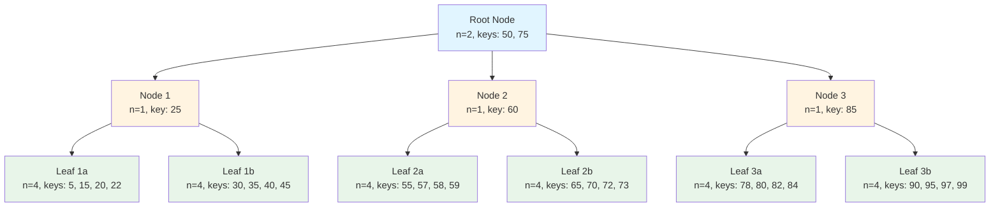
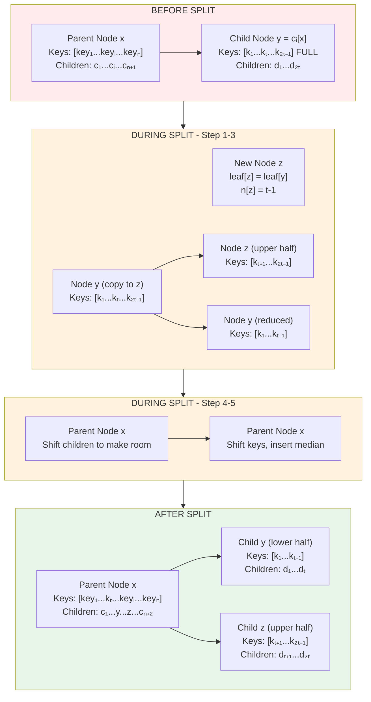

# Database Indexes - Comprehensive Guide

## Table of Contents
1. [Introduction to Database Indexes](#introduction-to-database-indexes)
2. [Why Do We Need Indexes?](#why-do-we-need-indexes)
3. [How Indexes Work](#how-indexes-work)
4. [Types of Database Indexes](#types-of-database-indexes)
   - [Primary Key Index](#1-primary-key-index)
   - [Unique Index](#2-unique-index)
   - [Composite Index](#3-composite-index)
   - [Clustered Index](#4-clustered-index)
   - [Non-Clustered Index](#5-non-clustered-index)
   - [Covering Index](#6-covering-index)
   - [Full-Text Index](#7-full-text-index)
   - [Hash Index](#8-hash-index)
   - [Bitmap Index](#9-bitmap-index)
   - [Spatial Index](#10-spatial-index)
5. [Underlying Data Structures](#underlying-data-structures)
6. [Index Operations](#index-operations)
7. [Index Trade-offs](#index-trade-offs)
8. [Index Best Practices](#index-best-practices)
9. [Index in Different Databases](#index-in-different-databases)
10. [Advanced Index Concepts](#advanced-index-concepts)

---

## Introduction to Database Indexes

A database index is a data structure that improves the speed of data retrieval operations on a database table at the cost of additional writes and storage space to maintain the index data structure. Indexes are one of the most fundamental performance optimization techniques in database systems, enabling applications to scale from handling thousands to billions of records efficiently.

### Historical Context

The concept of database indexing emerged in the 1970s with the development of relational database systems. Early database systems like IBM's System R (1970s) introduced B-Tree indexes as a way to efficiently manage large datasets. Since then, indexing techniques have evolved significantly, with various data structures being developed to address different use cases:

- **1970s**: B-Tree indexes introduced in System R
- **1980s**: Hash indexes for exact match queries
- **1990s**: Bitmap indexes for data warehousing
- **2000s**: Full-text search indexes (Lucene, inverted indexes)
- **2010s**: LSM trees for write-heavy workloads (Cassandra, HBase)
- **2020s**: Adaptive and machine learning-based indexing

### Key Characteristics

- **Search Optimization**: Indexes are used to quickly locate data without having to search every row in a database table. They transform O(n) linear searches into O(log n) logarithmic searches, providing exponential performance improvements as data grows.

- **Trade-off**: Faster read operations at the cost of slower write operations and increased storage. Every INSERT, UPDATE, or DELETE operation must update not just the table data but also all affected indexes, adding overhead to write operations.

- **Analogous to Book Index**: Like a book's index helps you find specific pages quickly by listing topics with page numbers, database indexes help find specific rows quickly by storing key values with pointers to actual data locations.

- **Persistent Data Structures**: Indexes are stored on disk and maintained by the database engine, persisting across database restarts and transactions.

- **Automatic Maintenance**: The database automatically updates indexes when data changes, ensuring consistency between the table and its indexes.

- **Query Optimizer Integration**: The database query optimizer automatically decides when and how to use indexes based on query patterns, statistics, and cost analysis.

### How Indexes Work at a High Level

Indexes work by creating a separate data structure that contains:

1. **Indexed Column Values**: The actual values from the column(s) being indexed
2. **Row Pointers**: References to the actual data rows in the table
3. **Metadata**: Information about the index structure, statistics, and properties

When a query is executed with a WHERE clause on an indexed column:

1. The database checks if an index exists on that column
2. If an index exists, it searches the index structure (typically using binary search)
3. Once the value is found in the index, it retrieves the row pointer
4. The database uses the pointer to fetch the actual row data from the table
5. The result is returned to the user

This process avoids scanning the entire table, dramatically reducing I/O operations and CPU usage.

### Basic Example

Consider a table `users` with 1 million rows:

```sql
-- Without index
SELECT * FROM users WHERE email = 'user@example.com';
-- Time Complexity: O(n) - scans all rows
-- I/O Operations: Reads potentially all data pages from disk
-- CPU Operations: Compares email value with 1,000,000 rows
-- Typical Time: 1-10 seconds depending on hardware

-- With index on email column
SELECT * FROM users WHERE email = 'user@example.com';
-- Time Complexity: O(log n) - uses binary search through index
-- I/O Operations: Reads only a few index pages plus one data page
-- CPU Operations: Compares email value with ~20 index entries (log2(1,000,000))
-- Typical Time: 0.001-0.01 seconds depending on hardware
```

### Real-World Performance Impact

To understand the practical impact, consider these real-world scenarios:

**E-commerce Platform**:
- Table: `orders` with 50 million rows
- Query: Find orders by customer_id
- Without index: ~45 seconds per query
- With index: ~0.003 seconds per query
- Impact: 15,000x faster, enabling real-time order tracking

**Social Media Application**:
- Table: `posts` with 100 million rows
- Query: Find posts by user_id with date filter
- Without index: ~90 seconds per query
- With composite index: ~0.005 seconds per query
- Impact: 18,000x faster, enabling instant timeline loading

**Financial System**:
- Table: `transactions` with 200 million rows
- Query: Find transactions by account number
- Without index: ~180 seconds per query
- With index: ~0.004 seconds per query
- Impact: 45,000x faster, enabling real-time fraud detection

---

## Why Do We Need Indexes?

### The Performance Problem

Without indexes, databases must perform a **full table scan** to find matching rows. This is a fundamental performance bottleneck that scales linearly with data size, making it impossible to maintain acceptable query performance as datasets grow.

#### Understanding Full Table Scans

A full table scan is exactly what it sounds like: the database reads every single row in the table to find matching records. This process involves:

1. **Disk I/O**: Reading all data pages from disk into memory
2. **CPU Processing**: Comparing each row against the search criteria
3. **Memory Usage**: Loading potentially large amounts of data into buffer pools
4. **Network Transfer**: Moving data between storage, memory, and CPU

```
Table Scan Process:
┌─────────────────────────────────────┐
│  Row 1: email = 'alice@test.com'    │
│  Row 2: email = 'bob@test.com'      │
│  Row 3: email = 'charlie@test.com'  │
│  ...                                │
│  Row 1,000,000: email = 'target@test.com' │
└─────────────────────────────────────┘
Time: O(n) - Must check every row

Disk I/O: ~10,000 page reads (assuming 100 rows/page)
CPU Comparisons: 1,000,000 string comparisons
Memory Usage: Entire table loaded into buffer pool
Network: ~1GB of data transferred (assuming 1KB/row)
```

#### The Scalability Crisis

The linear nature of full table scans creates a scalability crisis:

- **1,000 rows**: 0.001 seconds (acceptable)
- **10,000 rows**: 0.01 seconds (acceptable)
- **100,000 rows**: 0.1 seconds (slowing down)
- **1,000,000 rows**: 1 second (noticeable delay)
- **10,000,000 rows**: 10 seconds (user frustration)
- **100,000,000 rows**: 100 seconds (timeout territory)
- **1,000,000,000 rows**: 1,000 seconds (system failure)

As data grows exponentially, query performance degrades linearly, making it impossible to scale applications without indexing.

### The Index Solution

With an index, the database can jump directly to the relevant data using sophisticated data structures that enable logarithmic search complexity. This transforms the scalability equation from linear to logarithmic growth.

#### How Indexes Solve the Problem

Indexes solve the performance problem through several mechanisms:

1. **Sorted Data**: Indexes maintain data in sorted order, enabling binary search algorithms
2. **Reduced I/O**: Only relevant index pages need to be read, not entire table
3. **Pointer-based Access**: Direct references to data rows eliminate scanning
4. **Multi-level Structures**: Hierarchical organization minimizes the number of comparisons

```
Index Lookup Process:
┌─────────────────────────────────────┐
│  Index Structure (B-Tree)           │
│  ┌─────────┐                        │
│  │  Root   │                        │
│  └────┬────┘                        │
│       │                             │
│  ┌────┴────┐                        │
│  │  Nodes  │                        │
│  └────┬────┘                        │
│       │                             │
│  ┌────┴────┐                        │
│  │  Leaf   │ → Direct pointer to   │
│  │  Nodes  │   row 847,292         │
│  └─────────┘                        │
└─────────────────────────────────────┘
Time: O(log n) - Binary search through index

Disk I/O: ~3-4 page reads (root + intermediate + leaf)
CPU Comparisons: ~20 comparisons (log2(1,000,000))
Memory Usage: Only index pages in buffer pool
Network: ~40KB of data transferred
```

#### The Logarithmic Advantage

The logarithmic complexity of indexed searches provides remarkable scalability:

- **1,000 rows**: 0.001 seconds (same as scan)
- **10,000 rows**: 0.0013 seconds (8x faster)
- **100,000 rows**: 0.0017 seconds (59x faster)
- **1,000,000 rows**: 0.002 seconds (500x faster)
- **10,000,000 rows**: 0.0023 seconds (4,348x faster)
- **100,000,000 rows**: 0.0027 seconds (37,037x faster)
- **1,000,000,000 rows**: 0.003 seconds (333,333x faster)

As data grows exponentially, query performance grows logarithmically, enabling virtually unlimited scalability.

### Performance Comparison

| Operation | Without Index | With Index | Improvement | Index Type |
|-----------|---------------|------------|-------------|------------|
| Find 1 row in 1M | ~1 second | ~0.001 second | 1000x faster | B-Tree |
| Find 1 row in 10M | ~10 seconds | ~0.001 second | 10,000x faster | B-Tree |
| Find 1 row in 100M | ~100 seconds | ~0.001 second | 100,000x faster | B-Tree |
| Find 1 row in 1B | ~1000 seconds | ~0.003 seconds | 333,333x faster | B-Tree |
| Range query (100 rows) in 10M | ~10 seconds | ~0.01 seconds | 1,000x faster | B+Tree |
| Exact match in 10M | ~10 seconds | ~0.0005 seconds | 20,000x faster | Hash |
| Text search in 1M documents | ~100 seconds | ~0.1 seconds | 1,000x faster | Full-Text |
| Spatial query in 1M points | ~50 seconds | ~0.05 seconds | 1,000x faster | R-Tree |

### Business Impact of Indexing

The performance improvements from indexing translate directly into business value:

**User Experience**:
- Faster page loads → better user engagement
- Reduced latency → higher conversion rates
- Real-time responses → competitive advantage

**Operational Efficiency**:
- Reduced server load → lower infrastructure costs
- Fewer database servers → simplified operations
- Better resource utilization → cost optimization

**Scalability**:
- Handle more users → grow user base
- Support more data → enable new features
- Maintain performance → ensure reliability

**Revenue Impact**:
- Faster checkout → higher completion rates
- Better search → increased product discovery
- Real-time analytics → faster decision making

---

## How Indexes Work

### Index Architecture

Database indexes are separate data structures that coexist with the main table data. Understanding their architecture is crucial for optimizing database performance.

#### Physical Storage Structure

Indexes are stored on disk in a way that optimizes for both storage efficiency and access speed:

```
┌─────────────────────────────────────────────────────────────┐
│                    DATABASE TABLE                           │
│  ┌──────────────────────────────────────────────────────┐  │
│  │  users table (Heap or Clustered)                     │  │
│  │  ┌──────┬─────────────┬──────────┬─────────┐        │  │
│  │  │ id   │ email       │ name     │ age     │        │  │
│  │  ├──────┼─────────────┼──────────┼─────────┤        │  │
│  │  │ 1    │ alice@...   │ Alice    │ 25      │        │  │
│  │  │ 2    │ bob@...     │ Bob      │ 30      │        │  │
│  │  │ 3    │ charlie@... │ Charlie  │ 28      │        │  │
│  │  │ ...  │ ...         │ ...      │ ...     │        │  │
│  │  └──────┴─────────────┴──────────┴─────────┘        │  │
│  └──────────────────────────────────────────────────────┘  │
│                           │                                 │
│                           │ indexed by                       │
│                           ▼                                 │
│  ┌──────────────────────────────────────────────────────┐  │
│  │  INDEX on email column (B-Tree Structure)            │  │
│  │  ┌─────────────────┬─────────────┐                   │  │
│  │  │ email (key)     │ row pointer │                   │  │
│  │  ├─────────────────┼─────────────┤                   │  │
│  │  │ alice@test.com  │ → row 1     │                   │  │
│  │  │ bob@test.com    │ → row 2     │                   │  │
│  │  │ charlie@test.com│ → row 3     │                   │  │
│  │  │ ...             │ → ...       │                   │  │
│  │  └─────────────────┴─────────────┘                   │  │
│  └──────────────────────────────────────────────────────┘  │
└─────────────────────────────────────────────────────────────┘
```

#### Index Page Structure

Indexes are organized into pages (typically 4KB or 8KB) that are stored on disk:

```
Index Page Structure:
┌─────────────────────────────────────┐
│  Page Header                        │
│  - Page number                       │
│  - Page type (index/data)            │
│  - Free space                        │
│  - LSN (Log Sequence Number)         │
├─────────────────────────────────────┤
│  Index Entries (sorted)             │
│  ┌──────────┬──────────────┐         │
│  │ Key Value│ Row Pointer  │         │
│  ├──────────┼──────────────┤         │
│  │ alice@.. │ Page 5, Row 1│         │
│  │ bob@..   │ Page 5, Row 2│         │
│  │ charlie@.│ Page 5, Row 3│         │
│  └──────────┴──────────────┘         │
├─────────────────────────────────────┤
│  Page Footer                        │
│  - Checksum                         │
│  - Page type verification            │
└─────────────────────────────────────┘
```

#### Types of Row Pointers

Different databases use different types of row pointers:

1. **Physical Address**: Direct page number and row offset (fastest)
2. **Logical Address**: Primary key value (requires additional lookup)
3. **ROWID**: Oracle's unique row identifier
4. **TID**: PostgreSQL's tuple identifier
5. **RID**: SQL Server's row identifier

### Query Execution Flow

The process of using an index involves multiple steps, each handled by different components of the database engine.

```
Detailed Query Execution Flow:

Query: SELECT * FROM users WHERE email = 'bob@test.com'

Step 1: Query Parsing
        - Parse SQL syntax
        - Validate table and column names
        - Build abstract syntax tree
        │
        ▼
Step 2: Query Optimization
        - Analyze query structure
        - Check available indexes
        - Estimate costs for different plans
        - Choose optimal execution plan
        │
        ▼
Step 3: Index Selection
        - Found index on email column
        - Determine if index is selective enough
        - Check if index covers all needed columns
        - Decide between index scan vs table scan
        │
        ▼
Step 4: Index Traversal (B-Tree)
        - Start at root node
        - Navigate down the tree
        - Compare key values at each level
        - Reach leaf node containing target
        │
        ▼
Step 5: Row Pointer Retrieval
        - Extract row pointer from index entry
        - Determine physical location of data
        │
        ▼
Step 6: Data Access
        - Read data page containing the row
        - Extract the complete row data
        │
        ▼
Step 7: Result Assembly
        - Apply any remaining filters
        - Sort results if needed
        - Limit results if specified
        │
        ▼
Step 8: Return to Client
        - Format result set
        - Send data to client application
```

### Index Statistics and Metadata

Databases maintain statistics about indexes to help the query optimizer make informed decisions:

#### Index Statistics

```
Index Statistics Example:
┌─────────────────────────────────────┐
│  Index: idx_users_email             │
├─────────────────────────────────────┤
│  Total Rows: 1,000,000              │
│  Distinct Values: 998,500           │
│  Null Values: 1,500                 │
│  Average Key Length: 45 bytes        │
│  Index Size: 50 MB                  │
│  Height: 3 levels                   │
│  Pages: 6,250                        │
│  Selectivity: 0.9985                │
├─────────────────────────────────────┤
│  Usage Statistics:                 │
│  Index Scans: 15,234                │
│  Index Lookups: 1,234,567           │
│  Last Used: 2024-01-15 10:30:45     │
└─────────────────────────────────────┘
```

#### Histogram Statistics

Databases create histograms to understand data distribution:

```
Value Distribution Histogram:
┌─────────────────────────────────────┐
│  Email Column Distribution          │
├─────────────────────────────────────┤
│  Bucket 1: a* emails (10%)         │
│  Bucket 2: b* emails (8%)          │
│  Bucket 3: c* emails (7%)          │
│  ...                                │
│  Bucket 26: z* emails (1%)         │
├─────────────────────────────────────┤
│  Most Common Values:               │
│  - test@test.com: 5,000 rows       │
│  - admin@test.com: 3,000 rows      │
│  - user@test.com: 2,000 rows       │
└─────────────────────────────────────┘
```

### Index Access Methods

Different types of queries use different index access methods:

#### Index Seek (Point Lookup)
```sql
-- Single value lookup
SELECT * FROM users WHERE email = 'bob@test.com';
-- Method: Navigate directly to the specific key
-- Performance: O(log n) - very fast
```

#### Index Range Scan
```sql
-- Range of values
SELECT * FROM users 
WHERE email BETWEEN 'a@test.com' AND 'm@test.com';
-- Method: Start at first value, scan through range
-- Performance: O(log n + k) where k is range size
```

#### Index Full Scan
```sql
-- Scan entire index (often when index covers query)
SELECT email, name FROM users;
-- Method: Read all index pages sequentially
-- Performance: O(n) but faster than table scan
```

#### Index Only Scan (Covering Index)
```sql
-- All columns needed are in the index
SELECT email, name FROM users WHERE email = 'bob@test.com';
-- Method: No table access needed
-- Performance: O(log n) - fastest possible
```

### Multi-Index Operations

Complex queries may use multiple indexes:

#### Index Intersection
```sql
-- Using multiple indexes for AND conditions
SELECT * FROM users 
WHERE email = 'bob@test.com' AND age = 30;
-- Method: Find row pointers from both indexes, intersect
-- Performance: O(log n + log m) where n,m are index sizes
```

#### Index Union
```sql
-- Using multiple indexes for OR conditions
SELECT * FROM users 
WHERE email = 'bob@test.com' OR age = 30;
-- Method: Find row pointers from both indexes, union
-- Performance: O(log n + log m + k) where k is result size
```

---

## Types of Database Indexes

Database indexes come in various types, each designed for specific use cases and query patterns. Understanding the different types helps in choosing the right index for your specific needs.

### 1. Primary Key Index

Primary key indexes are the most fundamental type of index, automatically created when you define a primary key constraint on a table.

#### Characteristics
- **Automatically Created**: The database automatically creates an index when you define a primary key
- **Unique and Non-null**: Ensures each value in the indexed column is unique and cannot be NULL
- **Usually Clustered**: In most databases (MySQL InnoDB, SQL Server), the primary key index is clustered, meaning the actual table data is stored in the order of the primary key
- **Single per Table**: Each table can have only one primary key, and therefore one primary key index

#### Use Cases
- **Entity Identification**: Uniquely identifying each row in a table
- **Foreign Key References**: Other tables reference this primary key through foreign keys
- **Join Operations**: Primary keys are frequently used in JOIN operations
- **Data Integrity**: Enforces entity integrity by ensuring unique identification

#### Performance Characteristics
- **Read Performance**: Excellent for point lookups and range queries on the primary key
- **Write Performance**: Moderate overhead, as each INSERT/UPDATE must maintain the clustered structure
- **Storage**: No additional storage for clustered indexes (data is the index)

```sql
CREATE TABLE users (
    id INT PRIMARY KEY,  -- Automatically creates clustered index
    email VARCHAR(255),
    name VARCHAR(100)
);

-- Composite primary key
CREATE TABLE order_items (
    order_id INT,
    product_id INT,
    quantity INT,
    PRIMARY KEY (order_id, product_id)  -- Creates composite clustered index
);
```

#### Database-Specific Behavior
- **MySQL InnoDB**: Primary key is always clustered
- **MySQL MyISAM**: Primary key is non-clustered
- **SQL Server**: Primary key is clustered by default (can be changed)
- **PostgreSQL**: Primary key creates a unique B-Tree index (non-clustered)
- **Oracle**: Primary key creates a unique index (non-clustered by default)

### 2. Unique Index

Unique indexes enforce data integrity by ensuring that all values in the indexed column(s) are unique.

#### Characteristics
- **Uniqueness Constraint**: Prevents duplicate values in the indexed column(s)
- **Multiple per Table**: A table can have multiple unique indexes
- **Allows NULL**: Most databases allow NULL values in unique indexes (with some restrictions)
- **Automatic Validation**: Database automatically checks uniqueness on INSERT and UPDATE operations

#### Use Cases
- **Business Rules**: Enforcing business constraints like unique email addresses, usernames, or product codes
- **Data Quality**: Preventing duplicate data entry
- **Natural Keys**: Indexing columns that naturally have unique values
- **Lookup Optimization**: Fast lookups when you know the unique value

#### Performance Characteristics
- **Read Performance**: Excellent for point lookups (similar to primary key)
- **Write Performance**: Additional overhead for uniqueness checking
- **Storage**: Similar to regular B-Tree indexes

```sql
-- Unique index on email column
CREATE UNIQUE INDEX idx_email ON users(email);

-- Composite unique index
CREATE UNIQUE INDEX idx_user_email ON users(company_id, email);

-- Unique constraint (automatically creates unique index)
ALTER TABLE users ADD CONSTRAINT uc_email UNIQUE (email);
```

#### NULL Handling
Different databases handle NULL values in unique indexes differently:
- **MySQL**: Allows multiple NULL values in unique indexes
- **PostgreSQL**: Allows multiple NULL values (NULL != NULL)
- **SQL Server**: Allows only one NULL value by default (can be configured with filtered indexes)
- **Oracle**: Allows multiple NULL values

### 3. Composite Index

Composite indexes (also called multi-column or compound indexes) index multiple columns together in a specific order.

#### Characteristics
- **Multiple Columns**: Indexes two or more columns as a single unit
- **Column Order Matters**: The order of columns in the index definition is crucial
- **Leftmost Prefix Rule**: Queries can use the index if they reference the leftmost columns in order
- **Selective Filtering**: More selective columns should typically come first

#### The Leftmost Prefix Rule
This is the most important concept to understand for composite indexes:

```sql
CREATE INDEX idx_name_age_email ON users(name, age, email);

-- Effective queries (can use index):
WHERE name = 'Alice'                           -- Uses first column
WHERE name = 'Alice' AND age = 25              -- Uses first two columns
WHERE name = 'Alice' AND age = 25 AND email = 'alice@test.com'  -- Uses all columns
WHERE name = 'Alice' AND email = 'alice@test.com'  -- Uses first column, skips second

-- Ineffective queries (cannot use index):
WHERE age = 25                                  -- Skips first column
WHERE email = 'alice@test.com'                  -- Skips first two columns
WHERE age = 25 AND email = 'alice@test.com'     -- Skips first column
```

#### Column Ordering Strategy
When designing composite indexes, consider:

1. **Selectivity**: Put the most selective column (most unique values) first
2. **Query Patterns**: Order columns based on common WHERE clause patterns
3. **Equality vs Range**: Put equality columns before range columns
4. **Sorting**: If you need ORDER BY, consider including those columns

```sql
-- Good: High selectivity first, equality before range
CREATE INDEX idx_status_created ON users(created_at, status)
WHERE status = 'active' AND created_at > '2024-01-01';

-- Bad: Low selectivity first
CREATE INDEX idx_status_created ON users(status, created_at)
WHERE status = 'active' AND created_at > '2024-01-01';
```

#### Use Cases
- **Multi-column Filters**: Queries filtering on multiple columns
- **Covering Indexes**: Including columns to avoid table access
- **Sorting Optimization**: Supporting ORDER BY on multiple columns
- **Join Optimization**: Optimizing multi-column join conditions

### 4. Clustered Index

A clustered index determines the physical order of data in a table. The table data itself is stored in the order of the clustered index.

#### Characteristics
- **Data Storage**: The actual table data is stored in the leaf pages of the clustered index
- **Single per Table**: Only one clustered index per table (data can only be stored in one physical order)
- **Primary Key Default**: Usually created on the primary key column
- **Physical Sorting**: Data is physically sorted on disk by the indexed column

#### Clustered Index Structure

```
Clustered Index Structure:
┌─────────────────────────────────────┐
│  Data Pages (physically sorted by id)│
│  ┌─────┬──────────┬────────┐        │
│  │ id  │ email    │ name   │        │
│  ├─────┼──────────┼────────┤        │
│  │ 1   │ alice@.. │ Alice  │        │
│  │ 2   │ bob@..   │ Bob    │        │
│  │ 3   │ charlie@.│ Charlie│        │
│  │ 4   │ david@.. │ David  │        │
│  │ 5   │ eve@..   │ Eve    │        │
│  └─────┴──────────┴────────┘        │
└─────────────────────────────────────┘

Physical disk layout:
Page 1: [1, 2, 3]
Page 2: [4, 5, 6]
Page 3: [7, 8, 9]
...
```

#### Advantages
- **Range Queries**: Excellent for range queries on the clustered key
- **Fast Lookups**: No additional lookup needed (data is in the index)
- **Reduced I/O**: Only one I/O operation to get both index and data
- **Sequential Access**: Efficient for ordered data access

#### Disadvantages
- **Insert Overhead**: New rows must be inserted in sorted order (page splits)
- **Update Overhead**: Updating the clustered key requires moving the row
- **Limited to One**: Only one clustered index per table
- **Fragmentation**: Can lead to fragmentation over time

#### Use Cases
- **Primary Key**: Most common use case
- **Range Queries**: Tables frequently queried with range conditions
- **Sequential Access**: Tables accessed in sequential order
- **Date-based Data**: Time-series data where queries are time-based

```sql
-- SQL Server (clustered by default on primary key)
CREATE TABLE users (
    id INT PRIMARY KEY,  -- Creates clustered index
    email VARCHAR(255),
    name VARCHAR(100)
);

-- Explicit clustered index (SQL Server)
CREATE CLUSTERED INDEX idx_users_id ON users(id);

-- Non-clustered primary key (SQL Server)
CREATE TABLE users (
    id INT PRIMARY KEY NONCLUSTERED,
    email VARCHAR(255),
    name VARCHAR(100)
);
```

### 5. Non-Clustered Index

Non-clustered indexes are separate data structures that contain pointers to the actual table data.

#### Characteristics
- **Separate Structure**: Index is stored separately from table data
- **Multiple per Table**: A table can have many non-clustered indexes
- **Pointer-based**: Contains references (pointers) to actual data rows
- **Additional Lookup**: Requires an extra lookup to get the actual data (key lookup)

#### Non-Clustered Index Structure

```
Non-Clustered Index Structure:
┌─────────────────────────────────────┐
│  Index Pages (email index)          │
│  ┌─────────────┬──────────────┐     │
│  │ email       │ row pointer  │     │
│  ├─────────────┼──────────────┤     │
│  │ alice@test  │ → page 1, row 1│  │
│  │ bob@test    │ → page 1, row 2│  │
│  │ charlie@test│ → page 1, row 3│  │
│  │ david@test  │ → page 1, row 4│  │
│  │ eve@test    │ → page 1, row 5│  │
│  └─────────────┴──────────────┘     │
│                                      │
│  ┌──────────────────────────────┐   │
│  │  Data Pages (separate)       │   │
│  │  ┌─────┬──────────┬────────┐ │   │
│  │  │ id  │ email    │ name   │ │   │
│  │  ├─────┼──────────┼────────┤ │   │
│  │  │ 1   │ alice@.. │ Alice  │ │   │
│  │  │ 2   │ bob@..   │ Bob    │ │   │
│  │  │ 3   │ charlie@.│ Charlie│ │   │
│  │  │ 4   │ david@.. │ David  │ │   │
│  │  │ 5   │ eve@..   │ Eve    │ │   │
│  │  └─────┴──────────┴────────┘ │   │
│  └──────────────────────────────┘   │
└─────────────────────────────────────┘
```

#### Advantages
- **Multiple Indexes**: Can have many non-clustered indexes on a table
- **Flexible**: Can index any column regardless of table structure
- **No Data Movement**: Creating/dropping indexes doesn't require reorganizing table data
- **Covering Indexes**: Can include non-key columns to avoid lookups

#### Disadvantages
- **Additional I/O**: Requires extra lookup to get data (bookmark lookup)
- **Storage Overhead**: Each index consumes additional storage
- **Maintenance Overhead**: Each index must be maintained on data changes
- **Write Performance**: More indexes = slower writes

#### Use Cases
- **Frequent Lookup Columns**: Columns frequently used in WHERE clauses
- **Join Columns**: Foreign key columns used in joins
- **Sorting**: Columns used in ORDER BY clauses
- **Covering Queries**: Creating indexes that include all query columns

```sql
-- Create non-clustered index
CREATE INDEX idx_email ON users(email);

-- Non-clustered index with included columns (SQL Server)
CREATE INDEX idx_name_include 
ON users(name) 
INCLUDE (age, email);
```

### 6. Covering Index

A covering index includes all the columns needed to satisfy a query, eliminating the need to access the actual table data.

#### Characteristics
- **Complete Coverage**: Index contains all columns referenced in SELECT, WHERE, JOIN, and ORDER BY
- **Index-Only Scan**: Query can be satisfied entirely from the index
- **No Table Access**: Eliminates the expensive bookmark lookup operation
- **Performance Boost**: Can provide 10-100x performance improvement for specific queries

#### How Covering Indexes Work

```
Regular Index Query:
Query: SELECT name, age FROM users WHERE email = 'bob@test.com'

Step 1: Search email index for 'bob@test.com'
Step 2: Get row pointer from index
Step 3: Look up actual row in table
Step 4: Extract name and age columns
Total: 2 I/O operations (index + table)

Covering Index Query:
Query: SELECT name, age FROM users WHERE email = 'bob@test.com'
Index: CREATE INDEX idx_covering ON users(email, name, age)

Step 1: Search covering index for 'bob@test.com'
Step 2: Extract name and age from index
Total: 1 I/O operation (index only)
```

#### Use Cases
- **Frequent Queries**: Queries that run very frequently
- **Expensive Lookups**: Queries on large tables where bookmark lookup is expensive
- **Reporting Queries**: SELECT statements with specific column requirements
- **Join Optimization**: Covering indexes for join tables

#### Performance Impact
Covering indexes can dramatically improve performance:
- **Reduced I/O**: Eliminates table access (50-90% I/O reduction)
- **CPU Savings**: No need to decompress/parse table pages
- **Buffer Pool Efficiency**: Index pages are smaller, more fit in memory
- **Parallel Processing**: Easier to parallelize index-only scans

```sql
-- Create covering index
CREATE INDEX idx_covering ON users(name, age, email);

-- This query can be satisfied entirely from the index:
SELECT name, age, email FROM users WHERE name = 'Alice';

-- This query also benefits (partial covering):
SELECT name, age FROM users WHERE name = 'Alice';

-- PostgreSQL expression index (covering)
CREATE INDEX idx_lower_name ON users(LOWER(name));
SELECT name FROM users WHERE LOWER(name) = 'alice';
```

#### Trade-offs
- **Storage**: Larger indexes due to included columns
- **Maintenance**: More overhead on INSERT/UPDATE/DELETE
- **Flexibility**: Each query pattern may need its own covering index
- **Index Bloat**: Can lead to many large indexes

### 7. Full-Text Index

Full-text indexes are specialized for searching text content, supporting word-level searching, relevance ranking, and linguistic features.

#### Characteristics
- **Word-Level Indexing**: Indexes individual words rather than entire strings
- **Linguistic Support**: Handles stemming, stop words, and language-specific features
- **Relevance Scoring**: Returns results ranked by relevance
- **Natural Language**: Designed for human language search patterns

#### Full-Text Index Structure

```
Full-Text Index Structure (Inverted Index):
┌─────────────────────────────────────┐
│  Word Dictionary                    │
│  ┌──────────┬──────────────────────┐ │
│  │ Word     │ Document List        │ │
│  ├──────────┼──────────────────────┤ │
│  │ database │ [1, 3, 5, 8, 12]     │ │
│  │ index    │ [1, 2, 4, 7, 9]      │ │
│  │ search   │ [2, 3, 5, 6, 10]    │ │
│  │ query    │ [1, 4, 8, 11]        │ │
│  └──────────┴──────────────────────┘ │
└─────────────────────────────────────┘

Document 1: "database index search query"
Document 2: "index search query optimization"
Document 3: "database search techniques"
...
```

#### Features
- **Stemming**: Reduces words to root form (running → run)
- **Stop Words**: Ignores common words (the, a, an, in)
- **Proximity Search**: Finds words near each other
- **Phrase Search**: Searches for exact phrases
- **Wildcard Search**: Supports partial word matching
- **Relevance Ranking**: Scores results by relevance

#### Use Cases
- **Search Engines**: Website search, document search
- **Content Management**: Searching articles, blogs, documentation
- **E-commerce**: Product search, catalog search
- **Help Systems**: Knowledge base search, FAQ search

```sql
-- MySQL full-text index
CREATE FULLTEXT INDEX idx_content ON articles(content);

-- Search for articles
SELECT * FROM articles 
WHERE MATCH(content) AGAINST('database optimization' IN NATURAL LANGUAGE MODE);

-- Boolean mode search
SELECT * FROM articles 
WHERE MATCH(content) AGAINST('+database -optimization' IN BOOLEAN MODE);

-- Query expansion
SELECT * FROM articles 
WHERE MATCH(content) AGAINST('database' WITH QUERY EXPANSION);

-- PostgreSQL full-text search
CREATE INDEX idx_content_fts ON articles USING gin(to_tsvector('english', content));

SELECT * FROM articles 
WHERE to_tsvector('english', content) @@ to_tsquery('english', 'database & optimization');
```

### 8. Hash Index

Hash indexes use hash tables to store key-value pairs, providing extremely fast lookups for exact match queries.

#### Characteristics
- **Hash Function**: Uses a hash function to map keys to buckets
- **Exact Match Only**: Only supports equality comparisons (=, IN)
- **No Range Queries**: Cannot support range queries, sorting, or pattern matching
- **Constant Time**: O(1) average lookup time

#### Hash Index Structure

```
Hash Index Structure:
┌─────────────────────────────────────┐
│         Hash Function               │
│  hash(key) → bucket_number          │
└─────────────────┬───────────────────┘
                                      │
                                      ▼
┌─────────────────────────────────────┐
│         Hash Table                  │
│  ┌─────────┬─────────────────────┐  │
│  │ Bucket 0 │ (key, ptr) pairs   │  │
│  ├─────────┼─────────────────────┤  │
│  │ Bucket 1 │ (key, ptr) pairs   │  │
│  ├─────────┼─────────────────────┤  │
│  │ Bucket 2 │ (key, ptr) pairs   │  │
│  ├─────────┼─────────────────────┤  │
│  │   ...   │        ...          │  │
│  ├─────────┼─────────────────────┤  │
│  │ Bucket N │ (key, ptr) pairs   │  │
│  └─────────┴─────────────────────┘  │
└─────────────────────────────────────┘
```

#### Advantages
- **Fast Lookups**: O(1) average lookup time
- **Simple Structure**: Less complex than B-Tree
- **Memory Efficient**: Can be very memory-efficient
- **Predictable Performance**: Consistent lookup time regardless of data size

#### Disadvantages
- **No Range Queries**: Cannot support <, >, BETWEEN, etc.
- **No Sorting**: Cannot support ORDER BY on indexed column
- **No Pattern Matching**: Cannot support LIKE, regex, etc.
- **Collision Handling**: Hash collisions can degrade performance

#### Use Cases
- **Exact Match Lookups**: Caching, session stores, key-value stores
- **Equality Joins**: Hash joins for equi-joins
- **Memory Tables**: In-memory databases (MySQL MEMORY engine)
- **Hash Joins**: Internal query processing

```sql
-- MySQL MEMORY engine (hash indexes by default)
CREATE TABLE users (
    id INT,
    email VARCHAR(255),
    name VARCHAR(100),
    INDEX (email) USING HASH
) ENGINE=MEMORY;

-- PostgreSQL hash index
CREATE INDEX idx_email_hash ON users USING HASH (email);

-- Effective queries:
SELECT * FROM users WHERE email = 'bob@test.com';
SELECT * FROM users WHERE email IN ('alice@test.com', 'bob@test.com');

-- Ineffective queries (cannot use hash index):
SELECT * FROM users WHERE email LIKE 'bob%';
SELECT * FROM users WHERE email > 'bob@test.com';
SELECT * FROM users ORDER BY email;
```

### 9. Bitmap Index

Bitmap indexes use bitmaps (arrays of bits) to represent the presence or absence of values, making them extremely efficient for low-cardinality data.

#### Characteristics
- **Bitmap Representation**: Each distinct value has a bitmap indicating which rows contain that value
- **Low Cardinality**: Designed for columns with few distinct values
- **Compressed**: Bitmaps are compressed to save space
- **Bitwise Operations**: Uses AND, OR, NOT operations for query processing

#### Bitmap Index Structure

```
Bitmap Index Example (gender column):
┌─────────────────────────────────────┐
│  Row │ Gender │ Male Bitmap │ Female│
│  ────┼────────┼─────────────┼───────│
│  1   │ Male   │ 1           │ 0     │
│  2   │ Female │ 0           │ 1     │
│  3   │ Male   │ 1           │ 0     │
│  4   │ Female │ 0           │ 1     │
│  5   │ Male   │ 1           │ 0     │
│  6   │ Female │ 0           │ 1     │
│  7   │ Male   │ 1           │ 0     │
│  8   │ Female │ 0           │ 1     │
└─────────────────────────────────────┘

Bitmaps:
Male:   [1,0,1,0,1,0,1,0]
Female: [0,1,0,1,0,1,0,1]

Query: WHERE gender = 'Male' AND age > 30
Step 1: Male bitmap = [1,0,1,0,1,0,1,0]
Step 2: Age > 30 bitmap = [0,1,1,1,0,1,1,0]
Step 3: AND operation = [0,0,1,0,0,0,1,0]
Result: Rows 3 and 7
```

#### Advantages
- **Space Efficient**: Very compact storage for low-cardinality data
- **Fast Operations**: Bitwise operations are extremely fast
- **Complex Queries**: Efficient for complex multi-column queries
- **Compression**: Bitmaps compress well, further reducing storage

#### Disadvantages
- **High Cardinality**: Inefficient for columns with many distinct values
- **Write Performance**: Expensive to maintain on frequently updated tables
- **Concurrency**: Can have locking issues in write-heavy environments
- **Limited Support**: Not supported in all databases (mainly Oracle, PostgreSQL)

#### Use Cases
- **Data Warehousing**: Star schema dimension tables
- **Low-Cardinality Columns**: Gender, status, country, category
- **Read-Heavy**: Analytical queries with infrequent updates
- **Multi-Column Queries**: Complex WHERE conditions on multiple columns

```sql
-- PostgreSQL bitmap index (via BRIN extension)
CREATE INDEX idx_gender_btree ON users USING btree(gender);
-- PostgreSQL doesn't have traditional bitmap indexes but has BRIN for similar use cases

CREATE INDEX idx_age_brin ON users USING brin(age);

-- Oracle bitmap index
CREATE BITMAP INDEX idx_gender ON users(gender);
CREATE BITMAP INDEX idx_status ON users(status);

-- Complex query using bitmap indexes
SELECT * FROM users 
WHERE gender = 'Male' 
  AND status = 'Active' 
  AND country = 'USA';
-- Uses bitmap AND operations
```

### 10. Spatial Index

Spatial indexes are designed for geometric and geographic data, enabling efficient spatial queries like distance calculations and containment checks.

#### Characteristics
- **Geometric Data**: Indexes points, lines, polygons, and other geometric shapes
- **Spatial Queries**: Supports distance, containment, intersection, and proximity queries
- **R-Tree Structure**: Typically uses R-Tree or similar spatial data structures
- **Multi-dimensional**: Handles 2D, 3D, and higher-dimensional spatial data

#### Spatial Index Structure (R-Tree)

```
R-Tree Structure (Spatial Index):
┌─────────────────────────────────────┐
│              Root Node              │
│  ┌──────────────────────────────┐   │
│  │  Bounding Box (covers all)    │   │
│  └──────────┬───────────────────┘   │
└─────────────┼───────────────────────┘
                                  │
                    ┌─────────────┴─────────────┐
                    │                           │
                    ▼                           ▼
          ┌──────────────────┐        ┌──────────────────┐
          │  Node 1          │        │  Node 2          │
          │  ┌────────────┐  │        │  ┌────────────┐  │
          │  │   Box A    │  │        │  │   Box C    │  │
          │  └─────┬──────┘  │        │  └─────┬──────┘  │
          │        │         │        │        │         │
          │  ┌─────┴──────┐  │        │  ┌─────┴──────┐  │
          │  │   Box B    │  │        │  │   Box D    │  │
          │  └────────────┘  │        │  └────────────┘  │
          └──────────────────┘        └──────────────────┘
                  │                            │
        ┌─────────┴─────────┐      ┌──────────┴──────────┐
        │                   │      │                     │
        ▼                   ▼      ▼                     ▼
  ┌──────────┐       ┌──────────┐ ┌──────────┐      ┌──────────┐
  │ Point 1  │       │ Point 2  │ │ Point 3  │      │ Point 4  │
  │ (x1, y1) │       │ (x2, y2) │ │ (x3, y3) │      │ (x4, y4) │
  └──────────┘       └──────────┘ └──────────┘      └──────────┘
```

#### Spatial Query Types

```sql
-- Distance query
SELECT * FROM places 
WHERE ST_Distance(coordinates, POINT(40.7128, -74.0060)) < 1000;

-- Containment query
SELECT * FROM areas 
WHERE ST_Contains(geometry, POINT(40.7128, -74.0060));

-- Intersection query
SELECT * FROM areas 
WHERE ST_Intersects(geometry, ST_MakeEnvelope(-74.01, 40.71, -73.99, 40.73));

-- Nearest neighbor
SELECT * FROM places 
ORDER BY coordinates <-> POINT(40.7128, -74.0060)
LIMIT 10;
```

#### Use Cases
- **Location-Based Services**: Find nearby restaurants, stores, services
- **Mapping Applications**: Geographic information systems (GIS)
- **Real Estate**: Property search by location, radius
- **Logistics**: Route optimization, delivery zones
- **Weather**: Regional weather data, storm tracking

```sql
-- MySQL spatial index
CREATE TABLE places (
    id INT PRIMARY KEY,
    name VARCHAR(255),
    coordinates POINT,
    SPATIAL INDEX idx_location (coordinates)
);

-- PostgreSQL spatial index (PostGIS)
CREATE EXTENSION postgis;
CREATE TABLE places (
    id SERIAL PRIMARY KEY,
    name VARCHAR(255),
    coordinates GEOMETRY(Point, 4326)
);
CREATE INDEX idx_location ON places USING GIST (coordinates);

-- SQL Server spatial index
CREATE TABLE places (
    id INT PRIMARY KEY,
    name VARCHAR(255),
    coordinates GEOGRAPHY
);
CREATE SPATIAL INDEX idx_location ON places(coordinates);
```

---

## Underlying Data Structures

Database indexes rely on various data structures to organize and access data efficiently. Understanding these structures is crucial for database performance tuning and optimization.

### B-Tree (Balanced Tree) - Most Common

#### Definition

A **B-Tree** is a balanced search tree in which nodes can have many children. Let t ≥ 2 be an integer called the **minimum degree** of the B-Tree. A B-Tree of minimum degree t has the following properties:

1. Every node x has the following fields:
   - **n[x]**: the number of keys currently stored in node x
   
   **Purpose:** This field is critical for determining if a node is full (n[x] = 2t - 1) or has minimum keys (n[x] = t - 1). It's used during insertions to check for overflow and during deletions to check for underflow. It also enables iteration through keys during search operations.

   - **key₁[x], key₂[x], ..., keyₙ[x]**: the n[x] keys, stored in nondecreasing order
   
   **Purpose:** The sorted order enables binary search within a node for O(log n) lookup. During search, we compare the target key k with keys in the node. If k ≤ keyᵢ, we know k must be in the left subtree. If k > keyᵢ, we continue comparing with keyᵢ₊₁. This only works if keys are sorted.

   - **leaf[x]**: a boolean value that is TRUE if x is a leaf node, FALSE if x is an internal node
   
   **Purpose:** This flag terminates recursive search at leaves and determines whether child pointers cᵢ[x] are valid. It affects insertion/deletion logic since leaves store actual data while internal nodes only store navigation keys.

2. Each internal node x also contains **n[x] + 1** pointers **c₁[x], c₂[x], ..., cₙ₊₁[x]** to its children.

   **Why n[x] + 1 children for n[x] keys:** Each key acts as a separator between two subtrees. With n keys, you need n + 1 subtrees to partition all possible key ranges.

   **Visual representation:**
   ```
   Node with keys [20, 50, 80]:
   ┌─────┬─────┬─────┐
   │ 20  │ 50  │ 80  │  ← 3 keys (n[x] = 3)
   └──┬──┴──┬──┴──┬──┘
      │     │     │
     c₁    c₂    c₃    c₄  ← 4 children (n[x] + 1 = 4)
      ↓     ↓     ↓     ↓
   ≤20  20<k≤50 50<k≤80  >80
   ```

   **Purpose:** These pointers enable navigation down the tree during search operations. Each pointer cᵢ[x] points to the subtree containing keys in the range defined by the surrounding keys.

3. The keys in node x separate the ranges of keys stored in each subtree:

   For a node x with keys key₁[x], key₂[x], ..., keyₙ[x] and children c₁[x], c₂[x], ..., cₙ₊₁[x]:

   - **Leftmost child (c₁[x])**: All keys k in subtree c₁[x] satisfy: **k ≤ key₁[x]**
   - **Middle children (cᵢ[x] for 2 ≤ i ≤ n)**: All keys k in subtree cᵢ[x] satisfy: **keyᵢ₋₁[x] < k ≤ keyᵢ[x]**
   - **Rightmost child (cₙ₊₁[x])**: All keys k in subtree cₙ₊₁[x] satisfy: **k > keyₙ[x]**

   **Purpose:** This is the fundamental B-Tree search property that enables efficient lookup. At each node, you can determine which child to visit by using binary search on the sorted keys, requiring O(log n[x]) comparisons. This property guarantees that every key in the tree can be found by following the correct path from root to leaf.

   **Example with node [25, 50]:**
   ```
         Node: [25, 50]
          /    |    \
        c₁    c₂    c₃
        ↓     ↓     ↓
     ≤25  25<k≤50  >50
   ```
   - c₁: k ≤ 25
   - c₂: 25 < k ≤ 50
   - c₃: k > 50

4. All leaves have the same depth, which is the tree's height h.

   **Purpose:** This property guarantees O(log n) worst-case performance for all operations. Without this property, the tree could become unbalanced like a linked list, degrading to O(n) performance. B-Trees maintain this invariant through split and merge operations during insertions and deletions.

   **Example:** In a B-Tree of height 2, all leaves are exactly 2 edges from the root. This ensures that searching for any key requires exactly 2 node accesses (plus the root), regardless of which leaf contains the key.

5. Every node other than the root must have at least t - 1 keys. Every internal node other than the root thus has at least t children. If the tree is nonempty, the root must have at least one key.

   **Purpose:** This ensures nodes are never too empty (wasting space) and provides enough keys to enable redistribution during deletion. It also prevents excessive tree height by ensuring nodes maintain a minimum capacity.

   **Root exception:** The root can have as few as 1 key (or 0 in an empty tree) because it has no parent to borrow from or merge with. This exception is necessary to allow the tree to grow from a single node.

   **Example with t = 3:**
   - Minimum keys per node (non-root): t - 1 = 2
   - Minimum children per internal node: t = 3
   - Maximum keys per node: 2t - 1 = 5
   - Maximum children per internal node: 2t = 6

6. Every node can contain at most 2t - 1 keys. Therefore, an internal node can have at most 2t children.

   **Purpose:** This ensures nodes fit in a single disk block (critical for performance) and provides a clear threshold for when to split during insertion. Keeping node size bounded guarantees one disk read per node access.

   **Why this matters for disk I/O:** If nodes could grow arbitrarily large, they might span multiple disk blocks, requiring multiple I/O operations per node access. By limiting node size, we guarantee one disk read per node, which is essential for the O(log n) performance guarantee.

   **Example with t = 3:**
   - Node can hold at most 2t - 1 = 5 keys
   - If inserting a 6th key, the node must split

   **Split operation when full:**
   ```
   Before split (full node with 5 keys):
   [10, 20, 30, 40, 50]

   After split:
   - Median key (30) promoted to parent
   - Left node: [10, 20]
   - Right node: [40, 50]
   ```

**Note:** The parameter t is the minimum degree. In database literature, this is often referred to as the "order" of the B-Tree, where order m = 2t.

#### Motivation for B-Trees

B-Trees are specifically designed for systems that read and write large blocks of data from secondary storage, such as disk drives. Unlike binary search trees or other data structures optimized for RAM access, B-Trees are optimized for minimizing disk I/O operations.

**Disk Access Characteristics:**

1. **Disk I/O is expensive**: A disk access requires approximately 5-10 milliseconds, while RAM access takes approximately 50-100 nanoseconds. Disk access is roughly 100,000 times slower than RAM access.

2. **Block-oriented storage**: Disks read and write data in fixed-size blocks (typically 4KB to 16KB). Reading a single byte requires reading the entire block containing it.

3. **Sequential access is faster**: Once positioned at a block, sequential reads of adjacent blocks are much faster than random seeks to different locations.

**Why B-Trees Minimize Disk Access:**

By allowing nodes to have many children (high fan-out), B-Trees reduce the height of the tree. For a B-Tree with minimum degree t and n keys, the height is h = O(logₜ n). Since each node access corresponds to one disk read, the number of disk accesses for any operation is proportional to the tree height.

**Example Comparison:**

For a database with 1 billion records:
- Binary search tree height: ~30 levels → ~30 disk accesses
- B-Tree with t = 50: height ~3 levels → ~3 disk accesses
- **10x improvement** in disk accesses

**Node Size Matching:**

B-Tree nodes are typically sized to match disk block size. If a disk block is 8KB and each key-pointer pair is 16 bytes, a node can hold approximately 500 keys. This high branching factor is what enables B-Trees to maintain such shallow height.

#### B-Tree Structure



**Key Range Mapping:**

| Node | n[x] | Keys | Child Ranges |
|------|------|------|--------------|
| **Root** | 2 | 50, 75 | c₁: k ≤ 50, c₂: 50<k≤75, c₃: k > 75 |
| Node 1 | 1 | 25 | c₁: k ≤ 25, c₂: 25<k≤50 |
| &nbsp;&nbsp;Leaf 1a | 4 | 5, 15, 20, 22 | - |
| &nbsp;&nbsp;Leaf 1b | 4 | 30, 35, 40, 45 | - |
| Node 2 | 1 | 60 | c₁: 50<k≤60, c₂: 60<k≤75 |
| &nbsp;&nbsp;Leaf 2a | 4 | 55, 57, 58, 59 | - |
| &nbsp;&nbsp;Leaf 2b | 4 | 65, 70, 72, 73 | - |
| Node 3 | 1 | 85 | c₁: 75<k≤85, c₂: k > 85 |
| &nbsp;&nbsp;Leaf 3a | 4 | 78, 80, 82, 84 | - |
| &nbsp;&nbsp;Leaf 3b | 4 | 90, 95, 97, 99 | - |

#### B-Tree Properties and Invariants

**Theorem 18.1 (B-Tree Height)**
If n ≥ 1, then for any B-Tree of height h and minimum degree t that contains n keys, we have:

h ≤ logₜ((n+1)/2)

**Proof:** Consider a B-Tree of height h with minimum degree t and n keys. We establish a lower bound on the number of keys in terms of h and t.

The root contains at least 1 key. Every internal node other than the root has at least t children (since it has at least t - 1 keys and each internal node with k keys has k + 1 children). Therefore, if the height is h, the B-Tree has at least the following number of nodes:

- Level 0 (root): 1 node with at least 1 key
- Level 1: at least 2 nodes, each with at least t - 1 keys
- Level 2: at least 2t nodes, each with at least t - 1 keys
- Level i (for i ≥ 1): at least 2t^(i-1) nodes, each with at least t - 1 keys

The total number of keys n is therefore bounded below by:

```
n ≥ 1 + Σᵢ₌₁ʰ (number of nodes at level i) × (minimum keys per node at level i)
n ≥ 1 + Σᵢ₌₁ʰ (2t^(i-1)) × (t - 1)
n ≥ 1 + 2(t - 1) × Σᵢ₌₁ʰ t^(i-1)
n ≥ 1 + 2(t - 1) × ((tʰ - 1)/(t - 1))    // geometric series sum
n ≥ 1 + 2(tʰ - 1)
n ≥ 2tʰ - 1
```

Solving for h: tʰ ≤ (n + 1)/2, therefore h ≤ logₜ((n+1)/2). ∎

**Corollary 18.2**
For a B-Tree with minimum degree t and height h:
- The maximum number of keys is n = (2t)ʰ - 1
- The minimum number of keys is n = 2tʰ - 1

**Proof:** For the maximum, every node except the root is full (2t - 1 keys) and the tree is perfectly balanced. For the minimum, every node except the root has exactly t - 1 keys. ∎

#### B-Tree Node Structure

A B-Tree node x contains the following fields:

```
B-Tree Node x:
┌─────────────────────────────────────┐
│  n[x]                              │  // number of keys
│  leaf[x]                           │  // TRUE if leaf, FALSE otherwise
│  key₁[x], key₂[x], ..., keyₙ[x]    │  // keys in nondecreasing order
│  c₁[x], c₂[x], ..., cₙ₊₁[x]        │  // child pointers (if internal)
└─────────────────────────────────────┘

Constraints:
- If leaf[x] = TRUE: c₁, ..., cₙ₊₁ are undefined
- If leaf[x] = FALSE: n[x] + 1 children exist
- t - 1 ≤ n[x] ≤ 2t - 1 (except root where 1 ≤ n[x] ≤ 2t - 1)
- For internal nodes: keyᵢ separates cᵢ and cᵢ₊₁ subtrees
```

### Searching a B-Tree

**B-Tree-Search(x, k)**

**Parameters:**
- **x**: The root node of the B-Tree (or subtree) to search. This is a node containing keys key₁[x], key₂[x], ..., keyₙ[x] and child pointers c₁[x], c₂[x], ..., cₙ₊₁[x].
- **k**: The search key we are looking for in the B-Tree.

**Returns:**
- (x, i) if key k is found at position i in node x
- NIL if key k is not found in the B-Tree

**Algorithm:**
```
B-Tree-Search(x, k)
1  i ← 1                           // Initialize index to first key
2  while i ≤ n[x] and k > keyᵢ[x]  // Find smallest i where k ≤ keyᵢ[x]
3      do i ← i + 1                 // Move to next key if k is larger
4  if i ≤ n[x] and k = keyᵢ[x]    // Check if key matches exactly
5      then return (x, i)           // Key found at position i in node x
6  if leaf[x]                       // Check if we reached a leaf
7      then return NIL               // Key not found (no more children)
8  else DISK-READ(cᵢ[x])            // Read appropriate child from disk
9       return B-Tree-Search(cᵢ[x], k)  // Recurse into child subtree
```

**Algorithm Explanation:**

**Lines 1-3: Find the correct child pointer**
- The algorithm scans through the keys in node x from left to right
- It increments i until it finds the smallest index where k ≤ keyᵢ[x]
- This uses binary search in practice, but the pseudocode shows linear scan for clarity
- After the loop, i points to the child that might contain k

**Line 4-5: Check if key is found in current node**
- If k exactly equals keyᵢ[x], we've found the key
- Return the node and position for easy access to the key's value

**Line 6-7: Handle leaf node case**
- If x is a leaf, there are no children to search
- Since we didn't find k in the current node, it doesn't exist in the tree
- Return NIL to indicate key not found

**Line 8-9: Recurse into appropriate child**
- If x is an internal node, read child cᵢ[x] from disk
- Recursively search in that child subtree
- The recursion continues until we either find the key or reach a leaf

**Why this works:**
By the B-Tree property, the keys in each subtree are partitioned as follows:
- c₁[x]: all keys k where k ≤ key₁[x]
- cᵢ[x] for 2 ≤ i ≤ n: all keys k where keyᵢ₋₁[x] < k ≤ keyᵢ[x]
- cₙ₊₁[x]: all keys k where k > keyₙ[x]

The algorithm finds the correct i where k would be located if it exists, then searches only that subtree, pruning all other branches.

**Example:** Searching for key 39 in the B-Tree shown above:

1. Start at root (keys: 50, 75)
2. Compare 39 with 50: 39 < 50, go to child c₁
3. Read Node 1 (key: 25)
4. Compare 39 with 25: 39 > 25, go to child c₂
5. Read Leaf 1b (keys: 30, 35, 40, 45)
6. Scan keys: 30 < 39, 35 < 39, 39 < 40 (not found)
7. Return NIL

**Disk accesses:** 3 (root → Node 1 → Leaf 1b)

**Theorem 18.3 (B-Tree Search Complexity)**
A B-Tree-Search operation on a B-Tree with height h and minimum degree t makes O(h) disk accesses and examines O(th) = O(t logₜ n) keys.

**Proof:** The algorithm follows a simple path from the root to a leaf, making at most one disk access per level. At each node, it examines at most n[x] + 1 ≤ 2t keys. Since h = O(logₜ n), the total number of keys examined is O(th) = O(t logₜ n). ∎

### Inserting into a B-Tree

Inserting a key into a B-Tree is more complex because we may need to split nodes to maintain the B-Tree properties.

**B-Tree-Split-Child(x, i)**

**Parameters:**
- **x**: A non-full internal node that is the parent of the node to be split
- **i**: The index such that cᵢ[x] is the i-th child of x that is full and needs to be split

**Purpose:** Splits a full child node cᵢ[x] into two nodes and promotes the median key to the parent x

**Algorithm:**
```
B-Tree-Split-Child(x, i)
1  y ← cᵢ[x]                              // y is the child node to be split
2  z ← ALLOCATE-NODE()                    // Allocate new node z
3  leaf[z] ← leaf[y]                      // Copy leaf status from y to z
4  n[z] ← t - 1                           // z will have t - 1 keys
5  for j ← 1 to t - 1                     // Copy keys from y to z
6      do keyⱼ[z] ← keyⱼ₊ₜ[y]            // Copy keys from position t+1 to 2t-1
7  if not leaf[y]                         // If y is internal node
8      then for j ← 1 to t               // Copy child pointers from y to z
9              do cⱼ[z] ← cⱼ₊ₜ[y]       // Copy pointers from position t+1 to 2t
10 n[y] ← t - 1                           // y now has t - 1 keys (median removed)
11 for j ← n[x] + 1 downto i + 1         // Shift child pointers in x
12     do cⱼ₊₁[x] ← cⱼ[x]               // Make room for new child z
13 cᵢ₊₁[x] ← z                           // Insert z as new child of x
14 for j ← n[x] downto i                 // Shift keys in x
15     do keyⱼ₊₁[x] ← keyⱼ[x]           // Make room for median key
16 keyᵢ[x] ← keyₜ[y]                    // Promote median key from y to x
17 n[x] ← n[x] + 1                       // x now has one more key
18 DISK-WRITE(y)                          // Write modified y to disk
19 DISK-WRITE(z)                          // Write new z to disk
20 DISK-WRITE(x)                          // Write modified x to disk
```

**Algorithm Explanation:**

**Line 1: Define y as the child to split**
- `y ← cᵢ[x]`: Access the i-th child pointer array entry in node x, retrieve the memory address of the child node, and assign it to variable y
- This gives us a reference to the full child node that needs to be split

**Lines 2-4: Create and initialize new node z**
- `z ← ALLOCATE-NODE()`: Allocate memory for a new node structure (including arrays for keys and child pointers), initialize all fields to default values, and return the memory address
- `leaf[z] ← leaf[y]`: Read the leaf flag field from node y's memory location, copy the boolean value to node z's leaf flag field (z inherits y's leaf status - if y is a leaf, z is also a leaf)
- `n[z] ← t - 1`: Set the key count field in node z to t - 1 (z will hold exactly t - 1 keys after the split)

**Lines 5-6: Copy upper half of keys from y to z**
- `for j ← 1 to t - 1`: Initialize loop counter j to 1, iterate while j ≤ t - 1, increment j after each iteration
- `keyⱼ[z] ← keyⱼ₊ₜ[y]`: For each j, read key at position j+t from y's key array, write it to position j in z's key array
- This copies keys from positions t+1, t+2, ..., 2t-1 in y to positions 1, 2, ..., t-1 in z
- These are the keys greater than the median key (keyₜ[y])

**Lines 7-9: Copy child pointers if y is an internal node**
- `if not leaf[y]`: Read the leaf flag from y's memory, check if it's FALSE (indicating y has child pointers)
- `for j ← 1 to t`: Initialize loop counter j to 1, iterate while j ≤ t, increment j after each iteration
- `cⱼ[z] ← cⱼ₊ₜ[y]`: For each j, read child pointer at position j+t from y's child array, write it to position j in z's child array
- This copies pointers from positions t+1, t+2, ..., 2t in y to positions 1, 2, ..., t in z
- If y is a leaf, this step is skipped (leaves have no child pointers)

**Line 10: Update y's key count**
- `n[y] ← t - 1`: Overwrite the key count field in node y with value t - 1
- y now contains only keys at positions 1, 2, ..., t-1 (the lower half)
- The median key at position t remains in y but will be promoted to parent

**Lines 11-13: Shift child pointers in parent x to make room for z**
- `for j ← n[x] + 1 downto i + 1`: Initialize j to n[x]+1, iterate while j ≥ i+1, decrement j after each iteration
- `cⱼ₊₁[x] ← cⱼ[x]`: For each j, read child pointer at position j in x, write it to position j+1 in x
- This shifts all child pointers from positions i+1, i+2, ..., n[x]+1 to positions i+2, i+3, ..., n[x]+2
- The shift creates a gap at position i+1 for the new child z
- `cᵢ₊₁[x] ← z`: Write the memory address of z into position i+1 of x's child array

**Lines 14-16: Shift keys in parent x and promote median key**
- `for j ← n[x] downto i`: Initialize j to n[x], iterate while j ≥ i, decrement j after each iteration
- `keyⱼ₊₁[x] ← keyⱼ[x]`: For each j, read key at position j in x, write it to position j+1 in x
- This shifts all keys from positions i, i+1, ..., n[x] to positions i+1, i+2, ..., n[x]+1
- The shift creates a gap at position i for the promoted median key
- `keyᵢ[x] ← keyₜ[y]`: Read the median key from position t in y's key array, write it to position i in x's key array
- This promotes the median key to become the separator between y and z in the parent

**Line 17: Update parent's key count**
- `n[x] ← n[x] + 1`: Read current key count from x, add 1, write back to x's key count field
- x now has one additional key (the promoted median from y)

**Lines 18-20: Persist changes to disk**
- `DISK-WRITE(y)`: Read entire node y from memory, write it to disk at its allocated block location
- `DISK-WRITE(z)`: Read entire node z from memory, write it to disk at its newly allocated block location
- `DISK-WRITE(x)`: Read entire node x from memory, write it to disk at its block location
- These writes ensure the split operation is persistent and the B-Tree structure remains valid on disk

**Visual Diagram of B-Tree-Split-Child Operation**

Example with t = 3 (minimum degree), splitting child cᵢ[x]:



**Key Points:**
- The full node y (2t-1 keys) is split into two nodes y and z (each with t-1 keys)
- The median key kₜ is promoted to the parent x
- Parent x gains one key and one child
- The B-Tree property is maintained: all keys in y are ≤ kₜ, all keys in z are > kₜ

**B-Tree-Insert(T, k)**

**Parameters:**
- **T**: The B-Tree into which key k is to be inserted
- **k**: The key to be inserted into the B-Tree

**Purpose:** Inserts key k into B-Tree T, handling the special case where the root is full by creating a new root

**Algorithm:**
```
B-Tree-Insert(T, k)
1  r ← root[T]
2  if n[r] = 2t - 1
3      then s ← ALLOCATE-NODE()
4           root[T] ← s
5           leaf[s] ← FALSE
6           n[s] ← 0
7           c₁[s] ← r
8           B-Tree-Split-Child(s, 1)
9           B-Tree-Insert-Nonfull(s, k)
10 else B-Tree-Insert-Nonfull(r, k)
```

**Algorithm Explanation:**

**Line 1: Get current root**
- Store reference to current root for later use

**Line 2: Check if root is full**
- If root has 2t - 1 keys (maximum capacity), it needs to be split
- This is the only case where tree height increases

**Lines 3-8: Handle full root case**
- Create a new node s to become the new root
- Make s an internal node (not a leaf)
- Initially s has 0 keys and 1 child (the old root)
- Split the old root (now child c₁[s]) to make room for insertion

**Line 9: Insert into new root**
- After splitting, the new root s has room for insertion
- Recursively call Insert-Nonfull on s

**Line 10: Insert into existing root**
- If root is not full, proceed with normal insertion
- No height increase needed

**B-Tree-Insert-Nonfull(x, k)**

**Parameters:**
- **x**: A non-full node where key k is to be inserted
- **k**: The key to be inserted

**Purpose:** Inserts key k into node x, assuming x is not full

**Algorithm:**
```
B-Tree-Insert-Nonfull(x, k)
1  i ← n[x]
2  if leaf[x]
3      then while i ≥ 1 and k < keyᵢ[x]
4              do i ← i - 1
5          for j ← n[x] downto i + 1
6              do keyⱼ₊₁[x] ← keyⱼ[x]
7          keyᵢ₊₁[x] ← k
8          n[x] ← n[x] + 1
9          DISK-WRITE(x)
10 else
11     while i ≥ 1 and k < keyᵢ[x]
12         do i ← i - 1
13     if n[cᵢ₊₁[x]] = 2t - 1
14         then B-Tree-Split-Child(x, i + 1)
15         if k > keyᵢ[x]
16             then i ← i + 1
17     B-Tree-Insert-Nonfull(cᵢ₊₁[x], k)
```

**Algorithm Explanation:**

**Line 1: Initialize index**
- Start with i pointing to the last key in node x

**Line 2: Check if x is a leaf node**
- If x is a leaf, we can insert k directly into x
- If x is internal, we need to descend to the appropriate child

**Lines 3-9: Insert into leaf node**
- Find the correct position for k by scanning from right to left
- Shift keys to make room for k
- Insert k at the correct position
- Update key count and write to disk

**Lines 11-16: Insert into internal node**
- Find the child where k should be inserted
- If that child is full, split it first
- Recursively insert k into the appropriate child

**Deleting from a B-Tree**

Deleting from a B-Tree is more complex than insertion.

Deletion from a B-Tree is the most complex operation because it may require merging or redistributing nodes to maintain the minimum degree constraint.

**B-Tree-Delete(x, k)**
```
B-Tree-Delete(x, k)
1  if leaf[x]
2      then delete k from x
3           if n[x] < t - 1
4              then B-Tree-Rebalance(x)
5  else find i such that keyᵢ₋₁[x] < k ≤ keyᵢ[x]
6       if k = keyᵢ[x]  // k is in internal node
7          then if cᵢ[x] has at least t keys
8                  then find predecessor k' in subtree rooted at cᵢ[x]
9                       keyᵢ[x] ← k'
10                      B-Tree-Delete(cᵢ[x], k')
11              else if cᵢ₊₁[x] has at least t keys
12                      then find successor k' in subtree rooted at cᵢ₊₁[x]
13                           keyᵢ[x] ← k'
14                          B-Tree-Delete(cᵢ₊₁[x], k')
15              else merge cᵢ[x] and cᵢ₊₁[x]
16                  then B-Tree-Delete(cᵢ[x], k)
17       else B-Tree-Delete(cᵢ[x], k)
18           if n[x] < t - 1
19              then B-Tree-Rebalance(x)
```

**Theorem 18.5 (B-Tree Deletion Complexity)**
Deleting a key from a B-Tree with n keys and minimum degree t requires O(h) disk accesses, where h is the height of the B-Tree.

**Proof:** The algorithm descends from the root to a leaf, making at most one merge or redistribution per level. Each merge/redistribution requires O(1) disk operations. Since h = O(logₜ n), the total number of disk accesses is O(h) = O(logₜ n). ∎

**Example:** Deleting key 40 from a B-Tree with t = 2:

Initial state:
```
      [25, 50]
     /    |    \
[10,15] [30,40] [60,70]
```

Step 1: Search for key 40
- Found in middle leaf [30,40]

Step 2: Delete 40 from leaf
- Leaf becomes [30]
- n[leaf] = 1 ≥ t-1 = 1 (minimum satisfied, done)

**No rebalancing needed in this case.**

**Example requiring merge:** Deleting key 30 from the result above:

After deleting 30: leaf becomes []
- n[leaf] = 0 < t-1 = 1 (underflow, must rebalance)

Rebalancing options:
1. **Borrow from sibling** if possible
2. **Merge with sibling** if both at minimum

Merge operation:
- Merge empty leaf with sibling [10,15]
- Take separator 25 from parent
- Result: [10,15,25]

Final state:
```
      [50]
     /    \
[10,15,25] [60,70]
```

If parent also underflows, merge propagates upward.

#### B+Tree (Variant of B-Tree)

A **B+Tree** is a variant of B-Tree where all data is stored in leaf nodes, and internal nodes only store keys for navigation. This is the most common variant used in modern database systems.

**Definition:** A B+Tree of minimum degree t has the same structure as a B-Tree, with the following additional properties:

1. All keys appear in leaf nodes
2. Internal nodes contain only keys (no data) for navigation
3. Leaf nodes are linked in a doubly-linked list for sequential access
4. Internal nodes may contain duplicate keys that also appear in leaves

**B+Tree vs B-Tree Differences:**

| Feature | B-Tree | B+Tree |
|---------|--------|--------|
| Data Storage | Data in all nodes | Data only in leaf nodes |
| Internal Nodes | Keys + data | Keys only (duplicates) |
| Leaf Nodes | Same as internal | Linked list for sequential access |
| Range Queries | Possible but inefficient | Very efficient (linked leaves) |
| Space Usage | Less overhead | More overhead (duplicate keys) |
| Search Time | Slightly faster | Same complexity |
| Sequential Access | Difficult | Very efficient |

**Why B+Tree is Preferred for Databases:**

1. **Range Queries**: Linked leaf nodes enable efficient range scans
2. **Sequential Access**: Perfect for ORDER BY and range queries
3. **Predictable Performance**: All data at same depth
4. **Cache Efficiency**: Internal nodes are smaller, more fit in cache
5. **Uniform Node Size**: All nodes can be same size (simpler implementation)

**Theorem 18.6 (B+Tree Range Query Complexity)**
A range query on a B+Tree with n keys, height h, and result size k requires O(h + k) disk accesses.

**Proof:** Finding the starting key requires O(h) disk accesses (standard B-Tree search). Once the leaf is found, the algorithm follows leaf links, accessing each leaf containing results once. Since there are k results and each leaf can contain multiple keys, the number of additional leaf accesses is O(k). Total: O(h + k). ∎

#### Practical Considerations for B-Trees in Database Systems

**Choosing the Minimum Degree t:**

The choice of t significantly impacts B-Tree performance. In practice, t is chosen so that a node fits in one disk block.

- **Disk block size**: Typically 4KB to 16KB
- **Key size**: Varies by data type (e.g., 4 bytes for INT, 8 bytes for BIGINT, variable for VARCHAR)
- **Pointer size**: Typically 8 bytes (64-bit addresses)
- **Node overhead**: Metadata fields (n[x], leaf[x], etc.)

**Example calculation:**
- Disk block: 8192 bytes
- Key size: 8 bytes
- Pointer size: 8 bytes
- Overhead: 32 bytes

Available space for keys and pointers: 8192 - 32 = 8160 bytes
Each key-pointer pair: 8 + 8 = 16 bytes
Maximum pairs per node: 8160 / 16 ≈ 510

For a B-Tree, we need n keys and n+1 pointers:
n × 16 ≤ 8160
n ≤ 510

Thus, 2t - 1 ≈ 510, so t ≈ 256.

**Cache Considerations:**

Modern databases use buffer pools to cache frequently accessed B-Tree nodes in RAM. Key considerations:

1. **Root node caching**: The root is almost always cached since it's accessed for every operation
2. **Upper-level caching**: Internal nodes near the root have high reuse patterns
3. **Leaf node caching**: Leaf nodes may be evicted more frequently due to larger working set

**Concurrency Control:**

B-Trees in multi-user environments require concurrency control mechanisms:

- **Latch-based locking**: Short-duration locks on individual nodes during operations
- **Optimistic concurrency**: Version checking instead of locking
- **Crash recovery**: Write-ahead logging (WAL) to ensure ACID properties

**Variants and Optimizations:**

**B*-Tree:** A variant where nodes must be at least 2/3 full (instead of 1/2 full). This reduces space utilization but can improve performance by reducing splits.

**Prefix Compression:** Storing only the distinguishing prefix of keys in internal nodes, reducing space requirements.

**Lazy Deletion:** Marking keys as deleted rather than physically removing them, deferring rebalancing.

**Bulk Loading:** Building a B-Tree from sorted data by constructing leaves first and then building internal nodes bottom-up, which is more efficient than sequential insertion.

#### B*-Tree Variant

A **B*-Tree** is a variant of the B-Tree that provides better space utilization at the cost of slightly more complex insertion and deletion algorithms.

**Definition:** A B*-Tree of minimum degree t has the same basic structure as a B-Tree, with the following modifications:

1. Every internal node (except root) must be at least 2/3 full
2. When a node overflows during insertion, instead of splitting immediately, the algorithm attempts to redistribute keys with a sibling first
3. Only when both a node and its sibling are full does a split occur, and the split creates three nodes (two new nodes plus keeping one)

**Properties:**

- **Minimum keys per node (non-root):** ⌈2(2t - 1)/3⌉ instead of t - 1
- **Maximum keys per node:** 2t - 1 (same as B-Tree)
- **Space utilization:** Typically 66-100% vs 50-100% for B-Tree

**Advantages:**

- **Better space utilization:** Nodes are kept fuller, reducing wasted space
- **Fewer splits:** Redistribution reduces the frequency of node splits
- **More stable performance:** More consistent node sizes lead to predictable performance

**Disadvantages:**

- **More complex algorithms:** Insertion and deletion require additional logic for redistribution
- **Slower insertion:** Redistribution checks add overhead
- **Less common:** Not as widely implemented as standard B-Trees

**B*-Tree Insertion Strategy:**

```
B*-Tree-Insert(T, k)
1  Find the appropriate leaf node L for key k
2  if L is not full
3      then insert k into L
4  else if L has a sibling S that is not full
5      then redistribute keys between L and S
6           insert k into L
7  else // both L and S are full
8      split L and S into three nodes
9      redistribute keys evenly among the three
10     promote appropriate key to parent
```

**Example:** B*-Tree with t = 2 (max 3 keys per node, minimum 2 keys per node for non-root):

Standard B-Tree: Nodes can have 1-3 keys (50-100% full)
B*-Tree: Nodes must have 2-3 keys (66-100% full)

This ensures better space utilization but requires checking siblings before splitting.

### Hash Index

#### Definition

A **hash index** is a data structure that maps keys to values using a hash function, enabling O(1) average-case time complexity for insert, search, and delete operations. Unlike tree-based indexes, hash indexes do not maintain any ordering of keys and are optimized for exact match queries.

**Formal Definition:**
Let U be a universe of keys and let m be the number of buckets. A hash function h: U → {0, 1, ..., m-1} maps each key to a bucket index. A hash table T[0..m-1] stores the actual key-value pairs.

**Hash Table Components:**

1. **Hash Function**: h: U → {0, 1, ..., m-1}
2. **Bucket Array**: T[0..m-1], where each T[i] stores keys that hash to i
3. **Collision Resolution**: Strategy for handling h(k₁) = h(k₂) when k₁ ≠ k₂

#### Hash Function Properties

A good hash function for indexing should satisfy:

**Definition (Uniform Hashing):**
A hash function h is uniform if for any key k, the probability that h(k) = i is 1/m for all i ∈ {0, 1, ..., m-1}, independently of where any other key hashes.

**Properties:**

1. **Deterministic**: ∀k ∈ U, h(k) always produces the same output
2. **Uniform Distribution**: Pr[h(k) = i] = 1/m for all i ∈ {0, 1, ..., m-1}
3. **Fast Computation**: h(k) can be computed in O(1) time
4. **Low Collision Rate**: Pr[h(k₁) = h(k₂) | k₁ ≠ k₂] ≈ 1/m
5. **Avalanche Effect**: Small changes in input produce large changes in output

#### Common Hash Functions

**Division Method:**
```
h(k) = k mod m
```
**Theorem:** If m is prime and keys are uniformly distributed, the division method produces uniform hashing.

**Proof:** When m is prime, the residues k mod m are uniformly distributed for uniformly distributed k. If m is not prime and shares factors with keys, the distribution becomes non-uniform. ∎

**Multiplication Method:**
```
h(k) = ⌊m × (k × A mod 1)⌋
```
where A ≈ (√5 - 1)/2 ≈ 0.6180339887 (golden ratio conjugate)

**Universal Hashing:**
A family H of hash functions is universal if for any two distinct keys k₁, k₂:
```
Pr[h(k₁) = h(k₂)] ≤ 1/m
```
where the probability is over the random choice of h ∈ H.

#### Hash Index Structure

```
                    Hash Index Structure
                    ┌─────────────────────────────────────┐
                    │         Hash Function               │
                    │  hash(key) → bucket_number          │
                    └─────────────────┬───────────────────┘
                                      │
                                      ▼
                    ┌─────────────────────────────────────┐
                    │         Hash Table                  │
                    │  ┌─────────┬─────────────────────┐  │
                    │  │ Bucket 0 │ (key, ptr) pairs   │  │
                    │  ├─────────┼─────────────────────┤  │
                    │  │ Bucket 1 │ (key, ptr) pairs   │  │
                    │  ├─────────┼─────────────────────┤  │
                    │  │ Bucket 2 │ (key, ptr) pairs   │  │
                    │  ├─────────┼─────────────────────┤  │
                    │  │   ...   │        ...          │  │
                    │  ├─────────┼─────────────────────┤  │
                    │  │ Bucket N │ (key, ptr) pairs   │  │
                    │  └─────────┴─────────────────────┘  │
                    └─────────────────────────────────────┘
```

#### Hash Index Example

```
Hash Function: hash(email) % 10

Insert operations:
- hash('alice@test.com') % 10 = 3 → Bucket 3
- hash('bob@test.com') % 10 = 7 → Bucket 7
- hash('charlie@test.com') % 10 = 3 → Bucket 3 (collision)

Hash Table:
┌─────────┬─────────────────────────────┐
│ Bucket  │ Contents                     │
├─────────┼─────────────────────────────┤
│ 0       │ empty                        │
│ 1       │ empty                        │
│ 2       │ empty                        │
│ 3       │ (alice@test.com, row1)       │
│         │ (charlie@test.com, row3)    │
│ 4       │ empty                        │
│ 5       │ empty                        │
│ 6       │ empty                        │
│ 7       │ (bob@test.com, row2)         │
│ 8       │ empty                        │
│ 9       │ empty                        │
└─────────┴─────────────────────────────┘

Collision Resolution: Chaining
- Bucket 3 uses linked list to handle collisions
- alice@test.com → charlie@test.com → NULL
```

#### Hash Index Operations

**Chained-Hash-Search(T, k)**
```
Chained-Hash-Search(T, k)
1  i ← h(k)
2  return search(T[i], k)
```

**Theorem 11.1 (Chained Hash Search)**
Given a hash table with m buckets and n keys, and assuming simple uniform hashing, the expected time to search for an element is O(1 + α), where α = n/m is the load factor.

**Proof:** Under simple uniform hashing, each key is equally likely to hash to any of the m buckets. The expected number of keys in any bucket is α = n/m. Searching a bucket of expected size α takes O(α) time. Computing the hash takes O(1). Total: O(1 + α). ∎

**Chained-Hash-Insert(T, x)**
```
Chained-Hash-Insert(T, x)
1  i ← h(x.key)
2  insert x at the head of list T[i]
```

**Chained-Hash-Delete(T, x)**
```
Chained-Hash-Delete(T, x)
1  i ← h(x.key)
2  delete x from list T[i]
```

**Theorem 11.2 (Chained Hash Operations)**
In a hash table in which collisions are resolved by chaining, the worst-case time for searching is O(n), plus the time to compute the hash function. However, under the assumption of simple uniform hashing, the expected time for each operation is O(1 + α), where α = n/m.

**Proof:** In the worst case, all keys hash to the same bucket, creating a single linked list of length n. Searching this list takes O(n) time. Under uniform hashing, each bucket has expected size α, giving O(1 + α) expected time for all operations. ∎

**Example:** Chained hash search for 'bob@test.com':
```
Hash table T with m = 10, h(email) = hash(email) mod 10

Step 1: Compute hash
i ← h('bob@test.com') = hash('bob@test.com') mod 10 = 7

Step 2: Search bucket T[7]
T[7] contains: [(bob@test.com, row2)]
Found bob@test.com, return row2

Time: O(1) for hash + O(1) for search = O(1)
```

**Collision Resolution Strategies**

1. **Chaining (Separate Chaining)**:
   - Each bucket contains a linked list of entries
   - Simple to implement
   - Handles any number of collisions
   - Memory overhead for pointers

2. **Open Addressing (Linear Probing)**:
   - When collision occurs, probe next bucket
   - No extra memory for pointers
   - Can suffer from clustering
   - Deletion is more complex

3. **Double Hashing**:
   - Use two hash functions
   - Second hash determines probe sequence
   - Reduces clustering
   - More complex implementation

**Hash Index Limitations:**
- **No Range Queries**: Cannot support WHERE age > 25
- **No Sorting**: Cannot support ORDER BY on indexed column
- **No Prefix Matching**: Cannot support LIKE 'abc%'
- **Only Equality**: Only supports =, IN, and exact match operations
- **Collision Degradation**: Performance degrades with many collisions
- **Resizing Overhead**: Requires rebuilding when load factor gets too high
- **No Partial Keys**: Cannot search on part of composite key

### R-Tree (Spatial Index)

#### Definition

An **R-Tree** is a balanced tree data structure designed for spatial access methods, particularly for indexing multi-dimensional information such as geographical coordinates, rectangles, and polygons. It was proposed by Antonin Guttman in 1984.

**Formal Definition:**
An R-Tree is a height-balanced tree similar to a B-Tree, but designed for spatial data. Each node in an R-Tree contains a minimum bounding rectangle (MBR) that encloses all spatial objects in its subtree.

**Minimum Bounding Rectangle (MBR):**
For a set of d-dimensional spatial objects, an MBR is defined as the smallest axis-aligned rectangle that contains all objects. For a rectangle R = (x₁, y₁, x₂, y₂) in 2D space:
- x₁ = min{x-coordinate of all objects}
- y₁ = min{y-coordinate of all objects}
- x₂ = max{x-coordinate of all objects}
- y₂ = max{y-coordinate of all objects}

**R-Tree Properties:**

1. Every leaf node contains between m and M entries (m ≤ M/2)
2. Every non-leaf node contains between m and M entries
3. For each entry in a non-leaf node, the rectangle is the minimum bounding rectangle of all rectangles in the child node
4. All leaf nodes are at the same level
5. The root has at least two children unless it is a leaf

where M is the maximum number of entries per node and m is the minimum number of entries per node.

**Why R-Tree for Spatial Data**

Spatial data requires special indexing because:

1. **Multi-dimensional**: Data has 2D, 3D, or higher dimensions
2. **Proximity Queries**: Need to find objects near a point or region
3. **Containment Queries**: Need to find objects inside a region
4. **Intersection Queries**: Need to find objects overlapping a region
5. **Traditional Indexes Fail**: B-Tree cannot efficiently handle spatial queries

**Spatial Predicate Definitions:**

For two rectangles R₁ = (x₁₁, y₁₁, x₁₂, y₁₂) and R₂ = (x₂₁, y₂₁, x₂₂, y₂₂):

- **Intersection**: R₁ ∩ R₂ ≠ ∅ if and only if:
  x₁₁ ≤ x₂₂ AND x₁₂ ≥ x₂₁ AND y₁₁ ≤ y₂₂ AND y₁₂ ≥ y₂₁

- **Containment**: R₂ ⊆ R₁ if and only if:
  x₁₁ ≤ x₂₁ AND x₁₂ ≥ x₂₂ AND y₁₁ ≤ y₂₁ AND y₁₂ ≥ y₂₂

- **Distance**: Euclidean distance between centers:
  d(R₁, R₂) = √[(c₁ₓ - c₂ₓ)² + (c₁ᵧ - c₂ᵧ)²]
  where cᵢₓ = (xᵢ₁ + xᵢ₂)/2 and cᵢᵧ = (yᵢ₁ + yᵢ₂)/2

#### R-Tree Structure

```
                    R-Tree Structure (Spatial Index)
                    ┌─────────────────────────────────────┐
                    │              Root Node              │
                    │  ┌──────────────────────────────┐   │
                    │  │  Bounding Box (covers all)    │   │
                    │  └──────────┬───────────────────┘   │
                    └─────────────┼───────────────────────┘
                                  │
                    ┌─────────────┴─────────────┐
                    │                           │
                    ▼                           ▼
          ┌──────────────────┐        ┌──────────────────┐
          │  Node 1          │        │  Node 2          │
          │  ┌────────────┐  │        │  ┌────────────┐  │
          │  │   Box A    │  │        │  │   Box C    │  │
          │  └─────┬──────┘  │        │  └─────┬──────┘  │
          │        │         │        │        │         │
          │  ┌─────┴──────┐  │        │  ┌─────┴──────┐  │
          │  │   Box B    │  │        │  │   Box D    │  │
          │  └────────────┘  │        │  └────────────┘  │
          └──────────────────┘        └──────────────────┘
                  │                            │
        ┌─────────┴─────────┐      ┌──────────┴──────────┐
        │                   │      │                     │
        ▼                   ▼      ▼                     ▼
  ┌──────────┐       ┌──────────┐ ┌──────────┐      ┌──────────┐
  │ Point 1  │       │ Point 2  │ │ Point 3  │      │ Point 4  │
  │ (x1, y1) │       │ (x2, y2) │ │ (x3, y3) │      │ (x4, y4) │
  └──────────┘       └──────────┘ └──────────┘      └──────────┘
```

#### R-Tree Spatial Query Types

**R-Tree-Search(N, R)**
```
R-Tree-Search(N, R)
1  if N is a leaf node
2      then for each entry E in N
3              if E.rectangle intersects R
4                  then report E as a result
5  else for each entry E in N
6          if E.rectangle intersects R
7              then R-Tree-Search(E.child, R)
```

**Theorem (R-Tree Search Complexity)**
Given an R-Tree with n entries and height h, a range query with result set size k requires O(h + k) time in the worst case.

**Proof:** The algorithm visits at most one node per level that intersects the query rectangle R. Since the tree has height h, at most h nodes are visited before reaching leaves. At the leaf level, it examines each entry that intersects R, which is k entries. Total time: O(h + k). ∎

**Example:** Find all points within rectangle R = [20,20] to [40,40]:

```
Step 1: Check Root's bounding box
Root MBR: [0,0] to [100,100]
Query R: [20,20] to [40,40]
Intersects? Yes (0 ≤ 40 AND 100 ≥ 20 AND 0 ≤ 40 AND 100 ≥ 20)

Step 2: Check child nodes
Box A MBR: [10,10] to [30,30]
Intersects R? Yes → Recurse into Box A

Box B MBR: [50,50] to [70,70]
Intersects R? No (50 > 40) → Prune subtree

Step 3: Check leaf nodes within Box A
Point 1: (15,15)
In R? No (15 < 20) → Skip

Point 2: (25,25)
In R? Yes (20 ≤ 25 ≤ 40 AND 20 ≤ 25 ≤ 40) → Report

Point 3: (35,35)
In R? No (35 > 40) → Skip

Result: [Point 2]

Disk accesses: 3 (Root → Box A → Leaf)
Time: O(h + k) = O(2 + 1) = O(1) for this example
```

#### R-Tree Operations

**R-Tree-Insert(T, E)**
```
R-Tree-Insert(T, E)
1  I ← ChooseLeaf(T, E)
2  if I has room for another entry
3      then add E to I
4  else SplitNode(I, E)
5  AdjustTree(T, I)
6  if root splits
7      then create new root with children from split
```

**ChooseLeaf(N, E)**
```
ChooseLeaf(N, E)
1  if N is a leaf
2      then return N
3  else select entry F in N whose rectangle requires
4          minimum area enlargement to include E.rectangle
5      return ChooseLeaf(F.child, E)
```

**Theorem (R-Tree Insertion Complexity)**
Inserting an entry into an R-Tree with n entries requires O(log n) time in the average case.

**Proof:** The algorithm follows a single path from the root to a leaf, similar to B-Tree insertion. At each level, it selects the child requiring minimum area enlargement, which takes O(M) time where M is the maximum entries per node. Since the height is O(log n), the total time is O(M log n) = O(log n) for constant M. ∎

**R-Tree-Delete(T, E)**
```
R-Tree-Delete(T, E)
1  L ← FindLeaf(T, E)
2  if L = NIL
3      then return (entry not found)
4  remove E from L
5  CondenseTree(T, L)
6  if root has only one child after condensing
7      then make that child the new root
```

**Theorem (R-Tree Deletion Complexity)**
Deleting an entry from an R-Tree with n entries requires O(log n) time in the average case.

**Proof:** Finding the leaf requires O(log n) time. The condensation operation may need to reorganize nodes along the path, but each operation is O(1) per level. Total: O(log n). ∎

### LSM Tree (Log-Structured Merge Tree)

#### Definition

An **LSM (Log-Structured Merge) Tree** is a data structure designed for write-heavy workloads, used in modern distributed databases like Cassandra, HBase, RocksDB, and LevelDB. It was introduced by Patrick O'Neil in 1996.

**Formal Definition:**
An LSM Tree transforms random write operations into sequential write operations by buffering updates in memory and periodically flushing sorted buffers to disk in append-only files called SSTables (Sorted String Tables).

**LSM Tree Components:**

1. **MemTable (M)**: An in-memory sorted data structure (typically a skip list or balanced tree) that buffers recent writes
2. **Immutable MemTable (M')**: When M reaches a size threshold, it becomes immutable and is flushed to disk
3. **SSTable (S)**: Sorted String Table - an immutable, sorted file on disk containing key-value pairs
4. **Bloom Filter (B)**: A probabilistic data structure used to quickly determine if a key might exist in an SSTable
5. **Compaction Process**: Background process that merges SSTables to remove deleted keys and reduce read amplification

**Why LSM Tree for Write-Heavy Workloads**

LSM Trees excel in scenarios where:

1. **High Write Throughput**: Optimized for fast writes (append-only)
2. **Sequential I/O**: Writes are always sequential (no random writes)
3. **Compression**: Excellent compression ratios due to sorted data
4. **No Write Amplification**: Eliminates random writes to disk
5. **Distributed Friendly**: Easy to distribute across nodes

#### LSM Tree Structure

LSM Trees use a tiered approach with memory and disk components:

1. **MemTable**: In-memory buffer for recent writes
2. **Immutable MemTable**: When MemTable fills, it becomes immutable
3. **SSTable (Sorted String Table)**: Sorted files on disk
4. **Compaction**: Periodic merging of SSTables

```
                    LSM Tree Structure
                    ┌─────────────────────────────────────┐
                    │         MemTable (Memory)           │
                    │  ┌───┬───┬───┬───┬───┬───┐          │
                    │  │ K │ K │ K │ K │ K │ K │          │
                    │  │ 1 │ 2 │ 3 │ 4 │ 5 │ 6 │          │
                    │  └───┴───┴───┴───┴───┴───┘          │
                    └─────────────────┬───────────────────┘
                                      │
                                      │ (when full)
                                      ▼
                    ┌─────────────────────────────────────┐
                    │         Immutable MemTable          │
                    │  ┌───┬───┬───┬───┬───┬───┐          │
                    │  │ K │ K │ K │ K │ K │ K │          │
                    │  │ 1 │ 2 │ K │ K │ K │ K │          │
                    │  └───┴───┴───┴───┴───┴───┘          │
                    └─────────────────┬───────────────────┘
                                      │
                                      │ (flush to disk)
                                      ▼
                    ┌─────────────────────────────────────┐
                    │         SSTable 0 (Disk)             │
                    │  ┌───┬───┬───┬───┬───┬───┐          │
                    │  │ K │ K │ K │ K │ K │ K │          │
                    │  │ 1 │ 2 │ 3 │ 4 │ 5 │ 6 │          │
                    │  └───┴───┴───┴───┴───┴───┘          │
                    └─────────────────────────────────────┘
                                      │
                                      │ (compaction)
                                      ▼
                    ┌─────────────────────────────────────┐
                    │         SSTable 1 (Disk)             │
                    │  ┌───┬───┬───┬───┬───┬───┐          │
                    │  │ K │ K │ K │ K │ K │ K │          │
                    │  │ 7 │ 8 │ 9 │10 │11 │12 │          │
                    │  └───┴───┴───┴───┴───┴───┘          │
                    └─────────────────────────────────────┘
```

#### LSM Tree Operations

**LSM-Write(M, K, V)**
```
LSM-Write(M, K, V)
1  insert (K, V) into MemTable M
2  if |M| > threshold
3      then M' ← M
4           M ← new MemTable()
5           Flush(M') to disk as SSTable S
6           add S to level 0
7           trigger background compaction
```

**Theorem (LSM Write Complexity)**
Writing a key-value pair to an LSM Tree requires O(log n) time for insertion into the MemTable (using a balanced tree or skip list), where n is the number of keys in the MemTable. The flush to disk is O(1) amortized due to sequential writes.

**Proof:** The MemTable is typically implemented as a skip list or balanced tree, requiring O(log n) time for insertion. When the MemTable reaches threshold size T, the flush operation writes T keys sequentially to disk in O(T) time. Since this happens once every T writes, the amortized cost per write is O(T/T) = O(1) for the flush. Total: O(log n) for insertion + O(1) amortized for flush = O(log n). ∎

**LSM-Read(M, S₁, S₂, ..., Sₖ, K)**
```
LSM-Read(M, S₁, S₂, ..., Sₖ, K)
1  if K ∈ M
2      then return value from M
3  if K ∈ M'
4      then return value from M'
5  for i ← 1 to k  // S₁ is newest, Sₖ is oldest
6      if BloomFilter(Sᵢ, K) = FALSE
7          then continue  // K definitely not in Sᵢ
8      if binary_search(Sᵢ, K) = found
9          then return value from Sᵢ
10 return NOT_FOUND
```

**Theorem (LSM Read Complexity)**
Reading a key from an LSM Tree with L levels and n total keys requires O(log n) time with bloom filters, where the read amplification is O(L).

**Proof:** The algorithm checks the MemTable first (O(log m) where m is MemTable size). For each of the L levels, it checks the bloom filter (O(1)) and potentially performs a binary search on the SSTable (O(log sᵢ) where sᵢ is the SSTable size). With bloom filters, most SSTables are skipped. In the worst case where the key exists in the oldest SSTable, the total time is O(log m + Σᵢ log sᵢ) = O(log n) since Σᵢ sᵢ = n. ∎

**Example:** Read key K = "user:1005":

```
Step 1: Check MemTable M
M contains: {user:1001, user:1003, user:1007}
Binary search: K not in M

Step 2: Check Immutable MemTable M'
M' contains: {user:999, user:1000, user:1002}
Binary search: K not in M'

Step 3: Check SSTable S₀ (newest)
BloomFilter(S₀, "user:1005") = TRUE (might exist)
Binary search S₀: K not found

Step 4: Check SSTable S₁
BloomFilter(S₁, "user:1005") = TRUE (might exist)
Binary search S₁: Found K = "user:1005" → value = "John Doe"

Return: "John Doe"

Time: O(log m) + O(1) + O(log s₀) + O(1) + O(log s₁) = O(log n)
```

**LSM-Delete(M, K)**
```
LSM-Delete(M, K)
1  insert (K, TOMBSTONE) into MemTable M
2  // TOMBSTONE is a special marker indicating deletion
```

**Theorem (LSM Delete Complexity)**
Deleting a key from an LSM Tree requires O(log n) time, equivalent to a write operation. The actual removal occurs during compaction.

**Proof:** A delete operation is implemented as a special write (tombstone marker) to the MemTable, requiring O(log n) time. The tombstone persists through compaction until all older versions of the key are removed. ∎

#### LSM Tree Compaction Strategies

**Size-Tiered Compaction:**
- SSTables of similar size are merged together
- Good for write-heavy workloads
- Can create temporary space spikes

**Leveled Compaction:**
- SSTables organized in levels with size limits
- Each level has fixed number of SSTables
- More predictable space usage
- Better read performance

**Tiered vs Leveled:**
```
Size-Tiered:
Level 0: [SST1(100MB), SST2(100MB)]
Level 1: [SST3(200MB), SST4(200MB)]
Level 2: [SST5(400MB)]
Compaction: Merge SST1+SST2 → SST6(200MB) → Level 1

Leveled:
Level 0: [SST1(100MB), SST2(100MB), SST3(100MB)] (10 files max)
Level 1: [SST4(100MB), SST5(100MB), ...] (10 files max, each 100MB)
Level 2: [SST6(1GB), SST7(1GB), ...] (10 files max, each 1GB)
Compaction: Merge overlapping SSTables within level
```

#### LSM Tree Advantages
- **High Write Throughput**: Sequential writes, no random I/O
- **Excellent Compression**: Sorted data compresses well
- **No Write Locking**: Concurrent writes are easy
- **Predictable Performance**: No random disk seeks
- **Scalable**: Easy to distribute across nodes

#### LSM Tree Disadvantages
- **Read Performance**: May need to check multiple SSTables
- **Compaction Overhead**: Background compaction uses resources
- **Space Amplification**: Old data exists until compaction
- **Write Amplification**: Data may be rewritten multiple times
- **Stale Reads**: May return old data until compaction

---

## Index Operations

Database index operations include creating, dropping, rebuilding, analyzing, and maintaining indexes. Understanding these operations is crucial for database administration and performance optimization.

### Creating Indexes

Creating indexes is a fundamental operation that establishes the index structure on specified columns.

#### Basic Index Creation

```sql
-- Basic index on single column
CREATE INDEX idx_email ON users(email);

-- Index with specific name
CREATE INDEX idx_user_email ON users(email);

-- Index on multiple columns
CREATE INDEX idx_name_age ON users(name, age);
```

#### Advanced Index Creation Options

```sql
-- Unique index (enforces uniqueness)
CREATE UNIQUE INDEX idx_email ON users(email);

-- Descending index (for DESC sorting)
CREATE INDEX idx_age_desc ON users(age DESC);

-- Partial index (only index specific rows)
CREATE INDEX idx_active_email ON users(email) WHERE active = true;

-- Expression index (index computed values)
CREATE INDEX idx_lower_email ON users(LOWER(email));

-- Case-insensitive index
CREATE INDEX idx_email_ci ON users(LOWER(email));

-- Index with specific fill factor (PostgreSQL)
CREATE INDEX idx_email ON users(email) WITH (fillfactor = 70);

-- Concurrent index creation (PostgreSQL - non-blocking)
CREATE INDEX CONCURRENTLY idx_email ON users(email);

-- Index with storage parameters (PostgreSQL)
CREATE INDEX idx_email ON users(email) 
WITH (fillfactor = 70)
TABLESPACE index_space;

-- Hash index (PostgreSQL)
CREATE INDEX idx_email_hash ON users USING HASH (email);

-- GIN index for array columns (PostgreSQL)
CREATE INDEX idx_tags ON articles USING GIN(tags);

-- GiST index for geometric data (PostgreSQL)
CREATE INDEX idx_location ON places USING GIST(coordinates);
```

#### Index Creation Considerations

**Performance Impact During Creation:**
- **Large Tables**: Index creation on large tables can take significant time
- **Locking**: Default index creation locks the table (prevents writes)
- **Resource Usage**: High CPU, memory, and I/O during creation
- **Disk Space**: Requires temporary space for sorting

**Best Practices for Index Creation:**
1. **Schedule During Low Traffic**: Create indexes during maintenance windows
2. **Use CONCURRENTLY**: For PostgreSQL, use CONCURRENTLY to avoid locking
3. **Monitor Resources**: Watch CPU, memory, and disk usage
4. **Estimate Time**: Use EXPLAIN to estimate index creation time
5. **Batch Creation**: Create multiple indexes in a single transaction

#### Index Creation Process

```
Index Creation Process:
┌─────────────────────────────────────┐
│  Step 1: Parse and Validate         │
│  - Check syntax                     │
│  - Verify table exists              │
│  - Check column exists              │
│  - Check index doesn't exist        │
└─────────────────┬───────────────────┘
                  │
                  ▼
┌─────────────────────────────────────┐
│  Step 2: Lock Table                 │
│  - Acquire exclusive lock           │
│  - Prevent concurrent writes        │
│  - Allow reads (if supported)       │
└─────────────────┬───────────────────┘
                  │
                  ▼
┌─────────────────────────────────────┐
│  Step 3: Extract Data               │
│  - Scan table for all rows          │
│  - Extract indexed columns         │
│  - Extract row pointers             │
└─────────────────┬───────────────────┘
                  │
                  ▼
┌─────────────────────────────────────┐
│  Step 4: Sort Data                  │
│  - Sort extracted data by key       │
│  - Use external sort if large       │
│  - Temporary disk usage             │
└─────────────────┬───────────────────┘
                  │
                  ▼
┌─────────────────────────────────────┐
│  Step 5: Build Index Structure      │
│  - Create B-Tree nodes              │
│  - Fill nodes with sorted data      │
│  - Build tree hierarchy             │
└─────────────────┬───────────────────┘
                  │
                  ▼
┌─────────────────────────────────────┐
│  Step 6: Write to Disk              │
│  - Persist index pages             │
│  - Update system catalogs          │
│  - Commit transaction              │
└─────────────────┬───────────────────┘
                  │
                  ▼
┌─────────────────────────────────────┐
│  Step 7: Release Lock               │
│  - Release table lock              │
│  - Make index available            │
│  - Update statistics               │
└─────────────────────────────────────┘
```

### Dropping Indexes

Dropping indexes removes them from the database, freeing storage and reducing write overhead.

#### Basic Drop Operations

```sql
-- Drop index
DROP INDEX idx_email;

-- Drop index if exists (safe drop)
DROP INDEX IF EXISTS idx_email;

-- Drop multiple indexes
DROP INDEX idx_email, idx_name, idx_age;
```

#### Database-Specific Drop Syntax

```sql
-- PostgreSQL
DROP INDEX idx_email;
DROP INDEX CONCURRENTLY idx_email;  -- Non-blocking drop

-- MySQL
DROP INDEX idx_email ON users;
ALTER TABLE users DROP INDEX idx_email;

-- SQL Server
DROP INDEX idx_email ON users;
DROP INDEX users.idx_email;

-- Oracle
DROP INDEX idx_email;
DROP INDEX username.idx_email;
```

#### Drop Considerations

**Performance Impact:**
- **Immediate**: Locks table during drop operation
- **Resource Usage**: Minimal CPU, but may use I/O for cleanup
- **Space Reclamation**: Space is not immediately returned to OS

**Safety Considerations:**
- **Check Dependencies**: Ensure no queries depend on the index
- **Monitor Performance**: Watch for query performance degradation
- **Backup**: Consider backup before dropping critical indexes
- **Test**: Test in development environment first

#### Drop Process

```
Index Drop Process:
┌─────────────────────────────────────┐
│  Step 1: Acquire Lock               │
│  - Get exclusive lock on table      │
│  - Prevent concurrent access       │
└─────────────────┬───────────────────┘
                  │
                  ▼
┌─────────────────────────────────────┐
│  Step 2: Remove from Catalog        │
│  - Update system catalogs          │
│  - Mark index as dropped            │
└─────────────────┬───────────────────┘
                  │
                  ▼
┌─────────────────────────────────────┐
│  Step 3: Deallocate Pages          │
│  - Mark pages as free               │
│  - Update free space maps          │
└─────────────────┬───────────────────┘
                  │
                  ▼
┌─────────────────────────────────────┐
│  Step 4: Release Lock               │
│  - Release table lock              │
│  - Commit transaction              │
└─────────────────┬───────────────────┘
                  │
                  ▼
┌─────────────────────────────────────┐
│  Step 5: Background Cleanup        │
│  - Vacuum/analyze (async)           │
│  - Return space to filesystem       │
└─────────────────────────────────────┘
```

### Rebuilding Indexes

Index rebuilding recreates the index from scratch, which can improve performance by reducing fragmentation and optimizing structure.

#### When to Rebuild Indexes

**Signs That Index Needs Rebuilding:**
- **Fragmentation**: Index pages are scattered on disk
- **Performance Degradation**: Slower index access over time
- **High Page Density**: Many partially filled pages
- **Statistics Outdated**: Query optimizer making poor decisions
- **After Bulk Operations**: After large data loads or deletes

#### Rebuild Operations

```sql
-- PostgreSQL
-- Rebuild single index
REINDEX INDEX idx_email;

-- Rebuild all indexes on table
REINDEX TABLE users;

-- Rebuild all indexes in database
REINDEX DATABASE mydb;

-- Rebuild index concurrently (non-blocking)
REINDEX INDEX CONCURRENTLY idx_email;

-- MySQL
-- Rebuild index (drop and recreate)
ALTER TABLE users DROP INDEX idx_email;
ALTER TABLE users ADD INDEX idx_email(email);

-- Optimize table (rebuilds all indexes)
OPTIMIZE TABLE users;

-- Analyze table (update statistics)
ANALYZE TABLE users;

-- SQL Server
-- Rebuild index
ALTER INDEX idx_email ON users REBUILD;

-- Rebuild index with options
ALTER INDEX idx_email ON users 
REBUILD WITH (FILLFACTOR = 80, SORT_IN_TEMPDB = ON);

-- Reorganize index (less intensive)
ALTER INDEX idx_email ON users REORGANIZE;

-- Rebuild all indexes on table
ALTER INDEX ALL ON users REBUILD;

-- Oracle
-- Rebuild index
ALTER INDEX idx_email REBUILD;

-- Rebuild index online (non-blocking)
ALTER INDEX idx_email REBUILD ONLINE;

-- Rebuild with parallelism
ALTER INDEX idx_email REBUILD PARALLEL 4;
```

#### Rebuild vs Reorganize

```
Rebuild vs Reorganize:

Rebuild:
- Creates entirely new index
- More intensive resource usage
- Better performance improvement
- Requires more disk space
- May lock table (unless ONLINE)

Reorganize:
- Defragments existing index
- Less intensive resource usage
- Moderate performance improvement
- Requires less disk space
- Usually non-blocking

When to use:
Rebuild: High fragmentation, performance critical
Reorganize: Low fragmentation, always-on systems
```

### Analyzing Index Usage

Monitoring index usage helps identify unused indexes (for removal) and heavily used indexes (for optimization).

#### PostgreSQL Index Usage Analysis

```sql
-- Check index usage statistics
SELECT 
    schemaname,
    tablename,
    indexname,
    idx_scan,              -- Number of index scans
    idx_tup_read,          -- Tuples read by index
    idx_tup_fetch,         -- Tuples fetched by index
    pg_size_pretty(pg_relation_size(indexrelid)) AS index_size
FROM pg_stat_user_indexes
ORDER BY idx_scan DESC;

-- Find unused indexes (never scanned)
SELECT 
    schemaname,
    tablename,
    indexname,
    pg_size_pretty(pg_relation_size(indexrelid)) AS index_size
FROM pg_stat_user_indexes
WHERE idx_scan = 0
ORDER BY pg_relation_size(indexrelid) DESC;

-- Check index size
SELECT 
    indexname,
    pg_size_pretty(pg_relation_size(indexrelid)) AS index_size,
    pg_size_pretty(pg_total_relation_size(indexrelid)) AS total_size
FROM pg_indexes
WHERE tablename = 'users';
```

#### MySQL Index Usage Analysis

```sql
-- Show all indexes on table
SHOW INDEX FROM users;

-- Detailed index information
SELECT 
    TABLE_NAME,
    INDEX_NAME,
    COLUMN_NAME,
    SEQ_IN_INDEX,
    CARDINALITY,
    INDEX_TYPE
FROM information_schema.STATISTICS
WHERE TABLE_NAME = 'users'
ORDER BY INDEX_NAME, SEQ_IN_INDEX;

-- Check index cardinality
ANALYZE TABLE users;
SHOW INDEX FROM users;
```

#### SQL Server Index Usage Analysis

```sql
-- Check index usage statistics
SELECT 
    OBJECT_NAME(i.object_id) AS table_name,
    i.name AS index_name,
    i.type_desc AS index_type,
    s.user_seeks,
    s.user_scans,
    s.user_lookups,
    s.user_updates,
    s.last_user_seek,
    s.last_user_scan
FROM sys.indexes i
LEFT JOIN sys.dm_db_index_usage_stats s 
    ON i.object_id = s.object_id AND i.index_id = s.index_id
WHERE OBJECT_NAME(i.object_id) = 'users'
ORDER BY s.user_seeks + s.user_scans DESC;

-- Find unused indexes
SELECT 
    OBJECT_NAME(i.object_id) AS table_name,
    i.name AS index_name,
    s.user_seeks,
    s.user_scans,
    s.user_lookups
FROM sys.indexes i
LEFT JOIN sys.dm_db_index_usage_stats s 
    ON i.object_id = s.object_id AND i.index_id = s.index_id
WHERE OBJECT_NAME(i.object_id) = 'users'
  AND s.user_seeks = 0 
  AND s.user_scans = 0
  AND s.user_lookups = 0
  AND i.is_primary_key = 0
  AND i.is_unique_constraint = 0;
```

#### Query Execution Plan Analysis

```sql
-- PostgreSQL
-- Explain query plan
EXPLAIN SELECT * FROM users WHERE email = 'test@example.com';

-- Explain with actual execution statistics
EXPLAIN ANALYZE SELECT * FROM users WHERE email = 'test@example.com';

-- Verbose explain with costs
EXPLAIN (ANALYZE, BUFFERS, VERBOSE) 
SELECT * FROM users WHERE email = 'test@example.com';

-- MySQL
-- Explain query plan
EXPLAIN SELECT * FROM users WHERE email = 'test@example.com';

-- Extended explain
EXPLAIN EXTENDED SELECT * FROM users WHERE email = 'test@example.com';

-- Explain with partitions
EXPLAIN PARTITIONS SELECT * FROM users WHERE email = 'test@example.com';

-- SQL Server
-- Show estimated execution plan
SET SHOWPLAN_TEXT ON;
GO
SELECT * FROM users WHERE email = 'test@example.com';
GO

-- Show actual execution plan
SET STATISTICS PROFILE ON;
GO
SELECT * FROM users WHERE email = 'test@example.com';
GO

-- Oracle
-- Explain plan
EXPLAIN PLAN FOR
SELECT * FROM users WHERE email = 'test@example.com';

-- Display execution plan
SELECT * FROM TABLE(DBMS_XPLAN.DISPLAY);

-- Display with actual statistics
SELECT * FROM TABLE(DBMS_XPLAN.DISPLAY_CURSOR);
```

---

## Index Trade-offs

Database indexes provide significant performance benefits for read operations but come with trade-offs in terms of write performance, storage space, and maintenance overhead. Understanding these trade-offs is crucial for making informed indexing decisions.

### Performance Trade-offs

The fundamental trade-off is between read performance and write performance. Indexes dramatically improve read performance at the cost of slower write operations.

```
┌─────────────────────────────────────────────────────────────┐
│                    INDEX TRADE-OFFS                         │
├─────────────────────────────────────────────────────────────┤
│                                                             │
│  READ PERFORMANCE          WRITE PERFORMANCE               │
│  ┌──────────────┐         ┌──────────────┐                 │
│  │   FASTER     │         │   SLOWER     │                 │
│  │  O(log n)    │         │  O(log n)    │                 │
│  │              │         │  + overhead  │                 │
│  └──────────────┘         └──────────────┘                 │
│                                                             │
│  STORAGE SPACE            MAINTENANCE                      │
│  ┌──────────────┐         ┌──────────────┐                 │
│  │   MORE       │         │   REQUIRED   │                 │
│  │  (10-30%     │         │   (updates,  │                 │
│  │   overhead)  │         │   deletes)   │                 │
│  └──────────────┘         └──────────────┘                 │
│                                                             │
└─────────────────────────────────────────────────────────────┘
```

#### Detailed Performance Impact Analysis

**Read Performance Improvements:**
- **Point Queries**: 100x-100,000x faster for single row lookups
- **Range Queries**: 10x-1,000x faster for range scans
- **Join Operations**: 10x-100x faster for join operations
- **Sorting**: Eliminates expensive sort operations
- **Aggregation**: Faster GROUP BY and DISTINCT operations

**Write Performance Degradation:**
- **INSERT Operations**: 2x-10x slower per index
- **UPDATE Operations**: 2x-5x slower per indexed column
- **DELETE Operations**: 2x-5x slower per index
- **Bulk Operations**: Significantly slower for bulk loads

### Write Performance Impact

Indexes affect write performance because every INSERT, UPDATE, or DELETE operation must update not just the table data but also all affected indexes.

#### Detailed Write Operation Breakdown

```
Without Index:
INSERT INTO users VALUES (1, 'alice@test.com', 'Alice');
Step 1: Append row to table
Step 2: Update transaction log
Time: 0.1ms (just append to table)

With Single Index:
INSERT INTO users VALUES (1, 'alice@test.com', 'Alice');
Step 1: Append row to table
Step 2: Search index for insertion point
Step 3: Insert key into index
Step 4: Update transaction log
Time: 0.5ms (append to table + update index)
Impact: 5x slower writes

With Multiple Indexes (3 indexes):
INSERT INTO users VALUES (1, 'alice@test.com', 'Alice');
Step 1: Append row to table
Step 2: Update index 1 (email)
Step 3: Update index 2 (name)
Step 4: Update index 3 (age)
Step 5: Update transaction log
Time: 1.2ms (append to table + update 3 indexes)
Impact: 12x slower writes
```

#### Write Amplification

Write amplification refers to the ratio of actual data written to the amount of logical data written:

```
Write Amplification Examples:

Single Index:
- Table write: 1 page
- Index write: 1 page
- Write amplification: 2x

Multiple Indexes (5 indexes):
- Table write: 1 page
- Index writes: 5 pages
- Write amplification: 6x

Clustered Index + 3 Non-Clustered:
- Table write: 1 page (in clustered order)
- Index writes: 3 pages
- Write amplification: 4x
```

#### Update Performance Impact

Updates are particularly expensive when indexed columns are modified:

```
Update Indexed Column:
UPDATE users SET email = 'new@test.com' WHERE id = 1;

Without Index:
- Find row by id (if id is primary key, uses index)
- Update row
- Time: O(log n) for find + O(1) for update

With Index on email:
- Find row by id
- Remove old email from index
- Insert new email into index
- Update row
- Time: O(log n) for find + O(log n) for index update

Impact: 2-3x slower for indexed column updates
```

### Storage Overhead

Indexes consume additional storage space, which can be significant for large databases with many indexes.

#### Storage Overhead Calculation

```
Storage Overhead Examples:

Table Size: 1 GB
- Single B-Tree index: 200 MB (20% overhead)
- Total: 1.2 GB

Multiple Indexes:
- Table: 1 GB
- Index 1 (email): 200 MB
- Index 2 (name): 150 MB
- Index 3 (age): 100 MB
- Index 4 (created_at): 180 MB
- Index 5 (status): 120 MB
- Total indexes: 750 MB
- Total storage: 1.75 GB (75% overhead)

Large Table (100 GB):
- Table: 100 GB
- 10 indexes: ~30 GB (30% overhead)
- Total: 130 GB
```

#### Index Size Factors

Several factors affect index size:

1. **Indexed Column Size**: Larger columns = larger indexes
2. **Number of Rows**: More rows = larger indexes (linear relationship)
3. **Index Type**: B-Tree vs Hash vs Bitmap (different storage requirements)
4. **Fill Factor**: Higher fill factor = more space used initially
5. **Fragmentation**: Fragmented indexes use more space
6. **Data Type**: Variable-length strings vs fixed-length integers

```
Index Size Comparison:

INT column (4 bytes):
- 1 million rows: ~4 MB data
- B-Tree index: ~12 MB (3x overhead)

VARCHAR(255) column (average 50 bytes):
- 1 million rows: ~50 MB data
- B-Tree index: ~150 MB (3x overhead)

TEXT column (average 500 bytes):
- 1 million rows: ~500 MB data
- B-Tree index: ~1.5 GB (3x overhead)
- Full-text index: ~200 MB (inverted index)
```

### Memory and Buffer Pool Impact

Indexes consume memory in the database buffer pool, which can affect overall database performance.

```
Buffer Pool Impact:

Available Buffer Pool: 8 GB

Without Indexes:
- Table data: 5 GB
- Free space: 3 GB
- Cache hit rate: 85%

With Indexes:
- Table data: 5 GB
- Index data: 2 GB
- Free space: 1 GB
- Cache hit rate: 92% (better for indexed queries)
- Cache hit rate: 78% (worse for full table scans)

Trade-off:
- Better performance for indexed queries
- Worse performance for table scans
- Need larger buffer pool for optimal performance
```

### Maintenance Overhead

Indexes require ongoing maintenance to maintain performance and integrity.

#### Maintenance Operations

```
Maintenance Tasks:

1. Statistics Updates
   - Frequency: After significant data changes
   - Impact: CPU intensive during update
   - Duration: Minutes to hours for large tables

2. Index Rebuilding
   - Frequency: Monthly or quarterly
   - Impact: Locks table, high I/O
   - Duration: Hours for large tables

3. Defragmentation
   - Frequency: Weekly or monthly
   - Impact: Moderate I/O, may lock table
   - Duration: Minutes to hours

4. Consistency Checks
   - Frequency: Daily or weekly
   - Impact: CPU and I/O intensive
   - Duration: Hours for large databases
```

#### Maintenance Cost Calculation

```
Maintenance Cost Example:

Database: 1 TB data, 500 GB indexes

Daily Maintenance:
- Statistics update: 30 minutes
- Consistency check: 2 hours
- Backup: 4 hours
Total daily: 6.5 hours

Weekly Maintenance:
- Index rebuild: 8 hours
- Defragmentation: 4 hours
Total weekly: 12 hours

Monthly Maintenance:
- Full backup: 8 hours
- Archive old data: 4 hours
Total monthly: 12 hours

Annual Maintenance Window: ~300 hours
```

### When to Use Indexes

The decision to create an index should be based on careful analysis of query patterns, data characteristics, and performance requirements.

**Use indexes when:**
- Tables have many rows (>10,000)
- Queries are frequent and selective
- Read operations outnumber write operations (read-heavy workloads)
- Columns are used in WHERE, JOIN, ORDER BY clauses
- Queries return a small percentage of total rows
- Performance is critical for user experience
- Columns have high cardinality (many unique values)
- Range queries are common on the column

**Avoid indexes when:**
- Tables are small (<1,000 rows)
- Write operations are very frequent (write-heavy workloads)
- Columns have low cardinality (few distinct values)
- Queries return most of the rows anyway (low selectivity)
- Index maintenance cost exceeds performance benefit
- Storage is constrained
- Data is volatile (frequently inserted/deleted)
- Queries are ad-hoc and unpredictable
- Real-time data analysis is the primary use case

#### Index Decision Framework

```
Index Decision Framework:

┌─────────────────────────────────────┐
│  1. Table Size Analysis              │
│  Small (<1K): Don't index           │
│  Medium (1K-10K): Consider index    │
│  Large (>10K): Index likely needed   │
└─────────────────┬───────────────────┘
                  │
                  ▼
┌─────────────────────────────────────┐
│  2. Query Frequency Analysis       │
│  Rare (<1/day): Don't index         │
│  Occasional (1-100/day): Consider  │
│  Frequent (>100/day): Index needed  │
└─────────────────┬───────────────────┘
                  │
                  ▼
┌─────────────────────────────────────┐
│  3. Read/Write Ratio Analysis      │
│  Write-heavy (writes > reads):     │
│    Avoid indexes                   │
│  Balanced (reads ≈ writes):       │
│    Selective indexing              │
│  Read-heavy (reads >> writes):     │
│    Index aggressively               │
└─────────────────┬───────────────────┘
                  │
                  ▼
┌─────────────────────────────────────┐
│  4. Column Cardinality Analysis    │
│  Low (<10 values): Avoid B-Tree    │
│  Medium (10-1000): Consider index  │
│  High (>1000): Index beneficial    │
└─────────────────┬───────────────────┘
                  │
                  ▼
┌─────────────────────────────────────┐
│  5. Query Selectivity Analysis     │
│  Low selectivity (returns >10%):  │
│    Avoid index                     │
│  Medium selectivity (1-10%):       │
│    Consider index                  │
│  High selectivity (<1%):          │
│    Index beneficial               │
└─────────────────────────────────────┘
```

---

## Index Best Practices

Following best practices for database indexing ensures optimal performance, minimal maintenance overhead, and efficient resource utilization. These practices are derived from years of database administration experience and performance tuning expertise.

### 1. Index Selective Columns

Selectivity refers to the ratio of distinct values to total rows. High-selectivity columns make better index candidates.

#### Understanding Selectivity

```
Selectivity = number of distinct values / total number of rows

High selectivity (close to 1.0):
- Email column: 1,000,000 distinct / 1,000,000 total = 1.0
- Excellent candidate for index

Medium selectivity:
- Zip code column: 50,000 distinct / 1,000,000 total = 0.05
- Good candidate for index

Low selectivity (close to 0.0):
- Gender column: 2 distinct / 1,000,000 total = 0.000002
- Poor candidate for B-Tree index
- Consider bitmap index or don't index
```

#### Selectivity Guidelines

```sql
-- Good: High cardinality (many unique values)
CREATE INDEX idx_email ON users(email);  -- 1M unique values, selectivity 1.0
CREATE INDEX idx_user_id ON orders(user_id);  -- 500K unique values, selectivity 0.5

-- Acceptable: Medium cardinality
CREATE INDEX zip_code ON addresses(zip_code);  -- 50K unique values, selectivity 0.05

-- Bad: Low cardinality (few unique values)
CREATE INDEX idx_gender ON users(gender);  -- Only 2 values (M/F), selectivity 0.000002
-- Better approach: Use bitmap index for low cardinality
CREATE BITMAP INDEX idx_gender ON users(gender);  -- Oracle
-- Or skip indexing entirely for very low cardinality
```

#### Calculating Selectivity

```sql
-- PostgreSQL: Calculate selectivity
SELECT 
    COUNT(DISTINCT email)::FLOAT / COUNT(*) AS email_selectivity,
    COUNT(DISTINCT gender)::FLOAT / COUNT(*) AS gender_selectivity
FROM users;

-- MySQL: Calculate selectivity
SELECT 
    COUNT(DISTINCT email) / COUNT(*) AS email_selectivity,
    COUNT(DISTINCT gender) / COUNT(*) AS gender_selectivity
FROM users;

-- SQL Server: Calculate selectivity
SELECT 
    COUNT(DISTINCT email) * 1.0 / COUNT(*) AS email_selectivity,
    COUNT(DISTINCT gender) * 1.0 / COUNT(*) AS gender_selectivity
FROM users;
```

### 2. Optimize Column Ordering in Composite Indexes

Column ordering in composite indexes significantly impacts performance. The optimal order depends on selectivity, query patterns, and the types of conditions used (equality vs range).

**Column Ordering Rules:**

1. **Equality before Range**: Put equality columns before range columns
2. **High Selectivity First**: Put most selective columns first (when both are equality)
3. **Query Pattern**: Match your most common query patterns
4. **Leftmost Prefix**: Remember queries can only use index from leftmost column

**Example: Equality + Range Query**

```sql
-- Query: WHERE status = 'active' AND created_at > '2024-01-01'

-- Column Selectivity Analysis:
-- status column: 3 values (active, inactive, pending)
-- Selectivity: 3 / 1,000,000 = 0.000003 (very low)

-- created_at column: ~1,000,000 distinct timestamps
-- Selectivity: 1,000,000 / 1,000,000 = 1.0 (very high)

-- Good order (equality before range):
CREATE INDEX idx_status_created ON users(status, created_at);

-- Alternative order (if queries always filter by date range first):
CREATE INDEX idx_created_status ON users(created_at, status);
```

**Performance Impact of Column Order:**

```
Scenario: 1M users, 800K active, 200K inactive
Query: WHERE status = 'active' AND created_at > '2024-01-01'
Result: 100K rows match

Order 1: (status, created_at) - Equality first, range second
Execution:
1. Index seek to status = 'active'
2. Scan all 'active' entries (800K rows)
3. Filter by created_at > '2024-01-01'
4. Result: 100K rows
I/O: ~800 page reads (all active entries)

Order 2: (created_at, status) - Range first, equality second
Execution:
1. Index seek to created_at > '2024-01-01'
2. Scan entries in date range only
3. Filter by status = 'active'
4. Result: 100K rows
I/O: ~125 page reads (date range only)

Performance difference: 6.4x more I/O with order 1
```

**Visual Comparison:**

```
Index: idx_status_created (status, created_at)
Leaf Pages (ordered by status, then created_at):
┌─────────────────────────────────────────────────────┐
│ [active, 2023-01-01] [active, 2023-02-15] ...      │
│ [active, 2024-01-02] [active, 2024-01-15] ...      │
│ [active, 2024-12-31] [inactive, 2023-01-01] ...    │
└─────────────────────────────────────────────────────┘

Query: WHERE status = 'active' AND created_at > '2024-01-01'
Scan: Find first 'active', scan ALL 'active' entries
Filter: Keep only created_at > '2024-01-01'
Stop: Must scan ALL 'active' entries (can't stop early)
Pages read: All pages containing 'active' entries

Index: idx_created_status (created_at, status)
Leaf Pages (ordered by created_at):
┌─────────────────────────────────────────────────────┐
│ [2024-01-02, active] [2024-01-03, inactive] ...    │
│ [2024-01-15, active] [2024-01-16, pending] ...     │
└─────────────────────────────────────────────────────┘

Query: WHERE status = 'active' AND created_at > '2024-01-01'
Scan: Start at 2024-01-02, scan forward
Filter: Keep only status = 'active'
Stop: When created_at range exhausted
Pages read: Only pages in date range
```

**Practical Examples:**

```sql
-- Example 1: Equality + Range
-- Query: WHERE customer_id = 123 AND status = 'pending' 
--         AND created_at > '2024-01-01'
-- Good: (customer_id, status, created_at) - equalities, then range
CREATE INDEX idx_customer_status_created ON orders(customer_id, status, created_at);

-- Example 2: Multiple equalities
-- Query: WHERE status = 'active' AND type = 'premium'
-- Both have similar selectivity
CREATE INDEX idx_status_type ON users(status, type);

-- Example 3: Only range conditions
-- Query: WHERE created_at > '2024-01-01' AND updated_at > '2024-01-01'
-- Good: (created_at, updated_at) - first range can use index efficiently
CREATE INDEX idx_created_updated ON users(created_at, updated_at);

-- Example 4: Covering index with ORDER BY
-- Query: SELECT name, email FROM users WHERE status = 'active' ORDER BY created_at
-- Good: (status, created_at, name, email) - equality, range, then covering
CREATE INDEX idx_status_created_name_email ON users(status, created_at, name, email);
```

**Decision Framework for Column Ordering:**

```
When deciding column order in composite indexes:

1. Identify query patterns (most frequent queries first)
2. Analyze column selectivity for each pattern
3. Apply rules:
   - Equality columns before range columns
   - Higher selectivity columns before lower selectivity (for equalities)
   - Include columns needed for ORDER BY
   - Include columns needed for covering (SELECT clause)
4. Test with EXPLAIN to verify index usage
5. Monitor performance and adjust as needed

Trade-offs:
- No single order is optimal for all queries
- May need multiple indexes for different query patterns
- Balance read performance vs write overhead
- Consider query frequency and criticality
```

### 3. Follow the Leftmost Prefix Rule

The leftmost prefix rule is critical for composite indexes. Queries can only use the index if they reference columns starting from the leftmost column.

#### Understanding the Rule

```sql
CREATE INDEX idx_name_age_email ON users(name, age, email);

-- Effective queries (can use index):
-- Uses first column only
WHERE name = 'Alice';

-- Uses first two columns
WHERE name = 'Alice' AND age = 25;

-- Uses all three columns
WHERE name = 'Alice' AND age = 25 AND email = 'alice@test.com';

-- Uses first column, skips second, uses third
-- (Can use index for name, but not for age or email)
WHERE name = 'Alice' AND email = 'alice@test.com';

-- Ineffective queries (cannot use index or only partially):
-- Cannot use index (skips first column)
WHERE age = 25;

-- Cannot use index (skips first two columns)
WHERE email = 'alice@test.com';

-- Cannot use index (skips first column)
WHERE age = 25 AND email = 'alice@test.com';

-- Uses index for name only (age and email not indexed)
WHERE name = 'Alice' OR age = 25;
```

#### Column Ordering Strategy

When designing composite indexes, consider these factors:

1. **Selectivity**: Put the most selective column first
2. **Query Patterns**: Order columns based on common WHERE clause patterns
3. **Equality vs Range**: Put equality columns before range columns
4. **Sorting**: Include ORDER BY columns if needed

```sql
-- Scenario 1: Equality conditions only
-- Query: WHERE status = 'active' AND type = 'premium'
-- Both have similar selectivity
CREATE INDEX idx_status_type ON users(status, type);

-- Scenario 2: Equality + Range
-- Query: WHERE status = 'active' AND created_at > '2024-01-01'
-- Put equality column first, range column second
CREATE INDEX idx_status_created ON users(status, created_at);

-- Scenario 3: Multiple range conditions
-- Query: WHERE created_at > '2024-01-01' AND updated_at > '2024-01-01'
-- Only the first range column will use the index efficiently
CREATE INDEX idx_created_updated ON users(created_at, updated_at);

-- Scenario 4: Covering index with ORDER BY
-- Query: SELECT name, email FROM users WHERE status = 'active' ORDER BY created_at
CREATE INDEX idx_status_created_name_email ON users(status, created_at, name, email);
```

### 4. Use Covering Indexes

Covering indexes include all columns needed for a query, eliminating the need to access the table data (index-only scan).

#### When to Use Covering Indexes

Covering indexes are beneficial when:
- Queries are very frequent
- Tables are large (bookmark lookup is expensive)
- Query performance is critical
- The query pattern is stable

```sql
-- Instead of:
CREATE INDEX idx_name ON users(name);
-- Query: SELECT name, age FROM users WHERE name = 'Alice'
-- Process: Index lookup + table access (bookmark lookup)
-- I/O: 2 operations (index page + data page)

-- Use covering index:
CREATE INDEX idx_name_age ON users(name, age);
-- Query: SELECT name, age FROM users WHERE name = 'Alice'
-- Process: Index lookup only (no table access)
-- I/O: 1 operation (index page only)
-- Performance: 2-5x faster
```

#### Covering Index Examples

```sql
-- Example 1: Report query
-- Query: SELECT customer_id, order_date, total FROM orders 
--        WHERE customer_id = 123 ORDER BY order_date
CREATE INDEX idx_customer_order_total ON orders(customer_id, order_date, total);

-- Example 2: Dashboard query
-- Query: SELECT user_id, last_login, login_count FROM users 
--        WHERE status = 'active' AND last_login > '2024-01-01'
CREATE INDEX idx_status_login_count ON users(status, last_login, user_id, login_count);

-- Example 3: Join optimization
-- Query: SELECT u.name, u.email, o.order_id, o.total
--        FROM users u JOIN orders o ON u.id = o.user_id
--        WHERE u.status = 'active'
CREATE INDEX idx_status_name_email ON users(status, name, email);
CREATE INDEX idx_user_id_total ON orders(user_id, total);
```

#### Included Columns (SQL Server)

```sql
-- SQL Server: INCLUDE clause for covering indexes
CREATE INDEX idx_name_include 
ON users(name) 
INCLUDE (age, email, status);

-- The index covers this query:
SELECT name, age, email, status FROM users WHERE name = 'Alice';

-- Benefits:
-- - Key columns (name) are used for searching and sorting
-- - Included columns (age, email, status) are stored but not indexed
-- - Smaller index than including all columns in key
-- - Still avoids table access
```

### 5. Avoid Over-Indexing

Over-indexing occurs when you create too many indexes on a table, leading to excessive storage consumption and write performance degradation.

#### Signs of Over-Indexing

- **High Write Latency**: INSERT/UPDATE/DELETE operations are slow
- **Excessive Storage**: Indexes consume more space than table data
- **Maintenance Overhead**: Frequent index rebuilds required
- **Unused Indexes**: Many indexes with low or no usage

```sql
-- Bad: Too many indexes on same table
CREATE INDEX idx_col1 ON table(col1);
CREATE INDEX idx_col2 ON table(col2);
CREATE INDEX idx_col3 ON table(col3);
CREATE INDEX idx_col4 ON table(col4);
CREATE INDEX idx_col5 ON table(col5);
-- Problems:
-- - Each INSERT/UPDATE must update all 5 indexes
-- - 5x slower writes
-- - Significant storage overhead
-- - High maintenance cost

-- Better: Use composite indexes strategically
CREATE INDEX idx_col1_col2 ON table(col1, col2);
CREATE INDEX idx_col3_col4 ON table(col3, col4);
-- Benefits:
-- - Fewer indexes to maintain
-- - Covers more query patterns
-- - Reduced storage overhead
-- - Better write performance
```

#### Index Consolidation Strategy

```sql
-- Scenario: Multiple single-column indexes
CREATE INDEX idx_status ON orders(status);
CREATE INDEX idx_created ON orders(created_at);
CREATE INDEX idx_customer ON orders(customer_id);

-- Consolidate based on query patterns:
-- Query 1: WHERE status = 'pending' AND created_at > '2024-01-01'
-- Query 2: WHERE customer_id = 123 AND status = 'shipped'

-- Consolidated approach:
CREATE INDEX idx_status_created ON orders(status, created_at);
CREATE INDEX idx_customer_status ON orders(customer_id, status);

-- Benefits:
-- - Fewer indexes (3 → 2)
-- - Covers more query patterns
-- - Reduced maintenance overhead
```

### 6. Monitor Index Usage

Regularly monitoring index usage helps identify unused indexes (for removal) and heavily used indexes (for optimization).

#### Finding Unused Indexes

```sql
-- PostgreSQL: Find unused indexes
SELECT 
    schemaname,
    tablename,
    indexname,
    idx_scan,
    pg_size_pretty(pg_relation_size(indexrelid)) AS index_size
FROM pg_stat_user_indexes
WHERE idx_scan = 0
  AND indexname NOT LIKE '%_pkey'  -- Exclude primary keys
ORDER BY pg_relation_size(indexrelid) DESC;

-- SQL Server: Find unused indexes
SELECT 
    OBJECT_NAME(i.object_id) AS table_name,
    i.name AS index_name,
    s.user_seeks,
    s.user_scans,
    s.user_lookups,
    s.user_updates
FROM sys.indexes i
LEFT JOIN sys.dm_db_index_usage_stats s 
    ON i.object_id = s.object_id AND i.index_id = s.index_id
WHERE s.user_seeks = 0 
  AND s.user_scans = 0 
  AND s.user_lookups = 0
  AND i.is_primary_key = 0
  AND i.is_unique_constraint = 0
  AND i.type_desc != 'HEAP';

-- MySQL: Find low-usage indexes
SELECT 
    TABLE_NAME,
    INDEX_NAME,
    CARDINALITY,
    SEQ_IN_INDEX
FROM information_schema.STATISTICS
WHERE TABLE_SCHEMA = 'your_database'
ORDER BY TABLE_NAME, INDEX_NAME, SEQ_IN_INDEX;
```

#### Index Usage Analysis

```sql
-- PostgreSQL: Detailed index usage analysis
SELECT 
    schemaname,
    tablename,
    indexname,
    idx_scan AS index_scans,
    idx_tup_read AS tuples_read,
    idx_tup_fetch AS tuples_fetched,
    pg_size_pretty(pg_relation_size(indexrelid)) AS index_size,
    CASE 
        WHEN idx_scan = 0 THEN 'UNUSED'
        WHEN idx_scan < 100 THEN 'LOW USAGE'
        WHEN idx_scan < 1000 THEN 'MEDIUM USAGE'
        ELSE 'HIGH USAGE'
    END AS usage_category
FROM pg_stat_user_indexes
ORDER BY idx_scan DESC;
```

### 7. Use Partial Indexes When Appropriate

Partial indexes (also called filtered indexes) index only a subset of rows that meet specific conditions, reducing index size and maintenance overhead.

#### When to Use Partial Indexes

Partial indexes are beneficial when:
- Only a subset of rows is frequently queried
- The filtering condition is selective
- The filtered subset is relatively stable

```sql
-- Instead of indexing all rows
CREATE INDEX idx_email ON users(email);
-- Size: 50 MB for 1M rows

-- Index only active users
CREATE INDEX idx_active_email ON users(email) WHERE active = true;
-- Size: 40 MB for 800K active users (20% smaller)
-- Benefits:
-- - Smaller index (less storage)
-- - Faster index maintenance
-- - Better cache utilization
-- - Still covers most queries (usually query active users)
```

#### Partial Index Examples

```sql
-- Example 1: Status filtering
CREATE INDEX idx_pending_orders ON orders(customer_id) 
WHERE status = 'pending';

-- Example 2: Date filtering
CREATE INDEX idx_recent_users ON users(email) 
WHERE created_at > '2024-01-01';

-- Example 3: Boolean filtering
CREATE INDEX idx_premium_users ON users(user_id, last_login) 
WHERE is_premium = true;

-- Example 4: Composite filtering
CREATE INDEX idx_active_recent ON users(email, name) 
WHERE active = true AND created_at > '2024-01-01';
```

#### Database-Specific Syntax

```sql
-- PostgreSQL
CREATE INDEX idx_active_email ON users(email) WHERE active = true;

-- SQL Server (Filtered Index)
CREATE INDEX idx_active_email ON users(email) WHERE active = 1;

-- Oracle (Partial Index via function)
CREATE INDEX idx_active_email ON users(CASE WHEN active = 1 THEN email END);

-- MySQL (No native partial indexes, use workaround)
-- Use generated column or trigger-based approach
```

---

## Index in Different Databases

Different database systems implement indexes with varying features, syntax, and optimizations. Understanding these differences is crucial for effective database administration and performance tuning across different platforms.

### MySQL

MySQL is one of the most popular open-source relational databases, with two primary storage engines: InnoDB and MyISAM, each with different indexing characteristics.

#### MySQL Index Types

**InnoDB Storage Engine (Default):**
- **Clustered Index**: Primary key is always clustered (data stored in PK order)
- **Secondary Indexes**: All non-clustered indexes
- **Adaptive Hash Index**: Automatically built for frequently accessed pages
- **Full-Text Index**: Available for text search

**MyISAM Storage Engine:**
- **Non-Clustered Indexes**: All indexes are non-clustered
- **Full-Text Index**: Available for text search
- **Spatial Index**: R-Tree for spatial data
- **Hash Index**: Available for MEMORY engine

#### MySQL Index Operations

```sql
-- Create basic index
CREATE INDEX idx_email ON users(email);

-- Create unique index
CREATE UNIQUE INDEX idx_email ON users(email);

-- Create composite index
CREATE INDEX idx_name_age ON users(name, age);

-- Create full-text index
CREATE FULLTEXT INDEX idx_content ON articles(content);

-- Create spatial index
CREATE SPATIAL INDEX idx_location ON places(coordinates);

-- Show indexes
SHOW INDEX FROM users;
SHOW INDEX FROM users WHERE Key_name = 'idx_email';

-- Show index statistics
ANALYZE TABLE users;
SHOW INDEX FROM users;

-- Explain query execution
EXPLAIN SELECT * FROM users WHERE email = 'test@example.com';
EXPLAIN EXTENDED SELECT * FROM users WHERE email = 'test@example.com';

-- Drop index
DROP INDEX idx_email ON users;
ALTER TABLE users DROP INDEX idx_email;

-- Rebuild index (MySQL doesn't have direct REINDEX)
ALTER TABLE users DROP INDEX idx_email;
ALTER TABLE users ADD INDEX idx_email(email);

-- Optimize table (rebuilds indexes)
OPTIMIZE TABLE users;
```

#### MySQL Index Characteristics

- **B-Tree Default**: Uses B+Tree for most indexes
- **Leftmost Prefix**: Follows leftmost prefix rule for composite indexes
- **Index Cardinality**: Statistics maintained for query optimization
- **Index Merge**: Can use multiple indexes for a single query
- **Covering Index**: Implicitly supported (index-only scan)

### PostgreSQL

PostgreSQL is known for its advanced indexing capabilities, supporting a wide variety of index types for different use cases.

#### PostgreSQL Index Types

**B-Tree (Default):**
- General-purpose index for equality and range queries
- Supports all comparison operators
- Most common index type

**Hash Index:**
- Only for equality comparisons
- O(1) average lookup time
- Cannot support range queries

**GiST (Generalized Search Tree):**
- For geometric data and full-text search
- Supports custom operator classes
- Flexible but slower than B-Tree

**GIN (Generalized Inverted Index):**
- For array values and full-text search
- Excellent for multi-value searches
- Used with arrays, JSONB, tsvector

**SP-GiST (Space-partitioned GiST):**
- For partitioned data structures
- Good for data with natural clustering
- Supports KD-tree, quadtree

**BRIN (Block Range INdexes):**
- For very large tables
- Stores summary information per block
- Very space-efficient

#### PostgreSQL Index Operations

```sql
-- Create basic B-Tree index
CREATE INDEX idx_email ON users(email);

-- Create index with specific type
CREATE INDEX idx_email_hash ON users USING HASH (email);
CREATE INDEX idx_location ON places USING GIST (coordinates);
CREATE INDEX idx_tags ON articles USING GIN (tags);
CREATE INDEX idx_age ON users USING BRIN (age);

-- Create unique index
CREATE UNIQUE INDEX idx_email ON users(email);

-- Create partial index (filtered)
CREATE INDEX idx_active_email ON users(email) WHERE active = true;

-- Create expression index
CREATE INDEX idx_lower_email ON users(LOWER(email));
CREATE INDEX idx_email_ci ON users(LOWER(email) COLLATE "C");

-- Create concurrent index (non-blocking)
CREATE INDEX CONCURRENTLY idx_email ON users(email);

-- Show indexes
\d users
SELECT indexname, indexdef FROM pg_indexes WHERE tablename = 'users';

-- Show index size
SELECT pg_size_pretty(pg_relation_size('idx_email')) AS index_size;

-- Explain query
EXPLAIN SELECT * FROM users WHERE email = 'test@example.com';
EXPLAIN ANALYZE SELECT * FROM users WHERE email = 'test@example.com';
EXPLAIN (ANALYZE, BUFFERS, VERBOSE) SELECT * FROM users WHERE email = 'test@example.com';

-- Rebuild index
REINDEX INDEX idx_email;
REINDEX TABLE users;
REINDEX INDEX CONCURRENTLY idx_email;

-- Drop index
DROP INDEX idx_email;
DROP INDEX CONCURRENTLY idx_email;
```

#### PostgreSQL Index Characteristics

- **Extensible**: Custom index types can be added
- **Expression Indexes**: Can index computed values
- **Partial Indexes**: Filter indexes by condition
- **Concurrent Operations**: Non-blocking index operations
- **Advanced Types**: GIN, GiST, BRIN for specialized use cases
- **MVCC**: Indexes work with multi-version concurrency control

### SQL Server

Microsoft SQL Server provides a comprehensive indexing system with clustered and non-clustered indexes, filtered indexes, and included columns.

#### SQL Server Index Types

**Clustered Index:**
- Data is stored in the index order
- One per table (usually on primary key)
- Excellent for range queries

**Non-Clustered Index:**
- Separate structure from data
- Multiple per table allowed
- Includes row pointers or clustered key

**Filtered Index:**
- Index only rows meeting a condition
- Similar to PostgreSQL partial indexes
- Smaller and more efficient

**Columnstore Index:**
- For data warehousing and analytics
- Column-oriented storage
- Excellent for aggregations

#### SQL Server Index Operations

```sql
-- Create basic non-clustered index
CREATE INDEX idx_email ON users(email);

-- Create clustered index
CREATE CLUSTERED INDEX idx_id ON users(id);

-- Create unique index
CREATE UNIQUE INDEX idx_email ON users(email);

-- Create filtered index
CREATE INDEX idx_active_email ON users(email) WHERE active = 1;

-- Create index with included columns (covering index)
CREATE INDEX idx_name_include 
ON users(name) 
INCLUDE (age, email, status);

-- Create columnstore index
CREATE COLUMNSTORE INDEX idx_columnstore ON sales(product_id, quantity, amount);

-- Show indexes
EXEC sp_helpindex 'users';
EXEC sp_help 'users';

-- Show index statistics
SELECT * FROM sys.dm_db_index_physical_stats(DB_ID(), OBJECT_ID('users'), NULL, NULL, 'DETAILED');

-- Explain query
SET SHOWPLAN_TEXT ON;
GO
SELECT * FROM users WHERE email = 'test@example.com';
GO
SET SHOWPLAN_TEXT OFF;

-- Show actual execution plan
SET STATISTICS PROFILE ON;
GO
SELECT * FROM users WHERE email = 'test@example.com';
GO
SET STATISTICS PROFILE OFF;

-- Rebuild index
ALTER INDEX idx_email ON users REBUILD;
ALTER INDEX idx_email ON users REBUILD WITH (FILLFACTOR = 80, SORT_IN_TEMPDB = ON);

-- Reorganize index (less intensive)
ALTER INDEX idx_email ON users REORGANIZE;

-- Rebuild all indexes on table
ALTER INDEX ALL ON users REBUILD;

-- Drop index
DROP INDEX idx_email ON users;
```

#### SQL Server Index Characteristics

- **Clustered by Default**: Primary key creates clustered index
- **Included Columns**: Non-key columns in index for covering
- **Filtered Indexes**: Conditional indexing
- **Columnstore**: Column-oriented for analytics
- **Fill Factor**: Controls page fill during index creation
- **Online Operations**: Online index rebuild available

### Oracle

Oracle Database offers sophisticated indexing capabilities including bitmap indexes, function-based indexes, and index-organized tables.

#### Oracle Index Types

**B-Tree Index (Default):**
- Standard index for most use cases
- Supports equality and range queries
- Most common type

**Bitmap Index:**
- For low-cardinality data
- Excellent for data warehousing
- Not suitable for high-concurrency OLTP

**Function-Based Index:**
- Index on expression or function
- Enables indexing computed values
- Similar to PostgreSQL expression indexes

**Reverse Key Index:**
- Index with bytes reversed
- Reduces contention in OLTP
- Not suitable for range queries

**Index-Organized Table (IOT):**
- Table stored as a B-Tree index
- Similar to clustered index
- Data stored in PK order

#### Oracle Index Operations

```sql
-- Create basic B-Tree index
CREATE INDEX idx_email ON users(email);

-- Create bitmap index
CREATE BITMAP INDEX idx_status ON users(status);

-- Create function-based index
CREATE INDEX idx_lower_email ON users(LOWER(email));
CREATE INDEX idx_email_upper ON users(UPPER(email));

-- Create reverse key index
CREATE INDEX idx_id_reverse ON users(id) REVERSE;

-- Create index-organized table
CREATE TABLE users_iot (
    id NUMBER PRIMARY KEY,
    email VARCHAR2(255),
    name VARCHAR2(100),
    CONSTRAINT pk_users_iot PRIMARY KEY (id)
) ORGANIZATION INDEX;

-- Show indexes
SELECT index_name, column_name, column_position 
FROM user_ind_columns 
WHERE table_name = 'USERS'
ORDER BY index_name, column_position;

SELECT index_name, index_type, uniqueness, status 
FROM user_indexes 
WHERE table_name = 'USERS';

-- Show index size
SELECT segment_name, bytes/1024/1024 AS size_mb 
FROM user_segments 
WHERE segment_name = 'IDX_EMAIL';

-- Explain query
EXPLAIN PLAN FOR
SELECT * FROM users WHERE email = 'test@example.com';

SELECT * FROM TABLE(DBMS_XPLAN.DISPLAY);

-- Rebuild index
ALTER INDEX idx_email REBUILD;
ALTER INDEX idx_email REBUILD ONLINE;
ALTER INDEX idx_email REBUILD PARALLEL 4;

-- Drop index
DROP INDEX idx_email;
```

#### Oracle Index Characteristics

- **Bitmap Indexes**: Excellent for data warehousing
- **Function-Based**: Index on expressions
- **IOT**: Index-organized tables
- **Reverse Key**: Reduces contention
- **Parallel Operations**: Parallel index creation/rebuild
- **Online Operations**: Online index rebuild available

### MongoDB

MongoDB is a NoSQL document database with its own indexing system, supporting various index types for document-based data.

#### MongoDB Index Types

**Single Field Index:**
- Index on a single field
- Default _id index
- Supports ascending/descending order

**Compound Index:**
- Index on multiple fields
- Follows leftmost prefix rule
- Supports mixed ascending/descending

**Multikey Index:**
- Index on array fields
- Creates index entries for each array element
- Automatically created for array fields

**Geospatial Index:**
- 2dsphere for spherical geometry
- 2d for flat geometry
- Supports location-based queries

**Text Index:**
- For text search on string content
- Supports language-specific stemming
- Similar to full-text search

**Hash Index:**
- For equality queries only
- Uses hash function
- Cannot support range queries

**Wildcard Index:**
- Index on all fields matching pattern
- Flexible but higher overhead
- Available in MongoDB 4.2+

#### MongoDB Index Operations

```javascript
// Create single field index
db.users.createIndex({ email: 1 });
db.users.createIndex({ email: -1 });  // descending

// Create compound index
db.users.createIndex({ name: 1, age: -1, email: 1 });

// Create unique index
db.users.createIndex({ email: 1 }, { unique: true });

// Create sparse index (only documents with field)
db.users.createIndex({ email: 1 }, { sparse: true });

// Create TTL index (auto-expire documents)
db.sessions.createIndex({ createdAt: 1 }, { expireAfterSeconds: 3600 });

// Create geospatial index
db.places.createIndex({ location: "2dsphere" });
db.places.createIndex({ location: "2d" });

// Create text index
db.articles.createIndex({ content: "text" });
db.articles.createIndex({ title: "text", content: "text" });

// Create hash index
db.users.createIndex({ email: "hashed" });

// Create wildcard index
db.users.createIndex({ "metadata.$**": 1 });

// Show indexes
db.users.getIndexes();
db.users.getIndexKeys();

// Show index statistics
db.users.stats();

// Explain query
db.users.find({ email: 'test@example.com' }).explain();
db.users.find({ email: 'test@example.com' }).explain("executionStats");

// Drop index
db.users.dropIndex("email_1");
db.users.dropIndex({ email: 1 });
```

#### MongoDB Index Characteristics

- **Document-Oriented**: Designed for JSON documents
- **Multikey**: Automatic array indexing
- **Geospatial**: Built-in location support
- **Text Search**: Full-text search capabilities
- **TTL**: Automatic document expiration
- **Wildcard**: Flexible field indexing
- **Flexible Schema**: Schema-less indexing

---

## Advanced Index Concepts

Beyond basic indexing, databases implement advanced concepts and optimizations to further improve performance and handle specialized use cases. These concepts represent the cutting edge of database indexing technology.

### 1. Index Selectivity

Selectivity measures how unique the values in a column are, which directly impacts the effectiveness of an index.

#### Mathematical Definition

```
Selectivity = number of distinct values / total number of rows

High selectivity (close to 1.0):
- Email column: 1,000,000 distinct / 1,000,000 total = 1.0
- Excellent candidate for B-Tree index

Medium selectivity (0.01 - 0.5):
- Zip code column: 50,000 distinct / 1,000,000 total = 0.05
- Good candidate for B-Tree index

Low selectivity (close to 0.0):
- Gender column: 2 distinct / 1,000,000 total = 0.000002
- Poor candidate for B-Tree index
- Consider bitmap index for low cardinality
```

#### Selectivity Thresholds

```
Selectivity Guidelines:

> 0.1 (10%): Excellent for B-Tree
  - Almost all queries benefit
  - Index maintenance cost justified

0.01 - 0.1 (1-10%): Good for B-Tree
  - Most queries benefit
  - Consider query patterns

0.001 - 0.01 (0.1-1%): Marginal for B-Tree
  - Only selective queries benefit
  - Consider bitmap index

< 0.001 (<0.1%): Poor for B-Tree
  - Use bitmap index or skip indexing
  - Consider partitioning instead
```

#### Calculating Selectivity

```sql
-- PostgreSQL
SELECT 
    column_name,
    n_distinct::FLOAT / (SELECT COUNT(*) FROM users) AS selectivity
FROM pg_stats
WHERE tablename = 'users';

-- MySQL
SELECT 
    COUNT(DISTINCT column_name) / COUNT(*) AS selectivity
FROM users;

-- SQL Server
SELECT 
    COUNT(DISTINCT column_name) * 1.0 / COUNT(*) AS selectivity
FROM users;
```

### 2. Cardinality

Cardinality refers to the number of distinct values in a column, which is closely related to selectivity but focuses on absolute numbers rather than ratios.

#### Cardinality Categories

```
High cardinality:
- ID, email, timestamp, UUID
- Millions of distinct values
- Excellent for B-Tree indexes
- Supports both point and range queries

Medium cardinality:
- Zip code, phone number, username
- Thousands to hundreds of thousands of distinct values
- Good for B-Tree indexes
- May benefit from composite indexes

Low cardinality:
- Boolean, status (active/inactive), gender, country
- Few to hundreds of distinct values
- Poor for B-Tree indexes
- Consider bitmap indexes for data warehousing
- Consider partitioning for OLTP
```

#### Cardinality Impact on Query Plans

```
Query: WHERE status = 'active' AND created_at > '2024-01-01'

High cardinality on created_at:
- Optimizer chooses index on created_at
- Index scan followed by filter on status
- Efficient for large date ranges

Low cardinality on status:
- Optimizer may skip index on status
- Table scan if many rows match
- Or use bitmap index if available

Composite index approach:
- Index on (created_at, status)
- Optimizer can use both columns
- More efficient for this query pattern
```

### 3. Index Fragmentation

Over time, indexes can become fragmented due to page splits, deletions, and updates, reducing performance by causing scattered I/O operations.

#### Types of Fragmentation

```
Internal Fragmentation:
- Index pages have unused space
- Occurs after deletions
- Reduces page density
- Increases I/O operations

External Fragmentation:
- Index pages scattered on disk
- Occurs after page splits
- Reduces sequential I/O
- Increases seek time

Logical Fragmentation:
- Logical order differs from physical order
- Occurs with random inserts
- Reduces range scan efficiency
- Increases I/O operations
```

#### Fragmentation Example

```
Fragmented Index:
┌─────────────────────────────────────┐
│  Page 1: [1, 5, 9]                   │
│  Page 2: [2, 6, 10]  ← scattered     │
│  Page 3: [3, 7, 11]  ← on disk      │
│  Page 4: [4, 8, 12]                  │
└─────────────────────────────────────┘
Physical order: 1,5,9,2,6,10,3,7,11,4,8,12
Logical order:  1,2,3,4,5,6,7,8,9,10,11,12
Fragmentation: High

Defragmented Index:
┌─────────────────────────────────────┐
│  Page 1: [1, 2, 3, 4]               │
│  Page 2: [5, 6, 7, 8]  ← sequential │
│  Page 3: [9, 10, 11, 12] ← on disk  │
└─────────────────────────────────────┘
Physical order: 1,2,3,4,5,6,7,8,9,10,11,12
Logical order:  1,2,3,4,5,6,7,8,9,10,11,12
Fragmentation: None
```

#### Detecting Fragmentation

```sql
-- SQL Server: Check fragmentation
SELECT 
    OBJECT_NAME(i.object_id) AS table_name,
    i.name AS index_name,
    ips.avg_fragmentation_in_percent,
    ips.page_count
FROM sys.dm_db_index_physical_stats(DB_ID(), NULL, NULL, NULL, 'DETAILED') ips
JOIN sys.indexes i ON ips.object_id = i.object_id AND ips.index_id = i.index_id
WHERE ips.avg_fragmentation_in_percent > 10
ORDER BY ips.avg_fragmentation_in_percent DESC;

-- PostgreSQL: Check bloat
SELECT 
    schemaname,
    tablename,
    indexname,
    pg_size_pretty(pg_relation_size(indexrelid)) AS index_size,
    pg_stat_get_dead_tuples(indexrelid) AS dead_tuples
FROM pg_stat_user_indexes;
```

#### Solving Fragmentation

```
Solutions for Fragmentation:

1. Rebuild Index:
   - Creates entirely new index
   - Eliminates all fragmentation
   - Locks table (unless online)
   - Best for high fragmentation (>30%)

2. Reorganize Index:
   - Defragments existing pages
   - Partially reduces fragmentation
   - Usually non-blocking
   - Best for moderate fragmentation (10-30%)

3. Update Statistics:
   - Doesn't reduce fragmentation
   - Helps optimizer make better decisions
   - Low overhead
   - Complementary to rebuild/reorganize

4. Fill Factor Adjustment:
   - Leave space in pages for future growth
   - Reduces page splits
   - Prevents fragmentation
   - Trade-off: larger index size
```

### 4. Functional Indexes

Functional indexes (also called expression indexes) allow indexing on computed values or function results, enabling efficient queries on transformed data.

#### Use Cases for Functional Indexes

```
Case-Insensitive Search:
- Problem: WHERE LOWER(email) = 'test@example.com'
- Solution: Index on LOWER(email)
- Benefit: Efficient case-insensitive queries

Computed Columns:
- Problem: WHERE first_name + ' ' + last_name = 'John Doe'
- Solution: Index on (first_name || ' ' || last_name)
- Benefit: Efficient full name searches

Date Transformations:
- Problem: WHERE EXTRACT(YEAR FROM created_at) = 2024
- Solution: Index on EXTRACT(YEAR FROM created_at)
- Benefit: Efficient year-based queries

Data Normalization:
- Problem: WHERE REGEXP_REPLACE(phone, '[^0-9]', '') = '1234567890'
- Solution: Index on REGEXP_REPLACE(phone, '[^0-9]', '')
- Benefit: Efficient phone number searches
```

#### Functional Index Examples

```sql
-- PostgreSQL
-- Case-insensitive index
CREATE INDEX idx_lower_email ON users(LOWER(email));
SELECT * FROM users WHERE LOWER(email) = 'test@example.com';

-- Expression index
CREATE INDEX idx_full_name ON users(first_name || ' ' || last_name);
SELECT * FROM users WHERE first_name || ' ' || last_name = 'John Doe';

-- Date extraction index
CREATE INDEX idx_year_created ON users(EXTRACT(YEAR FROM created_at));
SELECT * FROM users WHERE EXTRACT(YEAR FROM created_at) = 2024;

-- Oracle
-- Function-based index
CREATE INDEX idx_lower_email ON users(LOWER(email));
SELECT * FROM users WHERE LOWER(email) = 'test@example.com';

-- Computed column index
CREATE INDEX idx_full_name ON users(first_name || ' ' || last_name);

-- SQL Server
-- Computed column + index
ALTER TABLE users ADD full_name AS (first_name + ' ' + last_name);
CREATE INDEX idx_full_name ON users(full_name);
SELECT * FROM users WHERE full_name = 'John Doe';
```

#### Functional Index Considerations

```
Advantages:
- Efficient queries on transformed data
- No need to pre-compute and store values
- Automatic maintenance by database

Disadvantages:
- Additional storage for computed values
- Slower writes (function must be computed)
- Database-specific syntax
- May not be supported in all databases

Best Practices:
- Use for frequently queried expressions
- Ensure function is deterministic
- Monitor performance impact
- Consider materialized views as alternative
```

### 5. Filtered Indexes

Filtered indexes (also called partial indexes) index only a subset of rows that meet specific conditions, reducing index size and maintenance overhead.

#### Benefits of Filtered Indexes

```
Reduced Storage:
- Only index relevant rows
- 50-90% smaller than full index
- Better cache utilization

Faster Maintenance:
- Fewer rows to update
- Faster INSERT/UPDATE/DELETE
- Reduced lock contention

Improved Performance:
- Smaller index = faster scans
- Better selectivity
- Reduced I/O operations

Use Cases:
- Status-based filtering (active users only)
- Date-based filtering (recent data only)
- Region-based filtering (specific regions)
- Category-based filtering (specific categories)
```

#### Filtered Index Examples

```sql
-- SQL Server (Filtered Index)
CREATE INDEX idx_active_email ON users(email) WHERE active = 1;
SELECT * FROM users WHERE email = 'test@example.com' AND active = 1;

-- PostgreSQL (Partial Index)
CREATE INDEX idx_active_email ON users(email) WHERE active = true;
SELECT * FROM users WHERE email = 'test@example.com' AND active = true;

-- Date filtering
CREATE INDEX idx_recent_orders ON orders(customer_id) 
WHERE created_at > '2024-01-01';

-- Composite filtering
CREATE INDEX idx_active_premium ON users(email, last_login) 
WHERE active = true AND is_premium = true;

-- Status filtering
CREATE INDEX idx_pending_orders ON orders(customer_id) 
WHERE status = 'pending';
```

#### Filtered Index Limitations

```
Limitations:
- Query must include filter condition
- Not supported in all databases
- Complex filter conditions may not be used
- Statistics may be less accurate

When to Use:
- Filter condition is selective (<50% of rows)
- Filter condition is stable (doesn't change often)
- Queries consistently include filter condition
- Index maintenance overhead is significant

When Not to Use:
- Filter condition matches most rows (>90%)
- Filter condition changes frequently
- Queries vary widely in filter conditions
- Database doesn't support filtered indexes
```

### 6. Included Columns

Included columns (non-key columns stored in the index) enable covering indexes without including the columns in the index key, providing covering index benefits without the overhead.

#### Included Columns vs Key Columns

```
Key Columns:
- Used for searching and sorting
- Part of the index structure
- Must be unique in composite index
- Used in WHERE, JOIN, ORDER BY

Included Columns:
- Stored in index but not indexed
- Not used for searching or sorting
- Don't need to be unique
- Only returned in SELECT

Key Columns Example:
CREATE INDEX idx_name_age ON users(name, age);
- name and age are both key columns
- Can search on name or name+age
- Can sort by name or age

Included Columns Example (SQL Server):
CREATE INDEX idx_name_include ON users(name) INCLUDE (age, email);
- name is key column
- age and email are included columns
- Can search on name only
- Cannot sort by age or email
- But SELECT age, email avoids table access
```

#### Included Column Examples

```sql
-- SQL Server
CREATE INDEX idx_name_include 
ON users(name) 
INCLUDE (age, email, status);

-- This query is covered (no table access):
SELECT name, age, email, status FROM users WHERE name = 'Alice';

-- This query is not covered (table access needed):
SELECT name, age, email, status, address FROM users WHERE name = 'Alice';

-- PostgreSQL (similar effect with covering index)
CREATE INDEX idx_name_age_email_status ON users(name, age, email, status);

-- Oracle (similar effect with covering index)
CREATE INDEX idx_name_age_email_status ON users(name, age, email, status);
```

#### Benefits of Included Columns

```
Benefits:
- Covering index benefits without key overhead
- Smaller index than full covering index
- Faster SELECT queries (no table access)
- No impact on index search/sort

Trade-offs:
- Larger index than key-only index
- Slower writes (more data to maintain)
- Database-specific feature (SQL Server)
- Limited to SELECT clause only

When to Use:
- Frequent queries returning specific columns
- Columns not used in WHERE/ORDER BY
- Performance-critical queries
- Large tables where bookmark lookup is expensive
```

### 7. Index Hints

Index hints allow you to force the query optimizer to use a specific index, overriding its automatic selection. Use sparingly and only when necessary.

#### When to Use Index Hints

```
Valid Use Cases:
- Optimizer chooses wrong index (bug or statistics issue)
- Testing index performance
- Temporary workaround for optimizer issues
- Specific performance requirements

Anti-Patterns:
- Using hints as default practice
- Hinting without understanding why
- Hints that break when data changes
- Hinting instead of fixing statistics
```

#### Index Hint Examples

```sql
-- MySQL
-- Force use of specific index
SELECT * FROM users USE INDEX (idx_email) WHERE email = 'test@example.com';

-- Force ignore of specific index
SELECT * FROM users IGNORE INDEX (idx_email) WHERE email = 'test@example.com';

-- Suggest index (optimizer may ignore)
SELECT * FROM users FORCE INDEX (idx_email) WHERE email = 'test@example.com';

-- SQL Server
-- Force use of specific index
SELECT * FROM users WITH (INDEX(idx_email)) WHERE email = 'test@example.com';

-- Force index join
SELECT * FROM users u WITH (INDEX(idx_email)) 
JOIN orders o ON u.id = o.user_id;

-- Oracle
-- Hint to use index
SELECT /*+ INDEX(users idx_email) */ * FROM users WHERE email = 'test@example.com';

-- Hint to use full table scan
SELECT /*+ FULL(users) */ * FROM users WHERE email = 'test@example.com';

-- PostgreSQL
-- PostgreSQL doesn't support index hints
-- Relies on optimizer statistics
-- Can adjust cost parameters instead
SET enable_seqscan = off;  -- Force index use
```

#### Risks of Index Hints

```
Risks:
- Breaks when data distribution changes
- Prevents optimizer from adapting
- Maintenance nightmare (hints everywhere)
- May become harmful over time

Alternatives:
- Update statistics
- Analyze query plan
- Optimize index design
- Adjust cost parameters
- Use query store (SQL Server)
```

### 8. Concurrent Index Building

Concurrent index building allows creating indexes without locking the table, enabling continuous database operations during index creation.

#### Why Concurrent Index Building

```
Traditional Index Creation:
- Locks entire table
- Blocks all reads and writes
- Downtime required
- Not suitable for 24/7 systems

Concurrent Index Creation:
- No table locks
- Reads and writes continue
- No downtime required
- Suitable for 24/7 systems

Trade-offs:
- Slower index creation
- More resource intensive
- May fail with certain constraints
- Requires careful monitoring
```

#### Concurrent Index Examples

```sql
-- PostgreSQL
-- Concurrent index creation
CREATE INDEX CONCURRENTLY idx_email ON users(email);

-- Concurrent unique index
CREATE UNIQUE INDEX CONCURRENTLY idx_email ON users(email);

-- Concurrent partial index
CREATE INDEX CONCURRENTLY idx_active_email ON users(email) WHERE active = true;

-- Concurrent index with expression
CREATE INDEX CONCURRENTLY idx_lower_email ON users(LOWER(email));

-- SQL Server (Online Index Build)
-- Online index rebuild
ALTER INDEX idx_email ON users REBUILD WITH (ONLINE = ON);

-- Online index creation
CREATE INDEX idx_email ON users(email) WITH (ONLINE = ON);

-- Oracle (Online Index Build)
-- Online index rebuild
ALTER INDEX idx_email REBUILD ONLINE;

-- Parallel online rebuild
ALTER INDEX idx_email REBUILD ONLINE PARALLEL 4;
```

#### Concurrent Index Considerations

```
Requirements:
- Sufficient resources (CPU, memory, I/O)
- Adequate disk space (for temporary files)
- Monitoring during creation
- Rollback plan if it fails

Limitations:
- Cannot create unique index on existing data
- Cannot add constraints concurrently
- May fail with certain DDL operations
- Longer creation time

Best Practices:
- Schedule during low traffic
- Monitor system resources
- Test in development first
- Have rollback plan ready
- Document the process
```

### 9. Bloom Filters

Bloom filters are probabilistic data structures used to quickly determine whether an element is definitely not in a set or possibly in a set, avoiding unnecessary index lookups.

#### How Bloom Filters Work

```
Bloom Filter Structure:
- Bit array of m bits
- k hash functions
- Insert: hash element k times, set corresponding bits
- Lookup: hash element k times, check if all bits set

Properties:
- No false negatives (definitely not in set)
- Possible false positives (might be in set)
- Space-efficient
- O(k) time for operations

Trade-offs:
- Larger bit array = fewer false positives
- More hash functions = fewer false positives
- But more memory and computation
```

#### Bloom Filter in Databases

```
Bloom Filter Check:
┌─────────────────────────────────────┐
│  Query: WHERE email = 'test@test'   │
│                                     │
│  Step 1: Check bloom filter          │
│          bloom_filter.might_contain('test@test') │
│          → false                    │
│                                     │
│  Step 2: Skip index lookup           │
│          (definitely not in index)  │
│                                     │
│  Result: Fast rejection             │
└─────────────────────────────────────┘

Bloom Filter False Positive:
┌─────────────────────────────────────┐
│  Query: WHERE email = 'test@test'   │
│                                     │
│  Step 1: Check bloom filter          │
│          bloom_filter.might_contain('test@test') │
│          → true (false positive)   │
│                                     │
│  Step 2: Perform index lookup       │
│          (might be in index)        │
│                                     │
│  Result: Not found in actual index  │
└─────────────────────────────────────┘
```

#### Bloom Filter Use Cases

```
Use Cases:
- Filter index lookups in distributed systems
- Cache invalidation
- Network routing
- Spell checkers
- Database join optimization

Database Examples:
- Cassandra: Bloom filters for SSTable lookups
- PostgreSQL: Bloom filter extensions
- HBase: Bloom filters for block lookups
- RocksDB: Bloom filters for SSTable lookups

Benefits:
- Reduce disk I/O
- Faster query performance
- Lower memory usage
- Scalable to large datasets
```

### 10. Adaptive Hash Indexes

Some databases automatically create hash indexes for frequently accessed data, providing transparent performance optimization.

#### How Adaptive Hash Indexes Work

```
Adaptive Hash Index Process:
┌─────────────────────────────────────┐
│  Monitor Access Patterns             │
│  - Track frequently accessed pages   │
│  - Identify hot spots               │
│  - Analyze access patterns          │
└─────────────────┬───────────────────┘
                  │
                  ▼
┌─────────────────────────────────────┐
│  Build Hash Index                   │
│  - Create hash table for hot pages  │
│  - Map keys to memory locations     │
│  - Maintain hash table             │
└─────────────────┬───────────────────┘
                  │
                  ▼
┌─────────────────────────────────────┐
│  Use Hash Index                     │
│  - Check hash index first           │
│  - Fall back to B-Tree if miss      │
│  - Transparent to queries          │
└─────────────────────────────────────┘
```

#### Adaptive Hash Index in MySQL InnoDB

```
MySQL InnoDB Adaptive Hash Index:

Features:
- Automatically built for frequently accessed pages
- Transparent to the user (no configuration needed)
- Maintained by InnoDB automatically
- Can be disabled if not beneficial

Configuration:
-- Enable adaptive hash index
SET GLOBAL innodb_adaptive_hash_index = ON;

-- Disable adaptive hash index
SET GLOBAL innodb_adaptive_hash_index = OFF;

-- Monitor adaptive hash index
SHOW ENGINE INNODB STATUS;

When to Disable:
- Write-heavy workloads (hash index maintenance overhead)
- Random access patterns (no hot spots)
- Limited memory (hash index consumes memory)
- Performance issues with adaptive hash

When to Enable:
- Read-heavy workloads
- Consistent access patterns
- Sufficient memory
- Performance-critical queries
```

#### Adaptive Hash Index Considerations

```
Advantages:
- Transparent optimization
- No manual configuration
- Automatic adaptation to workload
- Improves read performance

Disadvantages:
- Memory overhead
- Write performance impact
- Not always beneficial
- Can cause performance issues

Monitoring:
- Track adaptive hash hit rate
- Monitor memory usage
- Measure performance impact
- Adjust based on workload

Best Practices:
- Monitor performance metrics
- Test with workload
- Disable if not beneficial
- Consider workload characteristics
```

---

## Summary

### Key Takeaways

1. **Indexes dramatically improve read performance** by reducing search complexity from O(n) to O(log n)

2. **B-Tree is the most common index structure**, providing balanced performance for various operations

3. **Different index types serve different purposes**:
   - B-Tree: General purpose, supports range queries
   - Hash: Fast equality lookups only
   - Bitmap: Low cardinality data
   - Spatial: Geographic data
   - Full-text: Text search

4. **Indexes come with trade-offs**:
   - Faster reads, slower writes
   - Additional storage space
   - Maintenance overhead

5. **Best practices**:
   - Index selective columns
   - Use composite indexes strategically
   - Monitor index usage
   - Avoid over-indexing
   - Consider covering indexes

6. **Different databases have different index implementations** and features

### Index Decision Flowchart

```
Should I create an index?

Start
  │
  ▼
Is the table large (>10K rows)?
  │
  ├─ No → Don't index (table scan is fast enough)
  │
  └─ Yes → Continue
       │
       ▼
Are queries frequent?
  │
  ├─ No → Don't index (maintenance cost > benefit)
  │
  └─ Yes → Continue
       │
       ▼
Is the column selective (many unique values)?
  │
  ├─ No → Consider bitmap index or don't index
  │
  └─ Yes → Continue
       │
       ▼
Is the column used in WHERE/JOIN/ORDER BY?
  │
  ├─ No → Don't index
  │
  └─ Yes → Create index
       │
       ▼
Choose index type based on query patterns
```

---

## Further Reading

- Database System Concepts by Silberschatz, Korth, Sudarshan
- High Performance MySQL by Baron Schwartz et al.
- PostgreSQL documentation on indexes
- Database Internals by Alex Petrov
- Designing Data-Intensive Applications by Martin Kleppmann
