# In-Depth System Design of Chat Application (WhatsApp-Style)

## Table of Contents
1. [Introduction](#introduction)
2. [Problem Statement and Requirements](#problem-statement-and-requirements)
3. [High-Level Architecture](#high-level-architecture)
4. [Communication Protocols](#communication-protocols)
5. [Message Flow and Delivery Semantics](#message-flow-and-delivery-semantics)
6. [Group Messaging Architecture](#group-messaging-architecture)
7. [Media Sharing and Storage](#media-sharing-and-storage)
8. [Presence and Notifications](#presence-and-notifications)
9. [End-to-End Encryption](#end-to-end-encryption)
10. [Database Design and Optimization](#database-design-and-optimization)
11. [Multi-Device Synchronization](#multi-device-synchronization)
12. [Voice and Video Calling Architecture](#voice-and-video-calling-architecture)
13. [Message Search and Indexing](#message-search-and-indexing)
14. [Rate Limiting Strategies](#rate-limiting-strategies)
15. [Monitoring and Observability](#monitoring-and-observability)
16. [Cost Optimization Strategies](#cost-optimization-strategies)
17. [Regional Deployment Strategies](#regional-deployment-strategies)
18. [Testing Strategies](#testing-strategies)
19. [Scalability Considerations](#scalability-considerations)
20. [Fault Tolerance and Reliability](#fault-tolerance-and-reliability)
21. [Security Considerations](#security-considerations)
22. [WhatsApp-Specific Architecture](#whatsapp-specific-architecture)
23. [Trade-offs and Design Decisions](#trade-offs-and-design-decisions)

---

## Introduction

Modern chat applications like WhatsApp, Signal, and Telegram represent some of the most complex distributed systems in operation today. These platforms must handle billions of users, process trillions of messages, maintain sub-second latency, ensure perfect reliability, and provide state-of-the-art security—all while operating on unreliable mobile networks with varying connectivity conditions.

This guide provides a comprehensive analysis of designing a production-grade chat application, drawing insights from WhatsApp's engineering practices, the Signal Protocol for encryption, and modern architectural patterns for real-time messaging systems.

---

## Problem Statement and Requirements

### Functional Requirements

**Core Messaging Features:**
- **One-to-One Messaging**: Reliable delivery of text messages between two users with delivery and read receipts
- **Group Messaging**: Support for group chats with multiple participants, message fan-out, and membership management
- **Media Sharing**: Transmission of images, videos, audio files, and documents
- **Presence Indicators**: Real-time status updates (online, offline, last seen)
- **Typing Indicators**: Real-time notification when a user is composing a message
- **Message History**: Persistent storage of conversation history accessible across devices
- **Contact Discovery**: Finding other users on the platform via phone numbers or usernames
- **Push Notifications**: Alerting users of new messages when the app is closed

**Extended Features:**
- **Voice and Video Calls**: Real-time communication using WebRTC or similar protocols
- **Multi-Device Support**: Synchronizing conversations across phones, tablets, and desktops
- **Message Reactions**: Emoji reactions to messages
- **Message Deletion**: Ability to delete messages for sender or all participants
- **Status Updates**: Temporary stories or status messages
- **End-to-End Encryption**: Ensuring only intended recipients can read messages

### Non-Functional Requirements

**Performance Requirements:**
- **Low Latency**: Message delivery should complete within 100-500ms for online users
- **High Throughput**: System must handle billions of messages per day (WhatsApp processes ~100 billion messages daily)
- **Scalability**: Architecture must support horizontal scaling to billions of users
- **Efficiency**: Minimal battery and bandwidth usage on mobile devices

**Reliability Requirements:**
- **High Availability**: 99.99% uptime (WhatsApp maintains near-zero downtime)
- **Message Durability**: No message loss, even during server failures
- **Consistency**: Message ordering must be preserved within conversations
- **Fault Tolerance**: System must continue operating during partial failures

**Security Requirements:**
- **End-to-End Encryption**: Server cannot access message content
- **Authentication**: Secure user identity verification
- **Data Privacy**: Minimal metadata collection and storage
- **Forward Secrecy**: Compromised keys cannot decrypt past messages

### Capacity Estimation

**Back-of-the-Envelope Calculations:**

Capacity estimation is a critical step in system design that helps determine the scale of infrastructure required to support the expected user base and workload. These calculations provide rough estimates to guide architectural decisions, technology choices, and resource planning. The following calculations assume a platform with 1 billion daily active users (DAU), which is comparable to the scale of major messaging platforms like WhatsApp.

**Message Throughput Calculations:**

The first set of calculations focuses on the message throughput the system must handle. We start with an estimate of how many messages each user sends per day. A conservative estimate of 50 messages per user per day is used, which accounts for both personal and group conversations. This number may seem high for casual users, but it averages across heavy users who send hundreds of messages daily and light users who send only a few. For context, WhatsApp processes approximately 100 billion messages per day, so our estimate of 50 billion is reasonable for a large but not necessarily market-dominant platform.

- **Messages per User**: 50 messages per day (conservative estimate)
  - This includes both sent and received messages
  - Accounts for personal chats, group conversations, and broadcast messages
  - Heavy users may send 200+ messages per day, while casual users may send 5-10
  - The average is pulled up by power users and group message multiplication

- **Total Daily Messages**: 50 messages/user × 1 billion users = 50 billion messages per day
  - This represents the total volume of messages the system must process
  - Each message requires storage, routing, and potentially delivery to multiple recipients
  - Group messages multiply this count as one message may be delivered to many recipients

- **Messages per Second**: 50 billion messages / 86,400 seconds ≈ 578,700 messages per second
  - There are 86,400 seconds in a day (24 × 60 × 60)
  - This is the average throughput the system must sustain
  - The system must be designed to handle this rate continuously without degradation
  - This calculation assumes uniform distribution, which is not realistic (see peak load below)

- **Peak Load**: 3-5x average during peak hours ≈ 2-3 million messages per second
  - Message traffic is not uniform throughout the day
  - Peak hours typically occur during evening hours when users are most active
  - Different time zones create multiple peaks spread across the day
  - The system must be provisioned to handle peak load, not just average load
  - A 3-5x multiplier is typical for consumer applications
  - This peak load determines the maximum capacity required for message processing
  - Auto-scaling can help handle peaks, but baseline capacity must be sufficient

**Storage Requirements:**

Storage requirements are calculated based on the volume of messages and the size of each message. Text messages are relatively small, but media files (images, videos, documents) consume significantly more storage. These calculations help determine the storage infrastructure needed and the associated costs.

- **Average Message Size**: 100 bytes (text only)
  - This includes the message content, metadata, and overhead
  - A typical text message might be 20-50 characters
  - Metadata includes sender ID, recipient ID, timestamp, message ID, and delivery status
  - Protocol overhead (JSON, encryption) adds additional bytes
  - 100 bytes is a conservative estimate that accounts for all overhead

- **Daily Text Storage**: 50 billion messages × 100 bytes = 5,000,000,000,000 bytes = 5 TB per day
  - Calculation: 50 × 10^9 × 100 = 5 × 10^12 bytes
  - 5 TB = 5,000 GB = 5,000,000 MB
  - This is the raw storage required for text messages alone
  - Actual storage will be higher due to database overhead, indexing, and replication
  - Replication (typically 3x for durability) increases this to 15 TB per day

- **Annual Text Storage**: 5 TB/day × 365 days = 1,825 TB = 1.825 PB per year
  - This is the cumulative storage for text messages over a year
  - In practice, old messages may be archived or deleted based on retention policies
  - If messages are retained indefinitely, storage grows linearly
  - Data compression can reduce this by 30-50% for text data
  - With 3x replication, this becomes 5.475 PB per year

- **Media Storage**: Assuming 10% of messages include media, with average media size of 2 MB
  - The 10% assumption is based on typical usage patterns
  - Some users share media frequently, others rarely
  - Media includes images, videos, audio files, and documents
  - Average size of 2 MB accounts for small images (100 KB) and large videos (10+ MB)
  - Modern smartphones capture high-resolution images (3-5 MB) and HD videos (100+ MB per minute)
  - Compression and transcoding reduce these sizes before storage

  - **Daily media messages**: 50 billion × 10% = 5 billion media messages per day
    - This is the number of messages that include media attachments
    - Each media message requires both text storage (for the message) and media storage (for the file)

  - **Daily media storage**: 5 billion × 2 MB = 10,000,000,000,000 MB = 10 EB per day
    - Calculation: 5 × 10^9 × 2 × 10^6 = 10 × 10^15 bytes = 10 EB
    - This is the raw storage for media files
    - Actual storage will be higher due to CDN caching, backup storage, and replication
    - Media files are typically replicated across multiple regions for availability
    - With 3x replication, this becomes 30 EB per day

  - **Annual media storage**: 10 EB/day × 365 days = 3,650 EB = 3.65 ZB per year
    - This is the cumulative storage for media files over a year
    - Media storage dominates total storage requirements (95%+ of total)
    - Lifecycle policies can move old media to cheaper storage tiers
    - Deduplication can reduce storage if the same media is shared multiple times
    - With 3x replication, this becomes 10.95 ZB per year

**Connection Requirements:**

Connection requirements determine the number of servers needed to handle concurrent user connections. This is critical for real-time messaging applications that maintain persistent connections with clients.

- **Concurrent Connections**: Assume 20% of DAU are concurrently connected
  - 1 billion × 20% = 200 million concurrent connections
  - The 20% assumption is based on typical usage patterns
  - Not all daily active users are online at the same time
  - Users in different time zones spread connections across the day
  - Peak concurrent connections may be higher during local evening hours
  - Each user may have multiple devices connected (phone, tablet, desktop)
  - Multi-device support could increase this to 30-40% of DAU

- **Per Server Capacity**: Modern servers can handle 1-2 million concurrent connections with proper optimization
  - This capacity depends on several factors:
    - Server specifications (CPU, memory, network bandwidth)
    - Operating system limits (file descriptors, kernel tuning)
    - Application architecture (event-driven vs. thread-based)
    - Protocol efficiency (WebSocket vs. HTTP polling)
    - Connection overhead (heartbeat frequency, message rate)
  - Erlang/BEAM (used by WhatsApp) can handle millions of connections per server
  - Node.js with proper optimization can handle 100K-1M connections
  - Go with goroutines can handle similar scales
  - The 1-2 million figure assumes optimized, event-driven architecture

- **Required servers**: 200 million / 1 million = 200 servers minimum
  - This is the minimum number of servers needed for the chat service
  - In practice, you need more for:
    - Redundancy and high availability (typically 2-3x)
    - Different regions for geographic distribution
    - Different services (chat, presence, user, media)
    - Buffer capacity for traffic spikes
  - A realistic deployment might need 500-1000+ servers
  - Auto-scaling can dynamically adjust based on load
  - Serverless architectures can handle this without fixed server counts

**Additional Considerations:**

Beyond the basic calculations, several other factors influence capacity planning:

- **Database Read/Write Ratio**: Chat applications typically have a read-heavy workload
  - Users read messages more often than they send new ones
  - Typical read/write ratio: 10:1 to 100:1
  - This affects database sizing and replication strategy
  - Read replicas can be scaled independently of the primary

- **Network Bandwidth**: Calculate bandwidth requirements for message delivery
  - Text messages: 578,700 msg/s × 100 bytes = 57.87 MB/s ≈ 463 Mbps
  - Media delivery: Peak bandwidth depends on CDN offload
  - Without CDN: 5 billion media/day × 2 MB = 10 PB/day ≈ 926 Gbps average
  - CDN reduces origin bandwidth by 90-95%

- **API Request Rate**: Beyond messages, consider other API calls
  - Authentication requests: ~1 billion/day (login sessions)
  - Profile updates: ~100 million/day
  - Contact sync: ~500 million/day
  - Status updates: ~1 billion/day
  - These add to the total load on the system

- **Growth Planning**: Capacity must account for future growth
  - Plan for 2-3x growth over 12-18 months
  - Architecture should support horizontal scaling
  - Monitor metrics to predict when capacity will be exhausted
  - Have scaling plans ready before reaching limits

These back-of-the-envelope calculations provide a starting point for capacity planning. Actual requirements will vary based on specific usage patterns, feature set, and implementation details. Regular monitoring and adjustment of capacity estimates is essential as the application grows and evolves.

---

## High-Level Architecture

### Architectural Overview

A chat application requires a distributed architecture with specialized services handling different aspects of the system. The architecture must support real-time bidirectional communication, efficient message routing, and reliable persistence.

### Core Components

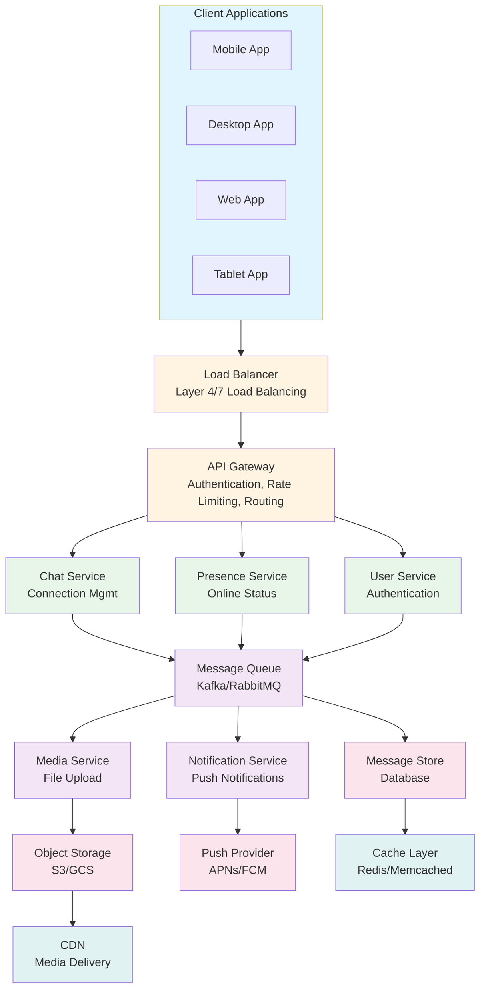
```mermaid
graph TD
    subgraph Clients["Client Applications"]
        Mobile["Mobile App"]
        Desktop["Desktop App"]
        Web["Web App"]
        Tablet["Tablet App"]
    end

    LB["Load Balancer<br/>Layer 4/7 Load Balancing"]
    Gateway["API Gateway<br/>Authentication, Rate Limiting, Routing"]

    Chat["Chat Service<br/>Connection Mgmt"]
    Presence["Presence Service<br/>Online Status"]
    User["User Service<br/>Authentication"]

    Queue["Message Queue<br/>Kafka/RabbitMQ"]
    Media["Media Service<br/>File Upload"]
    Notify["Notification Service<br/>Push Notifications"]

    Store["Message Store<br/>Database"]
    Object["Object Storage<br/>S3/GCS"]
    Push["Push Provider<br/>APNs/FCM"]

    CDN["CDN<br/>Media Delivery"]
    Cache["Cache Layer<br/>Redis/Memcached"]

    Clients --> LB
    LB --> Gateway
    Gateway --> Chat
    Gateway --> Presence
    Gateway --> User
    Chat --> Queue
    Presence --> Queue
    User --> Queue
    Queue --> Store
    Queue --> Media
    Queue --> Notify
    Media --> Object
    Notify --> Push
    Store --> Cache
    Object --> CDN

    style Clients fill:#e1f5ff
    style LB fill:#fff4e1
    style Gateway fill:#fff4e1
    style Chat fill:#e8f5e9
    style Presence fill:#e8f5e9
    style User fill:#e8f5e9
    style Queue fill:#f3e5f5
    style Media fill:#f3e5f5
    style Notify fill:#f3e5f5
    style Store fill:#fce4ec
    style Object fill:#fce4ec
    style Push fill:#fce4ec
    style CDN fill:#e0f2f1
    style Cache fill:#e0f2f1
```

### Component Descriptions

**Client Applications:**

Client applications are the user-facing interfaces that run on various devices including mobile phones (iOS and Android), desktop computers (Windows, macOS, Linux), web browsers, and tablets. These applications are responsible for maintaining persistent connections to the chat server using WebSocket or TCP protocols, enabling real-time bidirectional communication. They implement local encryption and decryption routines for end-to-end encrypted messages, ensuring that message content is only readable by the intended recipients. The applications maintain a local database (typically SQLite on mobile, IndexedDB on web) to store message history, allowing users to access their conversations even when offline. They handle background processing for push notifications, ensuring users receive alerts for new messages even when the app is not actively running. Client applications also implement UI components for message composition, display, media sharing, and various interactive features like typing indicators, read receipts, and message reactions. They must be optimized for battery life and bandwidth usage on mobile devices, implementing efficient data compression and smart sync strategies.

**Load Balancer:**

The load balancer sits at the edge of the infrastructure and is responsible for distributing incoming connections across multiple chat server instances to ensure optimal resource utilization and prevent any single server from becoming overwhelmed. It performs continuous health checks on all backend servers, automatically removing unhealthy instances from the rotation and routing traffic only to healthy servers. The load balancer can operate at Layer 4 (TCP level) for WebSocket connections or Layer 7 (HTTP level) for HTTP/WebSocket traffic, depending on the protocol requirements. It implements various load balancing algorithms including round-robin, least connections, and IP hash for session affinity. The load balancer also handles SSL/TLS termination, offloading the computational burden of encryption from backend servers. It provides failover capabilities, automatically redirecting traffic to available servers in the event of server failures. Popular load balancing solutions include HAProxy for on-premises deployments, NGINX for both load balancing and reverse proxy capabilities, AWS Application Load Balancer (ALB) and Network Load Balancer (NLB) for cloud deployments, and Google Cloud Load Balancing for GCP environments.

**API Gateway:**

The API Gateway serves as the central entry point for all client requests, acting as a unified facade that hides the complexity of the backend microservices architecture. It handles authentication and authorization by validating JWT tokens, API keys, or session tokens before forwarding requests to backend services. The gateway implements rate limiting to prevent abuse and protect against denial-of-service attacks, configuring different rate limits for different types of operations (e.g., message sending, file uploads, API calls). It routes requests to appropriate backend services based on URL patterns, headers, or other routing rules, enabling service discovery and dynamic routing. The gateway can perform protocol translation, converting HTTP requests to WebSocket connections or vice versa as needed. It also handles request/response transformation, modifying payloads to match the expected format of backend services. The API Gateway provides request/response logging and monitoring, giving visibility into API usage patterns and performance metrics. Popular API Gateway solutions include Kong for its plugin ecosystem and extensibility, AWS API Gateway for seamless integration with other AWS services, and Envoy for its high performance and advanced traffic management capabilities.

**Chat Service:**

The Chat Service is the core component responsible for managing real-time communication between users. It maintains persistent WebSocket or TCP connections with client applications, handling connection establishment, authentication, and lifecycle management. The service routes messages between users in real-time, ensuring that messages are delivered to the appropriate recipients based on their current connection state. It maintains session state for connected users, tracking which users are online, which conversations they have active, and their current presence status. For users who are offline, the chat service implements message queuing, storing messages temporarily until the user comes back online. The service is typically stateful and requires sticky sessions (session affinity) to ensure that a user's connection is always routed to the same server instance that maintains their session state. It handles connection pooling, managing thousands of concurrent connections efficiently using event-driven I/O models. The chat service also implements features like typing indicators, read receipts, and message delivery confirmations. It must be highly available and fault-tolerant, with mechanisms for graceful degradation during partial failures. The service often uses in-memory data structures for fast access to session information and may implement horizontal sharding to scale beyond the capacity of a single server.

**Presence Service:**

The Presence Service is dedicated to tracking and managing the real-time availability status of users across the platform. It maintains accurate information about whether users are online, offline, idle, or away, updating this status in real-time as users connect, disconnect, or become inactive. The service manages "last seen" timestamps, recording when each user was last active on the platform, which is displayed to other users to indicate availability. It handles typing indicators, broadcasting when a user is composing a message to other participants in the conversation, providing real-time feedback about user activity. The presence service uses a heartbeat mechanism to detect disconnections, requiring clients to send periodic heartbeat messages to maintain their online status; if heartbeats stop arriving, the service automatically marks the user as offline after a timeout period. This service is often implemented using in-memory data stores like Redis for low-latency access to presence information, as presence updates need to be processed and broadcast with minimal delay. The service must handle high write throughput during peak usage times when many users are coming online or going offline simultaneously. It also needs to efficiently broadcast presence updates to all relevant users (e.g., contacts, group members) without overwhelming the network with update messages. The presence service may implement presence subscriptions, allowing users to receive updates only for the contacts they care about.

**User Service:**

The User Service is responsible for managing all user-related data and operations. It handles user profile management, storing and updating user information such as display names, profile pictures, status messages, and other profile metadata. The service manages authentication, handling user login, logout, and session management, often integrating with identity providers for social login options. It maps phone numbers to internal user IDs, enabling users to be discovered and contacted via their phone numbers while maintaining internal identifiers for system operations. The service stores public keys for end-to-end encryption, managing the key bundles that include identity keys, signed prekeys, and one-time prekeys required for the Signal Protocol. It handles contact discovery and verification, allowing users to find their contacts who are also using the platform by comparing hashed phone numbers or usernames. The user service manages user settings and preferences, including notification preferences, privacy settings, theme choices, and other customizable options. It may also handle user account lifecycle operations such as account registration, deletion, and recovery. The service must ensure data privacy and security, especially for sensitive information like phone numbers and encryption keys. It often implements caching for frequently accessed user data to reduce database load and improve response times. The user service typically uses a relational database for structured user data and may integrate with key-value stores for session management.

**Message Queue:**

The Message Queue is a critical infrastructure component that provides reliable, asynchronous message delivery between different services in the system. It decouples message production from consumption, allowing services to operate independently without being blocked by each other. The queue enables asynchronous processing for non-critical operations such as media processing, notification sending, and analytics logging, ensuring that these operations don't block the main message delivery path. It handles backpressure during load spikes by buffering messages when consumers are unable to keep up with the production rate, preventing system overload. The message queue provides durability guarantees, ensuring that messages are not lost even if consumers fail temporarily. It supports various messaging patterns including point-to-point messaging for one-to-one communication and publish-subscribe for broadcasting messages to multiple consumers. The queue implements message ordering guarantees, ensuring that messages are processed in the order they were received when required. It also supports dead letter queues for handling messages that fail to be processed after multiple attempts. Popular message queue solutions include Apache Kafka for its high throughput and streaming capabilities, RabbitMQ for its flexible routing and protocol support, and Amazon SQS for its serverless nature and seamless AWS integration. The choice of message queue depends on factors like required throughput, latency, ordering guarantees, and operational complexity.

**Media Service:**

The Media Service is specialized for handling all file-related operations in the chat application. It manages file uploads from client applications, supporting various file types including images, videos, audio files, and documents. The service performs media processing operations such as image compression to reduce file size while maintaining acceptable quality, video transcoding to convert videos to standard formats compatible with all devices, and thumbnail generation to create preview images for media files. It generates unique, secure URLs for media files that can be shared in messages, often implementing signed URLs that expire after a certain time to prevent unauthorized access. The media service integrates with object storage systems like Amazon S3 or Google Cloud Storage for persistent file storage, handling the upload and retrieval operations. It may implement content moderation using AI/ML models to detect inappropriate content such as nudity, violence, or hate speech, automatically flagging or blocking such content. The service can also include virus scanning capabilities to detect malware in uploaded files, protecting users from security threats. The media service handles file deduplication, using content-based hashing to avoid storing duplicate files when multiple users share the same media. It implements storage lifecycle policies, automatically moving old or rarely accessed files to cheaper storage tiers or deleting them after retention periods expire. The service must handle large file uploads efficiently, supporting chunked uploads and resumable uploads for better reliability on unstable networks.

**Notification Service:**

The Notification Service is responsible for sending push notifications to users when they are offline or when the app is not actively running. It integrates with platform-specific push notification providers including Apple Push Notification Service (APNs) for iOS devices, Firebase Cloud Messaging (FCM) for Android devices, and Web Push API for web applications. The service formats notification payloads according to the specific requirements of each platform, handling differences in payload structure, supported features, and size limits. It implements notification rate limiting to prevent spam and protect against abuse, ensuring that users don't receive an overwhelming number of notifications. The service handles notification batching, combining multiple notifications into a single push when appropriate to reduce battery drain and network usage on user devices. It supports different notification types including message notifications, call notifications, and system notifications, each with appropriate priority and display behavior. The notification service decouples notification sending from message processing, allowing the main chat service to continue operating even if the notification service experiences delays or failures. It maintains device tokens for each user, managing the registration and deregistration of devices as users install or uninstall the app. The service handles notification analytics, tracking delivery rates, open rates, and other metrics to optimize notification effectiveness. It also supports silent notifications that wake up the app without displaying UI, used for background sync and data refresh operations. The service must handle platform-specific restrictions and quotas, such as APNs's limits on notification frequency and size.

**Message Store:**

The Message Store is the database component responsible for persisting message history for long-term storage and retrieval. It stores all messages exchanged between users, including text messages, media references, and metadata such as timestamps, sender information, and delivery status. The store enables message synchronization across multiple devices, allowing users to access their conversation history from any device they use. It supports efficient querying of conversation history, enabling features like pagination, search, and fetching messages by date range or conversation. The message store must handle extremely high write throughput, as a chat application may need to store millions of messages per second during peak usage. It implements data partitioning strategies to distribute data across multiple database nodes, enabling horizontal scaling. The store provides consistency guarantees to ensure that messages are delivered in the correct order and that all participants see the same conversation state. It may implement time-to-live (TTL) policies for ephemeral messages that should be automatically deleted after a certain period. The message store also handles message deletion operations, supporting both "delete for me" and "delete for everyone" operations with appropriate consistency guarantees. Popular database choices for message storage include Cassandra for its high write throughput and linear scalability, MongoDB for its flexible schema and rich query capabilities, and PostgreSQL with partitioning for its ACID compliance and relational features. The choice depends on factors like required consistency level, query patterns, and operational preferences.

**Object Storage:**

Object Storage provides scalable, durable, and cost-effective storage for media files including images, videos, audio files, and documents shared in the chat application. It offers virtually unlimited storage capacity, automatically scaling to accommodate growing data volumes without manual intervention. The storage system provides high durability guarantees, typically 99.999999999% (11 nines) durability, ensuring that data is protected against hardware failures and data corruption. It integrates seamlessly with Content Delivery Networks (CDNs) for efficient delivery of media files to users worldwide, reducing latency and improving user experience. Object storage supports various storage classes with different cost and performance characteristics, allowing optimization based on access patterns (e.g., frequent access vs. archival). It implements lifecycle management policies, automatically transitioning data between storage classes or deleting data based on age or other criteria. The storage system provides robust security features including encryption at rest, access control lists, and signed URLs for time-limited access. It supports multipart uploads for large files, enabling reliable upload of files that are gigabytes in size. Popular object storage solutions include Amazon S3 for its maturity and extensive feature set, Google Cloud Storage for its strong consistency and integration with GCP services, and Azure Blob Storage for its enterprise features and hybrid cloud capabilities. Object storage is essential for chat applications as media files typically constitute the majority of storage requirements, far exceeding the storage needed for text messages.

**Content Delivery Network (CDN):**

The Content Delivery Network (CDN) is a distributed network of servers deployed in multiple geographic locations worldwide, designed to deliver content to users with high performance and low latency. The CDN caches media files (images, videos, documents) at edge locations close to end users, significantly reducing the time required to download content compared to fetching it from the origin server. By serving content from edge locations, the CDN reduces latency for media downloads, providing a snappier user experience especially for users far from the origin data center. The CDN decreases load on origin servers by serving a large percentage of content requests from cache, reducing bandwidth costs and improving origin server performance. It handles high bandwidth for popular content efficiently, as the distributed nature of the CDN allows it to serve the same content to many users simultaneously without overwhelming any single server. The CDN implements intelligent caching strategies, determining which content to cache, how long to cache it, and when to invalidate cached content based on cache headers and configuration. It provides features like HTTP/2 support, TLS termination, and dynamic content acceleration. The CDN also offers security features including DDoS protection, web application firewall (WAF), and access control. Popular CDN providers include Cloudflare for its global network and security features, AWS CloudFront for its tight integration with other AWS services, and Fastly for its real-time logging and edge computing capabilities. Using a CDN is essential for chat applications with media sharing features, as it dramatically improves the user experience while reducing infrastructure costs.

**Cache Layer:**

The Cache Layer is a high-performance, in-memory data store that provides fast access to frequently accessed data, reducing latency and load on primary databases. It caches user presence information, allowing the system to quickly determine whether a user is online without querying the database. The cache stores session data, including authentication tokens and connection state, enabling fast session validation and reducing database load. It caches message metadata such as conversation lists, unread message counts, and recent message previews, allowing the application to display this information quickly without expensive database queries. The cache layer also stores frequently accessed user profile data, reducing the need to repeatedly fetch the same user information from the database. By serving these requests from memory, the cache significantly reduces response times for common operations, improving the overall user experience. The cache implements expiration policies to ensure that stale data is automatically refreshed, balancing freshness with performance. It supports various data structures including strings, hashes, lists, sets, and sorted sets, enabling diverse caching strategies. The cache layer provides persistence options, allowing data to be saved to disk for recovery after restarts. Popular caching solutions include Redis for its rich data structures and persistence options, and Memcached for its simplicity and high performance. The cache layer is particularly important for chat applications due to the real-time nature of the service and the need for low-latency access to user state and presence information.

---

## Communication Protocols

### Protocol Comparison

Choosing the right communication protocol is critical for chat applications. The protocol must support real-time bidirectional communication, handle unreliable network conditions, and minimize battery and bandwidth usage on mobile devices.

### WebSocket Protocol

**Overview:**
WebSocket is a protocol that enables two-way communication between a client and a remote host over a single persistent TCP connection. Standardized by the IETF as **RFC 6455** (December 2011, authors I. Fette and A. Melnikov), it was designed to supersede HTTP polling and long-polling techniques for bidirectional communication in web applications. RFC 6455 has since been updated by RFC 7936 (subprotocol name registry), RFC 8307 (well-known URIs), and RFC 8441 (bootstrapping WebSockets over HTTP/2).

The RFC's stated goal: *"to provide a mechanism for browser-based applications that need two-way communication with servers that does not rely on opening multiple HTTP connections."*

Conceptually, WebSocket is a thin layer on top of TCP that adds:
- An origin-based security model for browsers (Section 1.6)
- An addressing and protocol-naming mechanism to multiplex services on one port (Section 1.9)
- A frame-based message abstraction layered over TCP's byte stream (Section 5)
- An in-band closing handshake that works through proxies (Section 1.4, Section 7)

#### WebSocket URIs (RFC 6455 Section 3)

Two URI schemes are defined:
- `ws://host[:port]/path[?query]` — unencrypted (default port **80**)
- `wss://host[:port]/path[?query]` — TLS-encrypted (default port **443**)

Both `ws` and `wss` are registered IANA URI schemes (Section 11.1).

#### Opening Handshake (RFC 6455 Section 4)

The handshake is a standard HTTP/1.1 Upgrade request, making WebSocket compatible with existing HTTP infrastructure including proxies.

**Client Opening Handshake (Section 4.1) — required headers:**
```http
GET /chat HTTP/1.1
Host: server.example.com
Upgrade: websocket
Connection: Upgrade
Sec-WebSocket-Key: dGhlIHNhbXBsZSBub25jZQ==
Sec-WebSocket-Version: 13
Origin: http://example.com
Sec-WebSocket-Protocol: chat, superchat
Sec-WebSocket-Extensions: permessage-deflate
```

Per Section 4.1, the client request **MUST**:
- Use HTTP GET with version ≥ 1.1
- Include `Upgrade: websocket` (case-insensitive)
- Include `Connection: Upgrade`
- Include `Sec-WebSocket-Key` — a base64-encoded random 16-byte nonce
- Include `Sec-WebSocket-Version: 13`

**Server Opening Handshake (Section 4.2.2) — required response:**
```http
HTTP/1.1 101 Switching Protocols
Upgrade: websocket
Connection: Upgrade
Sec-WebSocket-Accept: s3pPLMBiTxaQ9kYGzzhZRbK+xOo=
Sec-WebSocket-Protocol: chat
```

Any status code other than **101** means the handshake did not complete and HTTP semantics still apply.

**`Sec-WebSocket-Accept` Derivation (Section 4.2.2):**

The server proves it received the WebSocket handshake by computing:
```
Sec-WebSocket-Accept = base64(SHA-1(Sec-WebSocket-Key + "258EAFA5-E914-47DA-95CA-C5AB0DC85B11"))
```
The GUID `258EAFA5-E914-47DA-95CA-C5AB0DC85B11` (RFC 4122) is a fixed magic string unlikely to be used by non-WebSocket servers, preventing accidental acceptance of WebSocket connections by plain HTTP servers.

Example (from Section 1.3, non-normative illustration):
- Key: `dGhlIHNhbXBsZSBub25jZQ==`
- Concatenated: `dGhlIHNhbXBsZSBub25jZQ==258EAFA5-E914-47DA-95CA-C5AB0DC85B11`
- SHA-1: `0xb3 0x7a 0x4f 0x2c ...`
- Accept: `s3pPLMBiTxaQ9kYGzzhZRbK+xOo=`

**Full Handshake + Data Transfer Sequence:**
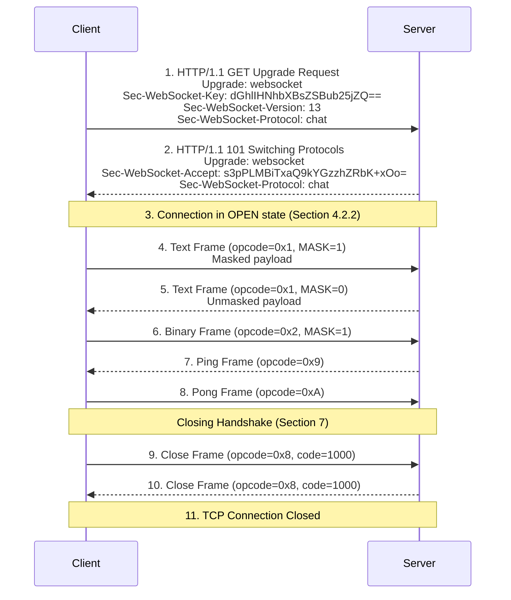
```mermaid
sequenceDiagram
    participant C as Client
    participant S as Server

    C->>S: 1. HTTP/1.1 GET Upgrade Request<br/>Upgrade: websocket<br/>Sec-WebSocket-Key: dGhlIHNhbXBsZSBub25jZQ==<br/>Sec-WebSocket-Version: 13<br/>Sec-WebSocket-Protocol: chat
    S-->>C: 2. HTTP/1.1 101 Switching Protocols<br/>Upgrade: websocket<br/>Sec-WebSocket-Accept: s3pPLMBiTxaQ9kYGzzhZRbK+xOo=<br/>Sec-WebSocket-Protocol: chat

    Note over C,S: 3. Connection in OPEN state (Section 4.2.2)

    C->>S: 4. Text Frame (opcode=0x1, MASK=1)<br/>Masked payload
    S-->>C: 5. Text Frame (opcode=0x1, MASK=0)<br/>Unmasked payload
    C->>S: 6. Binary Frame (opcode=0x2, MASK=1)
    S-->>C: 7. Ping Frame (opcode=0x9)
    C->>S: 8. Pong Frame (opcode=0xA)

    Note over C,S: Closing Handshake (Section 7)

    C->>S: 9. Close Frame (opcode=0x8, code=1000)
    S-->>C: 10. Close Frame (opcode=0x8, code=1000)
    Note over C,S: 11. TCP Connection Closed
```

#### Data Framing (RFC 6455 Section 5)

After the handshake, both parties exchange **frames**. A message may be split across one or more frames (fragmentation, Section 5.4). The wire format is defined in Section 5.2:

```
 0                   1                   2                   3
 0 1 2 3 4 5 6 7 8 9 0 1 2 3 4 5 6 7 8 9 0 1 2 3 4 5 6 7 8 9 0 1
+-+-+-+-+-------+-+-------------+-------------------------------+
|F|R|R|R| opcode|M| Payload len | Extended payload length       |
|I|S|S|S|  (4)  |A|     (7)     |             (16/64)           |
|N|V|V|V|       |S|             |   (if payload len==126/127)   |
| |1|2|3|       |K|             |                               |
+-+-+-+-+-------+-+-------------+ - - - - - - - - - - - - - - - +
|     Extended payload length continued, if payload len == 127 |
+ - - - - - - - - - - - - - - - +-------------------------------+
|                               |Masking-key, if MASK set to 1 |
+-------------------------------+-------------------------------+
| Masking-key (continued)       |         Payload Data          |
+-------------------------------- - - - - - - - - - - - - - - - +
:                     Payload Data continued ...                :
+ - - - - - - - - - - - - - - - - - - - - - - - - - - - - - - - +
|                     Payload Data continued ...                :
+---------------------------------------------------------------+
```

**Frame header fields (Section 5.2):**

| Field | Size | Description |
|-------|------|-------------|
| `FIN` | 1 bit | 1 = final fragment of message; 0 = more fragments follow |
| `RSV1-3` | 1 bit each | MUST be 0 unless a negotiated extension defines their use |
| `Opcode` | 4 bits | Defines payload interpretation (see opcodes below) |
| `MASK` | 1 bit | 1 = payload is masked; all client→server frames MUST be masked |
| `Payload len` | 7 bits | 0–125 = actual length; 126 = next 2 bytes are length; 127 = next 8 bytes are length |
| `Masking-key` | 0 or 4 bytes | Present only when MASK=1; random 32-bit value chosen by client |
| `Payload data` | variable | Extension data + Application data |

**Opcodes (Section 5.2):**

| Opcode | Value | Type | Description |
|--------|-------|------|-------------|
| Continuation | `0x0` | Data | Continues a fragmented message |
| Text | `0x1` | Data | UTF-8 encoded text payload |
| Binary | `0x2` | Data | Arbitrary binary payload |
| `0x3–0x7` | — | Reserved | Future non-control frames |
| Close | `0x8` | Control | Initiates closing handshake |
| Ping | `0x9` | Control | Keepalive / liveness probe |
| Pong | `0xA` | Control | Response to Ping |
| `0xB–0xF` | — | Reserved | Future control frames |

#### Client-to-Server Masking (RFC 6455 Section 5.3)

A key security requirement: **all frames sent from client to server MUST be masked** (MASK bit = 1). The server MUST close the connection upon receiving an unmasked client frame. Server-to-client frames MUST NOT be masked.

Masking uses a 32-bit key with XOR:
```
transformed-octet-i = original-octet-i XOR masking-key-octet-(i MOD 4)
```

This prevents cache-poisoning attacks against transparent HTTP proxies (Section 10.3). The masking key MUST be derived from a cryptographically strong entropy source (RFC 4086) and MUST be unpredictable per frame.

#### Message Fragmentation (RFC 6455 Section 5.4)

A message can be split into multiple frames to avoid buffering large payloads before transmission:
- First fragment: `FIN=0`, opcode = actual type (e.g., `0x1` for text)
- Middle fragments: `FIN=0`, opcode = `0x0` (continuation)
- Final fragment: `FIN=1`, opcode = `0x0`

Control frames (Close, Ping, Pong) MUST NOT be fragmented and MUST have a payload ≤ 125 bytes (Section 5.5).

#### Control Frames (RFC 6455 Section 5.5)

**Close (opcode `0x8`, Section 5.5.1):**
- Either peer initiates closure by sending a Close frame
- The other peer MUST respond with a Close frame if it has not already sent one
- After sending and receiving a Close frame, the TCP connection MUST be closed
- The body MAY contain a 2-byte status code followed by a UTF-8 reason string

**Close Status Codes (Section 7.4.1):**

| Code | Meaning |
|------|---------|
| `1000` | Normal closure — purpose fulfilled |
| `1001` | Going away — server shutting down or browser navigating away |
| `1002` | Protocol error |
| `1003` | Unsupported data type received |
| `1007` | Invalid data (e.g., non-UTF-8 in text frame) |
| `1008` | Policy violation |
| `1009` | Message too large |
| `1010` | Client expected extension negotiation that server didn't confirm |
| `1011` | Server encountered unexpected condition |

**Ping (opcode `0x9`, Section 5.5.2):**
- Either peer MAY send a Ping at any time after the handshake
- Receiver MUST respond with a Pong carrying the same application data
- Serves as keepalive or liveness probe

**Pong (opcode `0xA`, Section 5.5.3):**
- MUST echo the payload of the most recent Ping
- An unsolicited Pong is allowed (e.g., for one-way heartbeat)

#### Closing Handshake (RFC 6455 Section 7)

The WebSocket closing handshake complements the TCP FIN/ACK because TCP close is not always reliable end-to-end in the presence of proxies (Section 1.4). The procedure:
1. Initiating peer sends a Close frame (Section 7.1.2)
2. Receiving peer sends a Close frame in response (Section 7.1.3)
3. Both peers close the underlying TCP connection (Section 7.1.1)
4. Server MUST close TCP immediately; client SHOULD wait for server's TCP close

**Abnormal closure and reconnection (Section 7.2.3):**
Clients SHOULD use exponential backoff when reconnecting after abnormal closure to avoid inadvertently DDoS-ing the server. The RFC recommends an initial random delay of 0–5 seconds.

#### Subprotocols (RFC 6455 Section 1.9)

The `Sec-WebSocket-Protocol` header lets the client advertise application-level protocols layered over WebSocket. The server selects one:
- Client: `Sec-WebSocket-Protocol: chat, superchat`
- Server: `Sec-WebSocket-Protocol: chat`

Subprotocol names should use reverse-domain notation (e.g., `chat.example.com`) and are registered in the IANA WebSocket Subprotocol Name Registry (Section 11.5).

#### Extensions (RFC 6455 Section 9)

Extensions are negotiated via `Sec-WebSocket-Extensions`. They may use the reserved RSV bits and define new opcodes. The most widely deployed extension is `permessage-deflate` (per-message DEFLATE compression). Extensions MUST NOT be used unless negotiated during the opening handshake.

#### Security Considerations (RFC 6455 Section 10)

- **Origin model (Section 10.2)**: Servers SHOULD validate the `Origin` header to prevent unauthorized cross-origin use from browser scripts
- **Masking (Section 10.3)**: Client-to-server masking specifically defends against cache-poisoning of transparent HTTP proxies; it is required regardless of whether TLS is in use
- **TLS (Section 10.6)**: `wss://` connections MUST perform a TLS handshake before the WebSocket handshake; clients MUST use the SNI extension (RFC 6066)
- **Authentication (Section 10.5)**: RFC 6455 does not define authentication; servers should use cookies, HTTP auth, or tokens negotiated before or during the handshake
- **SHA-1 usage (Section 10.8)**: SHA-1 in the `Sec-WebSocket-Accept` derivation is used only to prove receipt of the handshake, not for security against collision attacks

**Key Features:**
- **Full-Duplex Communication**: Both client and server can send frames independently at any time after the handshake (Section 1.2)
- **Minimal Framing Overhead**: 2 bytes minimum for server→client frames; 6 bytes minimum for client→server frames (2 base + 4-byte masking key); up to 14 bytes for large masked frames (Section 5.2)
- **Text and Binary Frames**: Text frames carry UTF-8 data (Section 5.6); binary frames carry arbitrary bytes
- **Message Fragmentation**: Large messages can be sent as a stream of fragments without knowing total size upfront (Section 5.4)
- **Subprotocol Negotiation**: Application-level protocols layered over WebSocket (Section 1.9)
- **Extension Negotiation**: RSV bits and opcodes extensible via negotiated extensions (Section 9)
- **Built-in Keepalive**: Ping/Pong control frames (Section 5.5.2, Section 5.5.3)
- **Clean Closing Handshake**: In-band close with status codes, proxy-safe (Section 7)
- **Designed for HTTP Coexistence**: Runs on ports 80/443; handshake is a valid HTTP Upgrade request (Section 1.7)

**Advantages:**
- **Low Latency**: Eliminates per-message HTTP overhead once connection is established
- **Efficient**: 2-byte minimum frame header vs. hundreds of bytes for HTTP headers
- **Widely Supported**: All modern browsers, RFC-compliant since 2011
- **HTTP-Compatible**: Shares ports 80/443; traverses most firewalls and proxies
- **Extensible**: Subprotocol and extension negotiation at handshake time
- **Rich Ecosystem**: Socket.IO, SockJS, ws (Node.js), Gorilla WebSocket, Netty, etc.

**Disadvantages:**
- **Mandatory Client Masking**: Per-frame masking adds CPU cost on the client side (Section 5.3)
- **Stateful**: Server must maintain per-connection state; complicates horizontal scaling
- **Scaling Complexity**: Sticky sessions or a pub/sub layer (e.g., Redis) required for multi-node deployments
- **Proxy/Firewall Friction**: Some older or misconfigured HTTP proxies do not handle the Upgrade correctly
- **No Built-in Multiplexing**: One logical channel per TCP connection (multiplexing is reserved for future extensions per Section 1.5)

### XMPP Protocol

**Overview:**
Extensible Messaging and Presence Protocol (XMPP) is a real-time messaging protocol originally created in the late 1990s as an open-source alternative to closed messenger systems. It was standardized by the IETF (RFC 6120, RFC 6121) and is used by WhatsApp, Google Talk (historically), and many enterprise messaging systems.

**Key Features:**
- **XML-Based**: Uses XML for message formatting (verbose but structured)
- **Decentralized**: No single central server; federated server architecture
- **Built-in Identity**: Every client has a JabberID (similar to email)
- **Presence Support**: Native support for online/offline status
- **Extensible**: Rich extension ecosystem (XEPs) for additional features
- **Gateway Support**: Can interoperate with other protocols (SMS, email, etc.)

**Advantages:**
- **Mature and Stable**: Proven protocol with decades of development
- **Rich Feature Set**: Built-in support for presence, roster, and messaging
- **Federated**: Can communicate across different server domains
- **Extensible**: XEP (XMPP Extension Protocols) ecosystem for custom features
- **Security**: Built-in SASL authentication and TLS encryption
- **Open Standard**: No vendor lock-in, multiple implementations available

**Disadvantages:**
- **Verbose XML**: High overhead compared to binary protocols
- **Not Optimized for Mobile**: XML parsing is CPU-intensive on mobile devices
- **Complexity**: Full XMPP implementation is complex
- **Bandwidth**: XML verbosity increases bandwidth usage
- **Latency**: XML parsing adds latency compared to binary protocols

**WhatsApp's Custom XMPP:**
WhatsApp uses a heavily customized version of XMPP:
- Stripped down to essential features to reduce overhead
- Modified to work over custom TCP protocol instead of standard XMPP
- Optimized for mobile networks with poor connectivity
- Implemented in Erlang for massive concurrency

### MQTT Protocol

**Overview:**
Message Queuing Telemetry Transport (MQTT) is a lightweight messaging protocol designed for machine-to-machine communication and IoT devices. It was standardized by OASIS and ISO/IEC. While not originally designed for chat applications, its efficiency makes it suitable for mobile-first messaging.

**Key Features:**
- **Publish/Subscribe Model**: Decouples publishers from subscribers
- **Lightweight**: 2-byte minimum header, extremely efficient
- **QoS Levels**: Three levels of message delivery guarantees
  - QoS 0: At most once (fire and forget)
  - QoS 1: At least once (acknowledged delivery)
  - QoS 2: Exactly once (assured delivery)
- **Last Will and Testament**: Notification when client disconnects unexpectedly
- **Retained Messages**: Broker stores last message for new subscribers
- **Topic-Based Routing**: Hierarchical topic structure for message routing

**Advantages:**
- **Extremely Lightweight**: Minimal overhead, ideal for constrained devices
- **Efficient**: Small packet size reduces bandwidth usage
- **Battery-Friendly**: Low CPU and battery consumption
- **Network Resilient**: Designed for unreliable networks
- **Scalable**: Can handle millions of connections with proper broker configuration
- **Flexible QoS**: Choose appropriate delivery guarantees per use case

**Disadvantages:**
- **Not Chat-Specific**: Lacks built-in features like presence, roster management
- **Broker Dependency**: Requires central broker (single point of failure unless clustered)
- **Limited Security**: Basic authentication, requires TLS for encryption
- **No Native E2E Encryption**: Must be implemented at application layer
- **Less Mature for Chat**: Fewer chat-specific implementations compared to XMPP/WebSocket

### Protocol Selection Guide

**Choose WebSocket When:**
- Building web-based chat applications
- Need full-duplex communication with low latency
- Want to leverage existing WebSocket ecosystem
- Building custom messaging protocol on top of transport layer

**Choose XMPP When:**
- Need federated communication across domains
- Require built-in presence and roster management
- Want to leverage existing XMPP infrastructure
- Building enterprise messaging with interoperability requirements

**Choose MQTT When:**
- Targeting mobile devices with bandwidth constraints
- Building IoT-focused messaging applications
- Need efficient publish/subscribe model
- Operating in environments with poor network connectivity

**WhatsApp's Approach:**
WhatsApp uses a custom protocol based on modified XMPP over TCP:
- Custom TCP protocol for connection management
- Streamlined XMPP for message format
- Optimized for mobile networks
- Implemented in Erlang for massive concurrency

---

## Message Flow and Delivery Semantics

### Message Lifecycle

The complete lifecycle of a message from sender to recipient involves multiple components and guarantees. Understanding this flow is critical for building a reliable messaging system.

### Sequence Diagram: Online-to-Online Message Delivery

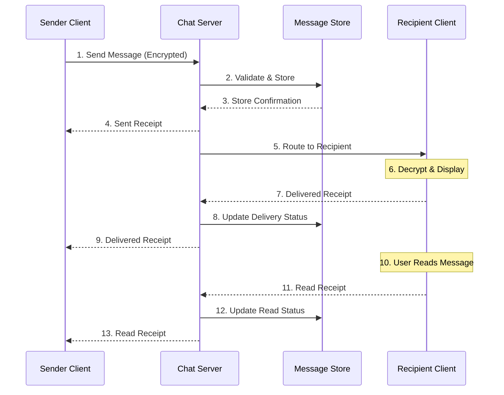
```mermaid
sequenceDiagram
    participant S as Sender Client
    participant CS as Chat Server
    participant MS as Message Store
    participant R as Recipient Client

    S->>CS: 1. Send Message (Encrypted)
    CS->>MS: 2. Validate & Store
    MS-->>CS: 3. Store Confirmation
    CS-->>S: 4. Sent Receipt
    CS->>R: 5. Route to Recipient
    Note over R: 6. Decrypt & Display
    R-->>CS: 7. Delivered Receipt
    CS->>MS: 8. Update Delivery Status
    CS-->>S: 9. Delivered Receipt
    Note over R: 10. User Reads Message
    R-->>CS: 11. Read Receipt
    CS->>MS: 12. Update Read Status
    CS-->>S: 13. Read Receipt
```

### Message Delivery Guarantees

**At-Least-Once Delivery:**
- Messages are guaranteed to be delivered at least once
- May result in duplicate messages (client must handle deduplication)
- Implemented using message queues with acknowledgments
- Suitable for most chat applications where duplicates are acceptable

**Exactly-Once Delivery:**
- Messages are guaranteed to be delivered exactly once
- More complex to implement, requires idempotency
- Implemented using message IDs and deduplication at application layer
- Critical for financial transactions or actions with side effects

**At-Most-Once Delivery:**
- Messages may be lost but never duplicated
- Lowest overhead, fastest delivery
- Suitable for ephemeral messages like typing indicators
- Not suitable for persistent messages

### Message Ordering

**Sequence Numbers:**
Each message in a conversation is assigned a monotonically increasing sequence number:
- Sender increments sequence number for each message
- Recipient buffers out-of-order messages
- Messages are displayed in sequence number order
- Handles network reordering and delayed delivery

**Vector Clocks:**
For group chats and distributed systems:
- Each participant maintains a logical clock
- Messages carry vector clock timestamps
- Enables causal ordering of messages
- More complex but provides stronger ordering guarantees

### Offline Message Handling

**Store-and-Forward Pattern:**
When recipient is offline:
1. Message is stored in pending message queue
2. Server maintains offline message list per user
3. When user reconnects, server pushes all pending messages
4. Client acknowledges receipt of each message
5. Server removes acknowledged messages from queue

**Implementation Considerations:**
- Limit maximum number of offline messages per user
- Implement TTL for old offline messages
- Use efficient data structures for message lookup
- Batch message delivery on reconnection to reduce overhead

### Message Deduplication

**Idempotency Keys:**
Each message includes a unique identifier:
- Client generates UUID for each message
- Server tracks processed message IDs per conversation
- Duplicate messages are detected and ignored
- Prevents duplicate delivery from retries

**Time-Based Deduplication:**
- Store message IDs for a limited time window (e.g., 24 hours)
- Old message IDs are expired to prevent unbounded growth
- Trade-off between memory usage and deduplication window

### Message Acknowledgments

**Three-Level Acknowledgment:**
1. **Sent**: Server received and stored the message
2. **Delivered**: Recipient received the message (device online)
3. **Read**: Recipient opened and read the message

**Acknowledgment Flow:**
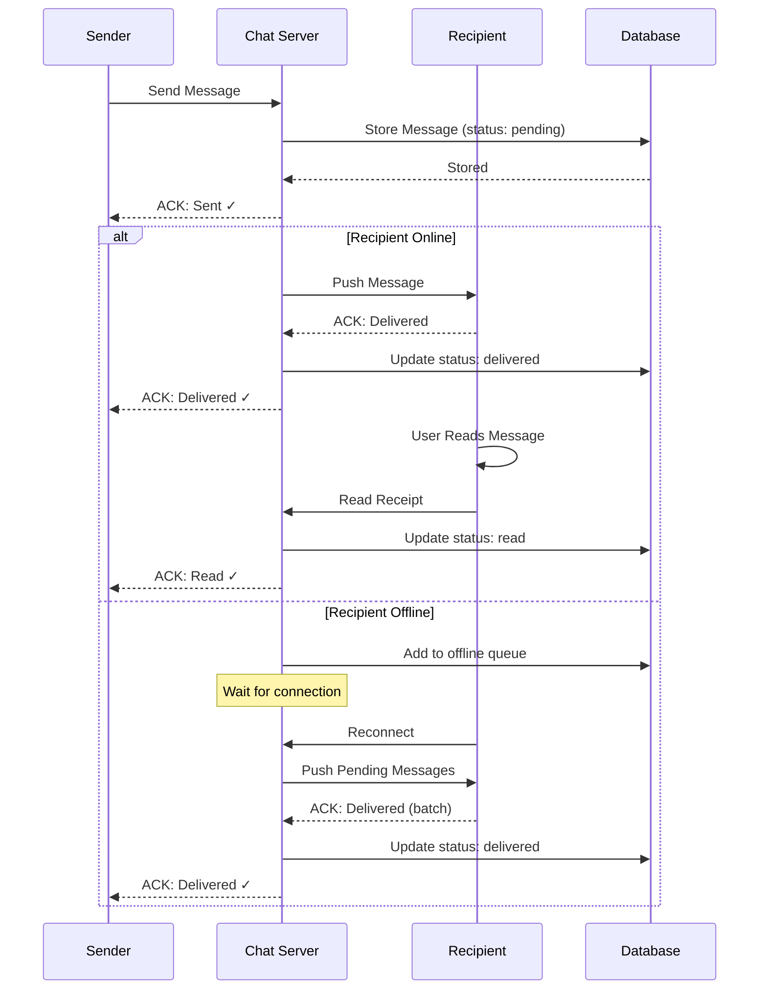
```mermaid
sequenceDiagram
    participant S as Sender
    participant CS as Chat Server
    participant R as Recipient
    participant DB as Database

    S->>CS: Send Message
    CS->>DB: Store Message (status: pending)
    DB-->>CS: Stored
    CS-->>S: ACK: Sent ✓
    
    alt Recipient Online
        CS->>R: Push Message
        R-->>CS: ACK: Delivered
        CS->>DB: Update status: delivered
        CS-->>S: ACK: Delivered ✓
        
        R->>R: User Reads Message
        R->>CS: Read Receipt
        CS->>DB: Update status: read
        CS-->>S: ACK: Read ✓
    else Recipient Offline
        CS->>DB: Add to offline queue
        Note over CS: Wait for connection
        
        R->>CS: Reconnect
        CS->>R: Push Pending Messages
        R-->>CS: ACK: Delivered (batch)
        CS->>DB: Update status: delivered
        CS-->>S: ACK: Delivered ✓
    end
```

### Retry Mechanisms

**Exponential Backoff:**
When message delivery fails, the system implements exponential backoff to avoid overwhelming the recipient or server:

```java
import java.util.concurrent.TimeUnit;

public class MessageDelivery {
    private static final int[] RETRY_DELAYS = {1000, 2000, 4000, 8000, 16000, 32000}; // milliseconds
    private static final int MAX_RETRIES = RETRY_DELAYS.length;

    public DeliveryResult deliverMessage(Message message, int attempt) {
        try {
            sendToRecipient(message);
            return new DeliveryResult(true, null);
        } catch (Exception error) {
            if (attempt >= MAX_RETRIES) {
                moveToDeadLetterQueue(message);
                return new DeliveryResult(false, "max_retries_exceeded");
            }
            
            int delay = RETRY_DELAYS[attempt];
            try {
                TimeUnit.MILLISECONDS.sleep(delay);
            } catch (InterruptedException e) {
                Thread.currentThread().interrupt();
            }
            return deliverMessage(message, attempt + 1);
        }
    }

    private void sendToRecipient(Message message) {
        // Implementation
    }

    private void moveToDeadLetterQueue(Message message) {
        // Implementation
    }

    public static class DeliveryResult {
        private final boolean success;
        private final String reason;

        public DeliveryResult(boolean success, String reason) {
            this.success = success;
            this.reason = reason;
        }

        public boolean isSuccess() {
            return success;
        }

        public String getReason() {
            return reason;
        }
    }
}
```

**Retry Strategies:**
- **Immediate Retry**: For transient network errors (1-2 attempts)
- **Exponential Backoff**: For server errors or rate limits (up to 32 seconds)
- **Jitter**: Add randomization to prevent thundering herd
- **Dead Letter Queue**: Messages that exceed max retries for manual inspection

### Message Expiration and TTL

**Time-to-Live Policies:**
- **Ephemeral Messages**: Auto-delete after 24 hours (e.g., "disappearing messages")
- **Offline Queue TTL**: Remove undelivered messages after 30 days
- **Receipt TTL**: Clean up old delivery receipts after 90 days
- **Media TTL**: Delete media files after message deletion

**Implementation:**
```java
import java.util.UUID;

public class Message {
    private String id;
    private String content;
    private long ttl;
    private long expiresAt;
    private long createdAt;

    public Message(String encryptedContent) {
        this.id = UUID.randomUUID().toString();
        this.content = encryptedContent;
        this.ttl = 86400000L; // 24 hours in milliseconds
        this.expiresAt = System.currentTimeMillis() + 86400000L;
        this.createdAt = System.currentTimeMillis();
    }

    // Getters and setters
    public String getId() { return id; }
    public String getContent() { return content; }
    public long getTtl() { return ttl; }
    public long getExpiresAt() { return expiresAt; }
    public long getCreatedAt() { return createdAt; }
}

// Database TTL index (MongoDB example)
// db.messages.createIndex({ expiresAt: 1 }, { expireAfterSeconds: 0 });
```

### Message Priority and QoS Levels

**Priority Levels:**
1. **Critical**: System alerts, security notifications (immediate delivery)
2. **High**: Direct messages, important group messages (high priority queue)
3. **Normal**: Standard chat messages (normal queue)
4. **Low**: Broadcast messages, marketing content (low priority queue)

**Quality of Service (QoS):**
- **QoS 0 (At Most Once)**: Fire and forget, no acknowledgment (typing indicators)
- **QoS 1 (At Least Once)**: Acknowledgment required, possible duplicates (standard messages)
- **QoS 2 (Exactly Once)**: Four-way handshake, no duplicates (critical messages)

### Error Handling Scenarios

**Network Failures:**
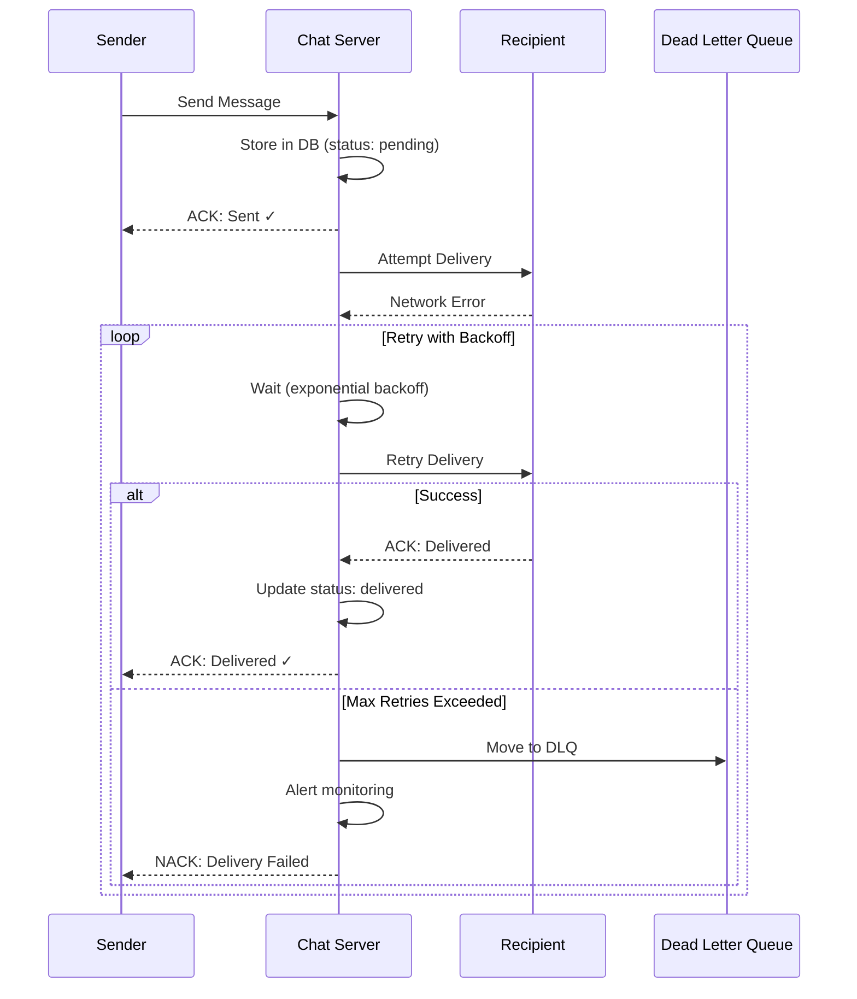
```mermaid
sequenceDiagram
    participant S as Sender
    participant CS as Chat Server
    participant R as Recipient
    participant DQ as Dead Letter Queue

    S->>CS: Send Message
    CS->>CS: Store in DB (status: pending)
    CS-->>S: ACK: Sent ✓
    
    CS->>R: Attempt Delivery
    R-->>CS: Network Error
    
    loop Retry with Backoff
        CS->>CS: Wait (exponential backoff)
        CS->>R: Retry Delivery
        alt Success
            R-->>CS: ACK: Delivered
            CS->>CS: Update status: delivered
            CS-->>S: ACK: Delivered ✓
        else Max Retries Exceeded
            CS->>DQ: Move to DLQ
            CS->>CS: Alert monitoring
            CS-->>S: NACK: Delivery Failed
        end
    end
```

**Server Failures:**
- **Primary Server Down**: Failover to replica, resume message delivery
- **Database Write Failure**: Buffer in memory, retry with backoff
- **Queue Overflow**: Shed low-priority messages, alert operators

**Client Failures:**
- **App Crash**: Messages remain in offline queue, delivered on reconnect
- **Storage Full**: Client requests partial sync, oldest messages first
- **Corruption**: Client requests full resync from server

### Message Compression

**Compression Strategies:**
- **Text Messages**: Gzip compression for messages > 1KB
- **JSON Payloads**: MessagePack or CBOR for binary encoding
- **Batch Messages**: Compress entire batch instead of individual messages

**Trade-offs:**
- **CPU vs. Bandwidth**: Compression saves bandwidth but uses CPU
- **Latency**: Compression/decompression adds ~5-10ms latency
- **Compression Ratio**: Typical text compression: 60-70% reduction

```java
import java.io.ByteArrayOutputStream;
import java.io.IOException;
import java.nio.charset.StandardCharsets;
import java.util.Base64;
import java.util.zip.GZIPInputStream;
import java.util.zip.GZIPOutputStream;
import com.fasterxml.jackson.databind.ObjectMapper;

public class MessageCompression {
    private static final ObjectMapper objectMapper = new ObjectMapper();
    private static final int COMPRESSION_THRESHOLD = 1024;

    public static String compressMessage(Object message) throws IOException {
        String json = objectMapper.writeValueAsString(message);
        if (json.length() < COMPRESSION_THRESHOLD) {
            return json; // Skip compression for small messages
        }
        return compress(json);
    }

    public static <T> T decompressMessage(String data, Class<T> clazz) throws IOException {
        if (isGzipped(data)) {
            String decompressed = decompress(data);
            return objectMapper.readValue(decompressed, clazz);
        }
        return objectMapper.readValue(data, clazz);
    }

    private static String compress(String data) throws IOException {
        ByteArrayOutputStream bos = new ByteArrayOutputStream(data.length());
        try (GZIPOutputStream gzip = new GZIPOutputStream(bos)) {
            gzip.write(data.getBytes(StandardCharsets.UTF_8));
        }
        return Base64.getEncoder().encodeToString(bos.toByteArray());
    }

    private static String decompress(String compressedData) throws IOException {
        byte[] compressed = Base64.getDecoder().decode(compressedData);
        ByteArrayOutputStream bos = new ByteArrayOutputStream();
        try (GZIPInputStream gzip = new GZIPInputStream(new java.io.ByteArrayInputStream(compressed))) {
            byte[] buffer = new byte[1024];
            int len;
            while ((len = gzip.read(buffer)) > 0) {
                bos.write(buffer, 0, len);
            }
        }
        return bos.toString(StandardCharsets.UTF_8.name());
    }

    private static boolean isGzipped(String data) {
        // Simple check: Base64 encoded gzip data typically has specific characteristics
        // In production, you might want a more robust check
        try {
            byte[] decoded = Base64.getDecoder().decode(data);
            return decoded.length > 2 && 
                   ((decoded[0] & 0xff) == 0x1f) && 
                   ((decoded[1] & 0xff) == 0x8b);
        } catch (Exception e) {
            return false;
        }
    }
}
```

### Message Batching

**Batching Strategies:**
- **Time-based**: Batch messages within 100ms window
- **Size-based**: Batch up to 50 messages or 100KB
- **Priority-based**: Critical messages sent immediately, others batched

**Benefits:**
- Reduced network roundtrips
- Lower protocol overhead
- Better compression ratios
- Reduced database writes

```java
import java.util.ArrayList;
import java.util.List;
import java.util.Timer;
import java.util.TimerTask;

public class MessageBatcher {
    private List<Object> batch;
    private final int maxSize;
    private final long maxWait; // milliseconds
    private Timer timer;

    public MessageBatcher(int maxSize, long maxWait) {
        this.batch = new ArrayList<>();
        this.maxSize = maxSize;
        this.maxWait = maxWait;
        this.timer = null;
    }

    public MessageBatcher() {
        this(50, 100);
    }

    public synchronized void add(Object message) {
        batch.add(message);
        
        if (batch.size() >= maxSize) {
            flush();
        } else if (timer == null) {
            timer = new Timer();
            timer.schedule(new TimerTask() {
                @Override
                public void run() {
                    flush();
                }
            }, maxWait);
        }
    }

    public synchronized void flush() {
        if (timer != null) {
            timer.cancel();
            timer = null;
        }
        if (!batch.isEmpty()) {
            sendBatch(new ArrayList<>(batch));
            batch.clear();
        }
    }

    private void sendBatch(List<Object> batch) {
        // Implementation for sending batch
    }
}
```

### Cross-Region Message Delivery

**Multi-Region Architecture:**
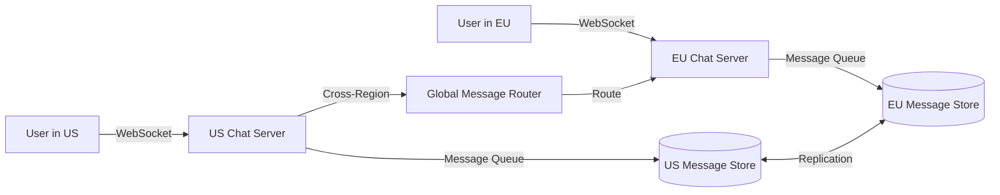
```mermaid
graph LR
    A[User in US] -->|WebSocket| B[US Chat Server]
    C[User in EU] -->|WebSocket| D[EU Chat Server]
    
    B -->|Message Queue| E[(US Message Store)]
    D -->|Message Queue| F[(EU Message Store)]
    
    E <-->|Replication| F
    
    B -->|Cross-Region| G[Global Message Router]
    G -->|Route| D
```

**Considerations:**
- **Latency**: Cross-region delivery adds 50-200ms latency
- **Consistency**: Eventual consistency across regions
- **Cost**: Cross-region data transfer charges
- **Compliance**: Data residency requirements (GDPR)

**Strategies:**
- **Home Region**: Each user's data stored in their home region
- **Read-Local**: Users read from nearest region
- **Write-Home**: Writes go to home region, replicated asynchronously
- **Edge Caching**: Frequently accessed messages cached at edge

### Message Persistence Guarantees

**Durability Levels:**
1. **Memory Only**: Fastest, data lost on restart (ephemeral)
2. **Write-Ahead Log**: Durable, can recover from crash
3. **Synchronous Replication**: Data replicated before ACK (highest durability)
4. **Geo-Replicated**: Data replicated across regions (disaster recovery)

**Write Path:**
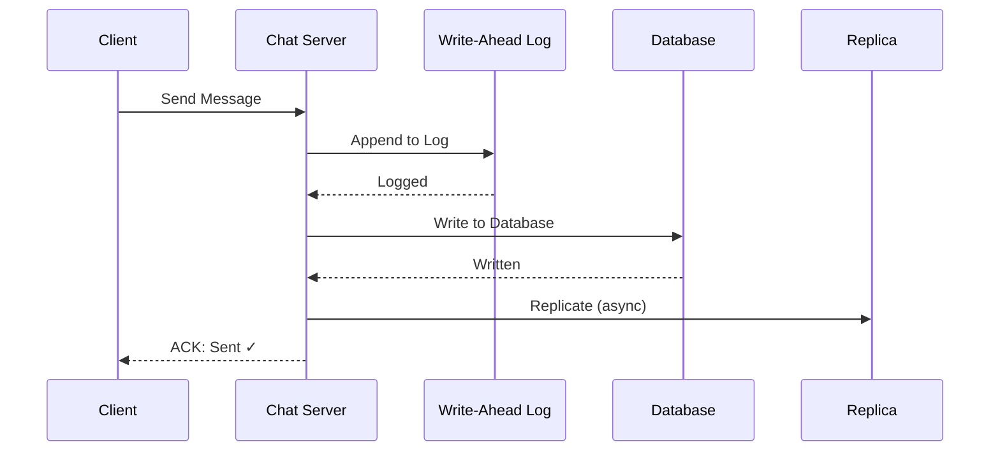
```mermaid
sequenceDiagram
    participant C as Client
    participant CS as Chat Server
    participant WAL as Write-Ahead Log
    participant DB as Database
    participant R as Replica

    C->>CS: Send Message
    CS->>WAL: Append to Log
    WAL-->>CS: Logged
    CS->>DB: Write to Database
    DB-->>CS: Written
    CS->>R: Replicate (async)
    CS-->>C: ACK: Sent ✓
```

### Implementation Example: Java Message Handler

```java
import java.util.*;
import java.util.UUID;

public class MessageHandler {
    private final MessageStore messageStore;
    private final NotificationService notificationService;
    private final Map<String, List<Message>> pendingMessages; // userId -> Message[]
    private final Map<String, Connection> connections; // userId -> Connection

    public MessageHandler(MessageStore messageStore, NotificationService notificationService) {
        this.messageStore = messageStore;
        this.notificationService = notificationService;
        this.pendingMessages = new HashMap<>();
        this.connections = new HashMap<>();
    }

    public MessageResult handleMessage(String senderId, String recipientId, String content) {
        String messageId = UUID.randomUUID().toString();
        Message message = new Message(
            messageId,
            senderId,
            recipientId,
            content,
            "sent",
            System.currentTimeMillis(),
            86400000L // 24 hours
        );

        // Store message
        messageStore.store(message);

        // Try to deliver immediately
        boolean delivered = tryDeliver(recipientId, message);

        if (!delivered) {
            // Add to offline queue
            addToOfflineQueue(recipientId, message);
        }

        return new MessageResult(messageId, delivered ? "delivered" : "pending");
    }

    public boolean tryDeliver(String recipientId, Message message) {
        Connection connection = getConnection(recipientId);
        if (connection == null) return false;

        try {
            connection.send(message);
            messageStore.updateStatus(message.getId(), "delivered");
            notifySender(message.getSenderId(), 
                new DeliveryNotification(message.getId(), "delivered"));
            return true;
        } catch (Exception error) {
            System.err.println("Delivery failed: " + error.getMessage());
            return false;
        }
    }

    public void addToOfflineQueue(String recipientId, Message message) {
        pendingMessages.computeIfAbsent(recipientId, k -> new ArrayList<>()).add(message);
    }

    public void handleUserConnect(String userId, Connection connection) {
        setConnection(userId, connection);

        // Deliver pending messages
        List<Message> pending = pendingMessages.getOrDefault(userId, new ArrayList<>());
        for (Message message : pending) {
            tryDeliver(userId, message);
        }
        pendingMessages.remove(userId);
    }

    public void handleReadReceipt(String userId, String messageId) {
        messageStore.updateStatus(messageId, "read");
        Message message = messageStore.get(messageId);
        if (message != null) {
            notifySender(message.getSenderId(), 
                new DeliveryNotification(messageId, "read"));
        }
    }

    private Connection getConnection(String userId) {
        return connections.get(userId);
    }

    private void setConnection(String userId, Connection connection) {
        connections.put(userId, connection);
    }

    private void notifySender(String senderId, DeliveryNotification notification) {
        notificationService.notify(senderId, notification);
    }

    public static class Message {
        private final String id;
        private final String senderId;
        private final String recipientId;
        private final String content;
        private String status;
        private final long timestamp;
        private final long ttl;

        public Message(String id, String senderId, String recipientId, String content, 
                      String status, long timestamp, long ttl) {
            this.id = id;
            this.senderId = senderId;
            this.recipientId = recipientId;
            this.content = content;
            this.status = status;
            this.timestamp = timestamp;
            this.ttl = ttl;
        }

        // Getters and setters
        public String getId() { return id; }
        public String getSenderId() { return senderId; }
        public String getRecipientId() { return recipientId; }
        public String getContent() { return content; }
        public String getStatus() { return status; }
        public void setStatus(String status) { this.status = status; }
        public long getTimestamp() { return timestamp; }
        public long getTtl() { return ttl; }
    }

    public static class MessageResult {
        private final String messageId;
        private final String status;

        public MessageResult(String messageId, String status) {
            this.messageId = messageId;
            this.status = status;
        }

        public String getMessageId() { return messageId; }
        public String getStatus() { return status; }
    }

    public static class DeliveryNotification {
        private final String messageId;
        private final String status;

        public DeliveryNotification(String messageId, String status) {
            this.messageId = messageId;
            this.status = status;
        }

        public String getMessageId() { return messageId; }
        public String getStatus() { return status; }
    }
}
```

---

## Group Messaging Architecture

Group messaging presents unique challenges compared to one-on-one messaging, primarily due to the need to deliver a single message to multiple recipients efficiently. This section details the architecture patterns, strategies, and implementation considerations for building a scalable group messaging system.

### Core Challenges

1. **Write Amplification**: A single message must be stored and delivered to N recipients
2. **Read Scalability**: Thousands of members reading the same conversation simultaneously
3. **Message Ordering**: Maintaining consistent order across all recipients
4. **Notification Overhead**: Avoiding notification storms in large groups
5. **Storage Efficiency**: Balancing delivery speed with storage costs
6. **Real-time Performance**: Ensuring low latency for all group operations
7. **Consistency**: Keeping group state synchronized across distributed systems

### Fan-Out Strategies

Group messaging introduces the challenge of delivering a single message to multiple recipients. The choice of fan-out strategy significantly impacts system performance and scalability.

### Fan-Out on Write

**Description:**
When a user sends a message to a group, the server immediately writes a copy of the message for each group member. This ensures fast delivery but increases write load.

**Architecture:**
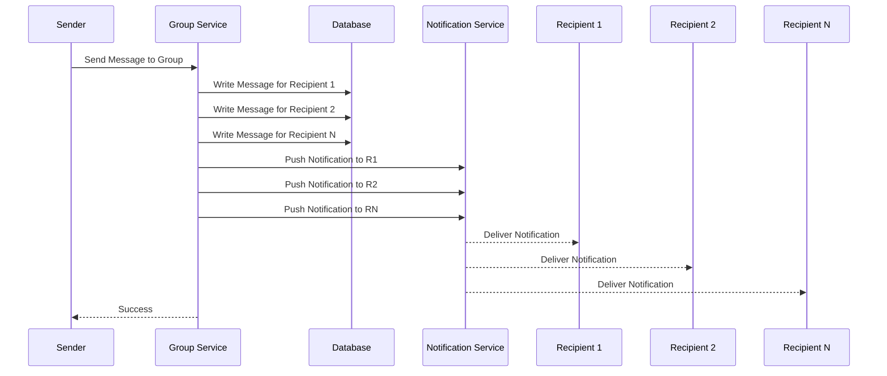
```mermaid
sequenceDiagram
    participant S as Sender
    participant GS as Group Service
    participant DB as Database
    participant NS as Notification Service
    participant R1 as Recipient 1
    participant R2 as Recipient 2
    participant RN as Recipient N

    S->>GS: Send Message to Group
    GS->>DB: Write Message for Recipient 1
    GS->>DB: Write Message for Recipient 2
    GS->>DB: Write Message for Recipient N
    GS->>NS: Push Notification to R1
    GS->>NS: Push Notification to R2
    GS->>NS: Push Notification to RN
    NS-->>R1: Deliver Notification
    NS-->>R2: Deliver Notification
    NS-->>RN: Deliver Notification
    GS-->>S: Success
```

**Advantages:**
- **Fast Delivery**: Recipients receive messages immediately
- **Simple Read Path**: No complex queries needed to fetch messages
- **Natural Ordering**: Each recipient has their own message sequence
- **Offline Support**: Each recipient has their own offline queue
- **Personalized Views**: Each recipient can have different message states (read, deleted, muted)
- **Efficient Pagination**: Simple cursor-based pagination per user

**Disadvantages:**
- **High Write Amplification**: One message becomes N writes (N = group size)
- **Storage Overhead**: Multiple copies of the same message stored
- **Not Scalable for Large Groups**: Performance degrades with group size
- **Complex Updates**: Message edits/deletions require updating all copies
- **Increased Latency**: Write time scales with group size
- **Higher Database Load**: More write operations per message

**Performance Characteristics:**
- **Write Latency**: O(N) where N = group size
- **Read Latency**: O(1) for fetching user's messages
- **Storage**: O(N) per message
- **Network**: O(N) push notifications per message

**Use Cases:**
- Small to medium groups (up to ~100 members)
- Applications where delivery speed is critical
- Scenarios with ample storage capacity
- Real-time collaboration tools
- Team messaging applications

**Implementation Considerations:**
```java
public class FanOutOnWriteService {
    private final MessageRepository messageRepository;
    private final NotificationService notificationService;
    private final GroupService groupService;

    public CompletableFuture<Void> sendMessageToGroup(String groupId, Message message) {
        // Fetch all group members
        return groupService.getGroupMembers(groupId)
            .thenCompose(members -> {
                // Write message for each member in parallel
                List<CompletableFuture<Void>> writeFutures = members.stream()
                    .map(member -> messageRepository.saveForMember(member.getUserId(), message))
                    .toList();

                // Send notifications in parallel
                List<CompletableFuture<Void>> notificationFutures = members.stream()
                    .filter(member -> !member.getUserId().equals(message.getSenderId()))
                    .map(member -> notificationService.sendPushNotification(
                        member.getUserId(), message))
                    .toList();

                // Wait for all writes and notifications
                return CompletableFuture.allOf(
                    Stream.concat(writeFutures.stream(), notificationFutures.stream())
                        .toArray(CompletableFuture[]::new)
                );
            });
    }
}
```

**Optimizations:**
- **Batch Writing**: Batch multiple member writes into single database operation
- **Async Fan-Out**: Perform fan-out asynchronously after acknowledging sender
- **Priority Queues**: Prioritize active members over inactive ones
- **Member Partitioning**: Cache member lists and partition by region
- **Write Coalescing**: Combine multiple messages for same recipient in single write

### Fan-Out on Read

**Description:**
The server stores a single copy of the message. Recipients query for new messages when they come online or periodically poll for updates.

**Architecture:**
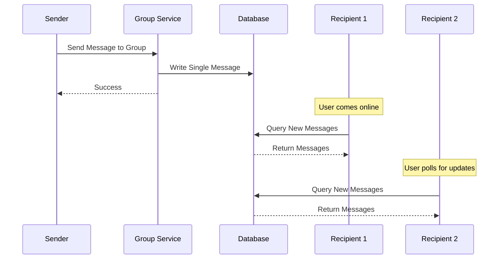
```mermaid
sequenceDiagram
    participant S as Sender
    participant GS as Group Service
    participant DB as Database
    participant R1 as Recipient 1
    participant R2 as Recipient 2

    S->>GS: Send Message to Group
    GS->>DB: Write Single Message
    GS-->>S: Success

    Note over R1: User comes online
    R1->>DB: Query New Messages
    DB-->>R1: Return Messages

    Note over R2: User polls for updates
    R2->>DB: Query New Messages
    DB-->>R2: Return Messages
```

**Advantages:**
- **Low Write Amplification**: One message = one write
- **Storage Efficient**: Single copy of each message
- **Scalable for Large Groups**: Performance independent of group size
- **Simple Updates**: Message edits/deletions affect single copy
- **Consistent State**: Single source of truth for message content
- **Lower Write Latency**: Constant time regardless of group size

**Disadvantages:**
- **Slower Delivery**: Recipients may not receive messages immediately
- **Complex Read Path**: Requires efficient querying of group messages
- **Polling Overhead**: Recipients must poll or use push notifications
- **Complex Ordering**: Requires careful handling of message ordering
- **Pagination Complexity**: Efficient pagination across large message sets
- **Read Amplification**: Each member reads same message independently

**Performance Characteristics:**
- **Write Latency**: O(1) constant time
- **Read Latency**: O(M) where M = messages to fetch
- **Storage**: O(1) per message
- **Network**: O(N) read operations per message (when members fetch)

**Use Cases:**
- Large groups (hundreds to thousands of members)
- Broadcast channels and public groups
- Applications where storage efficiency is critical
- Scenarios with limited write capacity
- Announcement systems
- Social media feeds

**Implementation Considerations:**
```java
public class FanOutOnReadService {
    private final MessageRepository messageRepository;
    private final GroupService groupService;
    private final CacheService cacheService;

    public CompletableFuture<Void> sendMessageToGroup(String groupId, Message message) {
        // Write single message
        return messageRepository.saveForGroup(groupId, message)
            .thenCompose(v -> {
                // Invalidate cache for this group
                return cacheService.invalidateGroupMessages(groupId);
            });
    }

    public CompletableFuture<List<Message>> getMessagesForUser(
            String groupId, String userId, long lastReadTimestamp) {
        // Check cache first
        return cacheService.getGroupMessages(groupId)
            .thenCompose(cached -> {
                if (cached != null) {
                    return CompletableFuture.completedFuture(
                        filterNewMessages(cached, lastReadTimestamp));
                }
                
                // Fetch from database if cache miss
                return messageRepository.getGroupMessages(groupId, lastReadTimestamp)
                    .thenApply(messages -> {
                        // Cache the result
                        cacheService.cacheGroupMessages(groupId, messages);
                        return messages;
                    });
            });
    }
}
```

**Optimizations:**
- **Materialized Views**: Pre-compute user-specific message views
- **Cursor-based Pagination**: Efficient pagination without offset
- **Read Replicas**: Distribute read load across multiple replicas
- **Message Indexing**: Index messages by timestamp, sender, and content
- **Incremental Fetch**: Only fetch messages since last read position
- **Prefetching**: Prefetch messages likely to be read

### Hybrid Approach

**Description:**
Combine fan-out on write for small groups and fan-out on read for large groups. Use a threshold (e.g., 100 members) to decide which strategy to use.

**Architecture:**
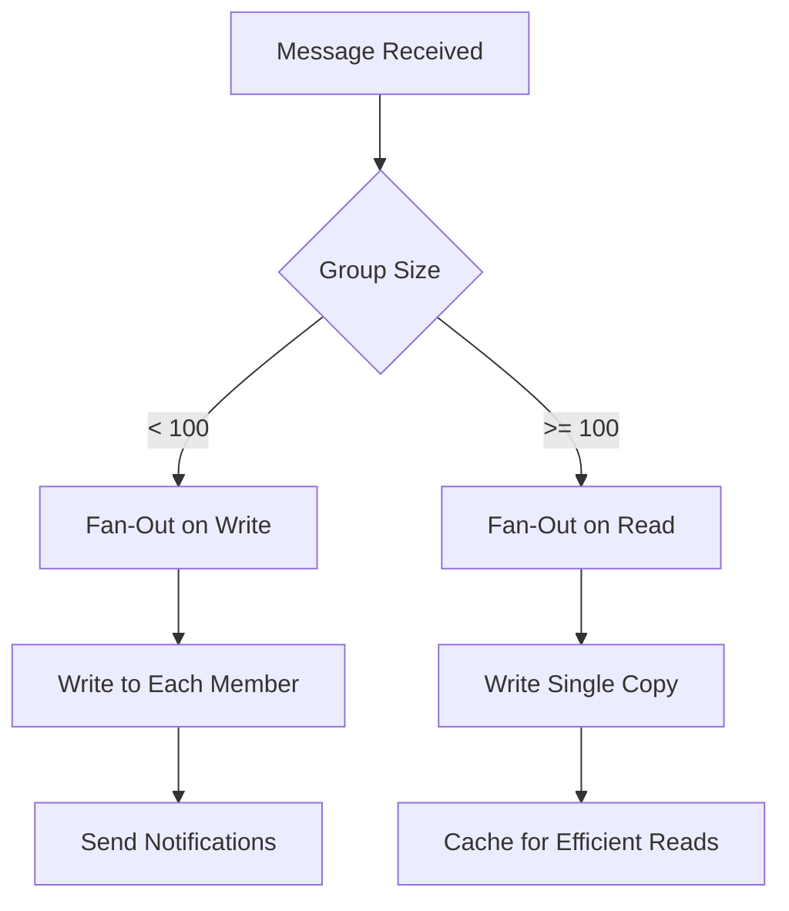
```mermaid
flowchart TD
    A[Message Received] --> B{Group Size}
    B -->|< 100| C[Fan-Out on Write]
    B -->|>= 100| D[Fan-Out on Read]
    C --> E[Write to Each Member]
    D --> F[Write Single Copy]
    E --> G[Send Notifications]
    F --> H[Cache for Efficient Reads]
```

**Threshold Selection:**
- **Write Capacity**: Based on database write throughput
- **Storage Cost**: Based on available storage budget
- **Delivery Requirements**: Based on SLA for message delivery
- **Group Dynamics**: Based on typical group sizes in application

**Implementation:**
```java
public class HybridFanOutService {
    private final FanOutOnWriteService writeService;
    private final FanOutOnReadService readService;
    private final int groupSizeThreshold;

    public CompletableFuture<Void> sendMessageToGroup(String groupId, Message message) {
        return groupService.getGroupSize(groupId)
            .thenCompose(groupSize -> {
                if (groupSize < groupSizeThreshold) {
                    return writeService.sendMessageToGroup(groupId, message);
                } else {
                    return readService.sendMessageToGroup(groupId, message);
                }
            });
    }
}
```

**Dynamic Strategy Switching:**
- Monitor group growth and switch strategies dynamically
- Migrate existing messages when switching strategies
- Consider member activity levels (active vs inactive members)
- Account for read-to-write ratio in decision making

### Lazy Fan-Out

**Description:**
Store single copy initially, fan-out on-demand when members become active. This combines the benefits of both approaches.

**Architecture:**
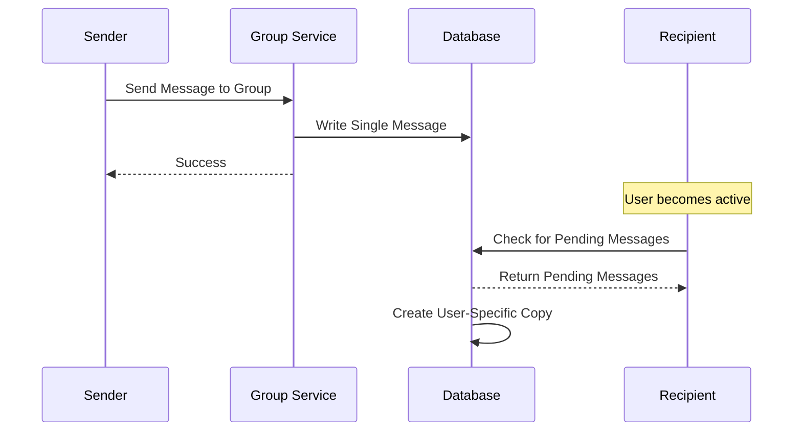
```mermaid
sequenceDiagram
    participant S as Sender
    participant GS as Group Service
    participant DB as Database
    participant R as Recipient

    S->>GS: Send Message to Group
    GS->>DB: Write Single Message
    GS-->>S: Success

    Note over R: User becomes active
    R->>DB: Check for Pending Messages
    DB-->>R: Return Pending Messages
    DB->>DB: Create User-Specific Copy
```

**Advantages:**
- **Efficient for Inactive Groups**: No write amplification for inactive members
- **Fast Delivery for Active Members**: Active members get fast delivery
- **Storage Optimization**: Only store copies for active recipients
- **Scalable**: Handles large groups with few active members

**Disadvantages:**
- **Complex Implementation**: Requires tracking member activity
- **Delayed Delivery**: Inactive members may not get messages immediately
- **Migration Overhead**: May need to migrate messages when member becomes active

### Group Metadata Management

**Group Service:**
Dedicated service to manage group metadata:
- Group creation and deletion
- Member addition and removal
- Group settings and permissions
- Member roles (admin, moderator, member)
- Group statistics and analytics

**Data Model:**
```java
import java.util.List;

public class GroupMetadata {
    private String groupId;
    private String name;
    private String description;
    private long createdAt;
    private String createdBy;
    private List<GroupMember> members;
    private GroupSettings settings;
    private GroupStatistics statistics;
    private long version;

    // Getters and setters
    public String getGroupId() { return groupId; }
    public void setGroupId(String groupId) { this.groupId = groupId; }
    public String getName() { return name; }
    public void setName(String name) { this.name = name; }
    public String getDescription() { return description; }
    public void setDescription(String description) { this.description = description; }
    public long getCreatedAt() { return createdAt; }
    public void setCreatedAt(long createdAt) { this.createdAt = createdAt; }
    public String getCreatedBy() { return createdBy; }
    public void setCreatedBy(String createdBy) { this.createdBy = createdBy; }
    public List<GroupMember> getMembers() { return members; }
    public void setMembers(List<GroupMember> members) { this.members = members; }
    public GroupSettings getSettings() { return settings; }
    public void setSettings(GroupSettings settings) { this.settings = settings; }
    public GroupStatistics getStatistics() { return statistics; }
    public void setStatistics(GroupStatistics statistics) { this.statistics = statistics; }
    public long getVersion() { return version; }
    public void setVersion(long version) { this.version = version; }

    public static class GroupMember {
        private String userId;
        private String role;
        private long joinedAt;
        private long lastActiveAt;
        private MemberSettings settings;
        private boolean isMuted;
        private boolean hasLeft;

        public GroupMember(String userId, String role, long joinedAt) {
            this.userId = userId;
            this.role = role;
            this.joinedAt = joinedAt;
        }

        // Getters and setters
        public String getUserId() { return userId; }
        public void setUserId(String userId) { this.userId = userId; }
        public String getRole() { return role; }
        public void setRole(String role) { this.role = role; }
        public long getJoinedAt() { return joinedAt; }
        public void setJoinedAt(long joinedAt) { this.joinedAt = joinedAt; }
        public long getLastActiveAt() { return lastActiveAt; }
        public void setLastActiveAt(long lastActiveAt) { this.lastActiveAt = lastActiveAt; }
        public MemberSettings getSettings() { return settings; }
        public void setSettings(MemberSettings settings) { this.settings = settings; }
        public boolean isMuted() { return isMuted; }
        public void setMuted(boolean muted) { isMuted = muted; }
        public boolean hasLeft() { return hasLeft; }
        public void setHasLeft(boolean hasLeft) { this.hasLeft = hasLeft; }
    }

    public static class GroupSettings {
        private boolean isPrivate;
        private boolean allowInvites;
        private int messageRetentionDays;
        private boolean allowReadReceipts;
        private boolean allowMessageEditing;
        private int maxMembers;
        private boolean requireAdminApproval;

        // Getters and setters
        public boolean isPrivate() { return isPrivate; }
        public void setPrivate(boolean isPrivate) { this.isPrivate = isPrivate; }
        public boolean isAllowInvites() { return allowInvites; }
        public void setAllowInvites(boolean allowInvites) { this.allowInvites = allowInvites; }
        public int getMessageRetentionDays() { return messageRetentionDays; }
        public void setMessageRetentionDays(int messageRetentionDays) { 
            this.messageRetentionDays = messageRetentionDays; 
        }
        public boolean isAllowReadReceipts() { return allowReadReceipts; }
        public void setAllowReadReceipts(boolean allowReadReceipts) { this.allowReadReceipts = allowReadReceipts; }
        public boolean isAllowMessageEditing() { return allowMessageEditing; }
        public void setAllowMessageEditing(boolean allowMessageEditing) { this.allowMessageEditing = allowMessageEditing; }
        public int getMaxMembers() { return maxMembers; }
        public void setMaxMembers(int maxMembers) { this.maxMembers = maxMembers; }
        public boolean isRequireAdminApproval() { return requireAdminApproval; }
        public void setRequireAdminApproval(boolean requireAdminApproval) { this.requireAdminApproval = requireAdminApproval; }
    }

    public static class MemberSettings {
        private boolean notificationsEnabled;
        private String notificationSound;
        private boolean mentionOnly;

        // Getters and setters
        public boolean isNotificationsEnabled() { return notificationsEnabled; }
        public void setNotificationsEnabled(boolean notificationsEnabled) { this.notificationsEnabled = notificationsEnabled; }
        public String getNotificationSound() { return notificationSound; }
        public void setNotificationSound(String notificationSound) { this.notificationSound = notificationSound; }
        public boolean isMentionOnly() { return mentionOnly; }
        public void setMentionOnly(boolean mentionOnly) { this.mentionOnly = mentionOnly; }
    }

    public static class GroupStatistics {
        private int totalMessages;
        private int activeMembers;
        private long lastActivityAt;
        private int messagesLast24h;
        private int messagesLast7d;

        // Getters and setters
        public int getTotalMessages() { return totalMessages; }
        public void setTotalMessages(int totalMessages) { this.totalMessages = totalMessages; }
        public int getActiveMembers() { return activeMembers; }
        public void setActiveMembers(int activeMembers) { this.activeMembers = activeMembers; }
        public long getLastActivityAt() { return lastActivityAt; }
        public void setLastActivityAt(long lastActivityAt) { this.lastActivityAt = lastActivityAt; }
        public int getMessagesLast24h() { return messagesLast24h; }
        public void setMessagesLast24h(int messagesLast24h) { this.messagesLast24h = messagesLast24h; }
        public int getMessagesLast7d() { return messagesLast7d; }
        public void setMessagesLast7d(int messagesLast7d) { this.messagesLast7d = messagesLast7d; }
    }
}
```

**Caching Strategy:**
- Cache group metadata in Redis for fast access
- Implement cache invalidation on group changes
- Use version numbers to detect stale cache
- Consider read-through caching for frequently accessed groups
- Implement multi-level caching (local + distributed)
- Use cache warming for popular groups

**Member Management:**
```java
public class GroupMemberManager {
    private final GroupMetadataRepository repository;
    private final CacheService cacheService;
    private final NotificationService notificationService;

    public CompletableFuture<Void> addMember(String groupId, String userId, String role) {
        return repository.addMember(groupId, userId, role)
            .thenCompose(v -> cacheService.invalidateGroup(groupId))
            .thenCompose(v -> notificationService.sendMemberAddedNotification(groupId, userId))
            .thenCompose(v -> updateGroupStatistics(groupId));
    }

    public CompletableFuture<Void> removeMember(String groupId, String userId) {
        return repository.removeMember(groupId, userId)
            .thenCompose(v -> cacheService.invalidateGroup(groupId))
            .thenCompose(v -> notificationService.sendMemberRemovedNotification(groupId, userId))
            .thenCompose(v -> updateGroupStatistics(groupId));
    }

    public CompletableFuture<Void> updateMemberRole(String groupId, String userId, String newRole) {
        return repository.updateMemberRole(groupId, userId, newRole)
            .thenCompose(v -> cacheService.invalidateGroup(groupId))
            .thenCompose(v -> notificationService.sendRoleChangedNotification(groupId, userId, newRole));
    }

    private CompletableFuture<Void> updateGroupStatistics(String groupId) {
        return repository.updateGroupStatistics(groupId);
    }
}
```

### Message Delivery Optimization

**Push Notification Strategies:**

1. **Individual Notifications**: Send separate notification to each member
   - **Pros**: Personalized, can handle user preferences
   - **Cons**: High overhead for large groups

2. **Bulk Notifications**: Batch notifications for multiple recipients
   - **Pros**: Reduced overhead, efficient for large groups
   - **Cons**: Less personalized, requires batching logic

3. **Topic-Based Notifications**: Use pub/sub for group notifications
   - **Pros**: Scalable, efficient for very large groups
   - **Cons**: Less control, platform-specific

**Delivery Confirmation:**
```java
public class MessageDeliveryTracker {
    private final Map<String, DeliveryStatus> deliveryStatuses;
    private final ScheduledExecutorService scheduler;

    public CompletableFuture<Void> trackDelivery(String messageId, List<String> recipientIds) {
        Map<String, CompletableFuture<Void>> deliveryFutures = recipientIds.stream()
            .collect(Collectors.toMap(
                recipientId -> recipientId,
                recipientId -> trackRecipientDelivery(messageId, recipientId)
            ));

        return CompletableFuture.allOf(deliveryStatuses.values().toArray(new CompletableFuture[0]));
    }

    private CompletableFuture<Void> trackRecipientDelivery(String messageId, String recipientId) {
        return sendNotification(recipientId)
            .orTimeout(30, TimeUnit.SECONDS)
            .handle((result, error) -> {
                DeliveryStatus status = error != null 
                    ? DeliveryStatus.FAILED 
                    : DeliveryStatus.DELIVERED;
                deliveryStatuses.put(recipientId, status);
                return null;
            });
    }
}
```

### Read Receipts in Groups

**Challenges:**
- Sending read receipts to all members creates notification storms
- Large groups would generate excessive traffic
- Privacy concerns (who can see read status)
- Storage overhead for read receipts

**Solutions:**

1. **Sender-Only Read Receipts**: Only sender sees who read the message
   - **Pros**: Simple, privacy-preserving
   - **Cons**: Limited functionality

2. **Aggregated Read Receipts**: Show "X members read" without listing them
   - **Pros**: Reduces overhead, provides useful information
   - **Cons**: Less detailed information

3. **Admin Read Receipts**: Only admins can see detailed read status
   - **Pros**: Useful for management
   - **Cons**: Complex permission handling

4. **Disabled for Large Groups**: Disable read receipts for groups above threshold
   - **Pros**: Prevents performance issues
   - **Cons**: Inconsistent user experience

**Implementation:**
```java
public class GroupReadReceiptManager {
    private final ReadReceiptRepository repository;
    private final GroupService groupService;
    private final NotificationService notificationService;

    public CompletableFuture<Void> markAsRead(String groupId, String messageId, String userId) {
        GroupMetadata group = groupService.getGroup(groupId);
        
        if (!group.getSettings().isAllowReadReceipts()) {
            return CompletableFuture.completedFuture(null);
        }

        if (group.getMembers().size() > 100) {
            // Use aggregated read receipts for large groups
            return repository.markAsReadAggregated(groupId, messageId, userId)
                .thenCompose(v -> sendAggregatedReadReceipt(groupId, messageId));
        } else {
            // Use individual read receipts for small groups
            return repository.markAsRead(groupId, messageId, userId)
                .thenCompose(v -> sendIndividualReadReceipt(groupId, messageId, userId));
        }
    }

    private CompletableFuture<Void> sendAggregatedReadReceipt(String groupId, String messageId) {
        return repository.getReadCount(groupId, messageId)
            .thenCompose(count -> 
                notificationService.sendAggregatedReadReceipt(groupId, messageId, count)
            );
    }

    private CompletableFuture<Void> sendIndividualReadReceipt(String groupId, String messageId, String userId) {
        return notificationService.sendIndividualReadReceipt(groupId, messageId, userId);
    }
}
```

### Group Scalability

**Horizontal Scaling:**
- Shard groups by group ID or geographic region
- Use consistent hashing for group-to-shard mapping
- Implement cross-shard communication for inter-group messages
- Consider hot spot mitigation for popular groups

**Vertical Scaling:**
- Optimize database queries with proper indexing
- Use connection pooling for database connections
- Implement caching at multiple levels
- Optimize serialization/deserialization

**Message Ordering:**
```java
public class GroupMessageOrdering {
    private final AtomicLong groupSequenceCounter;

    public CompletableFuture<Message> assignSequenceNumber(Message message, String groupId) {
        long sequenceNumber = groupSequenceCounter.incrementAndGet();
        message.setSequenceNumber(sequenceNumber);
        message.setGroupId(groupId);
        return CompletableFuture.completedFuture(message);
    }

    public List<Message> sortMessages(List<Message> messages) {
        return messages.stream()
            .sorted(Comparator.comparingLong(Message::getSequenceNumber))
            .collect(Collectors.toList());
    }
}
```

### Performance Monitoring

**Key Metrics:**
- Message delivery latency per group size
- Write amplification ratio
- Cache hit rates for group metadata
- Notification delivery success rate
- Member query latency
- Message fetch latency

**Alerting:**
- High delivery latency for specific groups
- Low cache hit rates
- High notification failure rates
- Unusual group growth patterns

### Security Considerations

**Access Control:**
- Verify group membership before message delivery
- Implement role-based permissions for group operations
- Validate member actions against group settings
- Audit all group membership changes

**Privacy:**
- Respect user notification preferences
- Handle member privacy settings
- Secure group metadata with proper encryption
- Implement proper data retention policies

---

## Media Sharing and Storage

### Media Upload Flow

Media sharing requires a separate pipeline from text messaging to handle large binary files efficiently without blocking real-time communication.

**Architecture:**
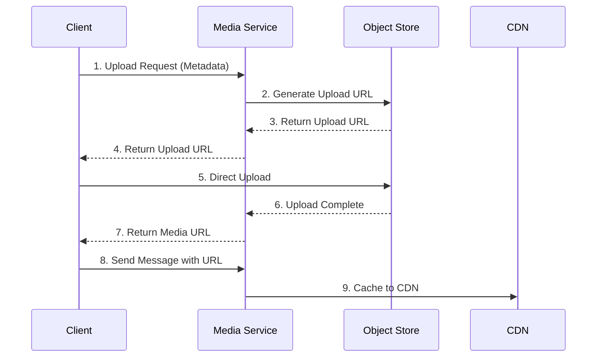
```mermaid
sequenceDiagram
    participant C as Client
    participant MS as Media Service
    participant OS as Object Store
    participant CDN as CDN

    C->>MS: 1. Upload Request (Metadata)
    MS->>OS: 2. Generate Upload URL
    OS-->>MS: 3. Return Upload URL
    MS-->>C: 4. Return Upload URL
    C->>OS: 5. Direct Upload
    OS-->>MS: 6. Upload Complete
    MS-->>C: 7. Return Media URL
    C->>MS: 8. Send Message with URL
    MS->>CDN: 9. Cache to CDN
```

### Upload Strategies

**Direct Upload to Object Storage:**
- Client uploads directly to object storage (S3, GCS)
- Media service generates pre-signed URLs for upload
- Reduces load on application servers
- Requires proper security (limited-time URLs, size limits)

**Proxy Upload Through Media Service:**
- Client uploads to media service
- Media service validates and processes before storage
- More control over upload process
- Increases server load and bandwidth usage

**Chunked Upload:**
- Large files split into chunks
- Chunks uploaded in parallel
- Enables resumable uploads
- Reduces impact of network failures

### Media Processing

**Common Processing Tasks:**
- **Image Compression**: Reduce file size while maintaining quality
- **Thumbnail Generation**: Create smaller preview images
- **Video Transcoding**: Convert to standard formats and resolutions
- **Audio Transcoding**: Convert to standard audio formats
- **Content Moderation**: Detect inappropriate content
- **Virus Scanning**: Scan uploaded files for malware

### Content Delivery Network (CDN) Integration

**CDN Benefits:**
- **Reduced Latency**: Content served from edge locations near users
- **Reduced Bandwidth**: CDN caches popular content, reducing origin load
- **Improved Reliability**: CDN provides redundancy and DDoS protection
- **Global Reach**: Serve content worldwide with consistent performance

**Cache Headers:**
```http
# For permanent media (user uploads)
Cache-Control: public, max-age=31536000, immutable

# For temporary media (stories, status updates)
Cache-Control: public, max-age=86400

# For private media (encrypted content)
Cache-Control: private, max-age=0
```

### Media Deduplication

**Client-Side Hashing:**
- Client calculates hash of file before upload
- Server checks if hash already exists
- If exists, reuse existing file instead of uploading
- Saves storage and bandwidth

### Media Storage Optimization

**Storage Tiers:**
- **Hot Storage**: Frequently accessed media (SSD, high cost)
- **Warm Storage**: Occasionally accessed media (HDD, medium cost)
- **Cold Storage**: Rarely accessed media (Glacier, low cost)

**Lifecycle Policies:**
- Move old media to cheaper storage tiers
- Delete media after retention period
- Implement different policies for different media types

---

## Presence and Notifications

Presence and notifications are critical components of a chat application that provide real-time awareness and timely communication to users. This section details the architecture, implementation strategies, and best practices for building robust presence and notification systems.

### Presence System

Presence tracking provides real-time information about user availability and activity states, enabling users to know when their contacts are online, idle, or offline. This feature enhances user experience by facilitating timely communication and managing expectations about response times.

#### Core Challenges

1. **Real-Time Accuracy**: Presence information must be up-to-date to be useful
2. **Scalability**: Tracking presence for millions of users efficiently
3. **Cross-Device Consistency**: Synchronizing presence across multiple devices
4. **Battery Efficiency**: Minimizing battery drain on mobile devices
5. **Network Resilience**: Handling intermittent connectivity gracefully
6. **Privacy**: Respecting user preferences for visibility
7. **False Positives**: Avoiding incorrect presence states due to network issues

#### Presence States

**Primary States:**
- **Online**: User is actively using the app and can receive messages
- **Idle**: User is online but not actively interacting (no activity for a period)
- **Away**: User has been idle for an extended period
- **Offline**: User is not connected to the service
- **Do Not Disturb**: User is online but has muted notifications
- **Invisible**: User appears offline to others but can still use the app

**Extended States:**
- **In a Call**: User is currently in a voice or video call
- **In a Meeting**: User has set a meeting status
- **Custom Status**: User-defined status message (e.g., "Working from home")
- **Mobile**: User is connected via mobile device
- **Desktop**: User is connected via desktop application
- **Web**: User is connected via web browser

**Device-Specific States:**
- **Mobile Online**: Connected via mobile app
- **Desktop Online**: Connected via desktop app
- **Web Online**: Connected via web browser
- **Last Seen**: Timestamp of last activity per device

#### Presence Architecture

**Components:**
1. **Presence Service**: Manages presence state and subscriptions
2. **State Store**: Database for persisting presence information
3. **Pub/Sub System**: Real-time broadcast of presence updates
4. **Heartbeat Manager**: Handles heartbeat processing and timeouts
5. **Presence Cache**: Fast access layer for frequently accessed presence data

**Architecture Diagram:**
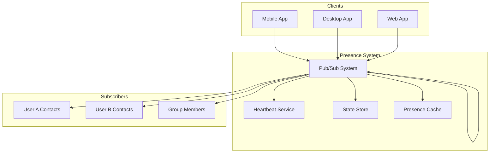
```mermaid
graph TB
    subgraph "Clients"
        C1[Mobile App]
        C2[Desktop App]
        C3[Web App]
    end
    
    subgraph "Presence System"
        PS[Presence Service]
        HS[Heartbeat Service]
        SS[State Store]
        PC[Presence Cache]
        PS[Pub/Sub System]
    end
    
    subgraph "Subscribers"
        S1[User A Contacts]
        S2[User B Contacts]
        S3[Group Members]
    end
    
    C1 --> PS
    C2 --> PS
    C3 --> PS
    PS --> HS
    PS --> SS
    PS --> PC
    PS --> PS
    PS --> S1
    PS --> S2
    PS --> S3
```

#### Heartbeat Mechanism

Heartbeats are periodic signals sent by clients to indicate they are still active. The server uses heartbeats to detect when a client has disconnected unexpectedly.

**Heartbeat Flow:**
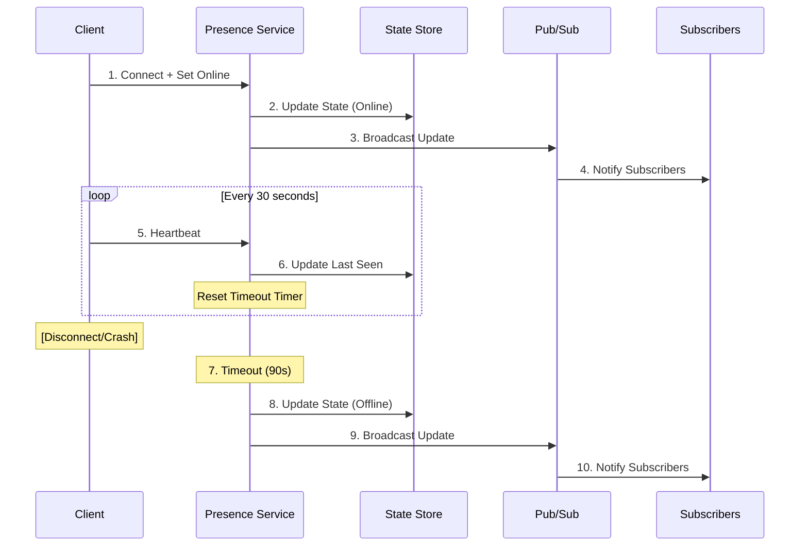
```mermaid
sequenceDiagram
    participant C as Client
    participant PS as Presence Service
    participant SS as State Store
    participant PS2 as Pub/Sub
    participant S as Subscribers

    C->>PS: 1. Connect + Set Online
    PS->>SS: 2. Update State (Online)
    PS->>PS2: 3. Broadcast Update
    PS2->>S: 4. Notify Subscribers
    
    loop Every 30 seconds
        C->>PS: 5. Heartbeat
        PS->>SS: 6. Update Last Seen
        Note over PS: Reset Timeout Timer
    end
    
    Note over C: [Disconnect/Crash]
    
    Note over PS: 7. Timeout (90s)
    PS->>SS: 8. Update State (Offline)
    PS->>PS2: 9. Broadcast Update
    PS2->>S: 10. Notify Subscribers
```

**Implementation Considerations:**

**Heartbeat Interval:**
- **Too Short**: Excessive network traffic, battery drain
- **Too Long**: Delayed detection of disconnections
- **Recommended**: 30-60 seconds for mobile, 15-30 seconds for desktop
- **Adaptive**: Adjust based on network conditions and device type

**Timeout Calculation:**
- Typically 3x the heartbeat interval
- Allows for network latency and temporary disconnections
- Example: 30s heartbeat → 90s timeout
- Can be adaptive based on network quality

**Heartbeat Payload:**
```json
{
  "userId": "user123",
  "deviceId": "device456",
  "timestamp": 1719385200000,
  "state": "online",
  "activity": "typing",
  "deviceType": "mobile"
}
```

**Exponential Backoff for Reconnection:**
- Initial reconnection attempt: immediate
- Subsequent attempts: 2s, 4s, 8s, 16s, 32s (max)
- Reset backoff on successful connection
- Prevents thundering herd problem during outages

#### Presence Synchronization

**Multi-Device Presence:**
- Track presence per device (mobile, desktop, web)
- Aggregate presence across devices for user-level state
- User is online if any device is online
- Show device-specific presence to contacts

**Presence Aggregation Logic:**
```java
public class PresenceAggregator {
    public UserPresence aggregateDevicePresence(List<DevicePresence> devicePresences) {
        boolean anyOnline = devicePresences.stream()
            .anyMatch(dp -> dp.getState() == PresenceState.ONLINE);
        
        boolean anyIdle = devicePresences.stream()
            .anyMatch(dp -> dp.getState() == PresenceState.IDLE);
        
        PresenceState aggregatedState = anyOnline ? PresenceState.ONLINE 
            : anyIdle ? PresenceState.IDLE 
            : PresenceState.OFFLINE;
        
        return new UserPresence(aggregatedState, devicePresences);
    }
}
```

**Cross-Device Sync:**
- When user goes online on one device, update all devices
- Sync custom status across devices
- Coordinate "do not disturb" state
- Handle conflicting states (priority: active > idle > offline)

#### Presence Subscriptions

**Subscription Model:**
- Users subscribe to presence updates of their contacts
- Groups subscribe to presence of all members
- Efficient pub/sub for real-time updates
- Unsubscribe when not needed to save resources

**Subscription Strategies:**

**1. Contact-Based Subscriptions:**
- Subscribe to presence of direct contacts
- Efficient for one-on-one messaging
- Scales with number of contacts

**2. Group-Based Subscriptions:**
- Subscribe to presence of group members
- Efficient for group messaging
- Scales with group membership

**3. Hybrid Approach:**
- Subscribe to contacts + active group members
- Balance between relevance and efficiency
- Dynamic subscription management

**Subscription Management:**
```java
public class PresenceSubscriptionManager {
    private final PubSubService pubSubService;
    private final SubscriptionRepository subscriptionRepository;
    
    public CompletableFuture<Void> subscribeToContact(String subscriberId, String targetUserId) {
        return subscriptionRepository.addSubscription(subscriberId, targetUserId)
            .thenCompose(v -> pubSubService.subscribe(
                "presence:" + targetUserId,
                subscriberId
            ));
    }
    
    public CompletableFuture<Void> unsubscribeFromContact(String subscriberId, String targetUserId) {
        return subscriptionRepository.removeSubscription(subscriberId, targetUserId)
            .thenCompose(v -> pubSubService.unsubscribe(
                "presence:" + targetUserId,
                subscriberId
            ));
    }
}
```

#### Presence Caching

**Cache Strategy:**
- Cache presence data in Redis for fast access
- TTL of 30-60 seconds for stale tolerance
- Cache invalidation on presence updates
- Multi-level caching (local + distributed)

**Cache Key Design:**
```
presence:user:{userId}           # User-level presence
presence:device:{deviceId}       # Device-level presence
presence:contacts:{userId}       # Presence of user's contacts
```

**Cache Warming:**
- Pre-load presence of frequently accessed contacts
- Warm cache on application startup
- Periodic refresh for active users
- Predictive caching based on usage patterns

#### Presence Privacy

**Privacy Settings:**
- **Public**: Anyone can see presence
- **Contacts Only**: Only contacts can see presence
- **Custom**: Select specific users who can see presence
- **Hidden**: No one can see presence

**Implementation:**
```java
public class PresencePrivacyFilter {
    public boolean canViewPresence(String viewerId, String targetUserId) {
        PrivacySettings settings = getPrivacySettings(targetUserId);
        
        return switch (settings.getVisibility()) {
            case PUBLIC -> true;
            case CONTACTS_ONLY -> isContact(viewerId, targetUserId);
            case CUSTOM -> settings.getAllowedViewers().contains(viewerId);
            case HIDDEN -> false;
        };
    }
}
```

#### Presence Optimization

**Batch Updates:**
- Aggregate multiple presence updates
- Reduce pub/sub message count
- Batch updates within a time window (e.g., 100ms)

**Delta Updates:**
- Send only changed state fields
- Reduce payload size
- More efficient network usage

**Compression:**
- Compress presence update payloads
- Use efficient serialization (Protocol Buffers, MessagePack)
- Reduce bandwidth usage

**Geographic Distribution:**
- Deploy presence service in multiple regions
- Route users to nearest region
- Cross-region sync for global presence

#### Presence Monitoring

**Key Metrics:**
- Presence update latency
- Heartbeat success rate
- Subscription count
- Cache hit rate
- Pub/sub message rate

**Alerting:**
- High heartbeat failure rate
- Low cache hit rate
- High subscription count per user
- Unusual presence update patterns

### Typing Indicators

Typing indicators provide real-time feedback when a user is composing a message, enhancing the conversational experience by managing expectations about message arrival.

#### Typing State Machine

**States:**
- **Not Typing**: User is not composing a message
- **Typing**: User is actively typing
- **Paused**: User stopped typing but message composition is in progress

**Transitions:**
```
Not Typing → Typing: User starts typing
Typing → Paused: User stops typing (no keypress for 3s)
Paused → Typing: User resumes typing
Paused → Not Typing: User cancels or sends message
Typing → Not Typing: User sends message
```

#### Typing Indicator Architecture

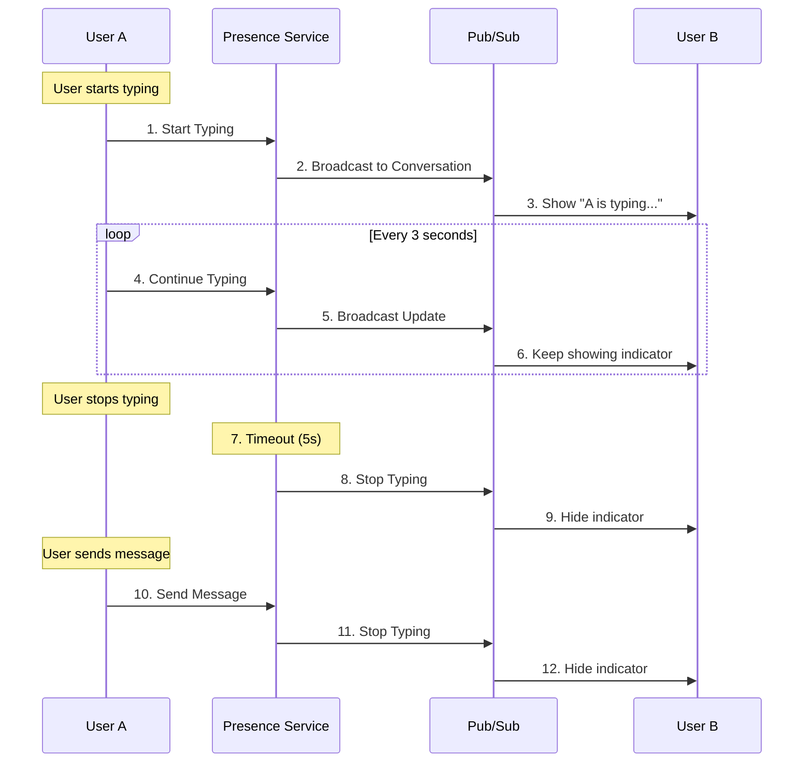
```mermaid
sequenceDiagram
    participant A as User A
    participant PS as Presence Service
    participant PS2 as Pub/Sub
    participant B as User B

    Note over A: User starts typing
    A->>PS: 1. Start Typing
    PS->>PS2: 2. Broadcast to Conversation
    PS2->>B: 3. Show "A is typing..."
    
    loop Every 3 seconds
        A->>PS: 4. Continue Typing
        PS->>PS2: 5. Broadcast Update
        PS2->>B: 6. Keep showing indicator
    end
    
    Note over A: User stops typing
    Note over PS: 7. Timeout (5s)
    PS->>PS2: 8. Stop Typing
    PS2->>B: 9. Hide indicator
    
    Note over A: User sends message
    A->>PS: 10. Send Message
    PS->>PS2: 11. Stop Typing
    PS2->>B: 12. Hide indicator
```

#### Implementation Considerations

**Throttling:**
- Limit typing indicator frequency to prevent spam
- Debounce typing events (e.g., send update every 3s while typing)
- Maximum rate: 1 update per 3 seconds per conversation

**Timeouts:**
- Clear typing state after 5 seconds of inactivity
- Prevent stuck typing indicators
- Client-side and server-side timeouts

**Scope:**
- Only send typing indicators for active conversations
- Limit to direct messages (not groups)
- Optional: support for small groups (< 10 members)

**Payload Design:**
```json
{
  "conversationId": "conv123",
  "userId": "user456",
  "isTyping": true,
  "timestamp": 1719385200000
}
```

**Batch Typing Updates:**
```java
public class TypingIndicatorBatcher {
    private final Map<String, Set<String>> typingStates = new ConcurrentHashMap<>();
    private final ScheduledExecutorService scheduler;
    
    public void startTyping(String conversationId, String userId) {
        typingStates.computeIfAbsent(conversationId, k -> ConcurrentHashMap.newKeySet())
            .add(userId);
    }
    
    public void stopTyping(String conversationId, String userId) {
        Set<String> users = typingStates.get(conversationId);
        if (users != null) {
            users.remove(userId);
            if (users.isEmpty()) {
                typingStates.remove(conversationId);
            }
        }
    }
    
    @Scheduled(fixedRate = 3000)
    public void broadcastTypingStates() {
        typingStates.forEach((conversationId, users) -> {
            broadcastTypingUpdate(conversationId, users);
        });
    }
}
```

**Privacy:**
- Respect user's typing indicator preferences
- Allow users to disable typing indicators
- Don't show typing indicators from blocked users

### Push Notifications

Push notifications wake up devices when the app is closed or in the background, ensuring users receive important messages even when not actively using the application.

#### Push Notification Providers

**Platform-Specific Providers:**

1. **APNs (Apple Push Notification Service)**
   - For iOS, macOS, watchOS, tvOS
   - Requires Apple Developer account
   - Uses device tokens for targeting
   - Supports rich notifications with images, videos
   - Maximum payload size: 4KB
   - QoS: Best-effort delivery

2. **FCM (Firebase Cloud Messaging)**
   - For Android, iOS, Web
   - Free service by Google
   - Uses registration tokens for targeting
   - Supports rich notifications and data messages
   - Maximum payload size: 4KB
   - QoS: Best-effort delivery

3. **Web Push**
   - For web applications
   - Uses Push API and Service Workers
   - Requires user permission
   - Supported by modern browsers
   - VAPID authentication for security

**Cross-Platform Solutions:**
- **Amazon SNS**: Unified interface for multiple platforms
- **OneSignal**: Third-party push notification service
- **Pusher**: Real-time push notification platform
- **Airship**: Enterprise push notification solution

#### Push Notification Architecture

**Components:**
1. **Notification Service**: Manages notification delivery
2. **Notification Queue**: Buffers notifications for reliability
3. **Push Provider Gateway**: Interface to push providers
4. **Device Token Store**: Database of device tokens
5. **Notification Processor**: Formats and enriches notifications

**Architecture Diagram:**
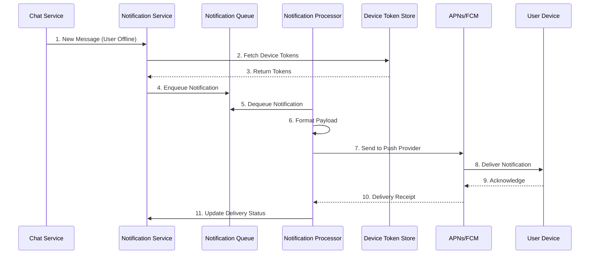
```mermaid
sequenceDiagram
    participant CS as Chat Service
    participant NS as Notification Service
    participant NQ as Notification Queue
    participant NP as Notification Processor
    participant DTS as Device Token Store
    participant APNs as APNs/FCM
    participant Device as User Device

    CS->>NS: 1. New Message (User Offline)
    NS->>DTS: 2. Fetch Device Tokens
    DTS-->>NS: 3. Return Tokens
    NS->>NQ: 4. Enqueue Notification
    NP->>NQ: 5. Dequeue Notification
    NP->>NP: 6. Format Payload
    NP->>APNs: 7. Send to Push Provider
    APNs->>Device: 8. Deliver Notification
    Device-->>APNs: 9. Acknowledge
    APNs-->>NP: 10. Delivery Receipt
    NP->>NS: 11. Update Delivery Status
```

#### Notification Payload Design

**Basic Payload:**
```json
{
  "to": "device_token",
  "notification": {
    "title": "New message from John",
    "body": "Hey, are you available?",
    "sound": "default",
    "badge": 1
  },
  "data": {
    "conversationId": "conv123",
    "messageId": "msg456",
    "senderId": "user789",
    "type": "message"
  }
}
```

**Rich Notification (iOS):**
```json
{
  "aps": {
    "alert": {
      "title": "New message from John",
      "body": "Hey, are you available?"
    },
    "sound": "default",
    "badge": 1,
    "category": "NEW_MESSAGE_CATEGORY",
    "mutable-content": 1,
    "thread-id": "conv123"
  },
  "data": {
    "conversationId": "conv123",
    "messageId": "msg456",
    "senderId": "user789",
    "senderName": "John",
    "attachmentUrl": "https://cdn.example.com/image.jpg"
  }
}
```

**Data Message (Android):**
```json
{
  "to": "device_token",
  "data": {
    "title": "New message from John",
    "body": "Hey, are you available?",
    "conversationId": "conv123",
    "messageId": "msg456",
    "senderId": "user789",
    "type": "message"
  },
  "priority": "high"
}
```

#### Notification Strategies

**1. Immediate Push**
- Send notification immediately when message arrives
- Best for time-sensitive messages
- Higher battery usage
- More immediate user engagement

**2. Batched Push**
- Accumulate messages over a time window (e.g., 5 minutes)
- Send single notification with summary
- Reduces battery drain and network usage
- Better for non-urgent messages

**3. Coalesced Push**
- Replace previous notification with new one
- Single notification slot per conversation
- Reduces notification clutter
- Platform-specific (iOS auto-coalesces, Android requires handling)

**4. Adaptive Push**
- Analyze user behavior and notification engagement
- Adjust push timing and frequency
- Machine learning-based optimization
- Personalized notification experience

#### Notification Batching

**Batching Logic:**
```java
public class NotificationBatcher {
    private final Map<String, List<Message>> pendingMessages = new ConcurrentHashMap<>();
    private final ScheduledExecutorService scheduler;
    
    public void enqueueMessage(String userId, Message message) {
        pendingMessages.computeIfAbsent(userId, k -> new ArrayList<>())
            .add(message);
    }
    
    @Scheduled(fixedRate = 300000) // Every 5 minutes
    public void flushBatchedNotifications() {
        pendingMessages.forEach((userId, messages) -> {
            if (messages.size() > 1) {
                sendBatchedNotification(userId, messages);
            } else {
                sendSingleNotification(userId, messages.get(0));
            }
        });
        pendingMessages.clear();
    }
    
    private void sendBatchedNotification(String userId, List<Message> messages) {
        String title = String.format("%d new messages", messages.size());
        String body = messages.get(0).getContent();
        // Send batched notification
    }
}
```

**Batching Strategies:**
- **Time-based**: Batch messages within a time window
- **Count-based**: Batch after N messages accumulate
- **Priority-based**: Batch low-priority messages, send high-priority immediately
- **User-preference**: Respect user's notification batching settings

#### Silent Notifications

Silent notifications wake up the app without showing UI, used for background sync and data refresh.

**Use Cases:**
- Background message sync
- Contact list updates
- Presence state refresh
- Cache invalidation
- Data prefetching

**Implementation:**
```json
{
  "aps": {
    "content-available": 1
  },
  "data": {
    "type": "sync",
    "syncType": "messages"
  }
}
```

**Limitations:**
- Limited by platform quotas (iOS: 30-50 per day)
- Not guaranteed delivery
- Battery impact if overused
- Platform-specific restrictions

#### Notification Delivery Guarantees

**Best-Effort Delivery:**
- Push providers don't guarantee delivery
- Device may be offline or out of coverage
- Notifications may be dropped by provider
- Need fallback mechanisms

**Delivery Tracking:**
```java
public class NotificationDeliveryTracker {
    public CompletableFuture<Void> trackNotification(String notificationId, List<String> deviceTokens) {
        Map<String, CompletableFuture<DeliveryStatus>> futures = deviceTokens.stream()
            .collect(Collectors.toMap(
                token -> token,
                token -> trackDeviceDelivery(notificationId, token)
            ));
        
        return CompletableFuture.allOf(futures.values().toArray(new CompletableFuture[0]))
            .thenCompose(v -> updateDeliveryStatus(notificationId, futures));
    }
    
    private CompletableFuture<DeliveryStatus> trackDeviceDelivery(String notificationId, String deviceToken) {
        return pushProvider.sendNotification(deviceToken, payload)
            .thenApply(response -> {
                if (response.isSuccess()) {
                    return DeliveryStatus.DELIVERED;
                } else if (response.isInvalidToken()) {
                    return DeliveryStatus.INVALID_TOKEN;
                } else {
                    return DeliveryStatus.FAILED;
                }
            })
            .exceptionally(error -> DeliveryStatus.FAILED);
    }
}
```

**Retry Strategy:**
- Exponential backoff for failed deliveries
- Remove invalid tokens from database
- Retry up to 3 times with increasing delays
- Give up after max retries

#### Notification Preferences

**User Preferences:**
- Enable/disable notifications globally
- Per-conversation notification settings
- Notification sound selection
- Vibration settings
- LED notification color
- Do not disturb schedule
- Quiet hours

**Implementation:**
```java
public class NotificationPreferencesService {
    public boolean shouldSendNotification(String userId, Message message) {
        UserPreferences prefs = getUserPreferences(userId);
        
        if (!prefs.isNotificationsEnabled()) {
            return false;
        }
        
        if (prefs.isInQuietHours()) {
            return false;
        }
        
        ConversationPreferences convPrefs = getConversationPreferences(userId, message.getConversationId());
        if (!convPrefs.isNotificationsEnabled()) {
            return false;
        }
        
        if (!prefs.isMentionOnly() && !isMentioned(message, userId)) {
            return false;
        }
        
        return true;
    }
}
```

#### Notification Security

**Payload Encryption:**
- Encrypt sensitive notification data
- Use device-specific encryption keys
- Prevent data leakage from notification center

**Authentication:**
- Validate device tokens before sending
- Use VAPID for web push authentication
- Implement rate limiting to prevent abuse

**Privacy:**
- Don't include sensitive content in notifications
- Mask message content in lock screen
- Respect user privacy settings

#### Notification Analytics

**Key Metrics:**
- Delivery rate
- Open rate
- Click-through rate
- Dismissal rate
- Time to open
- Platform breakdown
- Device type breakdown

**A/B Testing:**
- Test different notification copy
- Experiment with timing
- Compare batching strategies
- Optimize for engagement

#### Monitoring and Troubleshooting

**Monitoring:**
- Notification queue depth
- Delivery success rate
- Push provider error rates
- Device token validity rate
- Notification latency

**Common Issues:**
- Invalid device tokens
- Payload size exceeded
- Rate limiting by push provider
- Device offline
- Network connectivity issues

**Debugging:**
- Log all notification attempts
- Track delivery receipts
- Monitor error responses from push providers
- Implement notification testing tools

---

## End-to-End Encryption

End-to-end encryption (E2EE) ensures that only the communicating users can read the messages. Even the service provider, network operators, or governments cannot decrypt the messages. This section explains the Signal Protocol, which is the industry standard for E2EE in messaging applications like WhatsApp, Signal, and Facebook Messenger.

### What is End-to-End Encryption?

**Simple Explanation:**
Imagine you want to send a secret message to your friend. You put the message in a box and lock it with a special lock that only your friend has the key for. You send the locked box through the postal service. The postal workers, the post office, and anyone else who handles the box cannot open it because they don't have the key. Only your friend can unlock and read the message.

In digital messaging:
- **Your message** = The secret message
- **The lock** = Encryption algorithm
- **The key** = Cryptographic key
- **The postal service** = The messaging server and internet
- **Your friend** = The recipient

**Key Characteristics:**
1. **End-to-End**: Encryption happens on the sender's device, decryption happens on the recipient's device
2. **No Server Access**: The server only stores encrypted data, never sees plaintext
3. **No Interception**: Even if someone intercepts the message in transit, they cannot read it
4. **No Backend Decryption**: The service provider cannot decrypt messages even if compelled to

### Why End-to-End Encryption Matters

**Real-World Scenarios:**

1. **Government Surveillance**: Without E2EE, governments can compel service providers to hand over message contents. With E2EE, providers cannot comply even if they want to.

2. **Data Breaches**: If a messaging server is hacked, attackers only get encrypted gibberish, not actual messages.

3. **Insider Threats**: Even rogue employees at the messaging company cannot read user messages.

4. **Network Eavesdropping**: Hackers monitoring network traffic (Wi-Fi, internet backbone) cannot read messages.

### Signal Protocol Overview

The Signal Protocol is the industry standard for end-to-end encryption in messaging applications. It provides three critical security properties:

1. **Forward Secrecy**: Past messages remain secure even if current keys are compromised
2. **Post-Compromise Security**: Future messages become secure even if current keys are compromised
3. **Asynchronous Communication**: Works even when users are not online at the same time

**Key Components:**
1. **Double Ratchet Algorithm**: Manages ongoing key generation and rotation for each message
2. **X3DH Key Agreement**: Initial key exchange protocol for establishing secure communication
3. **Axolotl Ratchet**: Self-healing key rotation mechanism (part of Double Ratchet)

### Understanding the Core Concepts

#### Forward Secrecy

**What It Means:**
Forward secrecy ensures that if someone steals your current encryption key, they cannot decrypt your past messages. Each message uses a unique key that is deleted after use.

**Simple Analogy:**
Think of it like a notebook where you write secrets. With forward secrecy:
- You use a different page for each secret
- After writing a secret, you tear out and destroy that page
- If someone steals your current notebook page, they can't read secrets you wrote on previous torn-out pages

**Without Forward Secrecy:**
- You use the same key to encrypt all messages
- If someone steals the key, they can decrypt all past and future messages
- Like using the same diary lock for all entries

**With Forward Secrecy:**
- Each message gets a new, unique key
- After sending a message, the key is destroyed
- If someone steals your current key, they can only decrypt the current message, not past ones

**How It Works Technically:**
1. **Message Key Generation**: For each message, a new ephemeral key is generated
2. **Key Derivation**: Each key is derived from the previous one using a one-way function
3. **Key Deletion**: After using a key to encrypt/decrypt, it's securely deleted from memory
4. **No Key Storage**: Keys are never stored, only generated when needed
5. **Reverse Impossibility**: Even if someone has the current key, they cannot mathematically derive previous keys

**Why It Matters:**
- Protects against key theft over time
- Limits damage of security breaches
- Ensures past conversations remain private
- Provides defense-in-depth security

#### Post-Compromise Security

**What It Means:**
Post-compromise security (also called future secrecy or self-healing) ensures that if an attacker compromises your current keys, they cannot decrypt future messages. The system automatically "heals" itself by generating new keys that the attacker doesn't have.

**Simple Analogy:**
Think of it like changing your house lock every day:
- If a thief steals your house key today
- Tomorrow you have a completely different lock
- The thief's stolen key becomes useless
- Your house is secure again

**Without Post-Compromise Security:**
- If an attacker steals your key, they can decrypt all future messages
- You'd need to manually change keys (which users rarely do)
- The compromise persists indefinitely

**With Post-Compromise Security:**
- The system automatically generates new keys periodically
- Even if an attacker has your current key, it becomes useless after the next key rotation
- The system "heals" itself without user intervention
- Future messages become secure again

**How It Works Technically:**
1. **Periodic Key Rotation**: The system performs a "ratchet step" to generate new root keys
2. **New Entropy Introduction**: Each ratchet step introduces new random data (entropy)
3. **Key Derivation**: New keys are derived from the old keys plus new random data
4. **Irreversibility**: Even with the old key, an attacker cannot derive the new key without the new random data
5. **Automatic Healing**: This happens automatically in the background, no user action needed

**Why It Matters:**
- Limits the damage of key compromise
- Provides automatic security recovery
- Protects against long-term surveillance
- Reduces the need for manual key management

#### Double Ratchet Algorithm

**What It Is:**
The Double Ratchet is a key management algorithm that provides both forward secrecy and post-compromise security. It's called "double" because it uses two ratcheting mechanisms working together.

**What is a Ratchet?**
A ratchet is a mechanism that moves in only one direction. In cryptography, a ratchet is a one-way function that continuously generates new keys from previous keys, making it impossible to go backwards.

**Simple Analogy:**
Think of a ratchet like a combination lock that changes its combination after each use:
- You use combination 1234 to open the lock
- After closing it, the lock automatically changes to 5678
- The old combination 1234 never works again
- Even if someone saw you use 1234, they can't open the lock next time

**The Two Ratchets:**

1. **Symmetric-Key Ratchet** (The "Chain Ratchet"):
   - Generates a new message key for each message
   - Uses a one-way function to derive each key from the previous one
   - Provides forward secrecy (can't go back to previous keys)
   - Like a chain where each link is derived from the previous one

2. **Diffie-Hellman Ratchet** (The "DH Ratchet"):
   - Performs a new Diffie-Hellman key exchange periodically
   - Introduces fresh entropy into the system
   - Provides post-compromise security (heals from compromise)
   - Like periodically changing the entire chain

**How They Work Together:**

```
Message Flow with Double Ratchet:

Message 1: Use Symmetric Ratchet → Key1 → Encrypt → Delete Key1
Message 2: Use Symmetric Ratchet → Key2 → Encrypt → Delete Key2
Message 3: Use Symmetric Ratchet → Key3 → Encrypt → Delete Key3
Message 4: [DH Ratchet Step] → New Root Key → New Chain
Message 5: Use Symmetric Ratchet → Key4 → Encrypt → Delete Key4
Message 6: Use Symmetric Ratchet → Key5 → Encrypt → Delete Key5
```

**Detailed Flow:**

1. **Initial State**: Start with a shared root key (from X3DH)
2. **Symmetric Ratchet**: 
   - Derive chain key from root key
   - Derive message key from chain key
   - Use message key to encrypt/decrypt
   - Delete message key after use
   - Repeat for each message
3. **DH Ratchet** (triggered periodically or on reply):
   - Generate new ephemeral key pair
   - Perform Diffie-Hellman with peer's ephemeral key
   - Derive new root key from DH result
   - Start new symmetric ratchet chain
4. **Combined Effect**:
   - Symmetric ratchet provides forward secrecy (can't go back)
   - DH ratchet provides post-compromise security (can't go forward after compromise)

**Why It's Called "Double":**
- Two ratchets working together
- Symmetric ratchet for per-message keys
- DH ratchet for periodic key refresh
- Both provide different security properties

### X3DH Key Agreement

**What It Is:**
X3DH (Extended Triple Diffie-Hellman) is the initial key exchange protocol used when two users start a conversation for the first time. It establishes a shared secret that becomes the root key for the Double Ratchet.

**What is Diffie-Hellman?**
Diffie-Hellman is a cryptographic method that allows two parties to establish a shared secret over an insecure channel. Even if an eavesdropper sees all communications, they cannot determine the shared secret.

**Simple Diffie-Hellman Analogy:**
Imagine Alice and Bob want to agree on a secret color:
1. Alice and Bob publicly agree on a base color (yellow)
2. Alice secretly picks a private color (red) and mixes it with yellow → orange
3. Bob secretly picks a private color (blue) and mixes it with yellow → green
4. Alice sends orange to Bob publicly
5. Bob sends green to Alice publicly
6. Alice mixes her secret red with Bob's green → brown
7. Bob mixes his secret blue with Alice's orange → brown
8. They both end up with the same secret color (brown)
9. An eavesdropper sees yellow, orange, and green but cannot figure out brown

**Why "Triple" Diffie-Hellman?**
Standard Diffie-Hellman uses one key exchange. X3DH uses three simultaneous Diffie-Hellman exchanges to provide additional security properties:
- Authentication (verifies identity)
- Forward secrecy
- Resistance to key compromise impersonation

**Key Types in X3DH:**

1. **Identity Key (IK)**:
   - Long-term key pair unique per user
   - Generated once when user creates account
   - Public key published to server
   - Private key never leaves device
   - Used to authenticate the user
   - Like a permanent ID card

2. **Signed Prekey (SPK)**:
   - Medium-term key pair (rotated weekly/monthly)
   - Signed by the identity key (proves authenticity)
   - Public key published to server
   - Used in initial key exchange
   - Provides forward secrecy
   - Like a temporary ID card that changes periodically

3. **One-Time Prekey (OPK)**:
   - Short-term key pair (used only once)
   - Generated in batches and uploaded to server
   - Deleted after use
   - Provides additional forward secrecy
   - Like a single-use ticket

4. **Ephemeral Key (EK)**:
   - Generated per conversation/session
   - Never stored, used immediately
   - Provides maximum forward secrecy
   - Like a one-time password

**X3DH Key Exchange Flow:**

**Step 1: Key Bundle Upload**
- Alice generates her identity key, signed prekey, and batch of one-time prekeys
- Alice uploads the public parts to the server
- Bob does the same

**Step 2: Key Bundle Fetch**
- When Alice wants to message Bob, she fetches Bob's key bundle from the server
- The bundle contains Bob's identity key, signed prekey, and one of his one-time prekeys

**Step 3: Ephemeral Key Generation**
- Alice generates an ephemeral key pair for this specific conversation

**Step 4: Four Diffie-Hellman Exchanges**
X3DH performs four simultaneous DH operations:
- DH1: DH(Alice's Identity Key, Bob's Signed Prekey)
- DH2: DH(Alice's Ephemeral Key, Bob's Identity Key)
- DH3: DH(Alice's Ephemeral Key, Bob's Signed Prekey)
- DH4: DH(Alice's Ephemeral Key, Bob's One-Time Prekey)

**Step 5: Shared Secret Derivation**
- The four DH results are combined
- A Key Derivation Function (KDF) produces the shared secret
- This shared secret becomes the root key for the Double Ratchet

**Step 6: Initial Message**
- Alice sends Bob her ephemeral key
- Alice sends the first message encrypted with the derived root key
- Bob performs the same DH operations to derive the same root key
- Bob decrypts the message

**Why Four DH Exchanges?**
Each DH exchange provides different security properties:
- DH1: Authenticates Bob (proves it's really Bob)
- DH2: Authenticates Alice to Bob
- DH3: Provides forward secrecy
- DH4: Provides additional forward secrecy (prevents replay attacks)

### Axolotl Ratchet

**What It Is:**
The Axolotl Ratchet is the original name for the key ratcheting mechanism in the Signal Protocol. It's now commonly referred to as part of the Double Ratchet algorithm. The name comes from the axolotl salamander, which can regenerate limbs - symbolizing the protocol's ability to "heal" from key compromise.

**Relationship to Double Ratchet:**
- Axolotl Ratchet = The original implementation
- Double Ratchet = The formalized, improved version
- They're essentially the same concept with refinements
- Both provide the same security properties

### Complete Message Encryption Flow

**Step-by-Step Process:**

1. **Initial Setup (One-time per user)**:
   - User generates identity key pair
   - User generates signed prekey pair
   - User generates batch of one-time prekeys
   - User uploads public keys to server

2. **Starting a Conversation (X3DH)**:
   - Initiator fetches recipient's key bundle
   - Initiator generates ephemeral key
   - Both parties perform 4 DH exchanges
   - Both derive shared secret (root key)

3. **Ongoing Communication (Double Ratchet)**:
   - For each message:
     a. Derive message key from chain key
     b. Encrypt message with message key
     c. Delete message key
     d. Send encrypted message
   - Periodically (or on reply):
     a. Perform DH ratchet step
     b. Derive new root key
     c. Start new chain key
     d. Continue with symmetric ratchet

4. **Decryption (Recipient)**:
   - Receive encrypted message
   - Derive same message key (using same ratchet state)
   - Decrypt message
   - Delete message key
   - Update ratchet state

### Key Management

**Key Storage:**
- **Public Keys**: Stored on server for discovery by other users
- **Private Keys**: Stored securely on device only
- **Device Encryption**: Private keys protected by device encryption (passcode/biometrics)
- **Secure Enclave**: On iOS, keys stored in Secure Enclave (hardware-protected)
- **KeyStore**: On Android, keys stored in KeyStore (hardware-backed)
- **Optional Backup**: Users can optionally backup keys to secure cloud storage (encrypted with user password)

**Key Rotation:**
- **Identity Keys**: Rarely rotated (only if compromised or user explicitly requests)
- **Signed Prekeys**: Rotated periodically (weekly/monthly)
- **One-Time Prekeys**: Replenished when depleted (automatically generated)
- **Ephemeral Keys**: Generated per session, never stored

**Key Distribution:**
- Users upload public key bundles to server
- Key bundle contains: identity key, signed prekey, one-time prekeys
- Other users fetch key bundles to initiate conversations
- Server acts as key directory but cannot access private keys
- Keys are signed to prevent tampering

### Group Encryption

**Challenge:**
Encrypting messages for groups is more complex than 1-on-1 because you need to encrypt once but have multiple recipients decrypt.

**Signal Protocol Approach:**
Signal uses a "Sender Keys" approach for group encryption:

**How It Works:**
1. **Sender Key Generation**: Each group member generates a sender key
2. **Key Distribution**: Each member shares their sender key with other group members (using pairwise E2EE)
3. **Message Encryption**: When sending a group message, encrypt with sender key
4. **Message Decryption**: All group members who have the sender key can decrypt
5. **Key Rotation**: Sender keys are rotated periodically for security

**Why Sender Keys:**
- Efficient: Encrypt once, decrypt by all
- Scalable: Works for large groups
- Secure: Each member controls their own sender key
- Forward Secrecy: Keys can be rotated

**Alternative Approaches:**
- **Pairwise Encryption**: Encrypt separately for each recipient (inefficient for large groups)
- **Group Key Agreement**: Single shared key for entire group (complex key management)

### Security Properties Summary

**Forward Secrecy:**
- ✅ Past messages protected even if current keys compromised
- ✅ Achieved through symmetric ratchet (per-message keys)
- ✅ Keys deleted after use

**Post-Compromise Security:**
- ✅ Future messages protected even if current keys compromised
- ✅ Achieved through DH ratchet (periodic key refresh)
- ✅ System self-heals automatically

**Asynchronous Communication:**
- ✅ Works when users not online simultaneously
- ✅ Achieved through prekey bundles (server stores public keys)
- ✅ No need for online handshake

**Authentication:**
- ✅ Verifies identity of communicating parties
- ✅ Achieved through signed prekeys
- ✅ Prevents man-in-the-middle attacks

**Plausible Deniability:**
- ✅ Cannot prove who sent a message (even with private keys)
- ✅ Achieved through specific protocol design choices
- ✅ Important for whistleblower scenarios

### Implementation Considerations

**Key Storage Security:**
- Use hardware-backed key storage when available
- Implement secure key deletion (overwrite memory)
- Protect against side-channel attacks (timing, cache)
- Use constant-time operations for cryptographic functions

**Error Handling:**
- Handle missing prekeys gracefully
- Implement fallback mechanisms
- Provide user feedback for encryption failures
- Log security events for auditing

**Performance:**
- Optimize key generation and derivation
- Use efficient cryptographic libraries
- Implement batch processing for group messages
- Cache frequently used keys (carefully)

**Cross-Platform:**
- Ensure protocol compatibility across platforms
- Handle different key storage mechanisms
- Standardize key bundle formats
- Implement platform-specific optimizations

### Common Misconceptions

**Myth 1**: "E2EE means perfect security"
- **Reality**: E2EE protects message content, but metadata (who messaged whom, when) may still be visible
- **Solution**: Use additional privacy measures for metadata

**Myth 2**: "E2EE prevents all attacks"
- **Reality**: E2EE protects against server compromise and network interception, but not endpoint compromise
- **Solution**: Secure endpoints with good security practices

**Myth 3**: "E2EE is too complex for users"
- **Reality**: Modern implementations are transparent to users
- **Solution**: Good UX design hides complexity

**Myth 4**: "E2EE prevents law enforcement access"
- **Reality**: E2EE makes it technically difficult, but not legally impossible
- **Solution**: Understand legal and policy implications

---

## Database Design and Optimization

### Database Selection

**Message Store Requirements:**
- **High Write Throughput**: Billions of messages written daily
- **Low Latency Reads**: Fast retrieval of conversation history
- **Horizontal Scalability**: Scale across multiple nodes
- **Flexible Schema**: Support for various message types and metadata

**Database Options:**

**Cassandra:**
- **Architecture**: Distributed, masterless, peer-to-peer with no single point of failure
- **Data Model**: Wide-column store with partition key + clustering columns for efficient querying
- **Consistency**: Tunable consistency levels (ONE, QUORUM, ALL) to balance performance and durability
- **Write Path**: Commit log → Memtable → SSTable → Compaction (optimized for high write throughput)
- **Read Path**: Memtable → Bloom Filter → SSTable (optimized for predictable read latency)
- **Best for**: Time-series data, high write throughput, global distribution, fault tolerance
- **Real-world**: Used by Netflix, Apple, Instagram for messaging and streaming data
- **Trade-offs**: Eventual consistency, complex queries require secondary indexes, limited aggregation capabilities

**MongoDB:**
- **Architecture**: Document-oriented database storing data in BSON format (binary JSON)
- **Replication**: Replica sets with automatic failover and election of primary node
- **Sharding**: Automatic sharding with config servers for horizontal scaling
- **Indexes**: B-tree indexes, text search, geospatial indexes, and compound indexes
- **Transactions**: Multi-document ACID transactions supported since version 4.0
- **Best for**: Flexible schemas, complex queries, rapid prototyping, document-heavy workloads
- **Real-world**: Used by Slack, Adobe, EA for messaging features and user data
- **Trade-offs**: Memory-intensive (working set should fit in RAM), manual sharding complexity at scale, higher operational overhead

**PostgreSQL:**
- **Architecture**: Relational database with ACID compliance and MVCC (Multi-Version Concurrency Control)
- **Scaling**: Read replicas for read scaling, logical replication, Citus extension for horizontal sharding
- **Indexes**: B-tree, GiST, GIN, BRIN, hash indexes, and expression indexes
- **JSON Support**: JSONB with indexing and querying capabilities for semi-structured data
- **Full-text Search**: Built-in full-text search with tsvector/tsquery for message search
- **Best for**: Relational data, complex joins, transactional integrity, structured data with relationships
- **Real-world**: Used by Discord (initially), Reddit for some features, many enterprise applications
- **Trade-offs**: Horizontal scaling requires additional tooling (Citus, Patroni), vertical scaling limits, higher write latency for complex transactions

**ScyllaDB:**
- **Architecture**: C++ rewrite of Cassandra, compatible with Cassandra protocol
- **Performance**: 10x lower latency than Cassandra, shared-nothing architecture
- **Compatibility**: Drop-in replacement for Cassandra, same CQL protocol
- **Best for**: High-throughput, low-latency messaging where Cassandra performance is insufficient
- **Trade-offs**: Smaller community, less mature ecosystem, requires C++ expertise for customization

**DynamoDB:**
- **Architecture**: Fully managed NoSQL database by AWS
- **Scaling**: Auto-scaling with predictable performance at any scale
- **Pricing**: Pay-per-request model, can be expensive at high scale
- **Best for**: Serverless architectures, predictable performance requirements, AWS-centric deployments
- **Trade-offs**: Expensive at scale, limited query flexibility, vendor lock-in

**Redis (with persistence):**
- **Architecture**: In-memory data structure store with optional persistence
- **Persistence**: RDB snapshots and AOF (Append Only File) for durability
- **Features**: Pub/sub, sorted sets, streams, geospatial operations
- **Best for**: Real-time features, pub/sub messaging, caching layer, session storage
- **Trade-offs**: Memory cost limits dataset size, limited query capabilities compared to full databases

### Data Modeling

**Message Schema:**
```java
import java.util.List;
import java.util.Map;

public class MessageSchema {
    public String messageId;
    public String conversationId;
    public String senderId;
    public String recipientId; // null for groups
    public String groupId; // null for direct messages
    public String content;
    public String messageType; // text, image, video, audio, document
    public String mediaUrl; // for media messages
    public long sequenceNumber;
    public long timestamp;
    public String status; // sent, delivered, read, failed
    public String encryptionKey; // for server-side encryption
    public MessageMetadata metadata;

    public MessageSchema(String messageId, String conversationId, String senderId,
                         String content, String messageType, long timestamp) {
        this.messageId = messageId;
        this.conversationId = conversationId;
        this.senderId = senderId;
        this.content = content;
        this.messageType = messageType;
        this.timestamp = timestamp;
    }

    public static class MessageMetadata {
        public String replyToMessageId;
        public List<MessageReaction> reactions;
        public boolean edited;
        public Long editedAt;

        public MessageMetadata(String replyToMessageId, List<MessageReaction> reactions) {
            this.replyToMessageId = replyToMessageId;
            this.reactions = reactions;
        }
    }

    public static class MessageReaction {
        public String userId;
        public String emoji;

        public MessageReaction(String userId, String emoji) {
            this.userId = userId;
            this.emoji = emoji;
        }
    }
}
```

**Conversation Schema:**
```java
import java.util.List;
import java.util.Map;

public class ConversationSchema {
    public String conversationId;
    public String type; // direct, group
    public List<String> participants;
    public String createdBy;
    public long createdAt;
    public long lastMessageAt;
    public String lastMessagePreview;
    public Map<String, Integer> unreadCount;
    public ConversationSettings settings;

    public ConversationSchema(String conversationId, String type, List<String> participants) {
        this.conversationId = conversationId;
        this.type = type;
        this.participants = participants;
        this.createdAt = System.currentTimeMillis();
    }

    public static class ConversationSettings {
        public boolean muted;
        public boolean archived;
        public boolean pinned;

        public ConversationSettings() {
            this.muted = false;
            this.archived = false;
            this.pinned = false;
        }
    }
}
```

**Partitioning Strategy:**

**Partitioning by Conversation ID (Recommended for Chat):**

Partition Key: conversationId
Clustering Key: timestamp (DESC)

Benefits:
- All messages in a conversation stored together
- Efficient pagination of conversation history
- Natural ordering by timestamp
- Predictable query patterns

Example Cassandra Table:
```sql
CREATE TABLE messages (
    conversation_id uuid,
    timestamp bigint,
    message_id uuid,
    sender_id uuid,
    content text,
    PRIMARY KEY ((conversation_id), timestamp)
) WITH CLUSTERING ORDER BY (timestamp DESC);
```

**Composite Partitioning (Conversation + Time):**

Partition Key: (conversationId, time_bucket)
Clustering Key: timestamp

Benefits:
- Limits partition size (prevents hotspots)
- Efficient time-based queries within conversation
- Easier data archival (drop old time buckets)

Time bucket strategies:
- Daily: conversationId + YYYYMMDD
- Weekly: conversationId + YYYYWW
- Monthly: conversationId + YYYYMM

**Hash Partitioning (for User Data):**

Partition Key: hash(userId) % num_partitions

Benefits:
- Even distribution across partitions
- Predictable scaling
- Handles sequential userIds gracefully

Use cases:
- User profiles
- User settings
- User session data

Note: Does not prevent hotspots from individual popular users - all data for a specific user still goes to one partition. Use composite partition keys or salting to distribute popular user data.

**Geographic Partitioning:**

Partition Key: region_code + userId

Benefits:
- Data locality (users served from nearest region)
- Compliance with data residency laws
- Reduced cross-region latency

Region codes:
- US-East, US-West, EU, APAC, etc.

**Partitioning Anti-Patterns:**

❌ Don't partition by:
- Low-cardinality fields (status, type)
- Frequently changing fields (user_status)
- Fields not used in queries

✅ Do partition by:
- High-cardinality fields (userId, conversationId)
- Query-access patterns
- Natural access patterns

**Partition Size Guidelines:**

Optimal partition size: 100MB - 1GB
- Too small: Too many partitions, overhead
- Too large: Hotspots, slow recovery

Monitoring:
- Track partition sizes
- Alert on oversized partitions
- Implement auto-splitting

### Indexing Strategy

**Primary Index Strategy:**

Messages Table:
- Primary Key: (conversationId, timestamp DESC)
- Rationale: Most queries fetch conversation history in reverse chronological order

Conversations Table:
- Primary Key: conversationId
- Secondary Index: (participantId, lastMessageAt DESC)
- Rationale: Fetch user's conversations ordered by recent activity

Users Table:
- Primary Key: userId
- Secondary Index: phoneNumber (unique)
- Secondary Index: username (unique)

**Covering Indexes:**

Query: SELECT content, timestamp FROM messages WHERE conversationId = ? ORDER BY timestamp DESC LIMIT 50

Covering Index:
```sql
CREATE INDEX idx_messages_covering ON messages (conversationId, timestamp DESC) INCLUDE (content);
```

Benefits:
- Avoids table lookup
- All data in index
- 10-100x faster for covered queries

**Partial Indexes:**

Index only active conversations:
```sql
CREATE INDEX idx_active_conversations ON conversations (participantId, lastMessageAt)
WHERE status = 'active';
```

Benefits:
- Smaller index size
- Faster index maintenance
- Faster queries (smaller index to scan)

**Composite Index Order Matters:**

Query pattern 1: WHERE conversationId = ? AND timestamp > ?
Index: (conversationId, timestamp) ✓

Query pattern 2: WHERE timestamp > ? AND conversationId = ?
Index: (conversationId, timestamp) ✗ (won't use index efficiently)

Rule: Put equality columns first, then range columns

**Indexing for Different Query Patterns:**

Pattern 1: Fetch conversation history
  Index: (conversationId, timestamp DESC)

Pattern 2: Fetch user's conversations
  Index: (participantId, lastMessageAt DESC)

Pattern 3: Search messages by content (full-text)
  Index: Full-text search index (Elasticsearch, PostgreSQL tsvector)

Pattern 4: Fetch unread messages
  Index: (recipientId, status, timestamp)

Pattern 5: Fetch messages by sender
  Index: (senderId, timestamp DESC)

**Index Maintenance Considerations:**

Write overhead:
- Each index adds write latency
- Rule of thumb: 3-5 indexes per table max
- Remove unused indexes (monitor query plans)

Index size:
- Indexes can be 2-3x data size
- Monitor disk usage
- Consider index-only tables for read-heavy workloads

Index rebuild:
- Rebuild indexes periodically (fragmentation)
- Use online rebuild (zero downtime)
- Schedule during low-traffic periods

**Index Selection Heuristics:**

Add index if:
- Query runs frequently (>1000/sec)
- Query is slow (>100ms)
- Query filters/joins on the column
- Column has high cardinality

Skip index if:
- Table is small (<10k rows)
- Column has low cardinality (<100 distinct values)
- Query runs infrequently
- Write-heavy workload

### Caching Strategy

**Multi-Level Caching Architecture:**

Level 1: Application Cache (Local)
- In-memory cache per application instance
- L1 cache: Guava, Caffeine (Java)
- Hit rate: 60-80%
- Latency: <1ms
- Size: 100-500MB per instance

Level 2: Distributed Cache
- Redis cluster or Memcached
- Shared across all instances
- L2 cache: Redis, Memcached
- Hit rate: 15-30%
- Latency: 1-5ms
- Size: 10-100GB

Level 3: Database
- Persistent storage
- Fallback when L1 and L2 miss
- Latency: 10-100ms

**Cache-Aside Pattern (Recommended):**

Read flow:
1. Check L1 cache (local)
2. If miss, check L2 cache (Redis)
3. If miss, query database
4. Populate L2 cache
5. Populate L1 cache
6. Return data

Write flow:
1. Write to database
2. Invalidate L2 cache
3. Invalidate L1 cache

Benefits:
- Simple implementation
- Cache consistency
- No cache stampede risk

**Read-Through Cache:**

Application code:
```java
data = cache.get(key)
if data == null:
    data = database.load(key)
    cache.put(key, data)
```

Use cases:
- Frequently read, rarely written data
- User profiles, conversation metadata
- Configuration data

**Write-Through Cache:**

Application code:
```java
database.write(key, data)
cache.put(key, data)
```

Benefits:
- Cache always consistent
- No data loss on cache failure
- Higher write latency

Use cases:
- Critical data that must be cached
- User presence information
- Message status updates

**Write-Behind (Write-Back) Cache:**

Application code:
```java
cache.put(key, data)
// Database write happens asynchronously
```

Benefits:
- Lowest write latency
- High write throughput
- Risk of data loss

Use cases:
- Analytics data
- Non-critical metrics
- Activity logs

**Cache Invalidation Strategies:**

Time-based (TTL):
- Set expiration time
- Simple to implement
- May serve stale data

Event-based:
- Invalidate on data change
- Publish invalidation events
- More complex, more accurate

Version-based:
- Include version in cache key
- cache:userId:123:v5
- Update version on change
- Natural invalidation

Hybrid:
- TTL + event-based
- Event invalidation for accuracy
- TTL as safety net

**Cache Warming:**

Pre-load cache on startup:
- User's recent conversations
- Active group metadata
- Frequently accessed user profiles

Background warming:
- Predictive caching
- Load likely-to-be-accessed data
- Based on access patterns

**Cache Eviction Policies (Detailed):**

LRU (Least Recently Used):
- Evict items not accessed recently
- Good for temporal locality
- Implementation: LinkedHashMap + access order

LFU (Least Frequently Used):
- Evict items accessed least often
- Good for stable access patterns
- Implementation: Frequency counter + min-heap

ARC (Adaptive Replacement Cache):
- Combines LRU and LFU
- Adapts to access patterns
- Better hit rate than LRU/LFU alone

TTL (Time To Live):
- Evict after expiration
- Simple, predictable
- Good for time-sensitive data

Size-based:
- Evict when cache full
- Combined with LRU/LFU
- Prevents OOM

**Caching Specific Data Types:**

User Sessions:
- Cache: Redis with 24h TTL
- Key: session:userId
- Strategy: Write-through

Conversation List:
- Cache: Redis with 1h TTL
- Key: conversations:userId
- Strategy: Cache-aside, invalidate on new message

Message Metadata:
- Cache: L1 (Caffeine) + L2 (Redis)
- Key: message:messageId
- Strategy: Cache-aside, 1h TTL

User Presence:
- Cache: Redis with 5min TTL
- Key: presence:userId
- Strategy: Write-through

Media URLs:
- Cache: CDN + Redis with 7d TTL
- Key: media:mediaId
- Strategy: Cache-aside

### WhatsApp's Database Approach

WhatsApp takes a radically different approach than traditional applications. Instead of using external databases like PostgreSQL or MongoDB, they built a custom storage system optimized for their specific use case.

**Core Principles:**

1. **Everything in Memory**: Data lives in RAM whenever possible
2. **No External Dependencies**: Database embedded in the application
3. **Simplicity Over Complexity**: Custom solution tailored to needs
4. **Predictable Performance**: No network calls, no query optimization

**Architecture Overview:**

```
┌─────────────────────────────────────────┐
│         Erlang VM (BEAM)               │
│                                         │
│  ┌───────────────────────────────────┐  │
│  │  Application Logic               │  │
│  │  (Message handling, routing)    │  │
│  └───────────────────────────────────┘  │
│                 ↕                       │
│  ┌───────────────────────────────────┐  │
│  │  ETS Tables (In-Memory Storage)   │  │
│  │  - Fast concurrent access        │  │
│  │  - Built-in replication          │  │
│  │  - No network latency           │  │
│  └───────────────────────────────────┘  │
│                 ↕                       │
│  ┌───────────────────────────────────┐  │
│  │  Write-Through Cache Layer       │  │
│  │  - Async writes to disk          │  │
│  │  - Batched I/O                  │  │
│  └───────────────────────────────────┘  │
│                 ↕                       │
│  ┌───────────────────────────────────┐  │
│  │  Disk Storage (Mnesia)           │  │
│  │  - Persistent storage           │  │
│  │  - Built-in to Erlang            │  │
│  └───────────────────────────────────┘  │
└─────────────────────────────────────────┘
```

**ETS (Erlang Term Storage) - The Core:**

ETS is Erlang's built-in in-memory storage system. It's like a hash table that lives in memory and provides:

**Key Features:**
- **O(1) access time**: Constant time lookups, inserts, deletes
- **Concurrent access**: Multiple processes can read/write simultaneously
- **Built-in replication**: Tables can be replicated across nodes
- **No serialization overhead**: Data stored as Erlang terms (native format)
- **Process isolation**: Each table owned by a process, automatic cleanup

**Table Types:**
- set: Key-value, unique keys (most common)
- ordered_set: Ordered by key
- bag: Multiple values per key
- duplicate_bag: Multiple identical values per key

**Example:**
```erlang
% Create a table for messages
TableId = ets:new(messages, [set, named_table, public, {read_concurrency, true}]).

% Insert a message
ets:insert(messages, {<<"msg123">>, <<"conv456">>, <<"user789">>, <<"Hello">>, 1234567890}).

% Lookup by message ID
Message = ets:lookup(messages, <<"msg123">>).
```

**Mnesia - The Persistent Layer:**

Mnesia is Erlang's distributed database management system. It provides:

**Key Features:**
- **Hybrid storage**: Can be in-memory, on-disk, or both
- **Transactions**: ACID transactions across tables
- **Distribution**: Tables can be replicated across nodes
- **Schema management**: Type-safe table definitions
- **Query language**: QLC (Query List Comprehension) for complex queries

**Table Storage Options:**

Mnesia provides three storage modes that determine how data is stored across memory and disk:

**`{disc_copies, Nodes}`**
- **How it works**: Data is loaded into RAM for fast access, and simultaneously written to disk for persistence. On node startup, data is loaded from disk back into RAM.
- **Performance**: Near RAM-speed reads (since data is in memory), writes are slightly slower due to disk sync
- **Durability**: Survives node crashes - data recovered from disk on restart
- **Use case**: Critical data that needs both speed and persistence (user profiles, message metadata)
- **Trade-off**: Requires sufficient RAM to hold all data, plus disk space for backup

**`{ram_copies, Nodes}`**
- **How it works**: Data exists only in memory. No disk persistence whatsoever.
- **Performance**: Fastest possible access - pure in-memory operations
- **Durability**: Data lost on node crash or restart
- **Use case**: Session data, temporary caches, real-time metrics where persistence isn't required
- **Trade-off**: High risk of data loss, but maximum throughput

**`{disc_only_copies, Nodes}`**
- **How it works**: Data stored exclusively on disk, never loaded into RAM. Every read/write requires disk I/O.
- **Performance**: Slowest access due to disk operations for every query
- **Durability**: Maximum persistence - survives crashes, data always on disk
- **Use case**: Large datasets that exceed RAM capacity, archival data, rarely-accessed historical records
- **Trade-off**: Poor performance, but allows storing data larger than available memory

**WhatsApp's Strategy**: Primarily uses `disc_copies` because their workload requires both the speed of in-memory access (millions of concurrent users) and the durability of disk persistence (messages must not be lost). They partition data across many nodes, so each node only holds a subset of data in RAM.

```erlang
% Example configuration:
{disc_copies, [node()]}  % Keep in RAM, persist to disk (WhatsApp's approach)
{ram_copies, [node()]}   % RAM only (for temporary data)
{disc_only_copies, [node()]}  % Disk only (for archival data)
```

**DB Frags - The Partitioning Strategy:**

WhatsApp partitions data into "DB Frags" (database fragments). Each fragment is:

**Structure:**
```
DB Frag = {
  frag_id: 1,
  key_range: [0, 1000000),  % Keyspace range
  node: node1@server,       % Primary node
  replica_node: node2@server,  % Replica node
  tables: [messages, users, conversations]  % Tables in this frag
}
```

**Benefits:**
- **Horizontal scaling**: Add more frags = more throughput
- **Targeted replication**: Only replicate specific frags
- **Isolated failure**: One frag down doesn't affect others
- **No distributed locks**: Each frag has single writer

**Example:**
```erlang
% Define 100 DB fragments
NumFrags = 100.
FragIds = lists:seq(1, NumFrags).

% Assign each frag to a node
FragNodes = [{FragId, lists:nth((FragId rem NumNodes) + 1, Nodes)} || FragId <- FragIds].

% Route request to correct frag
GetFragId(Key) -> (erlang:phash2(Key) rem NumFrags) + 1.

% Write to frag
WriteMessage(Message) ->
    FragId = GetFragId(Message#message.conversation_id),
    FragNode = proplists:get_value(FragId, FragNodes),
    rpc:call(FragNode, ets, insert, [messages, Message]).
```

**Code Explanation:**

**`NumFrags = 100.`**
- Defines 100 database fragments (partitions) to split data across
- Each fragment holds a portion of the total data

**`FragIds = lists:seq(1, NumFrags).`**
- Creates a list: `[1, 2, 3, ..., 100]`
- These are the fragment IDs used to identify each partition

**`FragNodes = [{FragId, lists:nth((FragId rem NumNodes) + 1, Nodes)} || FragId <- FragIds].`**
- Assigns each fragment to a specific node using round-robin distribution
- `(FragId rem NumNodes) + 1` calculates which node gets this fragment
- Example: If you have 3 nodes, frag 1→node1, frag 2→node2, frag 3→node3, frag 4→node1, etc.
- Result: `[{1, node1}, {2, node2}, {3, node3}, {4, node1}, ...]`

**`GetFragId(Key) -> (erlang:phash2(Key) rem NumFrags) + 1.`**
- Hashes a key (like conversation_id) to determine which fragment it belongs to
- `erlang:phash2(Key)` creates a consistent hash value
- `rem NumFrags` maps the hash to a fragment number (0-99)
- `+ 1` converts to 1-based index (1-100)
- Same key always maps to same fragment (consistent routing)

**`WriteMessage(Message)`**
- Routes a message write to the correct fragment/node:
  1. Hashes the conversation_id to get fragment ID
  2. Looks up which node owns that fragment
  3. Uses RPC to call `ets:insert` on that specific node
- This ensures all messages for a conversation go to the same fragment/node

**Why this matters**: Instead of all nodes handling all data, each node only handles its assigned fragments. This eliminates distributed locks (single writer per fragment) and enables horizontal scaling by adding more fragments.

**Lightweight Locking - The "No Lock" Approach:**

WhatsApp avoids traditional database locks through:

**Serialized Access Per Key:**
```
For each key, only one process can write at a time:
- Process A writes to key "user:123" → holds lock
- Process B tries to write to key "user:123" → waits or queues
- Process C writes to key "user:456" → proceeds (different key!)

Benefits:
- No global locks
- No deadlocks
- High concurrency (different keys don't block each other)
```

**Implementation:**
```erlang
% Simple lock per key
lock(Key) ->
    case global:set_lock({Key, self()}, [node()], 5000) of
        true -> ok;
        false -> {error, locked}
    end.

unlock(Key) ->
    global:del_lock({Key, self()}, [node()]).

% Usage
case lock(ConversationId) of
    ok ->
        try
            ets:insert(messages, Message)
        after
            unlock(ConversationId)
        end;
    {error, locked} ->
        % Retry or queue
        retry_later()
end.
```

**Async Writes and Parallel Disk I/O:**

WhatsApp uses asynchronous writes to avoid blocking:

**Write Path:**
```
1. Application writes to ETS (in-memory)
   - Immediate return (microseconds)
   - Data is now "visible" to reads

2. Background process batches writes
   - Collects multiple writes
   - Flushes to disk in batches
   - Parallel I/O across multiple disks

3. Acknowledgment
   - After disk write completes
   - Or after timeout (with risk)
```

**Benefits:**
- **Low latency**: Writes return immediately
- **High throughput**: Batched I/O is efficient
- **Parallelism**: Multiple disks write simultaneously

**Trade-offs:**
- **Data loss risk**: Crash before disk write = data lost
- **Complexity**: Need to handle write failures
- **Recovery**: Need to reconstruct from logs

**WhatsApp's Acceptance of Data Loss:**

WhatsApp accepts that some data may be lost in catastrophic failures:

**Philosophy:**
- Messages are transient (users can resend)
- Availability > durability for chat
- Focus on preventing data loss, not eliminating it

**Mitigations:**
- Replication across nodes
- Write-ahead logs
- Periodic snapshots
- Multiple data centers

**Real-World Impact:**
- 2014 outage: 11 hours of messages lost
- Acceptable trade-off for their scale
- Users understand and accept occasional loss

**Data Model - Key-Value Pattern:**

WhatsApp stores everything as key-value pairs:

**Message Storage:**
```
Key: message:messageId
Value: {
  conversation_id: "conv123",
  sender_id: "user456",
  content: "Hello",
  timestamp: 1234567890,
  status: "delivered"
}

Key: conversation:conv123:messages:timestamp
Value: [msgId1, msgId2, msgId3, ...]  % Ordered list for pagination
```

**Conversation Storage:**
```
Key: conversation:conv123
Value: {
  participants: ["user456", "user789"],
  created_at: 1234567890,
  last_message_at: 1234567900
}

Key: user:user456:conversations
Value: [conv123, conv456, conv789, ...]  % User's conversations
```

**User Storage:**
```
Key: user:user456
Value: {
  phone_number: "+1234567890",
  username: "alice",
  status: "active"
}
```

**Presence Storage:**
```
Key: presence:user456
Value: {
  online: true,
  last_seen: 1234567890
}

TTL: 5 minutes (auto-expire)
```

**Why This Works for WhatsApp:**

**Access Patterns:**
- **Write-heavy**: Billions of messages/day
- **Read-light**: Most messages read once
- **Simple queries**: Key-value lookups, no complex joins
- **Predictable access**: Always by conversation, always by user

**Scale:**
- **2B+ users**
- **100B+ messages/day**
- **65B+ messages sent on New Year's Eve 2023**
- **50M+ messages per second at peak**

**Performance:**
- **Sub-100ms latency**: Messages delivered in <100ms
- **99.9% availability**: Near-perfect uptime
- **Horizontal scaling**: Add nodes = more capacity
- **No single bottleneck**: Distributed architecture

**Lessons from WhatsApp:**

**What Works:**
- Custom solution for specific needs
- In-memory storage for speed
- Simplified data model
- Acceptable trade-offs

**What Doesn't Work for Everyone:**
- Not suitable for complex queries
- Not suitable for transactional integrity
- Requires Erlang expertise
- Accepts data loss (not acceptable for all apps)

**When to Consider This Approach:**
- Simple key-value access patterns
- High write throughput
- Low latency requirements
- Acceptable data loss risk
- Team with systems programming expertise
- Multiple transaction managers push data to disk in parallel
- IO bottlenecks absorbed by fragmenting disk writes

**Offline Caching:**
- Write-back model with variable sync delay
- Messages written to memory first
- Flushed to disk only if they linger too long
- Over 98% of messages served from memory before touching persistent storage

---

## Multi-Device Synchronization

### Overview

Modern chat applications must support multiple devices per user - phones, tablets, desktops, and web browsers. Each device should have access to the same conversation history, and messages sent from one device should appear on all others in real-time. This requires a sophisticated synchronization system that handles connectivity issues, ensures data consistency, and maintains security across all devices.

### Synchronization Challenges

**Message Ordering**: Ensuring consistent message order across all devices is critical. When devices receive messages at different times or reconnect after being offline, they must apply messages in the exact same sequence to maintain conversation integrity. This is typically achieved using server-assigned sequence numbers or timestamps that all devices respect.

**Offline Support**: Devices frequently go offline due to network conditions, battery saving, or user action. The system must queue messages and operations for offline devices, apply them in the correct order when they reconnect, and handle any conflicts that arise from delayed application of changes.

**Conflict Resolution**: When multiple devices edit the same data simultaneously (e.g., editing a message draft, deleting messages), conflicts occur. The system needs strategies to resolve these conflicts automatically or prompt users for resolution, ensuring data consistency without losing user intent.

**Efficiency**: Sync operations consume bandwidth and battery. The system must minimize unnecessary data transfer through delta sync, compression, batching, and intelligent prioritization to provide a good user experience while being resource-conscious.

**Security**: End-to-end encryption must work seamlessly across multiple devices. Each device needs its own keys, and the system must securely manage key distribution, rotation when devices are added/removed, and ensure that removed devices cannot access new messages.

**Latency**: Users expect near-real-time sync across devices. The system must push updates quickly using efficient protocols, handle network variability, and provide fallback mechanisms when real-time push isn't available.

### Synchronization Architectures

**Server-Side Sync**: The server maintains the authoritative message store and acts as the central coordinator. All devices fetch messages from and send messages to the server. When a new message arrives, the server pushes it to all connected devices. This approach is simple to implement and provides a single source of truth, but requires users to trust the server with their data (though end-to-end encryption mitigates content access).

**Device-to-Device Sync**: Devices communicate directly with each other, using the server only as a relay for initial connection establishment. This provides better privacy since the server never sees the full message content, but is significantly more complex to implement. It also requires devices to be online simultaneously for sync to work, which isn't always practical.

**Hybrid Approach**: The most common production approach combines the benefits of both. The server maintains the message store and acts as the primary sync coordinator, but devices can also cache data locally and perform some operations offline. The server pushes updates to all connected devices in real-time, while devices can pull updates when they reconnect. This balances simplicity, reliability, and user experience.

### Message Synchronization Flow

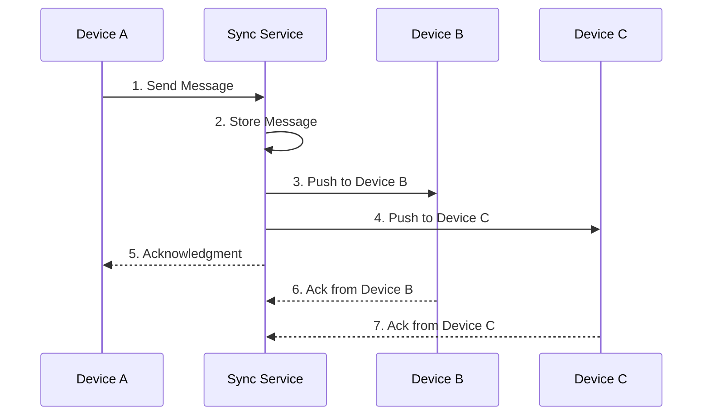
```mermaid
sequenceDiagram
    participant A as Device A
    participant S as Sync Service
    participant B as Device B
    participant C as Device C

    A->>S: 1. Send Message
    S->>S: 2. Store Message
    S->>B: 3. Push to Device B
    S->>C: 4. Push to Device C
    S-->>A: 5. Acknowledgment
    B-->>S: 6. Ack from Device B
    C-->>S: 7. Ack from Device C
```

**Flow Explanation**: When Device A sends a message, it goes to the Sync Service which stores it in the database. The service then pushes the message to all other devices (B and C) that belong to the same user. Each device acknowledges receipt, and the sender device gets confirmation once all devices have received the message. If a device is offline, the message is queued and delivered when it reconnects.

### Sync Protocols

**WebSocket-Based Sync**: Uses persistent WebSocket connections for real-time bidirectional communication. The server pushes new messages instantly to connected devices without devices needing to poll. This is highly efficient for online devices with stable connections. For offline devices, messages are queued in a per-device queue and delivered when the WebSocket connection is re-established.

**Polling-Based Sync**: Devices periodically make HTTP requests to fetch new messages since their last sync. This is simpler to implement and works reliably across all network conditions, but has higher latency (up to the poll interval) and wastes bandwidth with empty responses when there are no new messages. It's commonly used as a fallback or for web applications where WebSockets aren't available.

**Hybrid Sync**: Combines WebSocket for real-time push when devices are online, with polling as a fallback when WebSockets disconnect. Push notifications can wake offline devices to trigger immediate sync when important messages arrive. This provides the best user experience with real-time updates when possible and reliable fallback when needed.

### End-to-End Encryption for Multi-Device

**Key Sharing Across Devices**: Each device generates its own unique key pair (public/private key). Devices register their public keys with the server, which maintains a mapping of users to their devices and public keys. When sending a message, the sender encrypts the message separately for each recipient device using that device's public key. Each recipient device then decrypts the message using its private key. This ensures that even if one device is compromised, other devices' communications remain secure.

**Signal Protocol Multi-Device**: The Signal Protocol extends this with "sender keys" - a symmetric key shared among a user's devices that allows efficient group messaging. When a user adds a new device, it goes through a verification process (often QR code scanning) to establish trust. The new device receives the sender keys and can decrypt past messages. When a device is removed, the sender keys are rotated, preventing the removed device from decrypting future messages while preserving access to historical messages on remaining devices.

**Implementation**:
```javascript
// Add new device
function addDevice(userId, deviceId, publicKey) {
  keyStore.storeDeviceKey(userId, deviceId, publicKey);
  const devices = getUserDevices(userId);
  devices.forEach(d => syncDeviceList(d.id, devices));
}

// Encrypt for all recipient devices
function encryptForAllDevices(message, recipientDevices) {
  return recipientDevices.map(device => {
    const publicKey = keyStore.getDeviceKey(device.id);
    return encrypt(message, publicKey);
  });
}

// Remove device and rotate keys
function removeDevice(userId, deviceId) {
  keyStore.removeDeviceKey(userId, deviceId);
  rotateSenderKeys(userId);
  notifyOtherDevices(userId, deviceId);
}
```

### Offline Synchronization

**Offline Message Queue**: When a device is offline, the server maintains a queue of pending operations for that device. This includes new messages, read receipts, typing indicators, and any other state changes. Each operation is stored with a timestamp and sequence number to ensure correct ordering. When the device reconnects, it requests all operations since its last sync, applies them in order, and acknowledges completion.

**Conflict Resolution Strategies**:

- **Last-Write-Wins (LWW)**: The simplest approach uses timestamps to determine which change wins. The operation with the most recent timestamp overwrites earlier ones. This is easy to implement but can lose data if concurrent edits have semantic meaning.

- **Operational Transformation (OT)**: Used in collaborative editing, OT transforms concurrent edits so they can be applied in any order and produce the same result. Complex to implement but provides good user experience for text editing scenarios.

- **Conflict-Free Replicated Data Types (CRDTs)**: Data structures designed to converge automatically without conflicts. Examples include counters, sets, and registers with mathematically proven convergence properties. Ideal for chat applications where automatic resolution is preferred.

- **Manual Resolution**: For critical conflicts where automatic resolution might lose important data, the system can prompt the user to choose which version to keep or how to merge them. This provides the best data preservation but impacts user experience.

**Implementation**:
```javascript
// Queue operation for offline device
function queueOperation(deviceId, operation) {
  pendingOps[deviceId] = pendingOps[deviceId] || [];
  pendingOps[deviceId].push({
    op: operation,
    timestamp: Date.now(),
    id: generateId()
  });
}

// Sync when device reconnects
async function syncDevice(deviceId) {
  const operations = pendingOps[deviceId] || [];
  for (const op of operations) {
    try {
      await applyOperation(op);
      markComplete(op.id);
    } catch (error) {
      if (isConflict(error)) {
        await resolveConflict(op);
      }
    }
  }
  clearCompleted(deviceId);
}
```

### Conversation State Synchronization

**Read Receipts**: When a user reads a message on any device, that read status must sync to all other devices. The server maintains the authoritative read state per message per user. When a device marks a message as read, it sends this to the server, which updates its state and pushes the update to all other devices. This ensures that whether you read on your phone or desktop, the read status is consistent everywhere.

**Typing Indicators**: Typing status should be aggregated across all devices. If a user is typing on their phone, their desktop should show them as typing. The server receives typing events from all devices, maintains a "currently typing" state with a short TTL (e.g., 5 seconds), and broadcasts this to other devices. When typing stops on all devices, the indicator clears automatically after the TTL expires.

**Message Drafts**: Users often start composing a message on one device and want to finish on another. Drafts are synced across devices with conflict resolution for simultaneous edits. Each draft is stored with a timestamp, and when edits conflict, the most recent version wins or users are prompted to merge. Drafts auto-save periodically to prevent data loss.

### Performance Optimization

**Delta Sync**: Instead of sending the entire conversation history on each sync, the system only sends changes (deltas) since the last successful sync. This is tracked using version numbers, timestamps, or sequence numbers. For a conversation with thousands of messages, syncing only the 5 new messages since the last sync dramatically reduces bandwidth and improves sync speed.

**Batching**: Multiple small updates are batched into a single sync operation. Instead of sending 10 individual message updates, the system waits a short period (e.g., 100ms) and sends them together. This reduces the number of network round-trips and improves efficiency, though it must be balanced against latency requirements for real-time updates.

**Compression**: Sync data is compressed before transmission using efficient algorithms like gzip or brotli. This trades CPU usage for bandwidth savings, which is usually a good trade-off on mobile devices where bandwidth is more constrained than CPU power. Compression can reduce sync payload size by 50-80% for text-heavy data.

**Prioritization**: Not all sync operations are equally important. Active conversations sync first, followed by recent conversations, then archived ones. Within a conversation, new messages are prioritized over read receipts or typing indicators. This improves perceived performance by ensuring users see the most important updates immediately.

---

## Voice and Video Calling Architecture

### Overview

Voice and video calling lets users have real-time conversations with audio and video, similar to phone calls or video conferencing. This requires sending audio and video data directly between users' devices with minimal delay, which is more complex than sending text messages.

### How Voice/Video Calls Work

**The Basic Concept**: When you make a call, your device needs to establish a direct connection with the other person's device to send audio and video data back and forth. This is different from text messages, which go through a server.

**The Problem**: Most devices are behind routers (called NAT) that hide their real internet addresses. This makes it hard for devices to find each other directly.

**The Solution**: A system of helper servers and protocols that help devices discover each other and establish connections.

**WebRTC** is the technology that browsers and apps use to make voice/video calls. It handles the complex work of connecting devices and sending audio/video data.

### What is WebRTC?

**WebRTC** (Web Real-Time Communication) is an open-source project that enables real-time communication directly between web browsers and mobile apps. It's built into modern web browsers (Chrome, Firefox, Safari, Edge) and available as libraries for mobile apps.

**What WebRTC does**:
- Captures audio and video from your device's camera and microphone
- Compresses the data to reduce file size
- Encrypts the data for security
- Finds the best way to connect devices (through firewalls and routers)
- Sends audio/video data directly between devices
- Adjusts quality based on internet connection speed

**Why it's important**:
- No plugins required - works directly in browsers
- Free and open-source
- Standardized across all major browsers
- Handles the complex networking automatically
- Provides good quality even with poor internet connections

**How it's used**: When you make a video call in WhatsApp Web, Google Meet, or Zoom in a browser, they're all using WebRTC under the hood to make the connection and send audio/video data.

**How WebRTC Works Internally**:

**Core Components**:
- **MediaStream**: Represents audio/video streams from camera/microphone
- **RTCPeerConnection**: Manages the connection between two peers (devices)
- **RTCDataChannel**: Allows sending arbitrary data (text, files) alongside audio/video
- **getUserMedia API**: Access to camera and microphone

**Connection Process**:
1. **Device Access**: WebRTC requests permission to access camera and microphone
2. **Media Capture**: Captures raw audio/video data from devices
3. **SDP Exchange**: Devices exchange "Session Description Protocol" (SDP) which describes:
   - What codecs each device supports
   - Media capabilities (resolution, frame rate, audio quality)
   - Network preferences
4. **ICE Gathering**: Each device gathers "ICE candidates" - possible ways to connect:
   - Local network addresses (if devices are on same network)
   - Public addresses discovered via STUN servers
   - Relay addresses via TURN servers (if direct connection fails)
5. **Connection Establishment**: ICE tries each candidate in order of preference until a working connection is found
6. **Media Streaming**: Once connected, encrypted audio/video flows directly between devices

**SDP (Session Description Protocol)**:
- Think of SDP as a "menu" of what each device can do
- Contains information like: "I support Opus audio codec at 48kHz" or "I can send video at 720p"
- Both devices exchange SDP to agree on the best common capabilities
- Example: If one device supports 4K video but the other only supports 720p, they agree on 720p

**ICE Candidates**:
- ICE candidates are like different "paths" to reach a device
- Each candidate contains: IP address, port number, and protocol (UDP/TCP)
- Prioritization: Direct local connections > STUN-discovered public addresses > TURN relay
- ICE tries candidates in priority order until one works

**Security**:
- All media is encrypted using DTLS (Datagram Transport Layer Security)
- SRTP (Secure Real-time Transport Protocol) encrypts the actual audio/video packets
- Encryption happens automatically - no special setup required
- Even if someone intercepts the data, they can't see or hear the call

**Adaptive Quality**:
- WebRTC continuously monitors network conditions
- Automatically adjusts bitrate, resolution, and frame rate
- Uses congestion control algorithms to prevent network overload
- Example: If packet loss increases, it reduces video resolution to maintain smooth audio

**Call Setup Process**:
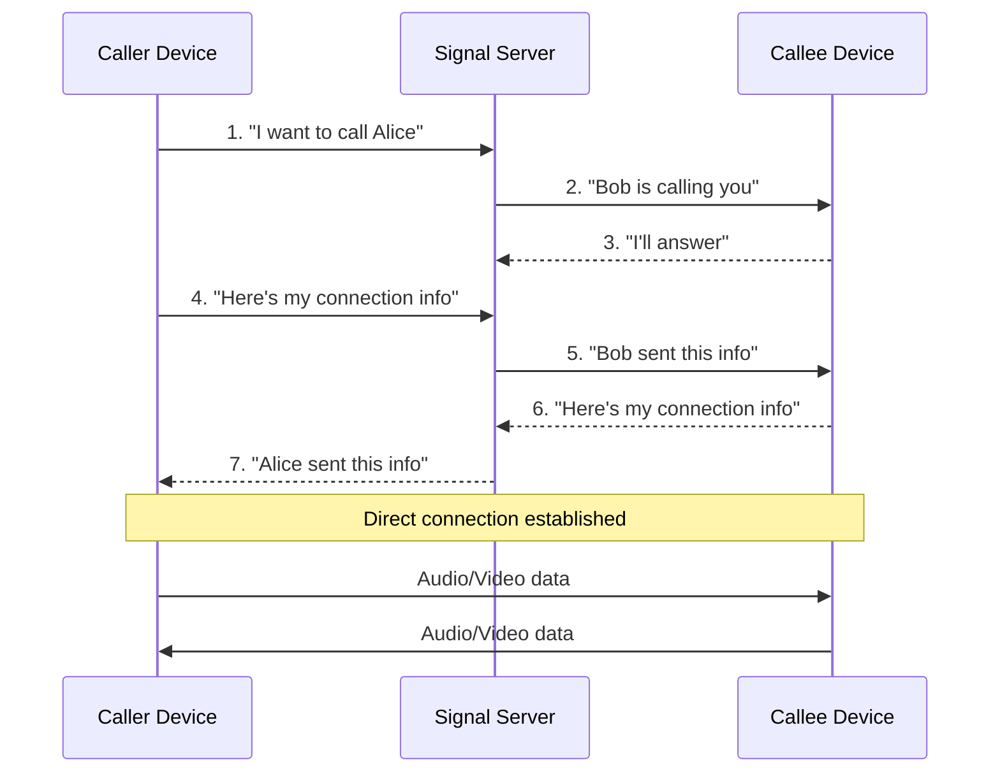
```mermaid
sequenceDiagram
    participant Caller as Caller Device
    participant Signal as Signal Server
    participant Callee as Callee Device

    Caller->>Signal: 1. "I want to call Alice"
    Signal->>Callee: 2. "Bob is calling you"
    Callee-->>Signal: 3. "I'll answer"
    Caller->>Signal: 4. "Here's my connection info"
    Signal->>Callee: 5. "Bob sent this info"
    Callee-->>Signal: 6. "Here's my connection info"
    Signal-->>Caller: 7. "Alice sent this info"
    
    Note over Caller,Callee: Direct connection established
    Caller->>Callee: Audio/Video data
    Callee->>Caller: Audio/Video data
```

**What happens**:
1. Caller initiates a call through a signal server
2. Signal server notifies the callee
3. Callee accepts the call
4. Both devices exchange connection information through the signal server
5. Devices try to connect directly to each other
6. Once connected, audio/video flows directly between devices

### The Signal Server

**What it does**: The signal server acts like a matchmaker that helps two devices find each other and exchange connection information. It doesn't handle the actual audio/video data.

**Key responsibilities**:
- Notify users when someone calls them
- Help devices exchange connection information
- Track call state (ringing, connected, ended)
- Handle call rejection or timeout
- Send push notifications if the recipient is offline

**Why it's needed**: Devices can't directly find each other on the internet due to network security (NAT). The signal server helps them discover each other.

### Connecting Through Firewalls and Routers

**The Challenge**: Most devices are behind routers that hide their real internet addresses for security. This is called NAT (Network Address Translation).

**STUN Server** (Session Traversal Utilities for NAT):
- Helps devices discover their real internet address
- Like asking "What's my public address?"
- Works for most common network setups
- Simple and lightweight

**TURN Server** (Traversal Using Relays around NAT):
- Acts as a relay when direct connection fails
- Like having a friend pass messages when you can't talk directly
- Used as a backup when STUN doesn't work
- Costs more bandwidth since data goes through the server

**ICE** (Interactive Connectivity Establishment):
- Automatically tries different ways to connect
- Prefers direct connections for best quality
- Falls back to relay if needed
- Built into modern web browsers

**Simple explanation**: Imagine you're in a building (behind a router). STUN tells you your building's address. If you still can't connect directly, TURN acts as a middleman that passes messages between you and the other person.

### Audio and Video Quality

**Codecs** (Compression/Decompression):
- Audio and video data is compressed to reduce bandwidth
- Different codecs offer different trade-offs between quality and file size
- Both devices must support the same codec to communicate

**Common audio codecs**:
- **Opus**: Modern, high quality, works well even with poor internet
- **G.711**: Older standard, works everywhere but lower quality
- **AAC**: Good quality, used by Apple devices

**Common video codecs**:
- **VP8**: Free, good quality, works on most devices
- **VP9**: Better compression (smaller files) but needs more processing power
- **H.264**: Very widely supported, used by most video platforms

**Adaptive Quality**: The system automatically adjusts quality based on internet connection speed. If your connection is slow, it reduces video quality. If it's fast, it increases quality. This prevents calls from freezing or dropping.

### Group Calls

**The Challenge**: In a group call with many people, having everyone connect directly to everyone else uses too much bandwidth.

**Three Approaches**:

**Mesh** (Everyone connects to everyone):
- Best for small groups (2-4 people)
- Lowest delay since data goes directly
- Bandwidth usage grows quickly with more people
- No server needed for media

**SFU** (Selective Forwarding Unit):
- Best for medium groups (up to 100 people)
- Everyone sends their video to a central server
- Server forwards each video to everyone else
- Server can adjust quality based on each person's connection
- Moderate delay since data goes through server

**MCU** (Multipoint Control Unit):
- Best for very large groups (1000+ people)
- Server mixes all video/audio into a single stream
- Everyone receives one combined stream
- Highest delay since server does all the work
- Most expensive to operate

**What apps use**: Most modern apps (Zoom, Google Meet, WhatsApp) use SFU for group calls.

### Call Quality Monitoring

**Key metrics tracked**:
- **Bitrate**: How much data is being sent per second (higher = better quality)
- **Packet Loss**: Percentage of data that doesn't arrive (causes choppy audio/video)
- **Jitter**: Variation in when data arrives (causes audio glitches)
- **Latency**: Delay between speaking and being heard (should be under 200ms)
- **Frame Rate**: How many video frames per second (30fps is standard)

**Automatic adjustments**: The system constantly monitors these metrics and automatically adjusts quality to maintain a smooth call. If packet loss increases, it reduces video quality. If the connection improves, it increases quality.

### Recording Calls

**Server-side recording**:
- Used for business compliance (call centers, etc.)
- Recording happens on the server
- Can be transcribed for searching
- Requires user consent in many regions

**Client-side recording**:
- User chooses to record (like recording a Zoom call)
- Recording happens on the user's device
- Can be saved locally or uploaded to cloud
- Privacy and legal considerations apply

---

## Message Search and Indexing

### Overview

Message search enables users to find specific messages across their conversation history. This requires efficient indexing, fast search capabilities, and privacy considerations for end-to-end encrypted messages.

### Search Challenges

**Scale**: Chat applications process billions of messages daily. Searching across this massive dataset requires distributed indexing, sharding strategies, and efficient query processing. A single search might need to scan millions of messages across multiple servers, requiring parallel processing and result aggregation.

**Latency**: Users expect instant search results (under 100ms). This requires optimized indexes, in-memory caching of frequently accessed data, and efficient query execution plans. Slow search frustrates users and reduces engagement.

**Privacy**: End-to-end encrypted messages cannot be indexed in plain text on the server. This requires searchable encryption techniques, client-side indexing, or hybrid approaches that balance privacy with performance. The challenge is enabling search without compromising encryption guarantees.

**Relevance**: Finding the right messages among thousands of matches requires sophisticated ranking algorithms. Factors include term frequency, message recency, sender importance, conversation context, and user behavior patterns. Poor relevance leads to users not finding what they need.

**Freshness**: New messages must be indexed quickly to appear in search results. Real-time indexing requires efficient write pipelines, incremental index updates, and handling high message throughput during peak usage.

**Multi-language**: Supporting global users means indexing and searching in multiple languages with different word boundaries, character sets, and linguistic rules. This requires language detection, tokenization for each language, and cross-language search capabilities.

**Storage Efficiency**: Indexes can be 30-50% of the original data size. With billions of messages, this translates to petabytes of index storage. Compression techniques, index pruning, and tiered storage strategies are needed to manage costs.

**Consistency**: When messages are edited or deleted, the index must be updated accordingly. Maintaining consistency between the message store and search index across distributed systems is challenging, especially during high write loads.

### Search Architectures

**Server-Side Search**:
The server indexes all messages and performs search queries. This is the traditional approach used by most web applications.

**How it works**:
- Messages are sent to the server and indexed immediately
- Search queries are processed on the server
- Results are returned to the client
- Index is maintained and updated by the server

**Advantages**:
- Fast and efficient search with dedicated server resources
- Centralized index management and optimization
- Can use powerful search engines (Elasticsearch, Solr)
- Works across all user devices (search from any device)
- Easy to implement and scale

**Disadvantages**:
- Privacy concerns - server sees all message content
- Not suitable for end-to-end encrypted messages
- Requires significant server infrastructure
- Bandwidth costs for transferring messages to server
- Regulatory compliance issues in some regions

**Use cases**: Email services (Gmail), traditional messaging platforms (non-encrypted), enterprise chat systems

**Client-Side Search**:
Search is performed entirely on the user's device using locally stored messages and indexes.

**How it works**:
- Messages are stored locally on the device
- Index is built and maintained on the device
- Search queries are processed locally
- No data is sent to the server for search

**Advantages**:
- Complete privacy - server never sees message content
- Works with end-to-end encrypted messages
- No server infrastructure needed for search
- Works offline (no internet required)
- Instant search (no network latency)

**Disadvantages**:
- Limited to messages stored on that device
- Higher resource usage on device (CPU, memory, storage)
- Index must be rebuilt when device changes
- Cannot search across multiple devices
- Slower on older devices with limited resources

**Use cases**: Signal, WhatsApp (end-to-end encrypted), privacy-focused applications

**Hybrid Search**:
Combines server-side and client-side search to balance privacy, performance, and functionality.

**How it works**:
- Server indexes metadata (sender, timestamp, conversation ID, message type)
- Client indexes actual message content
- Server narrows down search space using metadata filters
- Client performs content search on the filtered results
- Results are combined and displayed

**Example workflow**:
1. User searches for "meeting tomorrow"
2. Server filters: "Find messages from last week in work conversations" → returns 100 message IDs
3. Client receives these 100 message IDs and searches local content for "meeting tomorrow" → returns 5 matches
4. Client displays the 5 matching messages

**Advantages**:
- Server never sees message content (privacy preserved)
- Server reduces search space using metadata (performance)
- Client can search even when offline
- Bandwidth efficient (only metadata indexed on server)
- Balances privacy and performance

**Disadvantages**:
- Complex to implement (search logic on both server and client)
- Need to keep client-side index synchronized
- Higher resource usage on client device
- Limited to device's message history
- Consistency challenges between server and client indexes

**Use cases**: Modern encrypted messaging apps, privacy-sensitive applications, hybrid cloud deployments

### Indexing Strategies

**Full-Text Indexing**:
Full-text indexing creates a comprehensive index of all words in messages, enabling sophisticated search capabilities. Each message is tokenized (split into individual words), and each word is stored in the index along with its location and context. This allows for complex queries like "find messages containing 'meeting' AND 'tomorrow'" or "find messages with the phrase 'project deadline'".

**How it works**:
- Messages are broken down into words (tokens)
- Common words like "the", "and", "is" are removed (stop words)
- Words are normalized (lowercased, stemmed to root form)
- Each word is stored with references to messages containing it
- Additional metadata like position, frequency, and proximity is stored

**Advantages**:
- Supports boolean operators (AND, OR, NOT)
- Enables phrase searches with exact word sequences
- Allows proximity searches (words within N words of each other)
- Provides ranking based on word frequency and relevance
- Fast search performance for large datasets

**Trade-offs**:
- Higher storage overhead (index can be 30-50% of original data size)
- Slower indexing speed (need to process all words in all messages)
- Complex to implement and maintain

**Inverted Index**:
An inverted index is the foundation of most search engines. Instead of storing messages and searching through them sequentially, it maps each word to a list of message IDs where that word appears. Think of it like the index at the back of a book - instead of reading the entire book to find where "apple" is mentioned, you look up "apple" in the index and it tells you all the page numbers.

**How it works**:
- Create a dictionary of all unique words across all messages
- For each word, store a list of message IDs containing that word
- Optionally store word frequency (how many times the word appears in each message)
- Optionally store word position (where the word appears in the message)

**Example**:
```
Word "hello" → [message1, message5, message12]
Word "meeting" → [message2, message5, message8]
```
Searching for "hello meeting" would find message5 (contains both words).

**Advantages**:
- Extremely fast lookups (O(1) for finding word, then just merge lists)
- Standard approach used by Google, Elasticsearch, Solr
- Supports relevance scoring (TF-IDF, BM25)
- Efficient for large datasets

**Trade-offs**:
- Index size grows with vocabulary size
- Updates can be expensive (need to update index when messages change)
- Not ideal for very short queries or single-character searches

**N-gram Indexing**:
N-gram indexing breaks text into sequences of N consecutive characters, enabling partial matches and typo tolerance. This is particularly useful for autocomplete, fuzzy matching, and languages without clear word boundaries.

**How it works**:
- Break text into character sequences of length N
- For example, "hello" with n=3: "hel", "ell", "llo"
- Index each n-gram with references to messages containing it
- Search by breaking query into n-grams and finding overlapping matches

**Example**:
```
Message: "apple"
3-grams: "app", "ppl", "ple"
Search for "appl" → matches "app" and "ppl" → finds "apple"
```

**Advantages**:
- Supports partial matches (find "meet" when searching for "meeting")
- Handles typos and misspellings gracefully
- Works well for autocomplete (suggest completions as you type)
- Useful for languages without spaces between words (Chinese, Japanese)
- Enables fuzzy search (find similar words)

**Trade-offs**:
- Much higher storage overhead (exponential growth with n-gram size)
- Slower search performance (need to match multiple n-grams)
- More complex to implement and tune
- Can produce false positives (matches that don't make semantic sense)

**Implementation**:
```javascript
// Index a message for search
function indexMessage(message) {
  const document = {
    id: message.id,
    conversationId: message.conversationId,
    senderId: message.senderId,
    content: message.content,
    timestamp: message.timestamp,
    type: message.type
  };
  searchEngine.index('messages', document);
}

// Search messages for a user
function searchMessages(userId, query, options = {}) {
  const searchOptions = {
    query: query,
    filters: { userId },
    limit: options.limit || 50,
    offset: options.offset || 0,
    sort: { timestamp: 'desc' }
  };
  return searchEngine.search('messages', searchOptions);
}

// Delete message from index
function deleteMessage(messageId) {
  searchEngine.delete('messages', messageId);
}

// Update message in index
function updateMessage(message) {
  deleteMessage(message.id);
  indexMessage(message);
}
```

### Encrypted Message Search

**Searchable Encryption:**
- Encrypt messages in searchable form
- Server can search without decrypting
- Preserves privacy
- Complex to implement

**Techniques:**
- **Deterministic Encryption**: Same plaintext encrypts to same ciphertext
- **Homomorphic Encryption**: Compute on encrypted data
- **Searchable Symmetric Encryption (SSE)**: Specialized encryption for search
- **Private Information Retrieval (PIR)**: Query without revealing query

**Deterministic Encryption Approach**:
```javascript
// Encrypt a word using deterministic encryption (same word = same hash)
function encryptWord(word, key) {
  const hmac = crypto.createHmac('sha256', key);
  hmac.update(word.toLowerCase());
  return hmac.digest('hex');
}

// Index message with encrypted words
function indexMessage(message, key) {
  const words = tokenize(message.content);
  const encryptedWords = words.map(word => encryptWord(word, key));
  return { messageId: message.id, encryptedIndex: encryptedWords };
}

// Search encrypted index
function search(query, key) {
  const queryWords = tokenize(query);
  const encryptedQuery = queryWords.map(word => encryptWord(word, key));
  return searchIndex(encryptedQuery);
}

// Split text into words
function tokenize(text) {
  return text.toLowerCase().split(/\s+/).filter(word => word.length > 2);
}
```

### Search Features

**Basic Search:**
- Keyword search
- Phrase search
- Boolean operators (AND, OR, NOT)
- Wildcard search

**Advanced Search:**
- Date range filters
- Sender filters
- Conversation filters
- Media type filters
- Message type filters

**Autocomplete:**
- Suggest search terms
- Complete partial queries
- Show recent searches
- Popular searches

**Implementation**:
```javascript
// Search with filters and ranking
async function search(userId, query, filters = {}) {
  const searchQuery = buildSearchQuery(query, filters);
  const results = await indexer.searchMessages(userId, searchQuery);
  
  // Fetch full message details
  const messages = await Promise.all(
    results.messages.map(hit => getMessage(hit.id))
  );
  
  // Rank and sort results
  const ranked = rankResults(messages, query);
  
  return { messages: ranked, total: results.total, took: results.took };
}

// Build search query with filters
function buildSearchQuery(query, filters) {
  let searchQuery = query;
  
  if (filters.senderId) searchQuery += ` sender:${filters.senderId}`;
  if (filters.conversationId) searchQuery += ` conversation:${filters.conversationId}`;
  if (filters.startDate) searchQuery += ` after:${filters.startDate}`;
  if (filters.endDate) searchQuery += ` before:${filters.endDate}`;
  if (filters.messageType) searchQuery += ` type:${filters.messageType}`;
  
  return searchQuery;
}

// Rank results by relevance
function rankResults(messages, query) {
  const queryTerms = tokenize(query);
  
  return messages
    .map(message => ({
      message,
      score: calculateRelevance(message, queryTerms)
    }))
    .sort((a, b) => b.score - a.score);
}

// Calculate relevance score
function calculateRelevance(message, queryTerms) {
  let score = 0;
  const content = message.content.toLowerCase();
  
  for (const term of queryTerms) {
    if (content.includes(term)) {
      score += 1;
      if (content === term) score += 2; // Boost exact matches
      
      // Boost recent messages
      const daysSinceMessage = (Date.now() - message.timestamp) / (1000 * 60 * 60 * 24);
      score += Math.max(0, 10 - daysSinceMessage);
    }
  }
  
  return score;
}

// Split text into words
function tokenize(text) {
  return text.toLowerCase().split(/\s+/).filter(word => word.length > 2);
}
```

### Search Performance Optimization

**Caching:**
- Cache frequent search queries
- Cache search results
- Implement TTL for cache
- Invalidate on new messages

**Sharding:**
- Shard search index by user
- Distribute search load
- Parallel search across shards
- Aggregate results

**Lazy Loading:**
- Load results in batches
- Implement pagination
- Prefetch next page
- Cancel abandoned searches

**Implementation**:
```javascript
// Search with caching
async function searchWithCache(userId, query, filters = {}) {
  const cacheKey = getCacheKey(userId, query, filters);
  
  // Check cache first
  const cached = cache.get(cacheKey);
  if (cached) return cached;
  
  // Perform search
  const results = await search(userId, query, filters);
  
  // Cache results for 5 minutes
  cache.set(cacheKey, results, 300);
  
  return results;
}

// Generate cache key
function getCacheKey(userId, query, filters) {
  return `search:${userId}:${query}:${JSON.stringify(filters)}`;
}

// Invalidate cache for user
function invalidateCache(userId) {
  cache.deletePattern(`search:${userId}:*`);
}
```

### Search Analytics

**Metrics to Track:**
- Search query volume
- Search latency
- Result click-through rate
- Zero-result queries
- Popular search terms

**Implementation**:
```javascript
// Track search event
function trackSearch(userId, query, resultCount, latency) {
  const event = {
    type: 'search',
    userId,
    query,
    resultCount,
    latency,
    timestamp: Date.now()
  };
  analyticsStore.insert(event);
}

// Track click event
function trackClick(userId, query, messageId) {
  const event = {
    type: 'search_click',
    userId,
    query,
    messageId,
    timestamp: Date.now()
  };
  analyticsStore.insert(event);
}

// Get popular search queries
function getPopularQueries(limit = 10) {
  return analyticsStore.aggregate([
    { match: { type: 'search' } },
    { group: { _id: '$query', count: { $sum: 1 } } },
    { sort: { count: -1 } },
    { limit }
  ]);
}

// Get queries with zero results
function getZeroResultQueries(limit = 10) {
  return analyticsStore.aggregate([
    { match: { type: 'search', resultCount: 0 } },
    { group: { _id: '$query', count: { $sum: 1 } } },
    { sort: { count: -1 } },
    { limit }
  ]);
}
```

---

## Rate Limiting Strategies

### Overview

Rate limiting protects the system from abuse, ensures fair resource allocation, and prevents denial-of-service attacks. Chat applications need rate limiting at multiple levels to protect various components.

### Rate Limiting Levels

**User-Level Rate Limiting:**
- Limit messages per user per time window
- Prevent spam and abuse
- Fair resource allocation
- Different limits for different user tiers

**IP-Level Rate Limiting:**
- Limit requests per IP address
- Prevent DDoS attacks
- Limit bot traffic
- Geographic considerations

**Endpoint-Level Rate Limiting:**
- Limit requests per API endpoint
- Protect expensive operations
- Different limits for different operations
- Priority-based limiting

**Global Rate Limiting:**
- System-wide request limits
- Protect overall system capacity
- Emergency throttling
- Load shedding

### Rate Limiting Algorithms

**Token Bucket:**
- Fixed capacity bucket of tokens
- Tokens replenished at fixed rate
- Request consumes tokens
- Allows bursts up to bucket capacity

**Leaky Bucket:**
- Fixed rate of requests allowed
- Requests queue in bucket
- Requests processed at fixed rate
- Smooths out traffic

**Fixed Window Counter:**
- Counter resets at fixed intervals
- Simple to implement
- Can allow bursts at window boundaries
- Not precise for small windows

**Sliding Window Log:**
- Log of all request timestamps
- Count requests in sliding window
- Precise rate limiting
- Higher memory usage

**Sliding Window Counter:**
- Combination of approaches
- Precise with lower memory
- More complex implementation
- Good balance

### Implementation

**Token Bucket Implementation:**
```java
public class TokenBucketRateLimiter {
    private final double capacity;
    private final double refillRate; // tokens per second
    private double tokens;
    private long lastRefill;

    public TokenBucketRateLimiter(double capacity, double refillRate) {
        this.capacity = capacity;
        this.refillRate = refillRate;
        this.tokens = capacity;
        this.lastRefill = System.currentTimeMillis();
    }
    
    public synchronized boolean allowRequest(int tokens) {
        if (tokens <= 0) {
            tokens = 1;
        }
        
        refill();
        
        if (this.tokens >= tokens) {
            this.tokens -= tokens;
            return true;
        }
        
        return false;
    }
    
    public synchronized double getWaitTime(int tokens) {
        if (tokens <= 0) {
            tokens = 1;
        }
        
        refill();
        
        if (this.tokens >= tokens) {
            return 0;
        }
        
        double tokensNeeded = tokens - this.tokens;
        return tokensNeeded / refillRate;
    }
    
    private void refill() {
        long now = System.currentTimeMillis();
        double elapsed = (now - lastRefill) / 1000.0;
        double tokensToAdd = elapsed * refillRate;
        
        this.tokens = Math.min(capacity, this.tokens + tokensToAdd);
        this.lastRefill = now;
    }
}
```

**Sliding Window Implementation:**
```java
import java.util.*;
import java.util.concurrent.ConcurrentHashMap;

public class SlidingWindowRateLimiter {
    private final long windowSize; // in milliseconds
    private final int maxRequests;
    private final Map<String, List<Long>> requests; // userId -> array of timestamps

    public SlidingWindowRateLimiter(long windowSize, int maxRequests) {
        this.windowSize = windowSize;
        this.maxRequests = maxRequests;
        this.requests = new ConcurrentHashMap<>();
    }
    
    public synchronized boolean allowRequest(String userId) {
        long now = System.currentTimeMillis();
        List<Long> userRequests = requests.getOrDefault(userId, new ArrayList<>());
        
        // Remove requests outside window
        List<Long> validRequests = new ArrayList<>();
        for (Long timestamp : userRequests) {
            if (now - timestamp < windowSize) {
                validRequests.add(timestamp);
            }
        }
        
        if (validRequests.size() < maxRequests) {
            validRequests.add(now);
            requests.put(userId, validRequests);
            return true;
        }
        
        return false;
    }
    
    public synchronized int getRemainingRequests(String userId) {
        long now = System.currentTimeMillis();
        List<Long> userRequests = requests.getOrDefault(userId, new ArrayList<>());
        
        int validCount = 0;
        for (Long timestamp : userRequests) {
            if (now - timestamp < windowSize) {
                validCount++;
            }
        }
        
        return maxRequests - validCount;
    }
    
    public synchronized long getResetTime(String userId) {
        List<Long> userRequests = requests.getOrDefault(userId, new ArrayList<>());
        
        if (userRequests.isEmpty()) {
            return 0;
        }
        
        long oldestRequest = userRequests.get(0);
        return oldestRequest + windowSize;
    }
}
```

### Distributed Rate Limiting

**Redis-Based Rate Limiting:**
```java
import java.util.concurrent.CompletableFuture;

public class RedisRateLimiter {
    private final RedisClient redis;

    public RedisRateLimiter(RedisClient redis) {
        this.redis = redis;
    }
    
    public CompletableFuture<Boolean> allowRequest(String key, int limit, long window) {
        long now = System.currentTimeMillis();
        long windowStart = now - window;
        
        // Remove old entries
        return redis.zremrangebyscore(key, 0, windowStart)
            .thenCompose(v -> redis.zcard(key))
            .thenCompose(count -> {
                if (count < limit) {
                    // Add current request
                    return redis.zadd(key, now, String.valueOf(now))
                        .thenCompose(v2 -> redis.expire(key, window / 1000))
                        .thenApply(v3 -> true);
                }
                return CompletableFuture.completedFuture(false);
            });
    }
    
    public CompletableFuture<Integer> getRemainingRequests(String key, int limit, long window) {
        long now = System.currentTimeMillis();
        long windowStart = now - window;
        
        return redis.zremrangebyscore(key, 0, windowStart)
            .thenCompose(v -> redis.zcard(key))
            .thenApply(count -> Math.max(0, limit - count.intValue()));
    }
}

// Placeholder interface for Redis client
interface RedisClient {
    CompletableFuture<Long> zremrangebyscore(String key, long min, long max);
    CompletableFuture<Long> zcard(String key);
    CompletableFuture<Boolean> zadd(String key, double score, String member);
    CompletableFuture<Boolean> expire(String key, long seconds);
}
```

### Rate Limiting Strategies for Chat

**Message Sending:**
- Limit messages per minute per user
- Different limits for direct vs group messages
- Stricter limits for new users
- Relax limits for verified users

**Connection Establishment:**
- Limit connection attempts per IP
- Limit concurrent connections per user
- Implement backoff for failed connections
- Detect and block connection abuse

**API Requests:**
- Limit requests per endpoint
- Different limits for read vs write operations
- Higher limits for authenticated users
- Rate limit expensive operations (search, export)

**Media Upload:**
- Limit upload size per time window
- Limit number of uploads per day
- Different limits for different user tiers
- Implement quota system

### Implementation Example

**Comprehensive Rate Limiter:**
```java
import java.util.Map;
import java.util.concurrent.CompletableFuture;
import java.util.HashMap;

public class ChatRateLimiter {
    private final RedisClient redis;
    private final Map<String, RedisRateLimiter> limiters;

    public ChatRateLimiter(RedisClient redis) {
        this.redis = redis;
        this.limiters = new HashMap<>();
        limiters.put("messageSend", new RedisRateLimiter(redis));
        limiters.put("connection", new RedisRateLimiter(redis));
        limiters.put("apiRequest", new RedisRateLimiter(redis));
        limiters.put("mediaUpload", new RedisRateLimiter(redis));
    }
    
    public CompletableFuture<Boolean> checkMessageSend(String userId) {
        String key = "messages:" + userId;
        int limit = getUserMessageLimit(userId);
        long window = 60000; // 1 minute
        
        return limiters.get("messageSend").allowRequest(key, limit, window);
    }
    
    public CompletableFuture<Boolean> checkConnection(String ip, String userId) {
        String ipKey = "connections:ip:" + ip;
        String userKey = "connections:user:" + userId;
        
        CompletableFuture<Boolean> ipAllowed = limiters.get("connection").allowRequest(ipKey, 10, 60000);
        CompletableFuture<Boolean> userAllowed = limiters.get("connection").allowRequest(userKey, 5, 60000);
        
        return ipAllowed.thenCombine(userAllowed, (a, b) -> a && b);
    }
    
    public CompletableFuture<Boolean> checkAPIRequest(String userId, String endpoint) {
        String key = "api:" + userId + ":" + endpoint;
        int limit = getEndpointLimit(endpoint);
        long window = 60000; // 1 minute
        
        return limiters.get("apiRequest").allowRequest(key, limit, window);
    }
    
    public CompletableFuture<Boolean> checkMediaUpload(String userId) {
        String key = "media:" + userId;
        int limit = getUserMediaLimit(userId);
        long window = 86400000; // 24 hours
        
        return limiters.get("mediaUpload").allowRequest(key, limit, window);
    }
    
    private int getUserMessageLimit(String userId) {
        // Implement user tier logic
        return 60; // 60 messages per minute for regular users
    }
    
    private int getUserMediaLimit(String userId) {
        // Implement user tier logic
        return 100; // 100 uploads per day for regular users
    }
    
    private int getEndpointLimit(String endpoint) {
        Map<String, Integer> limits = new HashMap<>();
        limits.put("send_message", 60);
        limits.put("search", 30);
        limits.put("upload", 10);
        limits.put("default", 100);
        
        return limits.getOrDefault(endpoint, limits.get("default"));
    }
}
```

### Rate Limiting Headers

**Response Headers:**
```http
HTTP/1.1 200 OK
X-RateLimit-Limit: 60
X-RateLimit-Remaining: 45
X-RateLimit-Reset: 1625097600
X-RateLimit-Reset-After: 120
```

**Implementation:**
```java
public class RateLimitHeaders {
    public static void setRateLimitHeaders(HttpResponse response, int limit, int remaining, long reset) {
        response.setHeader("X-RateLimit-Limit", String.valueOf(limit));
        response.setHeader("X-RateLimit-Remaining", String.valueOf(remaining));
        response.setHeader("X-RateLimit-Reset", String.valueOf(reset / 1000));
        response.setHeader("X-RateLimit-Reset-After", String.valueOf(Math.max(0, reset - System.currentTimeMillis())));
    }
}

// Placeholder interface for HTTP response
interface HttpResponse {
    void setHeader(String name, String value);
}
```

### Handling Rate Limit Exceeded

**Response:**
```json
{
  "error": "rate_limit_exceeded",
  "message": "Too many requests. Please try again later.",
  "retryAfter": 45
}
```

**Implementation:**
```java
public class RateLimitErrorHandler {
    public static void handleRateLimitExceeded(HttpResponse response, int retryAfter) {
        response.setStatus(429);
        response.setHeader("Retry-After", String.valueOf(retryAfter));
        
        RateLimitError errorResponse = new RateLimitError(
            "rate_limit_exceeded",
            "Too many requests. Please try again later.",
            retryAfter
        );
        
        response.setBody(errorResponse);
    }

    public static class RateLimitError {
        private final String error;
        private final String message;
        private final int retryAfter;

        public RateLimitError(String error, String message, int retryAfter) {
            this.error = error;
            this.message = message;
            this.retryAfter = retryAfter;
        }

        public String getError() { return error; }
        public String getMessage() { return message; }
        public int getRetryAfter() { return retryAfter; }
    }
}

// Placeholder interface for HTTP response
interface HttpResponse {
    void setStatus(int status);
    void setHeader(String name, String value);
    void setBody(Object body);
}
```

---

## Monitoring and Observability

### Overview

Monitoring and observability are critical for operating a chat application at scale. They provide visibility into system health, performance, and user experience.

### Monitoring Pillars

**Metrics:**
- Numerical measurements over time
- Counters, gauges, histograms
- System and application metrics
- Business metrics

**Logs:**
- Discrete events with context
- Structured logging
- Log aggregation and analysis
- Error tracking

**Traces:**
- Distributed tracing across services
- Request flow visualization
- Performance bottleneck identification
- Service dependency mapping

### Metrics Collection

**System Metrics:**
- CPU utilization
- Memory usage
- Disk I/O
- Network I/O
- Connection counts

**Application Metrics:**
- Request rate
- Response time
- Error rate
- Message throughput
- Queue lengths

**Business Metrics:**
- Active users
- Messages sent
- Calls made
- Feature usage
- Conversion rates

**Implementation:**
```java
import java.util.*;
import java.util.stream.Collectors;

public class MetricsCollector {
    private final Map<String, Object> metrics;
    private final Map<String, Map<String, String>> labels;

    public MetricsCollector() {
        this.metrics = new ConcurrentHashMap<>();
        this.labels = new ConcurrentHashMap<>();
    }
    
    public void increment(String name, double value, Map<String, String> labels) {
        if (value == 0) {
            value = 1;
        }
        if (labels == null) {
            labels = new HashMap<>();
        }
        
        String key = getMetricKey(name, labels);
        Double current = (Double) metrics.getOrDefault(key, 0.0);
        metrics.put(key, current + value);
        this.labels.put(key, labels);
    }
    
    public void gauge(String name, double value, Map<String, String> labels) {
        if (labels == null) {
            labels = new HashMap<>();
        }
        
        String key = getMetricKey(name, labels);
        metrics.put(key, value);
        this.labels.put(key, labels);
    }
    
    public void histogram(String name, double value, Map<String, String> labels) {
        if (labels == null) {
            labels = new HashMap<>();
        }
        
        String key = getMetricKey(name, labels);
        if (!metrics.containsKey(key)) {
            metrics.put(key, new ArrayList<Double>());
        }
        ((List<Double>) metrics.get(key)).add(value);
        this.labels.put(key, labels);
    }
    
    public void timing(String name, double duration, Map<String, String> labels) {
        histogram(name, duration, labels);
    }
    
    public String getMetricKey(String name, Map<String, String> labels) {
        String labelString = labels.entrySet().stream()
            .sorted(Map.Entry.comparingByKey())
            .map(entry -> entry.getKey() + "=\"" + entry.getValue() + "\"")
            .collect(Collectors.joining(","));
        
        return labelString.isEmpty() ? name : name + "{" + labelString + "}";
    }
    
    public Map<String, MetricData> getMetrics() {
        Map<String, MetricData> result = new HashMap<>();
        for (Map.Entry<String, Object> entry : metrics.entrySet()) {
            String key = entry.getKey();
            Object value = entry.getValue();
            result.put(key, new MetricData(value, labels.get(key)));
        }
        return result;
    }

    public static class MetricData {
        private final Object value;
        private final Map<String, String> labels;

        public MetricData(Object value, Map<String, String> labels) {
            this.value = value;
            this.labels = labels;
        }

        public Object getValue() { return value; }
        public Map<String, String> getLabels() { return labels; }
    }
}
```

### Logging Strategy

**Structured Logging:**
```java
import java.time.Instant;
import java.time.format.DateTimeFormatter;
import java.util.Map;
import com.fasterxml.jackson.databind.ObjectMapper;

public class Logger {
    private final String service;
    private final ObjectMapper objectMapper;
    private final DateTimeFormatter formatter;

    public Logger(String service) {
        this.service = service;
        this.objectMapper = new ObjectMapper();
        this.formatter = DateTimeFormatter.ISO_INSTANT;
    }
    
    public void log(String level, String message, Map<String, Object> context) {
        if (context == null) {
            context = Map.of();
        }
        
        LogEntry logEntry = new LogEntry(
            Instant.now().toString(),
            level,
            service,
            message,
            context
        );
        
        try {
            System.out.println(objectMapper.writeValueAsString(logEntry));
        } catch (Exception e) {
            System.err.println("Failed to serialize log entry: " + e.getMessage());
        }
    }
    
    public void info(String message, Map<String, Object> context) {
        log("info", message, context);
    }
    
    public void warn(String message, Map<String, Object> context) {
        log("warn", message, context);
    }
    
    public void error(String message, Map<String, Object> context) {
        log("error", message, context);
    }
    
    public void debug(String message, Map<String, Object> context) {
        log("debug", message, context);
    }

    public static class LogEntry {
        private final String timestamp;
        private final String level;
        private final String service;
        private final String message;
        private final Map<String, Object> context;

        public LogEntry(String timestamp, String level, String service, String message, Map<String, Object> context) {
            this.timestamp = timestamp;
            this.level = level;
            this.service = service;
            this.message = message;
            this.context = context;
        }

        public String getTimestamp() { return timestamp; }
        public String getLevel() { return level; }
        public String getService() { return service; }
        public String getMessage() { return message; }
        public Map<String, Object> getContext() { return context; }
    }
}
```

**Log Levels:**
- **DEBUG**: Detailed diagnostic information
- **INFO**: General informational messages
- **WARN**: Warning messages for potential issues
- **ERROR**: Error messages for failures
- **FATAL**: Critical errors requiring immediate attention

### Distributed Tracing

**Trace Context:**
```java
import java.security.SecureRandom;
import java.util.*;

public class Tracer {
    private final String service;
    private final SecureRandom random;
    private final TracingBackend tracingBackend;

    public Tracer(String service, TracingBackend tracingBackend) {
        this.service = service;
        this.random = new SecureRandom();
        this.tracingBackend = tracingBackend;
    }
    
    public Span startSpan(String name, Span parentSpan) {
        String traceId = parentSpan != null ? parentSpan.getTraceId() : generateTraceId();
        String spanId = generateSpanId();
        String parentSpanId = parentSpan != null ? parentSpan.getSpanId() : null;
        
        return new Span(
            traceId,
            spanId,
            parentSpanId,
            name,
            service,
            System.currentTimeMillis()
        );
    }
    
    public void endSpan(Span span) {
        span.setDuration(System.currentTimeMillis() - span.getStartTime());
        reportSpan(span);
    }
    
    public void setTag(Span span, String key, String value) {
        span.getTags().put(key, value);
    }
    
    public void log(Span span, String message, Map<String, Object> context) {
        if (context == null) {
            context = new HashMap<>();
        }
        
        span.getLogs().add(new SpanLog(
            System.currentTimeMillis(),
            message,
            context
        ));
    }
    
    private String generateTraceId() {
        byte[] bytes = new byte[16];
        random.nextBytes(bytes);
        return bytesToHex(bytes);
    }
    
    private String generateSpanId() {
        byte[] bytes = new byte[8];
        random.nextBytes(bytes);
        return bytesToHex(bytes);
    }
    
    private void reportSpan(Span span) {
        // Send to tracing backend
        tracingBackend.report(span);
    }

    private String bytesToHex(byte[] bytes) {
        StringBuilder sb = new StringBuilder();
        for (byte b : bytes) {
            sb.append(String.format("%02x", b));
        }
        return sb.toString();
    }

    public static class Span {
        private final String traceId;
        private final String spanId;
        private final String parentSpanId;
        private final String name;
        private final String service;
        private final long startTime;
        private long duration;
        private final Map<String, String> tags;
        private final List<SpanLog> logs;

        public Span(String traceId, String spanId, String parentSpanId, String name, String service, long startTime) {
            this.traceId = traceId;
            this.spanId = spanId;
            this.parentSpanId = parentSpanId;
            this.name = name;
            this.service = service;
            this.startTime = startTime;
            this.tags = new HashMap<>();
            this.logs = new ArrayList<>();
        }

        public String getTraceId() { return traceId; }
        public String getSpanId() { return spanId; }
        public String getParentSpanId() { return parentSpanId; }
        public String getName() { return name; }
        public String getService() { return service; }
        public long getStartTime() { return startTime; }
        public long getDuration() { return duration; }
        public void setDuration(long duration) { this.duration = duration; }
        public Map<String, String> getTags() { return tags; }
        public List<SpanLog> getLogs() { return logs; }
    }

    public static class SpanLog {
        private final long timestamp;
        private final String message;
        private final Map<String, Object> context;

        public SpanLog(long timestamp, String message, Map<String, Object> context) {
            this.timestamp = timestamp;
            this.message = message;
            this.context = context;
        }

        public long getTimestamp() { return timestamp; }
        public String getMessage() { return message; }
        public Map<String, Object> getContext() { return context; }
    }
}

// Placeholder interface for tracing backend
interface TracingBackend {
    void report(Tracer.Span span);
}
```

### Alerting

**Alert Rules:**
- Error rate above threshold
- Response time above SLA
- Queue length growing
- Connection count dropping
- Disk space low

**Implementation:**
```java
import java.util.Map;
import java.util.concurrent.CompletableFuture;
import java.util.HashMap;
import java.util.function.Function;

public class AlertManager {
    private final AlertNotifier notifier;
    private final Map<String, AlertRule> alertRules;

    public AlertManager(AlertNotifier notifier) {
        this.notifier = notifier;
        this.alertRules = new HashMap<>();
    }
    
    public void addRule(String name, Function<Map<String, Object>, Boolean> condition, String severity) {
        alertRules.put(name, new AlertRule(condition, severity, null));
    }
    
    public CompletableFuture<Void> evaluateRules(Map<String, Object> metrics) {
        for (Map.Entry<String, AlertRule> entry : alertRules.entrySet()) {
            String name = entry.getKey();
            AlertRule rule = entry.getValue();
            
            try {
                boolean shouldAlert = rule.getCondition().apply(metrics);
                
                if (shouldAlert) {
                    long cooldown = 300000; // 5 minutes
                    long timeSinceLastAlert = rule.getLastAlerted() != null 
                        ? System.currentTimeMillis() - rule.getLastAlerted() 
                        : Long.MAX_VALUE;
                    
                    if (timeSinceLastAlert > cooldown) {
                        sendAlert(name, rule.getSeverity(), metrics).thenRun(() -> {
                            rule.setLastAlerted(System.currentTimeMillis());
                        });
                    }
                }
            } catch (Exception error) {
                System.err.println("Error evaluating rule " + name + ": " + error.getMessage());
            }
        }
        return CompletableFuture.completedFuture(null);
    }
    
    public CompletableFuture<Void> sendAlert(String ruleName, String severity, Map<String, Object> metrics) {
        Alert alert = new Alert(
            ruleName,
            severity,
            metrics,
            java.time.Instant.now().toString()
        );
        
        return notifier.send(alert);
    }

    public static class AlertRule {
        private final Function<Map<String, Object>, Boolean> condition;
        private final String severity;
        private Long lastAlerted;

        public AlertRule(Function<Map<String, Object>, Boolean> condition, String severity, Long lastAlerted) {
            this.condition = condition;
            this.severity = severity;
            this.lastAlerted = lastAlerted;
        }

        public Function<Map<String, Object>, Boolean> getCondition() { return condition; }
        public String getSeverity() { return severity; }
        public Long getLastAlerted() { return lastAlerted; }
        public void setLastAlerted(Long lastAlerted) { this.lastAlerted = lastAlerted; }
    }

    public static class Alert {
        private final String ruleName;
        private final String severity;
        private final Map<String, Object> metrics;
        private final String timestamp;

        public Alert(String ruleName, String severity, Map<String, Object> metrics, String timestamp) {
            this.ruleName = ruleName;
            this.severity = severity;
            this.metrics = metrics;
            this.timestamp = timestamp;
        }

        public String getRuleName() { return ruleName; }
        public String getSeverity() { return severity; }
        public Map<String, Object> getMetrics() { return metrics; }
        public String getTimestamp() { return timestamp; }
    }
}

// Placeholder interface for alert notifier
interface AlertNotifier {
    CompletableFuture<Void> send(AlertManager.Alert alert);
}
```

### Dashboards

**Key Dashboards:**
- **System Overview**: CPU, memory, network, disk
- **Application Health**: Request rate, error rate, latency
- **Message Flow**: Messages sent, delivered, failed
- **User Activity**: Active users, concurrent connections
- **Business Metrics**: MAU, DAU, retention

**Dashboard Metrics:**
```java
import java.util.Map;

public class DashboardMetrics {
    public static final SystemMetrics SYSTEM = new SystemMetrics();
    public static final ApplicationMetrics APPLICATION = new ApplicationMetrics();
    public static final MessagingMetrics MESSAGING = new MessagingMetrics();
    public static final BusinessMetrics BUSINESS = new BusinessMetrics();

    public static class SystemMetrics {
        public final String cpuUsage = "gauge";
        public final String memoryUsage = "gauge";
        public final String diskUsage = "gauge";
        public final String networkIn = "counter";
        public final String networkOut = "counter";
    }

    public static class ApplicationMetrics {
        public final String requestRate = "counter";
        public final String responseTime = "histogram";
        public final String errorRate = "gauge";
        public final String activeConnections = "gauge";
    }

    public static class MessagingMetrics {
        public final String messagesSent = "counter";
        public final String messagesDelivered = "counter";
        public final String messagesFailed = "counter";
        public final String queueLength = "gauge";
    }

    public static class BusinessMetrics {
        public final String activeUsers = "gauge";
        public final String newUsers = "counter";
        public final String messagesPerUser = "histogram";
        public final String retentionRate = "gauge";
    }
}
```

---

## Cost Optimization Strategies

### Overview

Operating a chat application at scale requires careful cost management. The major cost drivers include compute, storage, network bandwidth, and third-party services. Effective cost optimization reduces operational expenses without compromising performance or reliability.

### Cost Drivers

**Compute Costs:**
- Server instances for chat services
- Database servers
- Media processing servers
- Auto-scaling instances

**Storage Costs:**
- Message storage
- Media storage (images, videos, documents)
- Database storage
- Backup storage

**Network Costs:**
- Data transfer (egress)
- CDN bandwidth
- Inter-region data transfer
- CDN costs

**Third-Party Services:**
- Push notification services
- SMS verification
- STUN/TURN servers
- Monitoring and logging services

### Compute Optimization

**Right-Sizing Instances:**
- Monitor actual resource utilization
- Choose appropriate instance types
- Avoid over-provisioning
- Use burstable instances for variable workloads

**Auto-Scaling:**
- Scale out during peak hours
- Scale in during off-peak hours
- Use predictive scaling for known patterns
- Implement cooldown periods to prevent flapping

**Spot Instances:**
- Use spot instances for fault-tolerant workloads
- Significant cost savings (up to 90%)
- Implement graceful termination handling
- Not suitable for stateful services

**Serverless Architecture:**
- Use serverless for sporadic workloads
- Pay only for actual usage
- Scale automatically
- Consider cold start latency

### Storage Optimization

**Data Lifecycle Management:**
- Implement data retention policies
- Archive old messages to cold storage
- Delete expired media files
- Compress historical data

**Storage Tiers:**
- **Hot Storage**: Frequently accessed data (SSD, high cost)
- **Warm Storage**: Occasionally accessed data (HDD, medium cost)
- **Cold Storage**: Rarely accessed data (Glacier, low cost)

**Media Optimization:**
- Compress images and videos
- Generate multiple quality variants
- Use efficient codecs
- Implement adaptive bitrate streaming

**Deduplication:**
- Deduplicate media files
- Deduplicate message content
- Use content-addressable storage
- Implement chunk-level deduplication

### Network Optimization

**CDN Usage:**
- Cache static assets at edge
- Cache media files
- Implement cache warming
- Use CDN for all public content

**Data Compression:**
- Compress API responses
- Compress WebSocket messages
- Use efficient serialization (Protocol Buffers vs JSON)
- Implement delta sync

**Bandwidth Optimization:**
- Implement adaptive bitrate
- Use efficient codecs
- Batch requests
- Implement request coalescing

**Regional Routing:**
- Route users to nearest region
- Minimize cross-region traffic
- Use regional CDNs
- Implement geo-DNS

### Third-Party Service Optimization

**Push Notifications:**
- Batch notifications
- Use silent notifications for sync
- Implement notification collapsing
- Choose cost-effective providers

**SMS Verification:**
- Use multiple providers for cost optimization
- Implement rate limiting
- Use alternative verification methods (email, app-based)
- Cache verified numbers

**STUN/TURN Servers:**
- Use open-source STUN servers (free)
- Use TURN only when necessary
- Implement connection pooling
- Use regional TURN servers

**Monitoring and Logging:**
- Implement log sampling
- Use log aggregation efficiently
- Choose appropriate log retention
- Use cost-effective monitoring solutions

### Cost Monitoring

**Cost Allocation:**
- Tag resources by service
- Track costs per feature
- Allocate costs to teams
- Implement chargeback if needed

**Cost Alerts:**
- Set budget thresholds
- Alert on cost anomalies
- Track cost trends
- Implement cost governance

**Cost Analysis:**
- Analyze cost per user
- Analyze cost per message
- Identify cost outliers
- Optimize expensive operations

### Cost Optimization Best Practices

**General Principles:**
- Monitor costs continuously
- Optimize before scaling
- Use appropriate storage tiers
- Implement lifecycle policies
- Leverage spot instances where possible
- Optimize network usage
- Review third-party service costs regularly

**Chat-Specific Optimizations:**
- Compress media before storage
- Use CDN for media delivery
- Implement efficient sync protocols
- Optimize message indexing
- Use connection pooling
- Implement smart caching

**Avoid Pitfalls:**
- Don't optimize prematurely
- Don't sacrifice reliability for cost
- Don't ignore data transfer costs
- Don't forget about backup costs
- Don't overlook monitoring costs

---

## Regional Deployment Strategies

### Overview

Deploying a chat application across multiple regions reduces latency for geographically distributed users, improves reliability through geographic redundancy, and ensures compliance with data residency requirements.

### Deployment Models

**Single Region Deployment:**
- All services in one region
- Simplest to manage
- Lowest cost
- Higher latency for distant users
- Single point of failure

**Multi-Region Active-Active:**
- Services deployed in multiple regions
- All regions handle traffic
- Lowest latency
- Highest reliability
- Most complex to manage
- Higher cost

**Multi-Region Active-Passive:**
- Primary region handles traffic
- Passive regions on standby
- Faster failover than single region
- Lower cost than active-active
- Some latency for distant users

**Edge Deployment:**
- Services deployed at edge locations
- Ultra-low latency
- Limited functionality at edge
- Complex orchestration
- Emerging approach

### Geographic Routing

**DNS-Based Routing:**
- Use geo-DNS to route users
- Simple to implement
- Limited granularity
- DNS caching issues

**Anycast Routing:**
- Same IP advertised from multiple regions
- Automatic routing optimization
- Complex to set up
- Requires BGP

**CDN-Based Routing:**
- Use CDN for routing
- Edge locations worldwide
- Limited to CDN services
- Additional cost

**Application-Level Routing:**
- Application decides routing
- Most flexible
- Most complex
- Requires additional infrastructure

### Data Replication

**Replication Strategies:**

**Active-Active Replication:**
- All regions accept writes
- Multi-master replication
- Conflict resolution required
- Lowest latency for writes
- Most complex

**Active-Passive Replication:**
- Primary region accepts writes
- Passive regions replicate asynchronously
- No conflicts
- Higher latency for cross-region writes
- Simpler than active-active

**Eventual Consistency:**
- Replication happens asynchronously
- Temporary inconsistencies possible
- Higher availability
- Lower latency

**Strong Consistency:**
- Replication happens synchronously
- No inconsistencies
- Higher latency
- Lower availability

### Cross-Region Communication

**Inter-Region Latency:**
- Typical latency: 50-200ms
- Varies by distance
- Affects real-time features
- Consider in design

**Optimization Strategies:**
- Minimize cross-region calls
- Batch cross-region requests
- Use edge locations
- Implement regional caches

### Disaster Recovery

**Recovery Time Objectives (RTO):**
- **Critical Services**: < 5 minutes
- **Important Services**: < 30 minutes
- **Non-Critical Services**: < 4 hours

**Recovery Point Objectives (RPO):**
- **Critical Data**: < 1 minute
- **Important Data**: < 15 minutes
- **Non-Critical Data**: < 1 hour

**Failover Strategies:**
- **Automatic Failover**: Detect failure and switch automatically
- **Manual Failover**: Operator initiates failover
- **Graceful Degradation**: Reduce functionality instead of failing

### Compliance and Data Residency

**Data Residency Requirements:**
- GDPR: EU data must stay in EU
- Other regions have similar requirements
- Need to track data location
- Implement data transfer controls

### Regional Deployment Best Practices

**Planning:**
- Start with single region
- Add regions as needed
- Consider user distribution
- Factor in compliance requirements

**Implementation:**
- Use infrastructure as code
- Automate deployment
- Implement blue-green deployments
- Test failover regularly

**Monitoring:**
- Monitor each region independently
- Track cross-region latency
- Monitor replication lag
- Set up regional alerts

**Cost Management:**
- Consider regional cost differences
- Optimize data transfer costs
- Use regional pricing where available
- Monitor costs per region

---

## Testing Strategies

### Overview

Comprehensive testing is critical for chat applications due to their real-time nature, distributed architecture, and high reliability requirements. A robust testing strategy ensures the system works correctly under various conditions.

### Testing Pyramid

**Unit Tests:**
- Test individual components in isolation
- Fast execution
- High coverage
- Mock external dependencies

**Integration Tests:**
- Test interactions between components
- Medium execution time
- Test database interactions
- Test API integrations

**End-to-End Tests:**
- Test complete user flows
- Slow execution
- Test real user scenarios
- Use real infrastructure

### Unit Testing

### Integration Testing

### End-to-End Testing

### Performance Testing

### Chaos Testing

### Security Testing

### Testing Best Practices

**General Principles:**
- Test early and often
- Automate tests
- Use test data factories
- Keep tests independent
- Mock external dependencies

**Chat-Specific Considerations:**
- Test real-time scenarios
- Test offline/online transitions
- Test message ordering
- Test concurrent operations
- Test failure scenarios

**CI/CD Integration:**
- Run unit tests on every commit
- Run integration tests on pull requests
- Run E2E tests before deployment
- Use parallel test execution
- Cache test dependencies

---

## Scalability Considerations

### Horizontal Scaling

**Sharding Strategy:**

**By User ID:**
- All data for a user resides on specific shard
- Consistent hashing for shard assignment
- Enables efficient user-specific queries
- Simplifies cross-shard migration

**By Geographic Region:**
- Users routed to nearest data center
- Reduces latency for geographically distributed users
- Increases complexity for cross-region communication
- Requires data replication across regions

**By Function:**
- Different services scaled independently
- Chat service scaled based on connection count
- Message store scaled based on write throughput
- Media service scaled based on storage capacity

### Vertical Scaling

**Server Optimization:**
- Use high-performance servers with many CPU cores
- Optimize for CPU-bound or memory-bound workloads
- Use SSDs for fast disk I/O
- Increase network bandwidth for high throughput

**Erlang/BEAM Optimization:**
- Leverage Erlang's SMP (Symmetric Multi-Processing) scalability
- Scale by increasing core count on single node
- BEAM scheduler spreads processes across cores
- Minimal coordination overhead

### Load Balancing

**Connection-Level Load Balancing:**
- Distribute WebSocket/TCP connections across servers
- Use consistent hashing for session affinity
- Implement connection draining for graceful shutdown
- Handle connection failures with automatic reconnection

**Request-Level Load Balancing:**
- Distribute HTTP requests across API servers
- Use round-robin or least-connections algorithm
- Implement health checks for server availability
- Handle server failures with automatic failover

### Auto-scaling

**Horizontal Auto-scaling:**
- Scale out based on metrics (CPU, memory, connections)
- Scale in during low-traffic periods
- Implement cooldown periods to prevent flapping
- Use predictive scaling for anticipated traffic

**Vertical Auto-scaling:**
- Increase server resources based on demand
- Suitable for cloud environments with elastic resources
- May require application restart
- Less common than horizontal auto-scaling

### Caching Layers

**Application-Level Caching:**
- Cache frequently accessed data in memory
- Use Redis or Memcached for distributed caching
- Implement cache invalidation strategies
- Monitor cache hit rates

**CDN Caching:**
- Cache static assets at edge locations
- Cache media files for fast delivery
- Implement cache invalidation for dynamic content
- Use cache warming for popular content

**Database Query Caching:**
- Cache frequently executed queries
- Use materialized views for complex queries
- Implement query result caching
- Monitor cache effectiveness

---

## Fault Tolerance and Reliability

### Redundancy

**Server Redundancy:**
- Deploy multiple instances of each service
- Use load balancers for traffic distribution
- Implement health checks for failure detection
- Automatic failover to healthy instances

**Data Redundancy:**
- Replicate data across multiple nodes
- Use replication factor for durability
- Implement cross-datacenter replication for disaster recovery
- Use erasure coding for storage efficiency

**Geographic Redundancy:**
- Deploy services across multiple regions
- Implement active-active or active-passive configurations
- Use DNS-based traffic routing
- Handle cross-region latency and consistency

### Failure Detection

**Health Checks:**
- Implement liveness and readiness probes
- Check service endpoints for availability
- Monitor resource utilization (CPU, memory, disk)
- Alert on degraded performance

**Heartbeat Mechanism:**
- Services send periodic heartbeats
- Monitor detects missed heartbeats
- Mark services as unhealthy after threshold
- Trigger failover or recovery actions

**Circuit Breaker Pattern:**
- Prevent cascading failures
- Open circuit when failure rate exceeds threshold
- Allow limited traffic to test recovery
- Close circuit when service recovers

### Recovery Strategies

**Automatic Recovery:**
- Restart failed services automatically
- Reconnect to alternative instances
- Retry failed operations with exponential backoff
- Implement idempotent operations for safe retries

**Manual Recovery:**
- Alert operators for critical failures
- Provide dashboards for system status
- Implement runbooks for common failures
- Enable manual intervention when needed

**Data Recovery:**
- Restore from backups for data corruption
- Use point-in-time recovery for databases
- Implement data consistency checks
- Validate recovered data before serving traffic

### WhatsApp's "Islands" Architecture

**Island Concept:**
- Backend nodes grouped into "islands"
- Each island acts as small, redundant cluster
- Each island responsible for subset of data
- Islands operate independently

**Island Characteristics:**
- Each island has two or more nodes
- Data partitions assigned to primary and secondary
- Secondary takes over if primary fails
- Islands replicate data within themselves only

**Benefits:**
- Layer of fault tolerance without full replication
- Most failures affect only one island
- Recovery scoped tightly
- Limits blast radius of failures

---

## Security Considerations

### Authentication

**Phone Number Verification:**
- SMS-based OTP for initial registration
- Verify phone number ownership
- Prevent fake account creation
- Implement rate limiting for OTP requests

**Session Management:**
- Generate secure session tokens after authentication
- Implement token expiration and refresh
- Store tokens securely on device
- Revoke tokens on logout or security events

**Multi-Factor Authentication:**
- Optional MFA for enhanced security
- Support TOTP (Time-based One-Time Password)
- Support biometric authentication
- Implement backup authentication methods

### Authorization

**Role-Based Access Control:**
- Define roles (user, admin, moderator)
- Assign permissions to roles
- Enforce permissions at API level
- Audit permission changes

**Resource-Based Access Control:**
- Users can only access their own data
- Group members can access group data
- Implement ownership checks
- Validate access on each request

### Data Encryption

**Transport Layer Security (TLS):**
- Encrypt all network traffic
- Use strong cipher suites
- Implement certificate pinning on mobile
- Regularly update TLS libraries

**End-to-End Encryption:**
- Implement Signal Protocol for message encryption
- Server cannot access message content
- Keys managed on client devices
- Support key backup and recovery

**Data-at-Rest Encryption:**
- Encrypt stored data
- Use strong encryption algorithms
- Manage encryption keys securely
- Implement key rotation policies

### Privacy Protection

**Minimal Data Collection:**
- Collect only necessary data
- Anonymize or pseudonymize data when possible
- Implement data retention policies
- Allow users to delete their data

**Metadata Protection:**
- Minimize metadata collection
- Implement sealed sender to hide sender identity
- Reduce precision of timestamps
- Aggregate metadata when possible

**Privacy by Design:**
- Consider privacy in all design decisions
- Implement privacy defaults
- Provide privacy controls to users
- Conduct privacy impact assessments

### Security Monitoring

**Intrusion Detection:**
- Monitor for suspicious activity
- Implement anomaly detection
- Alert on security events
- Investigate potential breaches

**Audit Logging:**
- Log all security-relevant events
- Include timestamp, user, action, and result
- Protect logs from tampering
- Regularly review logs for issues

**Vulnerability Management:**
- Regularly scan for vulnerabilities
- Apply security patches promptly
- Conduct penetration testing
- Implement secure development practices

---

## WhatsApp-Specific Architecture

### System Design Principles

**Clarity Over Cleverness:**
- Architecture favors small, focused components
- Each service handles one job
- Minimizes dependencies
- Limits blast radius when things fail
- Simple code is easier to debug, maintain, and scale
- Avoids premature optimization that adds complexity
- Clear separation of concerns enables independent evolution of components

**Async by Default:**
- Relies on async messaging throughout
- Processes hand off work and move on
- Keeps system responsive even when parts slow down
- Absorbs load spikes and prevents glitches from snowballing
- Non-blocking design prevents cascading failures
- Message queues buffer work during traffic surges
- Enables loose coupling between components
- Allows components to fail and recover independently

**Isolation:**
- Each backend partitioned into "islands"
- Islands can fail independently
- Replication flows one way
- If node drops, peer takes over
- Failures contained within isolated boundaries
- Prevents single points of failure from propagating
- Enables targeted maintenance and upgrades
- Reduces coordination complexity across the system

**Seamless Upgrades:**
- Code changes roll out without restarting services
- No disconnection of users
- Discipline around state and interfaces
- Enables continuous deployment
- Hot code loading allows runtime updates without downtime
- Backward compatibility maintained during transitions
- Gradual rollout with ability to rollback quickly
- Zero-downtime deployments at WhatsApp scale

**Quality Through Focus:**
- Every line of backend code reviewed by founding team
- Kept system lean, fast, and deeply understood
- Small engineering team (50 engineers for entire backend)
- Fewer than a dozen focused on core infrastructure
- High code quality standards reduce bugs and technical debt
- Deep understanding of system behavior enables rapid debugging
- Small team size enables fast decision-making and iteration
- Focus on core competencies rather than building everything

### Connection Management

**A Connection is a Process:**
- When phone connects, establishes persistent TCP connection
- Connection managed as live Erlang process
- Process maintains session state, manages TCP socket
- Exits cleanly when user goes offline
- No connection pooling, no multiplexing
- One process per connection
- This approach simplifies connection management significantly
- Each connection process has its own isolated state and mailbox
- Process can be monitored, debugged, and restarted independently
- No shared state between connections eliminates race conditions
- Enables per-connection rate limiting and resource tracking

**Stateful and Smart on the Edge:**
- Session process actively coordinates with backends
- Pulls user-specific data:
  - Authentication: Verifies client identity and session validity
  - Blocking and Permissions: Checks if user allowed to send messages
  - Pending Messages and Notifications: Queries message queues
- Orchestration happens quickly and in parallel
- Keeps session logic close to edge
- Avoids round-trip and minimizes latency
- Session process caches frequently accessed user data
- Reduces load on backend systems by handling edge logic locally
- Enables fast decision-making without backend round-trips
- Session state includes: authentication tokens, user preferences, active conversations, message queues

**Scaling Frontend Connections:**
- Single chat server can manage 1+ million concurrent connections
- Erlang handles this with process model and non-blocking IO
- Each session lives independently
- One slow client doesn't affect others
- Strategies to maintain performance:
  - Typing indicators and presence updates batched and rate-limited
  - Message acknowledgments use lightweight protocol messages
  - Idle sessions monitored and culled when inactive
  - Process scheduling ensures fair CPU allocation across all connections
  - Memory usage monitored per-connection to prevent memory leaks
  - Connection timeouts prevent zombie connections from consuming resources
- BEAM VM's preemptive scheduler ensures no single process monopolizes CPU
- Memory isolation prevents one connection from affecting others
- Non-blocking I/O ensures slow network doesn't block other connections

**Efficient Message Flow:**
- When users online and chatting, session processes coordinate through backend chat nodes
- Chat nodes tightly interconnected
- Handle routing at protocol level, not application level
- Messages move peer-to-peer within backend mesh
- Minimizes hops
- Presence, typing states, metadata updates add volume
- Each message has multiple related updates:
  - Delivery receipts
  - Typing notifications
  - Group membership changes
  - Profile picture updates
- Travel through same architecture with reduced delivery guarantees
- Protocol-level routing faster than application-level routing
- Backend mesh optimized for low-latency message forwarding
- Message metadata (receipts, typing) travel on same path as messages
- Reduced delivery guarantees for metadata saves resources
- Prioritizes actual message delivery over auxiliary updates

### The Role of Erlang

**Erlang's Core Features:**
- Every connection, user session, internal task runs as lightweight process
- Managed by BEAM virtual machine
- Can spin up hundreds of thousands (sometimes millions) on single node
- Each process runs in isolation with own memory and mailbox
- Can crash without taking down system
- Plays well with large, multi-core boxes
- BEAM scheduler spreads processes across cores with minimal overhead
- SMP (Symmetric Multi-Processing) scalability: node count constant, internal capacity grows
- "Let it crash" philosophy: pragmatic response to unpredictability
- Supervisors monitor child processes, restart if they fail
- Failures stay local, no chain reaction
- Gen Factory dispatches work across multiple processes
- Each mini-factory handles own stream of input
- Reduces contention, spreads load evenly
- Processes communicate via message passing, eliminating shared state bugs
- Preemptive scheduling ensures fair CPU allocation across all processes
- Garbage collection per-process prevents system-wide GC pauses
- Hot code loading enables runtime updates without downtime
- Built-in distribution for transparent communication across nodes

**Process Model Advantages:**
- Process creation is extremely fast (microseconds)
- Process memory footprint is minimal (kilobytes)
- Context switching between processes is cheap
- No need for complex thread synchronization
- Message passing provides natural concurrency boundaries
- Process isolation prevents memory corruption from spreading
- Supervisor trees provide structured error handling
- Process monitoring enables proactive health checks
- Process linking enables automatic failure propagation when desired

**BEAM Virtual Machine:**
- Just-in-time compilation for performance
- Native code generation for critical paths
- Efficient memory management with per-process heaps
- I/O handled by separate driver processes
- Network operations non-blocking by design
- Scheduler runs one scheduler thread per CPU core
- Run queues ensure fair process execution
- Reductions for CPU-intensive computations
- NIFs (Native Implemented Functions) for performance-critical code
- Ports for interfacing with external programs

### Backend Systems and Isolation

**Divide by Function, Not Just Load:**
- Backend split into 40+ distinct clusters
- Each handles narrow slice of product
- Some handle message queues, others authentication, contact syncing, presence
- Multimedia, push notifications, spam filtering each get own space
- Benefits:
  - Limits failure scope: spam filter crash doesn't affect message delivery
  - Speeds up iteration: deploy changes to one backend without risk to others
  - Optimizes hardware: some services memory-bound, others CPU-heavy
- Decoupling adds coordination overhead
- At WhatsApp's scale, benefits outweigh costs
- Each cluster can be scaled independently based on its specific needs
- Team ownership is clear: each team responsible for their cluster
- Enables different deployment schedules for different services
- Reduces blast radius of bugs and configuration errors
- Allows specialized hardware for different workloads (GPU for media, high-memory for caching)

**Redundancy Through Erlang Clustering:**
- Erlang's distributed model key to backend resilience
- Nodes within cluster run in fully meshed topology
- Use native distribution mechanisms to communicate
- If one node drops, others pick up slack
- State often replicated or reconstructible
- Clients can reconnect to new node and resume
- Supervisors and health checks ensure failed processes restart quickly
- Clusters self-heal in face of routine hardware faults
- No single master node, no orchestrator dependency
- Minimal need for human intervention
- Automatic node discovery and connection establishment
- Transparent message passing across cluster boundaries
- Cluster membership changes handled automatically
- Network partitions detected and handled gracefully
- State synchronization happens in background without blocking operations

**"Islands" of Stability:**
- System groups backend nodes into "islands"
- Each island acts as small, redundant cluster
- Responsible for subset of data (like partition in distributed database)
- How island approach works:
  - Each island has two or more nodes
  - Data partitions assigned deterministically to one node as primary, another as secondary
  - If primary goes down, secondary takes over instantly
  - Islands replicate data within themselves but remain isolated from other islands
- Adds layer of fault tolerance without requiring full replication
- Most failures affect only one island
- Recovery scoped tightly
- Islands enable horizontal scaling without complex coordination
- Each island can be upgraded independently
- Reduces coordination overhead compared to global consensus
- Enables geographic distribution for latency optimization
- Island boundaries provide natural sharding boundaries

### Database Design and Optimization

**Key-Value Store in RAM:**
- Data access follows key-value pattern universally
- Each piece of information has predictable key and compact value
- Whenever possible, data lives in memory
- In-memory structures like Erlang's ETS tables provide fast concurrent access
- No external dependencies
- Read and write throughput consistent under pressure
- Memory latency doesn't spike with load
- Eliminates disk I/O bottleneck for hot data
- Predictable memory access patterns enable better optimization
- ETS tables provide O(1) or O(log n) access depending on table type
- Memory-only access eliminates network latency compared to external databases
- Enables fine-grained control over memory allocation and garbage collection

**Databases Embedded in VM:**
- Database logic embedded directly within Erlang runtime
- Tight integration reduces number of moving parts
- Avoids latency from networked DB calls
- Some backend clusters maintain internal data stores
- Implemented using mix of ETS tables and write-through caching layers
- Designed for short-lived data (presence updates, message queues)
- For long-lived data (media metadata), records kept in memory as long as possible
- Only when capacity demands or eviction policies kick in does data flush to disk
- Mnesia database provides distributed in-memory storage with persistence options
- Schema evolution handled carefully to maintain compatibility
- No separate database process to manage reduces operational complexity
- Direct memory access enables zero-copy data transfers where possible

**Lightweight Locking and Fragmentation:**
- Concurrency about managing locks, not just spawning processes
- To minimize lock contention, data partitioned into "DB Frags"
- Fragments of ETS tables distributed across processes
- Each fragment handles small, isolated slice of keyspace
- All access to fragment goes through single process on single node
- Allows for:
  - Serialized access per key: No races, no locks
  - Horizontal scale-out: More fragments mean more throughput
  - Targeted replication: Each fragment replicated independently to paired node
- Result: reads and writes rarely block
- Scaling up means adding more fragments and processes
- Fragment size tuned based on access patterns and data volume
- Consistent hashing ensures even distribution across fragments
- Fragment boundaries align with natural data partitioning (e.g., by user ID)
- Enables targeted optimization per fragment based on workload characteristics

**Async Writes and Parallel Disk I/O:**
- For persistence, writes happen asynchronously outside critical path
- Most tables operate in async_dirty mode
- Accept updates without requiring confirmation or transactional guarantees
- Keeps latency low even when disks get slow
- Behind scenes, multiple transaction managers push data to disk and replication streams in parallel
- If one TM lags, others keep system moving
- IO bottlenecks absorbed by fragmenting disk writes across directories and devices
- Maximizes throughput
- Write-ahead logging ensures durability without blocking
- Multiple disk spindles utilized in parallel for higher throughput
- Batched writes reduce disk seek overhead
- Compression applied to reduce disk I/O volume
- Separate disks for logs and data to prevent contention

**Offline Caching:**
- When phone goes offline, undelivered messages queue up in offline cache
- Cache smarter than simple buffer
- Uses write-back model with variable sync delay
- Messages written to memory first
- Flushed to disk only if they linger too long
- During high-load events (holidays), cache becomes critical buffer
- Allows system to keep delivering messages even when disk can't keep up
- In practice, over 98% of messages served from memory before touching persistent storage
- Cache eviction policies prioritize recently accessed messages
- LRU (Least Recently Used) algorithm for cache management
- Cache warming for frequently accessed conversations
- Separate caches per user to prevent cache pollution
- Adaptive sync delay based on system load and message volume

**Replication and Partitioning:**
- Replication tricky at scale
- Bidirectional replication introduces locking, contention, coordination overhead
- Cross-node consistency becomes fragile
- When things go wrong, everything grinds to halt
- WhatsApp follows different strategy
- Each data fragment owned by single node: primary
- Primary handles all application-layer reads and writes for its fragment
- Pushes updates to paired secondary node
- Secondary passively receives and stores changes
- Secondary never serves client traffic
- Only for failover
- Avoids concurrent access to shared state
- No conflicting writes, no race conditions, no need for transactional locks across nodes
- If primary fails, secondary promoted, replication flips
- Instead of one massive table per service, breaks data into hundreds/thousands of fragments
- Each fragment small, isolated slice of total dataset
- Typically hashed by user ID or session key
- Fragments:
  - Bound to single node for writes
  - Replicated to one other node
  - Mapped to processes through consistent hashing
- Sharding scheme reduces contention, improves locality, allows horizontal scaling without reshuffling state
- Each group of nodes managing set of fragments called island
- Island typically consists of two nodes: primary and secondary
- Key: each fragment belongs to only one island
- Each island operates independently
- Replication latency measured in milliseconds for fast failover
- Replication streams compressed to reduce network bandwidth
- Replication checksums ensure data integrity

### Message Delivery Architecture

**Store and Forward Mechanism:**
- When recipient offline, messages stored in offline queue
- Queue persists across server restarts and node failures
- Messages delivered immediately when recipient comes online
- Queue organized per-user for efficient retrieval
- Expiration policies prevent indefinite queue growth
- Delivery receipts generated only after successful delivery
- Supports message retry with exponential backoff
- Prioritizes recent messages over older ones during delivery bursts

**Message Queuing System:**
- Dedicated message queue clusters handle storage and delivery
- Messages indexed by recipient for fast lookup
- Queue depth monitored to prevent backpressure
- Separate queues for different message types (text, media, voice)
- Media messages stored with reference to media storage
- Queue metadata includes timestamp, sender, delivery attempts
- Dead letter queue for messages that fail delivery after max attempts
- Queue metrics used for system health monitoring

**Multimedia Handling:**
- Media files (images, videos, audio) stored separately from messages
- Media storage optimized for large binary objects
- Thumbnails generated and cached for quick preview
- Progressive loading for large media files
- Media compression reduces bandwidth and storage costs
- CDN integration for fast media delivery worldwide
- Media encryption applied at rest and in transit
- Media deduplication to save storage for duplicate files

**Push Notification Integration:**
- When recipient offline, push notifications sent to wake device
- Push notification service optimized for battery efficiency
- Batched notifications reduce wake-ups
- Notification payload includes message metadata (not content)
- FCM (Firebase Cloud Messaging) for Android, APNs for iOS
- Silent notifications for background message sync
- Notification rate limiting prevents spam
- Fallback to SMS for critical messages when push fails

---

## Trade-offs and Design Decisions

### Consistency vs. Availability

**CAP Theorem:**
- Consistency: All nodes see same data at same time
- Availability: Every request receives response (success/failure)
- Partition Tolerance: System continues operating despite network partitions
- Can only achieve two of three properties

**Chat Application Choice:**
- Prioritize availability and partition tolerance
- Accept eventual consistency
- Message ordering preserved within conversations
- Cross-region consistency may be temporary
- Client-side resolution using sequence numbers

### Latency vs. Throughput

**Low Latency Design:**
- Minimize network hops
- Use in-memory caching
- Optimize database queries
- Edge deployment for geographic distribution

**High Throughput Design:**
- Batch operations
- Asynchronous processing
- Horizontal scaling
- Connection pooling

**Balance:**
- Optimize for both where possible
- Use different strategies for different components
- Real-time messaging prioritizes latency
- Background processing prioritizes throughput

### Cost vs. Performance

**Cost Optimization:**
- Use spot instances for non-critical workloads
- Implement auto-scaling to reduce idle capacity
- Use storage tiering for cost-effective storage
- Optimize data transfer costs

**Performance Optimization:**
- Use high-performance instances for critical components
- Implement caching at multiple levels
- Use CDN for content delivery
- Optimize database queries

**Balance:**
- Use cost-performance analysis for decisions
- Implement monitoring to track both metrics
- Adjust based on business priorities
- Consider total cost of ownership

### Simplicity vs. Features

**Simple Design:**
- Fewer components to manage
- Easier to understand and debug
- Faster development and iteration
- Lower operational overhead

**Feature-Rich Design:**
- More capabilities for users
- Competitive differentiation
- Higher user engagement
- More complex architecture

**Balance:**
- Start with simple design
- Add features incrementally
- Evaluate feature value vs. complexity
- Maintain architectural simplicity where possible

### Security vs. Usability

**Security-Focused Design:**
- Strong authentication requirements
- End-to-end encryption
- Minimal data collection
- Strict access controls

**Usability-Focused Design:**
- Easy onboarding
- Seamless experience
- Rich features
- Convenient access

**Balance:**
- Implement security without compromising usability
- Use security best practices that are transparent to users
- Provide security options for advanced users
- Educate users about security features

---

## Conclusion

Designing a chat application at WhatsApp scale requires careful consideration of numerous factors: protocol selection, architecture patterns, database design, security, scalability, and reliability. WhatsApp's success demonstrates that simplicity, clarity, and thoughtful engineering choices can enable massive scale with a small team.

Key takeaways:
- **Protocol Choice**: Select protocol based on requirements (WebSocket for web, XMPP for federated, MQTT for mobile/IoT)
- **Architecture**: Use specialized services, implement proper isolation, and design for failure
- **Database**: Optimize for high write throughput, use in-memory structures where possible, implement smart partitioning
- **Security**: Implement end-to-end encryption, protect user privacy, monitor for threats
- **Scalability**: Design for horizontal scaling, use caching effectively, implement auto-scaling
- **Reliability**: Build redundancy, implement failure detection, design for recovery
- **Simplicity**: Favor simple solutions over clever ones, keep components focused, maintain clarity

The principles and patterns discussed in this guide provide a foundation for building production-grade chat applications that can scale to billions of users while maintaining reliability, security, and performance.

---

## References

### Authentic Sources
1. **ByteByteGo - How WhatsApp Handles 40 Billion Messages Per Day**
   - https://blog.bytebytego.com/p/how-whatsapp-handles-40-billion-messages
   - Detailed analysis of WhatsApp's architecture, Erlang usage, and database design

2. **System Design Handbook - Design a Messaging Platform Like WhatsApp**
   - https://www.systemdesignhandbook.com/guides/design-whatsapp/
   - Step-by-step guide covering requirements, architecture, databases, and trade-offs

3. **Ably - XMPP vs WebSocket: Which is best for chat apps?**
   - https://ably.com/topic/xmpp-vs-websocket
   - Comprehensive comparison of XMPP and WebSocket protocols for chat applications

4. **Wikipedia - Signal Protocol**
   - https://en.wikipedia.org/wiki/Signal_Protocol
   - Technical details on Signal Protocol, Double Ratchet, and X3DH key agreement

5. **WhatsApp Engineering Blog**
   - Various articles on WhatsApp's technical architecture and engineering practices

### Additional Resources
- RFC 6455 - The WebSocket Protocol
- RFC 6120 - Extensible Messaging and Presence Protocol (XMPP): Core
- RFC 6121 - Extensible Messaging and Presence Protocol (XMPP): Instant Messaging and Presence
- OASIS MQTT Specification
- Signal Protocol Specifications
- Erlang/OTP Documentation

---

## Appendix: Technology Comparison Tables

### Database Comparison

| Database | Write Scalability | Read Scalability | Query Flexibility | Consistency Model | Best For |
|----------|------------------|------------------|-------------------|------------------|----------|
| **Cassandra** | Excellent | Excellent | Limited | Tunable (Eventual/Strong) | High-volume messaging, time-series data |
| **MongoDB** | Good | Good | High | Tunable (Eventual/Strong) | Flexible schemas, complex queries |
| **PostgreSQL** | Moderate | Good | Very High | Strong | ACID transactions, relational data |
| **Redis** | Excellent | Excellent | Limited | Strong | Caching, real-time data, session storage |
| **DynamoDB** | Excellent | Excellent | Limited | Tunable (Eventual/Strong) | Serverless, auto-scaling workloads |
| **CockroachDB** | Good | Good | High | Strong | Distributed SQL, global deployments |

### Message Queue Comparison

| Queue | Throughput | Latency | Ordering Guarantees | Features | Best For |
|-------|------------|---------|---------------------|----------|----------|
| **Apache Kafka** | Very High | Low | Per-partition ordering | Log compaction, streams | Event streaming, high throughput |
| **RabbitMQ** | High | Low | Per-queue ordering | Flexible routing, plugins | Complex routing, reliable messaging |
| **Amazon SQS** | High | Medium | Best-effort | Serverless, auto-scaling | AWS workloads, simple queues |
| **Redis Streams** | High | Very Low | Per-stream ordering | Lightweight, in-memory | Real-time analytics, simple streams |
| **Apache Pulsar** | Very High | Low | Per-partition ordering | Multi-tenancy, geo-replication | Large-scale, multi-cluster deployments |

### Caching Comparison

| Cache | Persistence | Cluster Support | Data Structures | Replication | Best For |
|-------|-------------|----------------|-----------------|-------------|----------|
| **Redis** | Optional (RDB/AOF) | Yes (Redis Cluster) | Rich (strings, lists, sets, hashes, streams) | Async/Sync | General-purpose caching, session storage |
| **Memcached** | No | Yes (consistent hashing) | Basic (strings) | No | Simple caching, high performance |
| **Hazelcast** | Yes | Yes (distributed) | Rich | Sync/Async | Distributed computing, in-memory data grid |
| **Apache Ignite** | Yes | Yes (distributed) | Rich | Sync/Async | In-memory database, computing platform |
| **Elasticache (Memcached)** | No | Yes (AWS managed) | Basic | No | AWS workloads, simple caching |

### CDN Comparison

| CDN | Edge Locations | Smart Routing | Video Streaming | Pricing Model | Best For |
|-----|----------------|---------------|-----------------|---------------|----------|
| **Cloudflare** | 300+ | Yes | Yes | Pay-as-you-go | Global coverage, security features |
| **AWS CloudFront** | 400+ | Yes | Yes | Pay-as-you-go | AWS ecosystem, media delivery |
| **Fastly** | 100+ | Yes | Yes | Pay-as-you-go | Real-time logging, edge computing |
| **Akamai** | 3000+ | Yes | Yes | Custom pricing | Enterprise, large-scale media |
| **Google Cloud CDN** | 200+ | Yes | Yes | Pay-as-you-go | GCP ecosystem, video streaming |

### Load Balancer Comparison

| Load Balancer | Layer | Health Checks | Session Affinity | Auto-scaling | Best For |
|---------------|-------|---------------|------------------|--------------|----------|
| **HAProxy** | 4/7 | Yes | Yes | No | On-premises, high performance |
| **NGINX** | 4/7 | Yes | Yes | No | Web applications, reverse proxy |
| **AWS ALB** | 7 | Yes | Yes | Yes | AWS HTTP/HTTPS traffic |
| **AWS NLB** | 4 | Yes | No | Yes | AWS TCP/UDP traffic, high performance |
| **Envoy** | 4/7 | Yes | Yes | No | Service mesh, edge proxy |
| **Traefik** | 4/7 | Yes | Yes | Yes | Container orchestration, dynamic config |

### Programming Language Comparison

| Language | Concurrency Model | Performance | Ecosystem | Learning Curve | Best For |
|----------|-------------------|-------------|-----------|----------------|----------|
| **Erlang** | Actor model (lightweight processes) | High | Specialized | Steep | Real-time systems, telecom |
| **Go** | Goroutines (lightweight threads) | High | Growing | Moderate | Network services, microservices |
| **Node.js** | Event loop (async/await) | Medium | Very Large | Low | Real-time web applications |
| **Java** | Threads | High | Very Large | Moderate | Enterprise applications |
| **Python** | Asyncio | Medium | Very Large | Low | Rapid development, data processing |
| **Rust** | Async/Await | Very High | Growing | Steep | Performance-critical systems |

### Protocol Comparison Summary

| Protocol | Bandwidth Efficiency | Latency | Mobile Optimization | Complexity | Best For |
|----------|---------------------|---------|-------------------|-------------|----------|
| **WebSocket** | Medium | Very Low | Good | Low | Web applications, custom protocols |
| **XMPP** | Low (XML overhead) | Medium | Poor | High | Federated messaging, enterprise |
| **MQTT** | Very High | Low | Excellent | Low | IoT, mobile, constrained devices |
| **gRPC** | High (binary) | Low | Good | Medium | Microservices, API communication |
| **HTTP/2** | High | Medium | Good | Low | Web APIs, browser compatibility |

### Object Storage Comparison

| Storage | Durability | Availability | Lifecycle Management | Pricing | Best For |
|---------|------------|--------------|---------------------|---------|----------|
| **Amazon S3** | 99.999999999% | 99.99% | Yes | Tiered | General-purpose, AWS ecosystem |
| **Google Cloud Storage** | 99.999999999% | 99.99% | Yes | Tiered | GCP ecosystem, analytics |
| **Azure Blob Storage** | 99.999999999% | 99.99% | Yes | Tiered | Azure ecosystem, enterprise |
| **MinIO** | Configurable | Configurable | Yes | Self-hosted | On-premises, private cloud |
| **Wasabi** | 99.999999999% | 99.99% | Yes | Flat pricing | Cost-sensitive workloads |

### Monitoring Tool Comparison

| Tool | Metrics | Logs | Traces | Deployment | Best For |
|------|---------|------|--------|-------------|----------|
| **Prometheus** | Excellent | Limited | Limited | Self-hosted | Metrics-focused, Kubernetes |
| **Grafana** | Excellent | Limited | Limited | Self-hosted | Visualization, dashboards |
| **ELK Stack** | Good | Excellent | Limited | Self-hosted | Log analysis, search |
| **Datadog** | Excellent | Excellent | Excellent | SaaS | All-in-one observability |
| **New Relic** | Excellent | Excellent | Excellent | SaaS | APM, application monitoring |
| **Jaeger** | Limited | Limited | Excellent | Self-hosted | Distributed tracing |

### Push Notification Service Comparison

| Service | Platforms | Cost | Reliability | Features | Best For |
|---------|-----------|------|-------------|----------|----------|
| **APNs (Apple)** | iOS only | Free per device | Very High | Rich notifications, silent push | iOS applications |
| **FCM (Firebase)** | Android, iOS, Web | Free | High | Rich notifications, topics | Cross-platform, Google ecosystem |
| **OneSignal** | All platforms | Free tier available | High | Segmentation, A/B testing | Easy integration, marketing |
| **Amazon SNS** | All platforms | Pay-per-use | High | Multi-platform, topics | AWS ecosystem, scale |
| **Pusher** | All platforms | Paid tier | High | Real-time events, channels | Real-time applications |

### Testing Framework Comparison

| Framework | Language | Type | Learning Curve | Best For |
|-----------|----------|------|----------------|----------|
| **Jest** | JavaScript | Unit/Integration | Low | JavaScript/TypeScript projects |
| **Pytest** | Python | Unit/Integration | Low | Python projects |
| **JUnit** | Java | Unit | Moderate | Java applications |
| **TestNG** | Java | Unit/Integration | Moderate | Java, complex test scenarios |
| **Cypress** | JavaScript | E2E | Low | Web applications |
| **Playwright** | JavaScript | E2E | Moderate | Cross-browser testing |
| **Locust** | Python | Load Testing | Moderate | Python load testing |
| **JMeter** | Java | Load Testing | Steep | Complex load testing scenarios |

### Container Orchestration Comparison

| Platform | Complexity | Scalability | Managed Service | Ecosystem | Best For |
|----------|------------|-------------|-----------------|-----------|----------|
| **Kubernetes** | High | Excellent | Yes (EKS, GKE, AKS) | Very Large | Complex deployments, scale |
| **Docker Swarm** | Low | Good | No | Medium | Simple deployments, learning |
| **Nomad** | Medium | Good | No | Medium | Mixed workloads, simplicity |
| **AWS ECS** | Medium | Excellent | Yes | Medium | AWS ecosystem, containers |
| **Google Cloud Run** | Low | Excellent | Yes | Medium | Serverless containers, simplicity |

### Summary Table: Quick Technology Recommendations

| Component | Recommended Technology | Alternative | When to Use Alternative |
|----------|------------------------|-------------|------------------------|
| **Message Store** | Cassandra | MongoDB, PostgreSQL | Need complex queries or ACID transactions |
| **Message Queue** | Apache Kafka | RabbitMQ, Redis Streams | Need simple routing or lightweight |
| **Cache** | Redis | Memcached, Hazelcast | Need simple caching or distributed computing |
| **CDN** | Cloudflare | AWS CloudFront, Fastly | Need AWS integration or edge computing |
| **Load Balancer** | HAProxy | NGINX, Envoy | Need web server or service mesh |
| **Language** | Go | Erlang, Node.js | Need telecom reliability or rapid development |
| **Protocol** | WebSocket | MQTT, XMPP | Need mobile optimization or federation |
| **Storage** | Amazon S3 | Google Cloud Storage, MinIO | Need GCP integration or on-premises |
| **Monitoring** | Prometheus + Grafana | Datadog, New Relic | Need SaaS or all-in-one solution |
| **Push Notifications** | FCM | APNs, OneSignal | iOS-only or easy integration |
| **Testing** | Jest + Cypress | Pytest + Playwright | Python projects or cross-browser |
| **Orchestration** | Kubernetes | Docker Swarm, ECS | Simpler deployments or AWS ecosystem |

---

## Appendix: Diagrams

### High-Level System Architecture
[See section: High-Level Architecture]

### Message Flow Diagram
[See section: Message Flow and Delivery Semantics]

### Protocol Comparison
[See section: Communication Protocols]

### WhatsApp Island Architecture
[See section: WhatsApp-Specific Architecture - Islands of Stability]

### Signal Protocol Key Exchange
[See section: End-to-End Encryption - X3DH Key Agreement]
