# Two-Phase Commit (2PC) Protocol

## Table of Contents

1. [Introduction to Distributed Transactions](#introduction-to-distributed-transactions)
2. [The Problem 2PC Solves](#the-problem-2pc-solves)
3. [What is Two-Phase Commit?](#what-is-two-phase-commit)
4. [Core Concepts](#core-concepts)
5. [The Protocol in Detail](#the-protocol-in-detail)
6. [Detailed Flow Diagrams](#detailed-flow-diagrams)
7. [Failure Scenarios and Recovery](#failure-scenarios-and-recovery)
8. [The Blocking Problem](#the-blocking-problem)
9. [XA Standard](#xa-standard)
10. [Real-world Implementations](#real-world-implementations)
11. [Advantages and Disadvantages](#advantages-and-disadvantages)
12. [When to Use 2PC](#when-to-use-2pc)
13. [Alternatives to 2PC](#alternatives-to-2pc)
14. [Conclusion](#conclusion)

---

## Introduction to Distributed Transactions
In modern distributed systems, data is often spread across multiple databases, services, and nodes. A single business operation might need to update data in several different databases simultaneously. For example, when a user makes a purchase on an e-commerce platform:

- The payment service deducts money from the user's wallet
- The inventory service updates product stock
- The order service creates an order record
- The shipping service reserves shipping capacity

Each of these operations might be managed by a separate database or service. The challenge is ensuring that either all these operations succeed together, or all fail together. This is the fundamental problem of **atomicity** in distributed transactions.

In a single database, transactions are straightforward. ACID properties guarantee that a series of operations either all succeed or all fail. The database handles locking, logging, and recovery internally. But when data lives across multiple independent databases, there's no single authority to coordinate these guarantees.

---

## The Problem 2PC Solves
### Single Database Transactions vs Distributed Transactions
In a single database, transactions are elegant:

```sql
BEGIN TRANSACTION;
UPDATE wallets SET balance = balance - 100 WHERE user_id = 123;
UPDATE inventory SET quantity = quantity - 1 WHERE product_id = 456;
INSERT INTO orders (user_id, product_id, amount) VALUES (123, 456, 100);
COMMIT;
```

If anything fails, the database rolls everything back. ACID properties guarantee consistency.

But what happens when your data lives in three different databases across three different services?

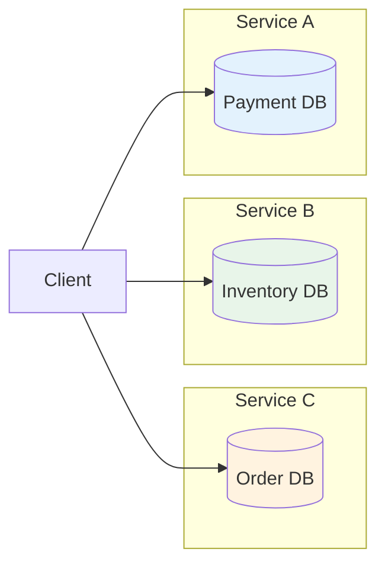
```mermaid
graph LR
    subgraph "Service C"
        DB3[(Order DB)]
    end
    subgraph "Service B"
        DB2[(Inventory DB)]
    end
    subgraph "Service A"
        DB1[(Payment DB)]
    end
    Client[Client] --> DB1
    Client --> DB2
    Client --> DB3
    style DB1 fill:#e3f2fd
    style DB2 fill:#e8f5e9
    style DB3 fill:#fff3e0
```

Each database has its own transaction. They don't talk to each other. If one commits and another fails, you're stuck with partial data:
- User's money is deducted
- Product inventory is updated
- But order creation fails

This is a catastrophic inconsistency that can lead to data corruption, financial discrepancies, and unhappy customers.

### The Distributed Transaction Problem
The core problem is: **How do we ensure atomicity across multiple independent databases?**

We need a protocol that:
1. Coordinates all participants to agree on a single outcome
2. Ensures all participants either commit or abort together
3. Handles failures gracefully
4. Recovers from crashes without data loss

Two-Phase Commit (2PC) is the classic solution to this problem.

---

## What is Two-Phase Commit?
Two-Phase Commit (2PC) is a distributed algorithm that coordinates all the processes that participate in a distributed atomic transaction on whether to commit or abort. It is a type of **atomic commitment protocol (ACP)**.

The protocol splits the commit process into two distinct phases:
1. **Prepare Phase**: Ask everyone "Can you commit?"
2. **Commit Phase**: Tell everyone "Go ahead and commit" or "Rollback"

### A Real-World Analogy
Think of it like organizing a group dinner reservation:

**Phase 1 (Prepare)**: You call each friend and ask "Can you make it Friday at 7pm?" You wait for everyone to confirm.

**Phase 2 (Commit)**: Once everyone says yes, you call them again: "Great, we're confirmed for Friday at 7pm." Now everyone shows up.

If even one friend says "Sorry, I can't make it" during Phase 1, you call everyone back and cancel the whole thing. Nobody shows up to an empty restaurant.

This analogy captures the essence of 2PC: unanimous agreement before commitment, or complete cancellation if anyone disagrees.

---

## Core Concepts
### Coordinator and Participants
The 2PC protocol involves two types of nodes:

#### Coordinator (Transaction Manager)- The master site that initiates and controls the transaction
- Collects votes from all participants
- Makes the final decision (commit or abort)
- Sends the decision to all participants
- Maintains a transaction log for recovery

#### Participants (Resource Managers)- The databases or services that hold the data
- Execute the transaction locally
- Vote on whether they can commit
- Follow the coordinator's final decision
- Maintain their own logs for recovery

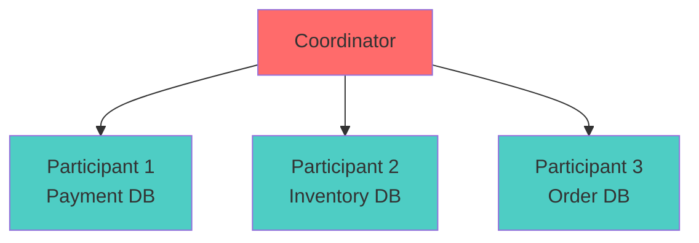
```mermaid
graph TD
    C[Coordinator]
    P1[Participant 1<br/>Payment DB]
    P2[Participant 2<br/>Inventory DB]
    P3[Participant 3<br/>Order DB]
    
    C --> P1
    C --> P2
    C --> P3
    
    style C fill:#ff6b6b
    style P1 fill:#4ecdc4
    style P2 fill:#4ecdc4
    style P3 fill:#4ecdc4
```

### Write-Ahead Log (WAL)
The Write-Ahead Log is a critical component for durability and recovery. Both the coordinator and participants maintain logs:

- **Coordinator's Log**: Records the transaction state (STARTED, PREPARED, COMMITTING, COMMITTED)
- **Participant's Log**: Records the vote and transaction outcome

Before any critical operation, the log entry is written to stable storage (disk). This ensures that if a crash occurs, the system can recover to a consistent state.

### Assumptions of the Protocol
The 2PC protocol makes several assumptions:

1. **Stable Storage**: Each node has stable storage with a write-ahead log
2. **No Permanent Failures**: No node crashes forever
3. **Log Integrity**: Data in the write-ahead log is never lost or corrupted in a crash
4. **Network Connectivity**: Any two nodes can communicate with each other

The first two assumptions are strong. If a node is totally destroyed, data can be lost. The last assumption is not too restrictive, as network communication can typically be rerouted.

---

## The Protocol in Detail
The Two-Phase Commit protocol consists of three phases: Phase 0 (Transaction Initiation), Phase 1 (Prepare/Voting), and Phase 2 (Commit/Completion). Let's walk through each phase with clear explanations and examples.

### Phase 0: Transaction Initiation
Before the 2PC protocol begins, the application sets up the distributed transaction. Think of this as the preparation phase where all the pieces are put in place.

#### Step 1: Establishing Connections
The application connects to all the databases that will participate in the transaction. For example, if you're processing an order that involves payment, inventory, and order records:

```java
// Application code
Connection paymentConn = dataSource1.getConnection();  // Connect to Payment DB
Connection inventoryConn = dataSource2.getConnection(); // Connect to Inventory DB
Connection orderConn = dataSource3.getConnection();     // Connect to Order DB
```

Each database connection is independent at this point. The application can now execute SQL statements on each connection, but these are not yet coordinated as a single distributed transaction.

#### Step 2: Identifying the Coordinator
When the application wants to execute a distributed transaction, it needs a coordinator to manage it. The coordinator can be:

1. **Application Server**: In Java EE/Spring environments, the application server (like WildFly, WebLogic) or framework (like Spring with JTA) acts as the coordinator
2. **Database**: Some databases can coordinate transactions across their own replicas (like Oracle TimesTen)
3. **Custom Coordinator**: You can implement your own coordinator service

The coordinator is essentially the "orchestrator" that will:
- Keep track of all participants
- Send prepare messages
- Collect votes
- Make the final commit/abort decision
- Handle recovery if something fails

**Example**: In a Spring Boot application with JTA, the transaction manager bean acts as the coordinator:

```java
@Bean
public PlatformTransactionManager transactionManager() {
    JtaTransactionManager tm = new JtaTransactionManager();
    // This tm is the coordinator for all distributed transactions
    return tm;
}
```

#### Step 3: Beginning the Transaction
The application signals the start of a distributed transaction. This is typically done through annotations or explicit API calls:

```java
// Using annotation (Spring)
@Transactional
public void processOrder(Order order) {
    // All database operations within this method
    // will be part of the same distributed transaction
}

// Or using explicit API (JTA)
UserTransaction utx = ...;
utx.begin();
// Execute operations
utx.commit();
```

When the transaction begins:
- The coordinator generates a unique transaction ID (called XID in XA terminology)
- The coordinator enlists all the database connections as participants
- Each participant is notified that it's part of a distributed transaction

#### Step 4: Executing Operations
The application executes its business logic, performing operations on multiple databases:

```java
@Transactional
public void processOrder(OrderRequest request) {
    // Operation 1: Deduct payment
    paymentRepository.debit(request.getUserId(), request.getAmount());
    
    // Operation 2: Update inventory
    inventoryRepository.reserve(request.getProductId(), request.getQuantity());
    
    // Operation 3: Create order record
    orderRepository.create(request);
}
```

**Important**: At this point, each database executes its operations locally, but none of them commit yet. Each database:
- Executes the SQL statements
- Holds locks on the affected rows/tables
- Keeps the changes in a transactional state (not yet permanent)

The coordinator tracks which participants are involved and their status (active, prepared, committed, etc.).

#### Step 5: Requesting Commit
When the application finishes executing all operations, it requests to commit the transaction:

```java
@Transactional
public void processOrder(OrderRequest request) {
    // ... execute operations ...
    // Method ends here, transaction manager automatically requests commit
}
```

This commit request triggers the actual Two-Phase Commit protocol (Phase 1 and Phase 2).

---

### Phase 1: Prepare Phase (Voting Phase)
The prepare phase is where the coordinator asks all participants: "Can you commit this transaction?" This is the voting phase where each participant decides if it's ready to commit.

#### Step 1: Coordinator Sends Prepare Message
The coordinator sends a `PREPARE` message to every participant. This is typically done in parallel to all participants to minimize latency.

**Message Structure:**
The PREPARE message includes:
- **Global Transaction ID (XID)**: A unique identifier for this distributed transaction (e.g., `TX_20240520_12345`)
- **Coordinator Identity**: Who is managing this transaction (hostname/port or service ID)
- **Participant List**: All databases/services involved (so participants know who else is participating)
- **Timeout**: How long to wait for responses (typically 30-60 seconds)
- **Transaction Context**: Any additional context needed for the transaction

**Timing Considerations:**
- The coordinator sends PREPARE messages to all participants simultaneously (in parallel)
- Each message is sent over the network, adding latency (typically 1-10ms per hop in same data center, 50-200ms across regions)
- The coordinator starts a timer when it sends the first PREPARE message
- If any participant doesn't respond within the timeout, the transaction will be aborted

**Example Message Format (simplified):**
```json
{
  "messageType": "PREPARE",
  "xid": "TX_20240520_12345",
  "coordinatorId": "tm-server-01:8080",
  "participants": ["payment-db:5432", "inventory-db:5432", "order-db:5432"],
  "timeoutMs": 30000,
  "timestamp": "2024-05-20T10:30:00Z"
}
```

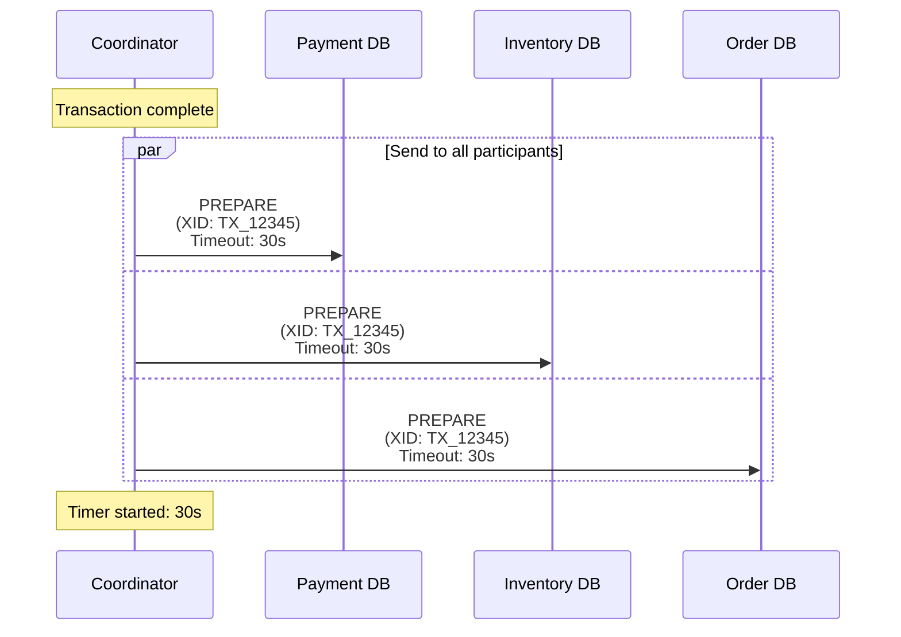
```mermaid
sequenceDiagram
    participant C as Coordinator
    participant P1 as Payment DB
    participant P2 as Inventory DB
    participant P3 as Order DB
    
    Note over C: Transaction complete
    par Send to all participants
        C->>P1: PREPARE<br/>(XID: TX_12345)<br/>Timeout: 30s
    and
        C->>P2: PREPARE<br/>(XID: TX_12345)<br/>Timeout: 30s
    and
        C->>P3: PREPARE<br/>(XID: TX_12345)<br/>Timeout: 30s
    end
    
    Note over C: Timer started: 30s
```

#### Step 2: Participants Process the Prepare Request
When a participant receives the PREPARE message, it must decide if it can commit. This is a critical decision-making moment that typically takes 1-100ms depending on the complexity of the transaction.

**What each participant does (in order):**

1. **Validate the Transaction**: Check if all operations executed successfully
   - Were there any SQL errors during the transaction?
   - Were all constraints (primary keys, foreign keys, unique constraints) satisfied?
   - Did the operations complete without exceptions?
   - Is the data in a consistent state?

2. **Write to Write-Ahead Log (WAL)**: Record that this transaction is in "prepared" state
   - This is written to disk **before** anything else (force-write to stable storage)
   - This is the most critical step for durability
   - If the participant crashes after this, it can recover by reading this log
   - The log entry includes: transaction ID, vote, timestamp, and recovery information
   - The write must be flushed to disk (fsync) before voting
   - This typically takes 5-20ms depending on disk speed

3. **Acquire and Hold Locks**: Ensure no other transactions can modify the same data
   - Row locks for specific rows that were modified
   - Table locks if needed for certain operations
   - Index locks to prevent concurrent index modifications
   - These locks will be held until the final commit/abort decision is received
   - This prevents other transactions from seeing inconsistent state
   - Lock contention can occur if many transactions touch the same data

4. **Prepare to Commit**: Get ready to make the changes permanent
   - All changes are staged in memory and ready to be written
   - The participant is now "committed to committing" if asked
   - Undo information is logged in case rollback is needed
   - Redo information is logged in case commit is needed

**Detailed Example - Payment DB Processing PREPARE:**
```sql
-- Payment DB receives PREPARE for transaction TX_12345

-- Step 1: Validate
-- Check that the debit operation succeeded
-- Check that balance >= 100 (sufficient funds)
-- Check that user account is active
-- All validations pass ✓

-- Step 2: Write to WAL (force to disk)
WAL_ENTRY: {
  transaction_id: "TX_12345",
  state: "PREPARED",
  vote: "YES",
  timestamp: "2024-05-20T10:30:00.100Z",
  changes: [
    {table: "accounts", row_id: 123, operation: "UPDATE", old_balance: 1000, new_balance: 900}
  ],
  undo_info: {...},
  redo_info: {...}
}
-- fsync() called to ensure WAL is on disk ✓

-- Step 3: Acquire locks
LOCK: accounts table, row 123 (exclusive lock)
-- Lock acquired successfully ✓

-- Step 4: Prepare to commit
-- Changes staged in memory buffer
-- Ready to commit if coordinator asks ✓

-- Total processing time: ~15ms
```

**What if validation fails?**
If any check fails, the participant:
- Writes a "PREPARED" entry to WAL with vote "NO"
- Releases any locks it might have acquired
- Immediately sends a NO vote to the coordinator
- Does not hold any resources
- Can immediately clean up transaction state

**Performance Impact:**
- The WAL write (fsync) is the most expensive operation
- Lock acquisition can block other transactions
- Multiple participants voting YES can create significant lock contention
- This is why 2PC has performance overhead compared to single-database transactions

#### Step 3: Participants Vote
After processing the prepare request, each participant sends its vote back to the coordinator. The vote is a critical message that determines the fate of the entire transaction.

**Vote Message Structure:**
```json
{
  "messageType": "VOTE",
  "xid": "TX_20240520_12345",
  "vote": "YES",  // or "NO"
  "participantId": "payment-db:5432",
  "reason": null,  // Only populated if vote is NO
  "timestamp": "2024-05-20T10:30:00.115Z"
}
```

**Vote YES (Commit) if:**
- All operations executed successfully
- Write-ahead log was written successfully (fsync completed)
- All necessary locks were acquired
- No constraints were violated
- The participant is healthy and operational
- Sufficient resources are available

**Vote NO (Abort) if:**
- Any operation failed during the transaction
- Write-ahead log couldn't be written (disk error, space full)
- Required locks couldn't be acquired (lock timeout, deadlock)
- A constraint would be violated
- The participant is overloaded or unhealthy
- Timeout occurred during prepare processing
- Insufficient resources (memory, disk space)

**Example NO Vote with Reason:**
```json
{
  "messageType": "VOTE",
  "xid": "TX_20240520_12345",
  "vote": "NO",
  "participantId": "inventory-db:5432",
  "reason": "Insufficient inventory: product_id=456, requested=5, available=3",
  "timestamp": "2024-05-20T10:30:00.120Z"
}
```

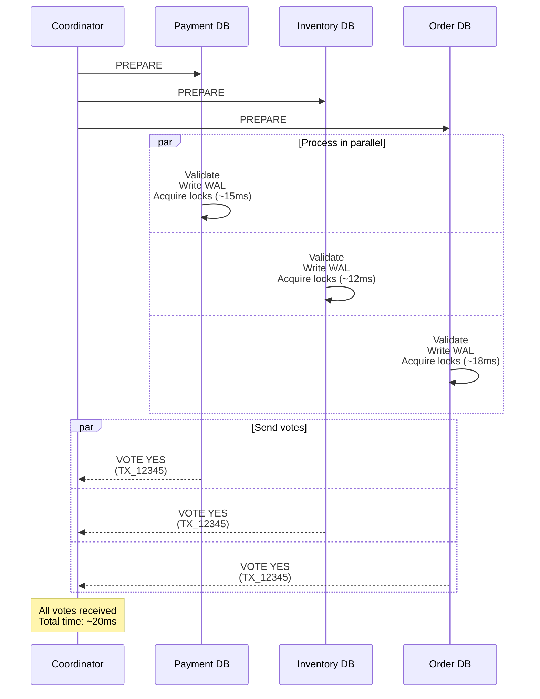
```mermaid
sequenceDiagram
    participant C as Coordinator
    participant P1 as Payment DB
    participant P2 as Inventory DB
    participant P3 as Order DB
    
    C->>P1: PREPARE
    C->>P2: PREPARE
    C->>P3: PREPARE
    
    par Process in parallel
        P1->>P1: Validate<br/>Write WAL<br/>Acquire locks (~15ms)
    and
        P2->>P2: Validate<br/>Write WAL<br/>Acquire locks (~12ms)
    and
        P3->>P3: Validate<br/>Write WAL<br/>Acquire locks (~18ms)
    end
    
    par Send votes
        P1-->>C: VOTE YES<br/>(TX_12345)
    and
        P2-->>C: VOTE YES<br/>(TX_12345)
    and
        P3-->>C: VOTE YES<br/>(TX_12345)
    end
    
    Note over C: All votes received<br/>Total time: ~20ms
```

**Critical Promise - The YES Vote Commitment:**
Once a participant votes YES, it has made an irrevocable promise. It must commit if the coordinator asks it to. It cannot change its mind later, even if:
- Its state changes after voting
- It discovers new problems
- Resources become scarce
- The coordinator takes a long time to respond

This is why participants only vote YES if they're absolutely certain they can commit. The YES vote is a binding contract.

**What Happens After Voting:**

**If participant voted YES:**
- Holds all locks indefinitely until coordinator decision
- Keeps transaction in "prepared" state
- Periodically checks if coordinator is still alive (heartbeat)
- Cannot process other transactions that conflict with held locks
- Can crash and recover (using WAL) to complete the transaction

**If participant voted NO:**
- Immediately releases all locks
- Cleans up transaction state
- Marks transaction as aborted in WAL
- Can immediately accept new transactions
- No further involvement in this transaction

**Read-Only Optimization:**
If a participant only performed read operations (no writes), it can:
- Immediately vote YES
- Commit locally without waiting for the final decision
- Release locks immediately
- Send an acknowledgement to the coordinator
- This optimization significantly speeds up read-only transactions

**Coordinator's Vote Collection:**
The coordinator maintains a vote collection table:
```
Transaction: TX_12345
Votes Received:
  - Payment DB: YES (received at 10:30:00.115Z)
  - Inventory DB: YES (received at 10:30:00.112Z)
  - Order DB: YES (received at 10:30:00.118Z)
Total: 3/3 votes received
Decision: COMMIT
```

**Timeout Handling:**
If the coordinator's timer expires before receiving all votes:
- Transaction is automatically aborted
- Participants that voted YES are sent ROLLBACK
- Participants that haven't voted are assumed to have voted NO
- This prevents indefinite blocking
- Typical timeout values: 30-60 seconds

---

### Phase 2: Commit Phase (Completion Phase)
After collecting all votes, the coordinator makes the final decision and notifies all participants. This is where the transaction is either completed or aborted.

#### Step 1: Coordinator Makes the Decision
The coordinator examines all the votes it received and makes the final commit or abort decision. This decision is irreversible once written to the coordinator's log.

**Decision Logic:**

**Decision to COMMIT if:**
- ALL participants voted YES
- No participants timed out
- The coordinator itself is ready to commit
- The coordinator's own resources are available

**Decision to ABORT if:**
- ANY participant voted NO
- ANY participant timed out
- The coordinator encountered an error
- The coordinator's resources are unavailable
- Network partition prevents communication with any participant

**The Decision Rule - Unanimous Consent:**
The protocol uses unanimous consent. Even a single NO vote causes the entire transaction to abort. This ensures consistency - either everyone commits together, or everyone aborts together. There is no "majority vote" or "partial commit" in standard 2PC.

**Coordinator's Internal State Machine:**
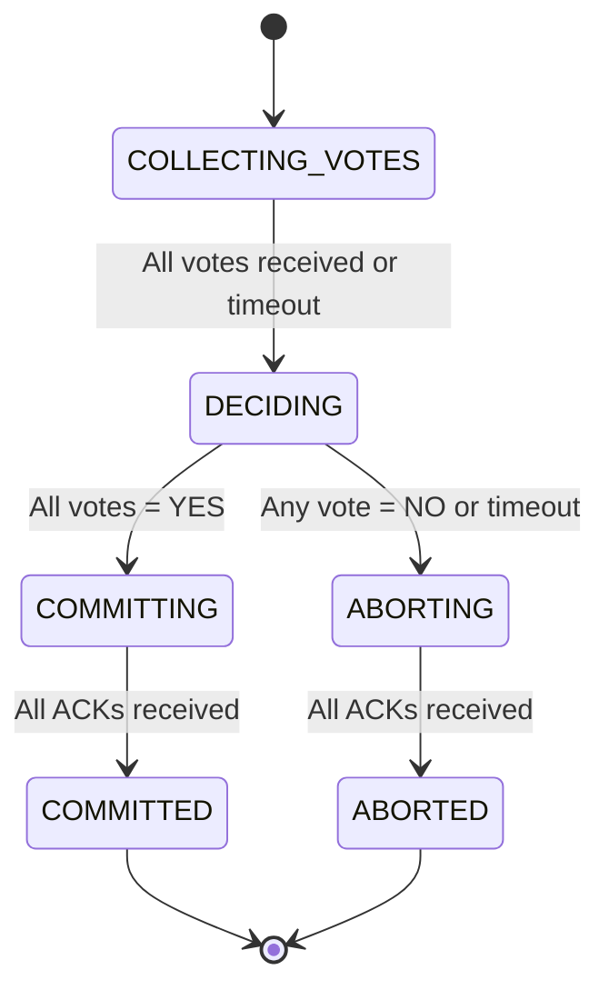
```mermaid
stateDiagram-v2
    [*] --> COLLECTING_VOTES
    COLLECTING_VOTES --> DECIDING: All votes received or timeout
    DECIDING --> COMMITTING: All votes = YES
    DECIDING --> ABORTING: Any vote = NO or timeout
    COMMITTING --> COMMITTED: All ACKs received
    ABORTING --> ABORTED: All ACKs received
    COMMITTED --> [*]
    ABORTED --> [*]
```

**Decision-Making Process:**
```
Time: 10:30:00.120Z
Transaction: TX_12345

Vote Collection:
┌─────────────────┬──────────┬──────────────────────┐
│ Participant     │ Vote     │ Received At          │
├─────────────────┼──────────┼──────────────────────┤
│ Payment DB      │ YES      │ 10:30:00.115Z        │
│ Inventory DB    │ YES      │ 10:30:00.112Z        │
│ Order DB        │ YES      │ 10:30:00.118Z        │
└─────────────────┴──────────┴──────────────────────┘

Analysis:
- Total participants: 3
- Votes received: 3
- YES votes: 3
- NO votes: 0
- Timeouts: 0

Decision: COMMIT
Reason: All participants voted YES
```

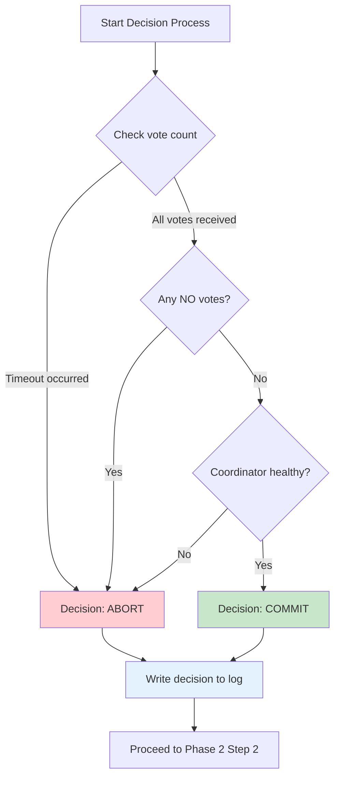
```mermaid
flowchart TD
    A[Start Decision Process] --> B{Check vote count}
    B -->|All votes received| C{Any NO votes?}
    B -->|Timeout occurred| D[Decision: ABORT]
    C -->|Yes| D
    C -->|No| E{Coordinator healthy?}
    E -->|No| D
    E -->|Yes| F[Decision: COMMIT]
    D --> G[Write decision to log]
    F --> G
    G --> H[Proceed to Phase 2 Step 2]
    
    style D fill:#ffcdd2
    style F fill:#c8e6c9
    style G fill:#e3f2fd
```

**Writing the Decision to Log:**
Before sending the decision to participants, the coordinator must write it to its own transaction log. This is crucial for recovery if the coordinator crashes after sending the decision but before receiving acknowledgements.

**Coordinator's Log Entry (Before Sending Decision):**
```
=== TRANSACTION LOG ENTRY ===
Transaction ID: TX_12345
State: PREPARED → COMMITTING
Timestamp: 2024-05-20T10:30:00.120Z
Decision: COMMIT
Votes:
  - payment-db:5432: YES (10:30:00.115Z)
  - inventory-db:5432: YES (10:30:00.112Z)
  - order-db:5432: YES (10:30:00.118Z)
Participants: 3
Coordinator: tm-server-01:8080
================================
```

**Why Write to Log First?**
- If coordinator crashes after writing log but before sending decision: On restart, it sees COMMITTING and resends COMMIT to all participants
- If coordinator crashes before writing log: On restart, it sees PREPARED and can safely decide to COMMIT or ABORT (implementation dependent)
- This ensures the coordinator never "forgets" its decision

**Edge Cases in Decision Making:**

**Case 1: Single Participant Times Out**
```
Votes: Payment=YES, Inventory=YES, Order=(timeout after 30s)
Decision: ABORT
Reason: Timeout counts as a NO vote
Action: Send ROLLBACK to Payment and Inventory (who voted YES)
```

**Case 2: Coordinator Resource Exhaustion**
```
Votes: All YES
Decision: ABORT
Reason: Coordinator cannot proceed (out of memory, disk full)
Action: Send ROLLBACK to all participants
Note: Coordinator cannot commit if it can't complete its own logging
```

**Case 3: Network Partition During Voting**
```
Votes: Payment=YES, Inventory=YES, Order=(unreachable)
Decision: ABORT
Reason: Not all votes received, timeout
Action: Send ROLLBACK to Payment and Inventory
Note: Order DB will timeout and rollback on its own
```

**Performance Considerations:**
- Decision making is fast (typically < 1ms)
- The log write is the expensive part (5-20ms for fsync)
- Some implementations use group commit to batch multiple decisions
- The decision must be made before the vote collection timeout expires

#### Step 2: Coordinator Sends Decision Message
The coordinator sends the decision to all participants. Like the PREPARE phase, this is typically done in parallel to minimize latency.

**Decision Message Structure:**
```json
{
  "messageType": "COMMIT",  // or "ROLLBACK"
  "xid": "TX_20240520_12345",
  "coordinatorId": "tm-server-01:8080",
  "decision": "COMMIT",
  "timestamp": "2024-05-20T10:30:00.125Z"
}
```

**For COMMIT Decision:**
- Send `COMMIT` message to all participants (including those that voted YES)
- Send `ROLLBACK` message to any participants that voted NO (to ensure they clean up)
- Start a new timeout for acknowledgements
- Typically 30-60 seconds for ACK timeout

**For ROLLBACK Decision:**
- Send `ROLLBACK` message to all participants (even those that voted YES)
- This is critical - participants that voted YES must rollback
- Participants that voted NO have already rolled back, but send ROLLBACK anyway for completeness
- Start a new timeout for acknowledgements

**Parallel Sending:**
The coordinator sends decision messages to all participants simultaneously to minimize total latency:
```
Time: 10:30:00.125Z
Coordinator sends to all in parallel:
  → payment-db:5432: COMMIT (TX_12345)
  → inventory-db:5432: COMMIT (TX_12345)
  → order-db:5432: COMMIT (TX_12345)

Expected ACKs by: 10:30:30.125Z (30s timeout)
```

**Retry Logic:**
If a participant doesn't acknowledge within the timeout:
- Coordinator retries sending the decision
- Typically 3-5 retry attempts
- If all retries fail, the transaction is marked as "in-doubt"
- Recovery process will handle it later
- This is part of the blocking problem - coordinator must keep trying

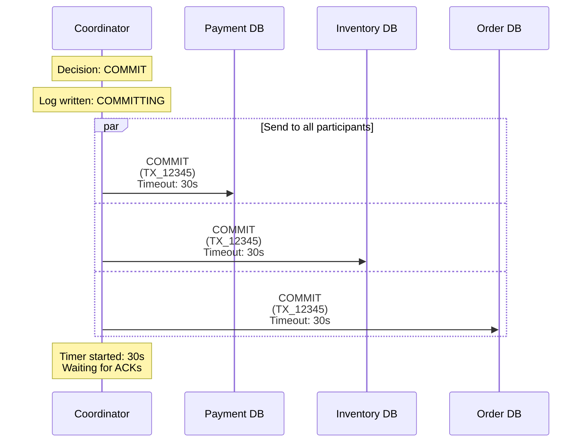
```mermaid
sequenceDiagram
    participant C as Coordinator
    participant P1 as Payment DB
    participant P2 as Inventory DB
    participant P3 as Order DB
    
    Note over C: Decision: COMMIT
    Note over C: Log written: COMMITTING
    
    par Send to all participants
        C->>P1: COMMIT<br/>(TX_12345)<br/>Timeout: 30s
    and
        C->>P2: COMMIT<br/>(TX_12345)<br/>Timeout: 30s
    and
        C->>P3: COMMIT<br/>(TX_12345)<br/>Timeout: 30s
    end
    
    Note over C: Timer started: 30s<br/>Waiting for ACKs
```

**What if Coordinator Crashes After Sending Decision?**
- If coordinator wrote "COMMITTING" to log before crashing:
  - On restart, it reads log and resends COMMIT to all participants
  - Participants that already committed will ACK again (idempotent)
  - Participants that haven't committed will now commit
- If coordinator crashed before writing "COMMITTING":
  - On restart, it sees "PREPARED" state
  - Can decide to COMMIT or ABORT (implementation dependent)
  - Most implementations default to ABORT for safety

**Message Ordering Guarantees:**
- Coordinator ensures all participants receive the same decision
- No participant receives COMMIT while another receives ROLLBACK
- This is guaranteed by the coordinator's log and state machine
- Network reordering doesn't matter - the decision is idempotent

#### Step 3: Participants Execute the Decision
Each participant receives the decision message and acts accordingly. This is the final step where the transaction is either completed or aborted at the participant level.

**On COMMIT - Detailed Execution:**

When a participant receives a COMMIT message:

1. **Write COMMITTED to WAL** (1-5ms)
   - Update the write-ahead log entry from "PREPARED" to "COMMITTED"
   - This log entry is crucial for recovery
   - If the participant crashes after this, it knows the transaction committed
   - The log entry is flushed to disk (fsync) ← This is the durability point

2. **Make Changes Permanent** (can be asynchronous)
   - Write all staged changes to the database files
   - Update indexes affected by the transaction
   - This happens asynchronously in the background via checkpoint/flush threads
   - Not required for ACK - WAL ensures durability even if data files aren't flushed yet

3. **Release All Locks** (instant)
   - Release row locks on all modified rows
   - Release table locks if any were held
   - Release index locks
   - Allow other transactions to access the modified data
   - This reduces lock contention and improves concurrency

4. **Send ACK to Coordinator** (1-10ms network latency)
   - Send acknowledgement message to coordinator
   - Include transaction ID and participant ID
   - Confirm that the participant has committed
   - The ACK message is typically small and fast

**Detailed COMMIT Example - Payment DB:**
```sql
-- Payment DB receives COMMIT for TX_12345 at 10:30:00.130Z

-- Step 1: Update WAL (durability point)
WAL_UPDATE: {
  transaction_id: "TX_12345",
  old_state: "PREPARED",
  new_state: "COMMITTED",
  timestamp: "2024-05-20T10:30:00.133Z"
}
fsync();  -- Flush WAL to disk (3ms) ← ACK sent after this

-- Step 2: Make changes permanent (asynchronous)
BEGIN INTERNAL COMMIT;
  UPDATE accounts SET balance = 900 WHERE user_id = 123;
  -- Balance change staged in buffer pool
  -- Indexes updated in memory
  -- Will be flushed to .ibd file by background thread later
COMMIT;

-- Step 3: Release locks
RELEASE LOCK accounts.user_id = 123;
-- Lock released immediately

-- Step 4: Send ACK
SEND TO coordinator: {
  messageType: "ACK",
  xid: "TX_12345",
  participantId: "payment-db:5432",
  result: "COMMITTED",
  timestamp: "2024-05-20T10:30:00.136Z"
}

-- Total commit time (critical path): ~6ms
-- Data file flush happens asynchronously in background
```

**On ROLLBACK - Detailed Execution:**

When a participant receives a ROLLBACK message:

1. **Undo All Changes** (5-50ms depending on transaction size)
   - Use the undo log to reverse all changes
   - Restore original values for all modified rows
   - Update indexes to reflect the reversal
   - This is essentially running the transaction in reverse

2. **Write ROLLED_BACK to WAL** (1-5ms)
   - Update the write-ahead log entry from "PREPARED" to "ROLLED_BACK"
   - This log entry confirms the transaction was aborted
   - If the participant crashes after this, it knows the transaction rolled back
   - The log entry is flushed to disk (fsync) ← This is the durability point

3. **Release All Locks** (instant)
   - Release all locks held during the transaction
   - Other transactions can now access the data
   - No lock contention remains

4. **Send ACK to Coordinator** (1-10ms network latency)
   - Send acknowledgement message to coordinator
   - Confirm that the participant has rolled back
   - Include transaction ID and participant ID

**Detailed ROLLBACK Example - Payment DB:**
```sql
-- Payment DB receives ROLLBACK for TX_12345 at 10:30:00.130Z

-- Step 1: Undo changes using undo log
BEGIN INTERNAL ROLLBACK;
  -- From undo log: old_balance = 1000, new_balance = 900
  UPDATE accounts SET balance = 1000 WHERE user_id = 123;
  -- Restore original value in buffer pool
  -- Update indexes in memory
ROLLBACK;

-- Step 2: Update WAL (durability point)
WAL_UPDATE: {
  transaction_id: "TX_12345",
  old_state: "PREPARED",
  new_state: "ROLLED_BACK",
  timestamp: "2024-05-20T10:30:00.142Z"
}
fsync();  -- Flush WAL to disk (3ms) ← ACK sent after this

-- Step 3: Release locks
RELEASE LOCK accounts.user_id = 123;
-- Lock released immediately

-- Step 4: Send ACK
SEND TO coordinator: {
  messageType: "ACK",
  xid: "TX_12345",
  participantId: "payment-db:5432",
  result: "ROLLED_BACK",
  timestamp: "2024-05-20T10:30:00.145Z"
}

-- Total rollback time: ~15ms
```

**ACK Message Structure:**
```json
{
  "messageType": "ACK",
  "xid": "TX_20240520_12345",
  "participantId": "payment-db:5432",
  "result": "COMMITTED",  // or "ROLLED_BACK"
  "timestamp": "2024-05-20T10:30:00.148Z"
}
```

**Idempotency - Handling Duplicate Decision Messages:**
If a participant receives the same decision message twice:
- It checks its WAL to see if it already processed this transaction
- If already COMMITTED: It sends ACK again (no-op)
- If already ROLLED_BACK: It sends ACK again (no-op)
- If still PREPARED: It processes the decision normally
- This ensures the protocol works even with network duplicates

**What if Participant Crashes During Commit/Rollback?**
- If participant crashes after writing COMMITTED to WAL: On restart, it sees COMMITTED and knows transaction succeeded
- If participant crashes before writing COMMITTED: On restart, it sees PREPARED and must contact coordinator to learn the decision
- If participant crashes during undo (rollback): On restart, it sees PREPARED and re-executes rollback
- The WAL ensures no data is lost or corrupted

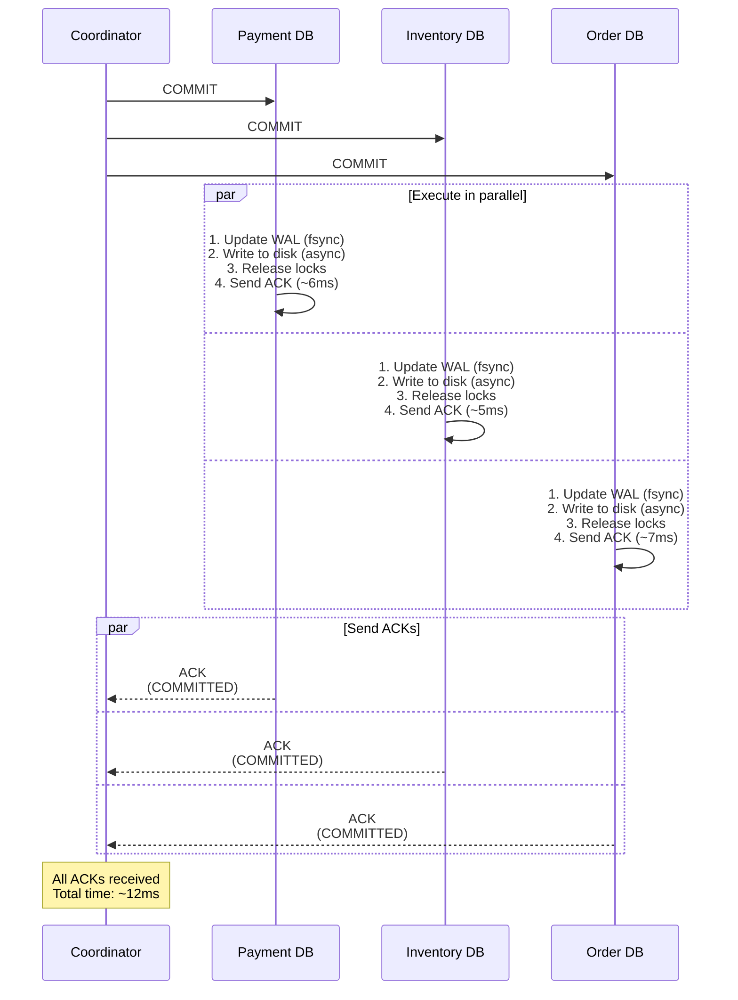
```mermaid
sequenceDiagram
    participant C as Coordinator
    participant P1 as Payment DB
    participant P2 as Inventory DB
    participant P3 as Order DB

    C->>P1: COMMIT
    C->>P2: COMMIT
    C->>P3: COMMIT

    par Execute in parallel
        P1->>P1: 1. Update WAL (fsync)<br/>2. Write to disk (async)<br/>3. Release locks<br/>4. Send ACK (~6ms)
    and
        P2->>P2: 1. Update WAL (fsync)<br/>2. Write to disk (async)<br/>3. Release locks<br/>4. Send ACK (~5ms)
    and
        P3->>P3: 1. Update WAL (fsync)<br/>2. Write to disk (async)<br/>3. Release locks<br/>4. Send ACK (~7ms)
    end

    par Send ACKs
        P1-->>C: ACK<br/>(COMMITTED)
    and
        P2-->>C: ACK<br/>(COMMITTED)
    and
        P3-->>C: ACK<br/>(COMMITTED)
    end

    Note over C: All ACKs received<br/>Total time: ~12ms
```

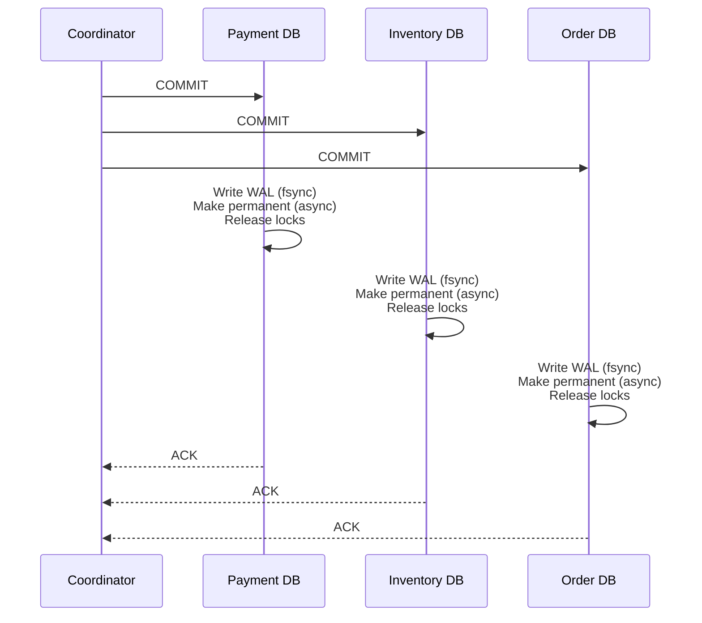
```mermaid
sequenceDiagram
    participant C as Coordinator
    participant P1 as Payment DB
    participant P2 as Inventory DB
    participant P3 as Order DB

    C->>P1: COMMIT
    C->>P2: COMMIT
    C->>P3: COMMIT

    P1->>P1: Write WAL (fsync)<br/>Make permanent (async)<br/>Release locks
    P2->>P2: Write WAL (fsync)<br/>Make permanent (async)<br/>Release locks
    P3->>P3: Write WAL (fsync)<br/>Make permanent (async)<br/>Release locks

    P1-->>C: ACK
    P2-->>C: ACK
    P3-->>C: ACK
```

#### Step 4: Coordinator Completes the Transaction
Once the coordinator receives acknowledgements from all participants, it performs final cleanup and completes the transaction lifecycle.

**Completion Steps:**

1. **Verify All ACKs Received**
   - Check that all expected participants have sent acknowledgements
   - Verify that all ACKs match the expected decision (all COMMITTED or all ROLLED_BACK)
   - If any ACK is missing or mismatched, initiate recovery procedures
   - This ensures consistency across all participants

2. **Write Final State to Log** (5-20ms for fsync)
   - Update the coordinator's transaction log from "COMMITTING" to "COMMITTED"
   - Or from "ABORTING" to "ABORTED"
   - This is the final log entry that marks the transaction as complete
   - Must be flushed to disk (fsync) for durability
   - After this point, the transaction is considered complete even if coordinator crashes

3. **Notify the Application** (instant to 1ms)
   - Return success/failure to the application that initiated the transaction
   - For successful transactions: Return control to application with success indication
   - For failed transactions: Throw an exception or return error code
   - The application can now proceed with next steps or handle the error

4. **Release Coordinator Resources** (instant)
   - Free memory used for tracking this transaction
   - Release any network connections held for this transaction
   - Clean up internal data structures
   - Remove transaction from active transaction list

5. **Garbage Collection** (background)
   - Archive old transaction log entries
   - Clean up temporary files
   - This is typically done asynchronously by a background process

**Detailed Completion Example:**
```
Time: 10:30:00.155Z
Transaction: TX_12345

ACK Collection:
┌─────────────────┬──────────┬──────────────────────┐
│ Participant     │ Result   │ Received At          │
├─────────────────┼──────────┼──────────────────────┤
│ Payment DB      │ COMMITTED│ 10:30:00.148Z        │
│ Inventory DB    │ COMMITTED│ 10:30:00.145Z        │
│ Order DB        │ COMMITTED│ 10:30:00.150Z        │
└─────────────────┴──────────┴──────────────────────┘

Verification:
- Total participants: 3
- ACKs received: 3
- All results: COMMITTED
- Verification: PASSED

Action: Complete transaction
```

**Coordinator's Final Log Entry:**
```
=== TRANSACTION LOG ENTRY ===
Transaction ID: TX_12345
State: COMMITTING → COMMITTED
Timestamp: 2024-05-20T10:30:00.155Z
Decision: COMMIT
Final Result: COMMITTED
ACKs:
  - payment-db:5432: COMMITTED (10:30:00.148Z)
  - inventory-db:5432: COMMITTED (10:30:00.145Z)
  - order-db:5432: COMMITTED (10:30:00.150Z)
Duration: 155ms (from start)
Participants: 3
Coordinator: tm-server-01:8080
================================
```

**Application Notification:**
```java
// Application code
@Transactional
public void processOrder(OrderRequest request) {
    paymentRepository.debit(request.getUserId(), request.getAmount());
    inventoryRepository.reserve(request.getProductId(), request.getQuantity());
    orderRepository.create(request);
    // Method ends here
}

// Transaction manager:
// 1. Completes 2PC protocol
// 2. Writes COMMITTED to log
// 3. Returns control to application (no exception thrown)
// Application continues execution
```

**Error Notification:**
```java
@Transactional
public void processOrder(OrderRequest request) {
    try {
        paymentRepository.debit(request.getUserId(), request.getAmount());
        inventoryRepository.reserve(request.getProductId(), request.getQuantity());
        orderRepository.create(request);
    } catch (TransactionException e) {
        // Transaction manager throws exception after 2PC abort
        // Application can handle the error
        log.error("Transaction failed", e);
        throw e;
    }
}
```

**Edge Cases in Completion:**

**Case 1: Mismatched ACKs**
```
Expected: All COMMITTED
Received: Payment=COMMITTED, Inventory=COMMITTED, Order=ROLLED_BACK
Action: This is a critical error - protocol violation
Recovery: Log the error, mark transaction as "INCONSISTENT", trigger manual intervention
Note: This should never happen in a correct implementation
```

**Case 2: Missing ACK**
```
Expected: 3 ACKs
Received: 2 ACKs (Payment, Inventory)
Missing: Order DB
Action: Retry sending COMMIT to Order DB
If retries fail: Mark transaction as "IN-DOUT", recovery process will handle it later
Note: This is part of the blocking problem
```

**Case 3: Coordinator Crash Before Final Log Write**
```
State: All ACKs received, but coordinator crashes before writing COMMITTED
On restart: Coordinator reads log, sees "COMMITTING" state
Action: Resend COMMIT to all participants, wait for ACKs, then write COMMITTED
Result: Transaction still completes correctly
```

**Performance Impact of Completion:**
- Verification is fast (< 1ms)
- Final log write is the expensive part (5-20ms for fsync)
- Application notification is instant
- Resource cleanup is instant
- Total completion time: ~10-25ms

**Transaction Timeline Summary:**
```
Phase 0: Transaction Initiation
  - Connect to databases: ~5ms
  - Begin transaction: ~1ms
  - Execute operations: ~50-500ms (depends on business logic)
  Total Phase 0: ~56-506ms

Phase 1: Prepare/Voting
  - Send PREPARE to all: ~5-20ms (network latency)
  - Participants process: ~15ms each (parallel)
  - Collect votes: ~5-20ms (network latency)
  Total Phase 1: ~25-55ms

Phase 2: Commit/Completion
  - Make decision: <1ms
  - Write decision to log: ~10ms
  - Send COMMIT to all: ~5-20ms (network latency)
  - Participants commit: ~18ms each (parallel)
  - Collect ACKs: ~5-20ms (network latency)
  - Write final state to log: ~10ms
  Total Phase 2: ~54-99ms

Total Transaction Time: ~135-660ms
Additional overhead beyond single-DB transaction: ~80-160ms
```

---

### Summary of the Three Phases
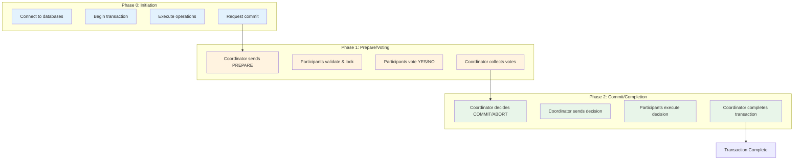
```mermaid
graph TD
    subgraph "Phase 0: Initiation"
        A1[Connect to databases]
        A2[Begin transaction]
        A3[Execute operations]
        A4[Request commit]
    end
    
    subgraph "Phase 1: Prepare/Voting"
        B1[Coordinator sends PREPARE]
        B2[Participants validate & lock]
        B3[Participants vote YES/NO]
        B4[Coordinator collects votes]
    end
    
    subgraph "Phase 2: Commit/Completion"
        C1[Coordinator decides COMMIT/ABORT]
        C2[Coordinator sends decision]
        C3[Participants execute decision]
        C4[Coordinator completes transaction]
    end
    
    A4 --> B1
    B4 --> C1
    C4 --> D[Transaction Complete]
    
    style A1 fill:#e3f2fd
    style A2 fill:#e3f2fd
    style A3 fill:#e3f2fd
    style A4 fill:#e3f2fd
    style B1 fill:#fff3e0
    style B2 fill:#fff3e0
    style B3 fill:#fff3e0
    style B4 fill:#fff3e0
    style C1 fill:#e8f5e9
    style C2 fill:#e8f5e9
    style C3 fill:#e8f5e9
    style C4 fill:#e8f5e9
```

**Key Takeaways:**
- Phase 0 is about setup and execution - getting everything ready
- Phase 1 is about agreement - ensuring everyone can commit
- Phase 2 is about completion - making it happen or rolling back
- The coordinator orchestrates everything
- Participants promise to commit if they vote YES
- Logs ensure recovery if anything fails
- Unanimous consent is required for commit

---

## Detailed Flow Diagrams
### Successful Commit Flow
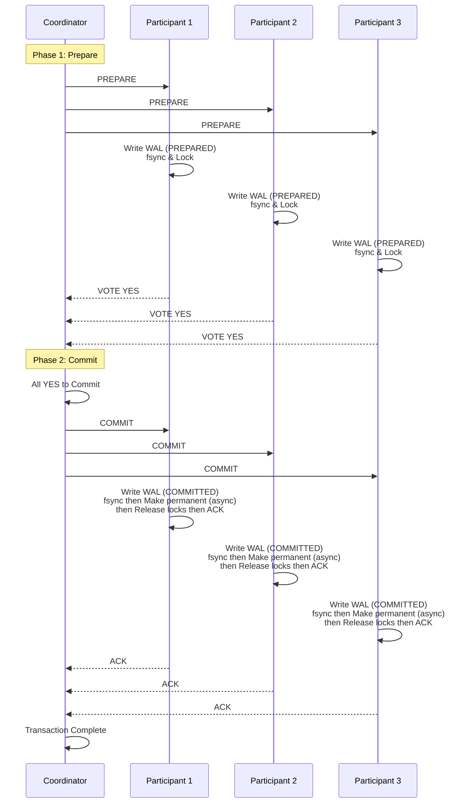
```mermaid
sequenceDiagram
    participant C as Coordinator
    participant P1 as Participant 1
    participant P2 as Participant 2
    participant P3 as Participant 3

    Note over C: Phase 1: Prepare
    C->>P1: PREPARE
    C->>P2: PREPARE
    C->>P3: PREPARE

    P1->>P1: Write WAL (PREPARED)<br/>fsync & Lock
    P2->>P2: Write WAL (PREPARED)<br/>fsync & Lock
    P3->>P3: Write WAL (PREPARED)<br/>fsync & Lock

    P1-->>C: VOTE YES
    P2-->>C: VOTE YES
    P3-->>C: VOTE YES

    Note over C: Phase 2: Commit
    C->>C: All YES to Commit
    C->>P1: COMMIT
    C->>P2: COMMIT
    C->>P3: COMMIT

    P1->>P1: Write WAL (COMMITTED)<br/>fsync then Make permanent (async)<br/>then Release locks then ACK
    P2->>P2: Write WAL (COMMITTED)<br/>fsync then Make permanent (async)<br/>then Release locks then ACK
    P3->>P3: Write WAL (COMMITTED)<br/>fsync then Make permanent (async)<br/>then Release locks then ACK

    P1-->>C: ACK
    P2-->>C: ACK
    P3-->>C: ACK

    C->>C: Transaction Complete
```

### Abort Flow
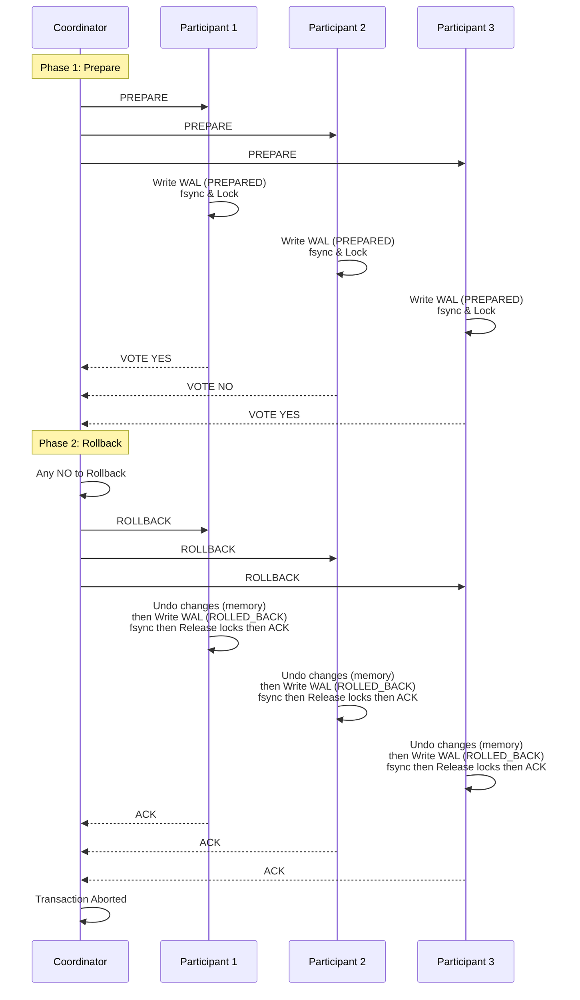
```mermaid
sequenceDiagram
    participant C as Coordinator
    participant P1 as Participant 1
    participant P2 as Participant 2
    participant P3 as Participant 3

    Note over C: Phase 1: Prepare
    C->>P1: PREPARE
    C->>P2: PREPARE
    C->>P3: PREPARE

    P1->>P1: Write WAL (PREPARED)<br/>fsync & Lock
    P2->>P2: Write WAL (PREPARED)<br/>fsync & Lock
    P3->>P3: Write WAL (PREPARED)<br/>fsync & Lock

    P1-->>C: VOTE YES
    P2-->>C: VOTE NO
    P3-->>C: VOTE YES

    Note over C: Phase 2: Rollback
    C->>C: Any NO to Rollback
    C->>P1: ROLLBACK
    C->>P2: ROLLBACK
    C->>P3: ROLLBACK

    P1->>P1: Undo changes (memory)<br/>then Write WAL (ROLLED_BACK)<br/>fsync then Release locks then ACK
    P2->>P2: Undo changes (memory)<br/>then Write WAL (ROLLED_BACK)<br/>fsync then Release locks then ACK
    P3->>P3: Undo changes (memory)<br/>then Write WAL (ROLLED_BACK)<br/>fsync then Release locks then ACK

    P1-->>C: ACK
    P2-->>C: ACK
    P3-->>C: ACK

    C->>C: Transaction Aborted
```

### Coordinator's Log States
The coordinator maintains a transaction log that tracks the state of each distributed transaction:

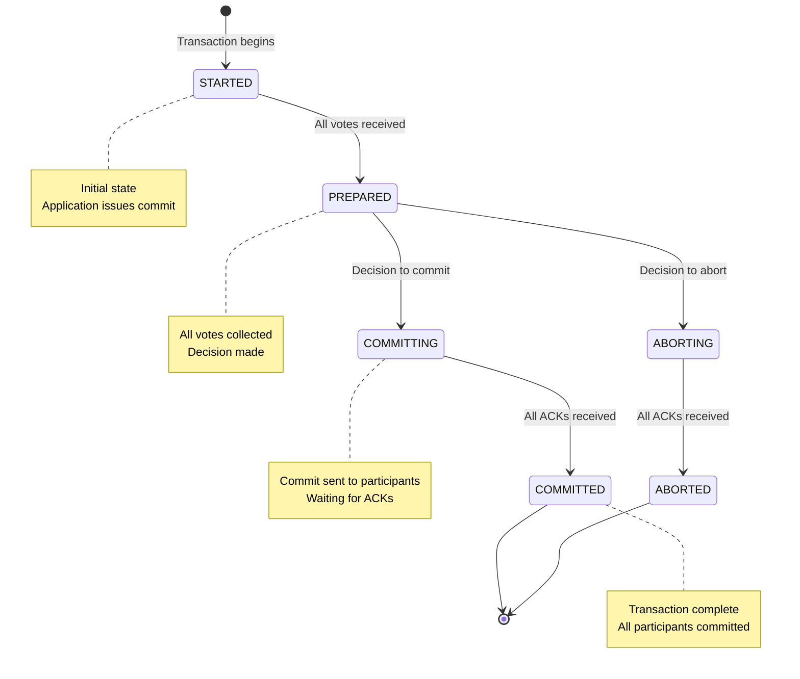
```mermaid
stateDiagram-v2
    [*] --> STARTED: Transaction begins
    STARTED --> PREPARED: All votes received
    PREPARED --> COMMITTING: Decision to commit
    PREPARED --> ABORTING: Decision to abort
    COMMITTING --> COMMITTED: All ACKs received
    ABORTING --> ABORTED: All ACKs received
    COMMITTED --> [*]
    ABORTED --> [*]
    
    note right of STARTED
        Initial state
        Application issues commit
    end note
    
    note right of PREPARED
        All votes collected
        Decision made
    end note
    
    note right of COMMITTING
        Commit sent to participants
        Waiting for ACKs
    end note
    
    note right of COMMITTED
        Transaction complete
        All participants committed
    end note
```

The coordinator's log is the source of truth for recovery. If the coordinator crashes, it reads this log on restart:
- If it logged `COMMITTING`, it resends `COMMIT` to all participants
- If it only logged `PREPARED`, it can either commit or abort (implementation dependent)
- If it logged nothing, it sends `ROLLBACK`

---

## Failure Scenarios and Recovery
2PC must handle several failure scenarios. Let's walk through each one in detail.

### Scenario 1: Participant Fails Before Voting
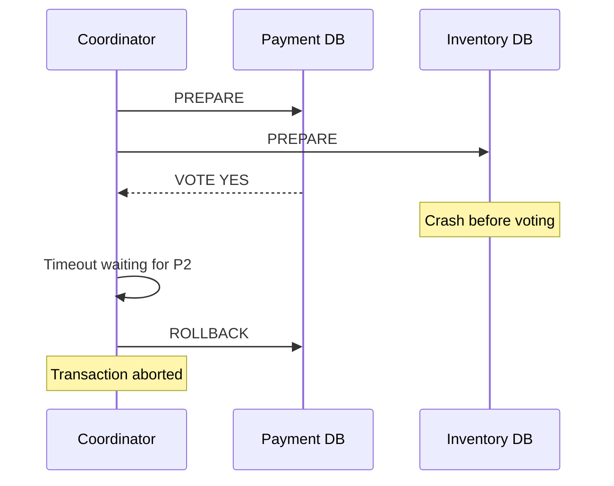
```mermaid
sequenceDiagram
    participant C as Coordinator
    participant P1 as Payment DB
    participant P2 as Inventory DB
    
    C->>P1: PREPARE
    C->>P2: PREPARE
    
    P1-->>C: VOTE YES
    Note over P2: Crash before voting
    
    C->>C: Timeout waiting for P2
    C->>P1: ROLLBACK
    
    Note over C: Transaction aborted
```

**What happens**: The coordinator times out waiting for a vote from P2. Since not all participants voted YES, it sends ROLLBACK to P1 (which voted YES).

**Recovery**: When the failed participant (P2) comes back online, it has no record of this transaction (it crashed before writing to its log), so there's nothing to clean up. The transaction is already aborted.

### Scenario 2: Participant Fails After Voting YES
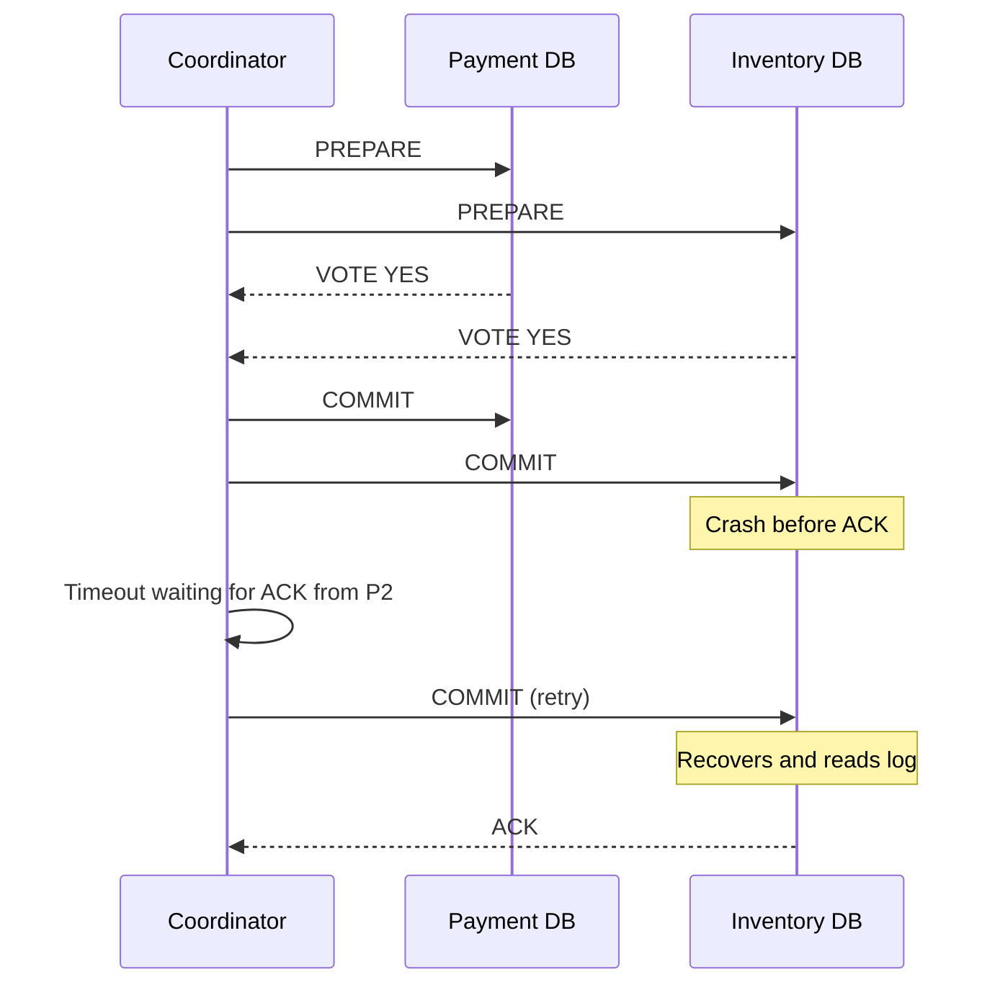
```mermaid
sequenceDiagram
    participant C as Coordinator
    participant P1 as Payment DB
    participant P2 as Inventory DB
    
    C->>P1: PREPARE
    C->>P2: PREPARE
    
    P1-->>C: VOTE YES
    P2-->>C: VOTE YES
    
    C->>P1: COMMIT
    C->>P2: COMMIT
    
    Note over P2: Crash before ACK
    
    C->>C: Timeout waiting for ACK from P2
    C->>P2: COMMIT (retry)
    
    Note over P2: Recovers and reads log
    P2-->>C: ACK
```

**What happens**: Participant P2 voted YES, received COMMIT, but crashed before acknowledging. The coordinator retries COMMIT until it gets an ACK.

**Recovery**: When P2 comes back, it reads its log, sees it voted YES but never committed. It contacts the coordinator (or waits for retry) to find out the decision. Since the coordinator's log shows COMMITTING, P2 completes the commit.

### Scenario 3: Coordinator Fails After Collecting Votes
This is the most critical failure scenario and reveals 2PC's blocking problem.

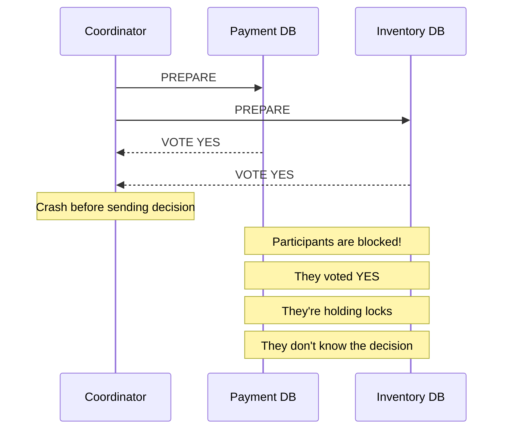
```mermaid
sequenceDiagram
    participant C as Coordinator
    participant P1 as Payment DB
    participant P2 as Inventory DB
    
    C->>P1: PREPARE
    C->>P2: PREPARE
    
    P1-->>C: VOTE YES
    P2-->>C: VOTE YES
    
    Note over C: Crash before sending decision
    
    Note over P1,P2: Participants are blocked!
    Note over P1,P2: They voted YES
    Note over P1,P2: They're holding locks
    Note over P1,P2: They don't know the decision
```

**What happens**: Both participants voted YES and are now holding locks. They can't commit (they don't know if the other participant voted YES). They can't rollback (they promised to commit if asked). They're stuck.

**Recovery**: The participants must wait for the coordinator to recover. When the coordinator restarts, it reads its log:
- If the log shows `PREPARED` with all YES votes, it can safely decide to COMMIT
- It then sends COMMIT to all participants
- Participants complete the commit and release locks

This is the **blocking problem** of 2PC. Participants remain blocked until the coordinator recovers.

### Scenario 4: Network Partition
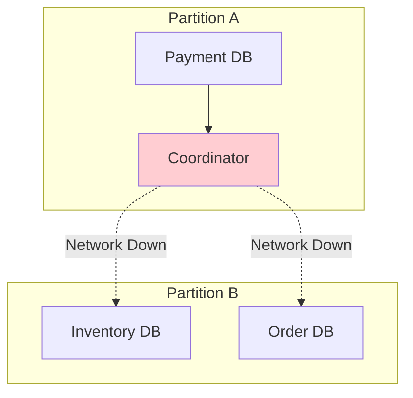
```mermaid
graph TB
    subgraph "Partition A"
        C[Coordinator]
        P1[Payment DB]
    end
    subgraph "Partition B"
        P2[Inventory DB]
        P3[Order DB]
    end
    
    C -.->|Network Down| P2
    C -.->|Network Down| P3
    P1 --> C
    
    style C fill:#ffcdd2
```

**What happens**: If the network splits after votes but before decision, participants in the isolated partition are blocked. They voted YES but can't reach the coordinator to learn the outcome.

**Recovery**: Similar to coordinator failure, participants must wait for network recovery. The coordinator, when it can communicate again, will retry sending the decision to all participants.

### Scenario 5: Participant Fails During Rollback
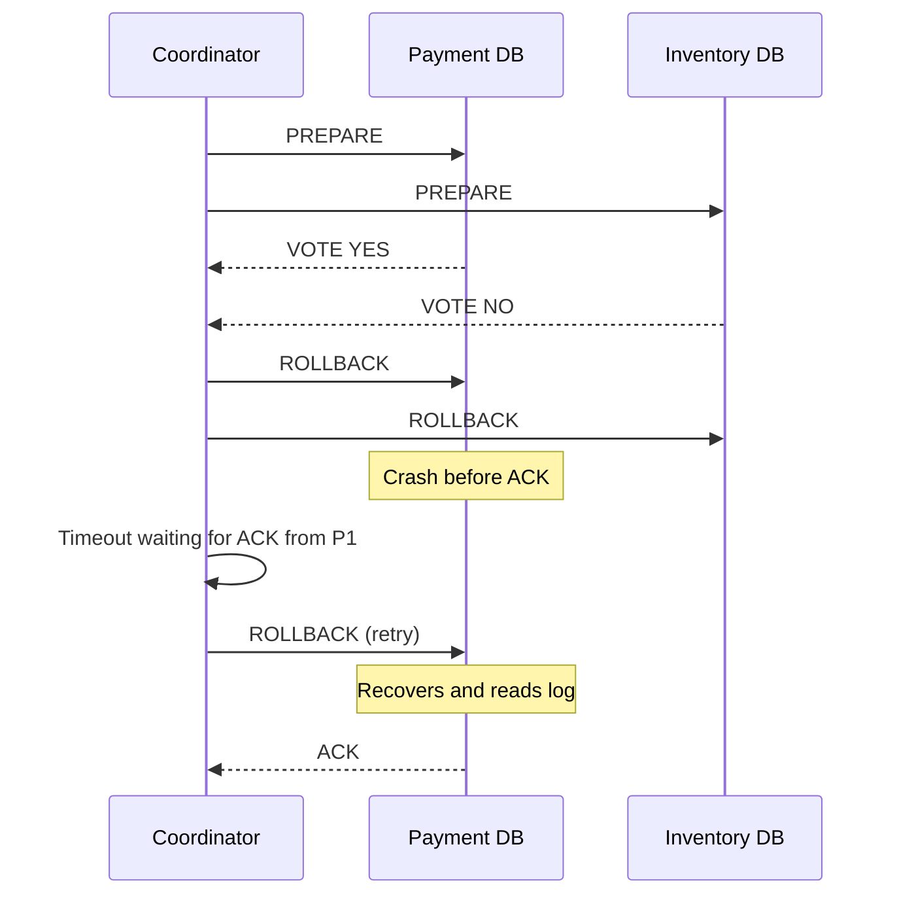
```mermaid
sequenceDiagram
    participant C as Coordinator
    participant P1 as Payment DB
    participant P2 as Inventory DB
    
    C->>P1: PREPARE
    C->>P2: PREPARE
    
    P1-->>C: VOTE YES
    P2-->>C: VOTE NO
    
    C->>P1: ROLLBACK
    C->>P2: ROLLBACK
    
    Note over P1: Crash before ACK
    
    C->>C: Timeout waiting for ACK from P1
    C->>P1: ROLLBACK (retry)
    
    Note over P1: Recovers and reads log
    P1-->>C: ACK
```

**What happens**: Participant P1 voted YES but the transaction is being rolled back (because P2 voted NO). P1 crashes before acknowledging the rollback.

**Recovery**: When P1 recovers, it reads its log and sees it voted YES but hasn't received a final decision. It contacts the coordinator to learn the outcome (ROLLBACK in this case) and completes the rollback.

---

## The Blocking Problem
The coordinator failure scenario reveals 2PC's biggest weakness: **it is a blocking protocol**.

### Why is 2PC Blocking?
When participants vote YES, they enter an uncertain state where they:
- Hold locks on resources
- Can't unilaterally decide to commit or abort
- Must wait for the coordinator

If the coordinator dies at the wrong moment (after collecting votes but before sending the decision), participants can be blocked indefinitely.

### Impact of Blocking
In a busy system, blocking causes:
- **Lock Contention**: Transactions pile up waiting for locks held by blocked participants
- **Timeout Cascades**: Timeouts cascade through the system as more transactions get stuck
- **User Impact**: Users see errors and delays
- **Resource Exhaustion**: System resources (connections, memory) are held by blocked transactions

### Why Can't Participants Decide Unilaterally?
Participants cannot unilaterally decide to commit or abort because:
- **If they commit**: They don't know if other participants voted YES. Some participants might have voted NO and rolled back, leading to inconsistency.
- **If they abort**: They promised to commit if asked. If the coordinator decided to commit, breaking this promise would violate the protocol's guarantees.

The only safe option is to wait for the coordinator's decision.

### Comparison with Non-Blocking Protocols
Three-Phase Commit (3PC) was designed to solve the blocking problem by adding a third phase. However, 3PC has its own issues:
- More complex implementation
- Higher latency (additional network round trips)
- Still doesn't handle network partitions perfectly
- Rarely used in practice

Modern systems often use other approaches instead of 2PC/3PC to avoid blocking, such as:
- Saga pattern (compensating transactions)
- Event sourcing with outbox pattern
- TCC (Try-Confirm-Cancel)
- Optimistic concurrency control

---

## XA Standard
Before looking at implementations, it's important to understand XA, the industry standard that makes 2PC work across different databases and systems.

### What is XA?
XA stands for "eXtended Architecture" and was developed by X/Open (now The Open Group) in 1991. It defines a standard interface between a Transaction Manager (the coordinator) and Resource Managers (the participants like databases, message queues, etc.).

Think of XA as a common language. Without it, every database would have its own way of doing 2PC. Your PostgreSQL database wouldn't know how to coordinate with your MySQL database. XA solves this by defining:
- **Transaction Manager (TM)**: The coordinator that drives the 2PC protocol
- **Resource Manager (RM)**: Any system that can participate in transactions (databases, JMS queues, etc.)
- **XA Interface**: The API that RMs must implement to participate in distributed transactions

### XA Architecture
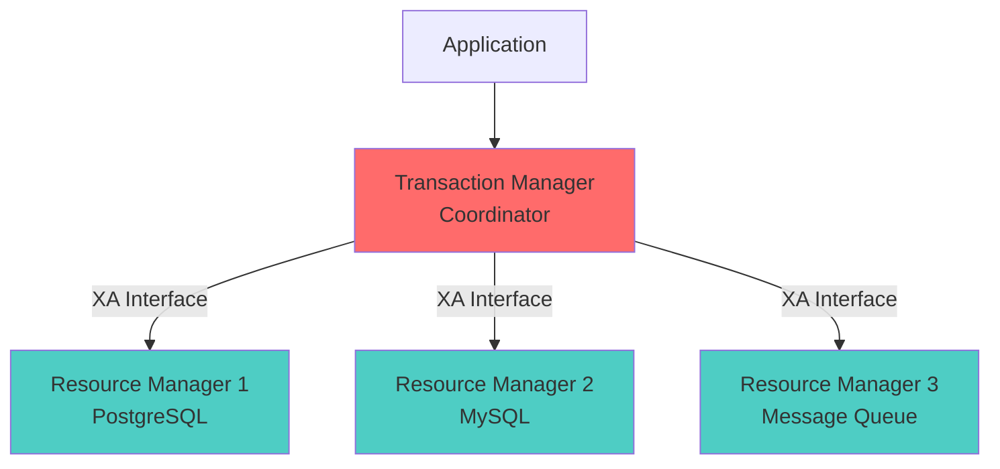
```mermaid
graph TD
    App[Application]
    TM[Transaction Manager<br/>Coordinator]
    RM1[Resource Manager 1<br/>PostgreSQL]
    RM2[Resource Manager 2<br/>MySQL]
    RM3[Resource Manager 3<br/>Message Queue]

    App --> TM
    TM -->|XA Interface| RM1
    TM -->|XA Interface| RM2
    TM -->|XA Interface| RM3

    style TM fill:#ff6b6b
    style RM1 fill:#4ecdc4
    style RM2 fill:#4ecdc4
    style RM3 fill:#4ecdc4
```

### The XA Interface Methods
XA defines specific methods that Resource Managers must implement:

#### xa_startBegins a new transaction branch on the resource manager. Associates the XID with the current thread.

#### xa_endEnds the work performed on behalf of a transaction branch. Disassociates the XID from the current thread.

#### xa_preparePrepares the transaction for commit. This is the voting phase. The resource manager writes to its log and votes YES or NO.

#### xa_commitCommits the transaction branch. Makes the changes permanent.

#### xa_rollbackRolls back the transaction branch. Undoes all changes.

#### xa_recoverReturns a list of prepared but not completed transactions. Used during recovery to find in-doubt transactions.

### The Global Transaction ID (XID)
Every XA transaction has a unique identifier called an XID, which consists of:
- **Format ID**: Identifies the transaction manager (e.g., 1 for JTA)
- **Global Transaction ID**: Unique identifier for the overall distributed transaction (typically 64 bytes)
- **Branch Qualifier**: Identifies a specific branch within the transaction (typically 64 bytes)

This allows multiple databases to know they're part of the same distributed transaction.

Example XID structure:
```
Format ID: 1
Global Transaction ID: 0x1234567890ABCDEF...
Branch Qualifier: 0x0000000000000001...
```

### XA in Java (JTA)
In Java, XA is exposed through the Java Transaction API (JTA). Application servers like WildFly, WebLogic, and frameworks like Spring provide transaction managers that handle the coordination:

```java
// Using JTA with Spring
@Transactional
public void transferMoney(long fromAccount, long toAccount, BigDecimal amount) {
    // Spring's JtaTransactionManager coordinates XA behind the scenes
    accountRepository.debit(fromAccount, amount);  // Goes to Database 1
    accountRepository.credit(toAccount, amount);   // Goes to Database 2
    auditService.logTransfer(fromAccount, toAccount, amount);  // Goes to Database 3
}
```

The `@Transactional` annotation with a JTA transaction manager handles all the XA coordination automatically:
1. Starts the transaction
2. Enlists resource managers
3. Coordinates the prepare phase
4. Makes the commit/abort decision
5. Completes the transaction

### XA Transaction Flow
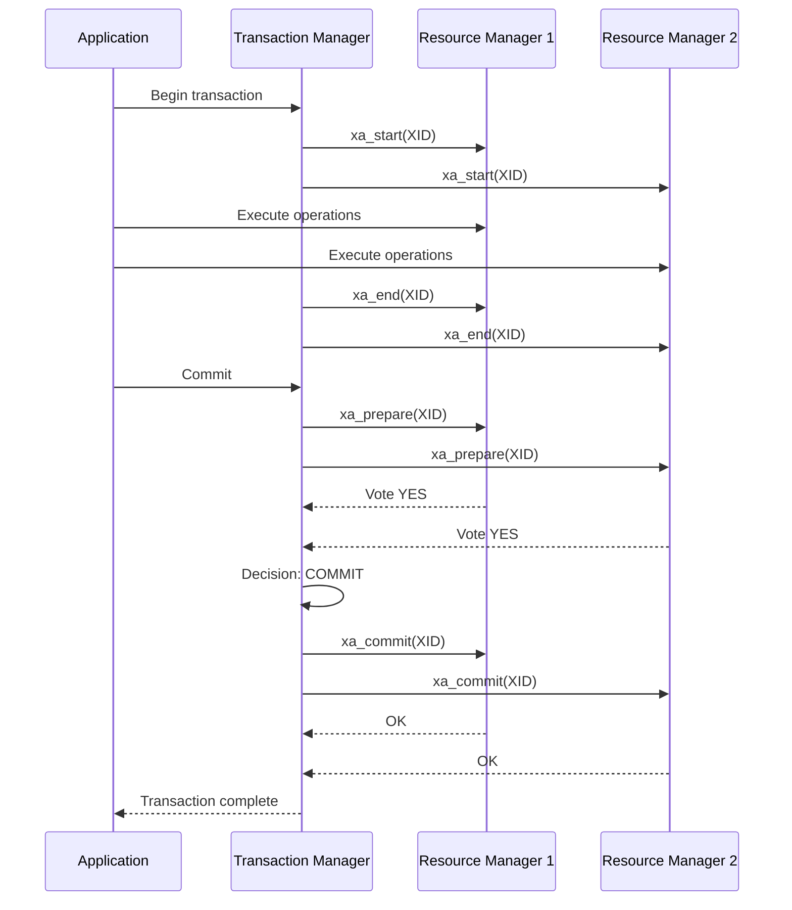
```mermaid
sequenceDiagram
    participant App as Application
    participant TM as Transaction Manager
    participant RM1 as Resource Manager 1
    participant RM2 as Resource Manager 2
    
    App->>TM: Begin transaction
    TM->>RM1: xa_start(XID)
    TM->>RM2: xa_start(XID)
    
    App->>RM1: Execute operations
    App->>RM2: Execute operations
    
    TM->>RM1: xa_end(XID)
    TM->>RM2: xa_end(XID)
    
    App->>TM: Commit
    
    TM->>RM1: xa_prepare(XID)
    TM->>RM2: xa_prepare(XID)
    
    RM1-->>TM: Vote YES
    RM2-->>TM: Vote YES
    
    TM->>TM: Decision: COMMIT
    
    TM->>RM1: xa_commit(XID)
    TM->>RM2: xa_commit(XID)
    
    RM1-->>TM: OK
    RM2-->>TM: OK
    
    TM-->>App: Transaction complete
```

---

## Real-world Implementations
### PostgreSQL
PostgreSQL implements XA through the `PREPARE TRANSACTION` and `COMMIT PREPARED`/`ROLLBACK PREPARED` SQL commands:

```sql
-- Phase 1: Prepare
BEGIN;
UPDATE accounts SET balance = balance - 100 WHERE id = 1;
PREPARE TRANSACTION 'tx_12345';

-- Phase 2: Commit (later)
COMMIT PREPARED 'tx_12345';

-- Or rollback
ROLLBACK PREPARED 'tx_12345';
```

To view prepared (in-doubt) transactions:
```sql
SELECT * FROM pg_prepared_xacts;
```

PostgreSQL also supports the XA protocol through the `XA START`, `XA END`, `XA PREPARE`, `XA COMMIT`, and `XA ROLLBACK` commands when used with appropriate drivers.

### MySQL
MySQL implements XA transactions with the following syntax:

```sql
-- Start a transaction branch
XA START 'xid_1';

-- Execute operations
UPDATE accounts SET balance = balance - 100 WHERE id = 1;

-- End the transaction branch
XA END 'xid_1';

-- Prepare (vote)
XA PREPARE 'xid_1';

-- Commit or rollback
XA COMMIT 'xid_1';
-- or
XA ROLLBACK 'xid_1';
```

To view in-doubt transactions:
```sql
XA RECOVER;
```

### Oracle
Oracle has robust XA support through its JDBC driver and can participate in distributed transactions coordinated by a JTA transaction manager:

```java
// Oracle XA DataSource configuration
OracleXADataSource xaDataSource = new OracleXADataSource();
xaDataSource.setURL("jdbc:oracle:thin:@localhost:1521:ORCL");
xaDataSource.setUser("username");
xaDataSource.setPassword("password");

// Enlist in JTA transaction
Connection conn = xaDataSource.getXAConnection().getConnection();
// Use connection normally
// Transaction manager handles XA coordination
```

### Apache Kafka
Kafka supports exactly-once semantics with transactions using a variant of 2PC:

```java
// Kafka producer with transactions
Properties props = new Properties();
props.put("transactional.id", "my-transactional-id");

KafkaProducer<String, String> producer = new KafkaProducer<>(props);
producer.initTransactions();

try {
    producer.beginTransaction();
    producer.send(new ProducerRecord<>("topic1", "key1", "value1"));
    producer.send(new ProducerRecord<>("topic2", "key2", "value2"));
    producer.commitTransaction();
} catch (ProducerFencedException | OutOfOrderSequenceException | AuthorizationException e) {
    producer.close();
} catch (KafkaException e) {
    producer.abortTransaction();
}
```

Kafka's implementation is optimized for its use case and doesn't use full XA, but follows the same two-phase pattern.

### Google Spanner
Google Spanner uses a variant of 2PC called **TrueTime** to achieve distributed transactions with external consistency:

```java
// Spanner client library
try (TransactionContext txn = databaseClient.readWriteTransaction()) {
    txn.buffer(Mutation.newInsertOrUpdateBuilder("accounts")
        .set("id").to(1)
        .set("balance").to(900)
        .build());
    txn.commit();
}
```

Spanner's implementation leverages synchronized clocks across data centers to make commit decisions without blocking.

### CockroachDB
CockroachDB uses a distributed SQL protocol that includes 2PC for multi-region transactions:

```sql
BEGIN;
UPDATE accounts SET balance = balance - 100 WHERE id = 1;
COMMIT;
```

CockroachDB automatically handles the 2PC coordination across nodes without requiring explicit XA configuration.

### Amazon DynamoDB
DynamoDB supports transactions across multiple items using an optimistic 2PC variant:

```javascript
// AWS SDK for JavaScript
const params = {
  TransactItems: [
    {
      Update: {
        TableName: "Accounts",
        Key: { id: 1 },
        UpdateExpression: "SET balance = balance - :val",
        ExpressionAttributeValues: { ":val": 100 }
      }
    },
    {
      Update: {
        TableName: "Inventory",
        Key: { product_id: 456 },
        UpdateExpression: "SET quantity = quantity - :val",
        ExpressionAttributeValues: { ":val": 1 }
      }
    }
  ]
};

await ddb.transactWriteItems(params).promise();
```

DynamoDB's implementation is optimized for its key-value store architecture and provides ACID guarantees across items.

---

## Advantages and Disadvantages
### Advantages of 2PC
1. **Strong Consistency**: 2PC provides strong consistency guarantees. All participants either commit or abort together, ensuring no partial updates.

2. **Atomicity**: The protocol ensures atomicity across multiple databases. The transaction is all-or-nothing.

3. **Durability**: Through write-ahead logging, 2PC ensures that committed transactions survive failures.

4. **Standardization**: XA provides a standard interface, allowing different databases and systems to participate in distributed transactions.

5. **Simplicity of Concept**: The two-phase concept is easy to understand and reason about.

6. **Recovery**: The protocol includes well-defined recovery procedures for handling failures.

### Disadvantages of 2PC
1. **Blocking Protocol**: This is the most significant disadvantage. Participants can block indefinitely if the coordinator fails at the wrong time.

2. **Single Point of Failure**: The coordinator is a single point of failure. If it fails, the entire transaction can hang.

3. **Performance Overhead**: 2PC requires multiple network round trips (prepare, vote, decision, acknowledge), adding latency to transactions.

4. **Lock Contention**: Participants hold locks during the prepare phase, which can cause contention and reduce concurrency.

5. **Reduced Availability**: If any participant is unavailable, the entire transaction fails. This reduces overall system availability.

6. **Scalability Issues**: As the number of participants increases, the protocol's overhead and failure probability increase.

7. **Network Partitions**: 2PC doesn't handle network partitions well. Participants can be blocked if they can't communicate with the coordinator.

8. **Complex Recovery**: Recovery procedures can be complex, especially when dealing with in-doubt transactions.

### Performance Comparison
| Aspect | Single DB Transaction | 2PC Transaction |
|--------|----------------------|-----------------|
| Latency | ~1-5ms | ~10-50ms (multiple round trips) |
| Throughput | High | Lower (due to locking and coordination) |
| Availability | High | Lower (all participants must be available) |
| Consistency | Strong | Strong |
| Scalability | Limited by single DB | Limited by coordination overhead |

---

## When to Use 2PC
2PC is not a one-size-fits-all solution. Here's when you should consider using it:

### Use Cases for 2PC
1. **Strong Consistency Required**: When your business logic absolutely requires strong consistency across multiple databases (e.g., financial transactions, inventory management).

2. **Low Volume, High Value**: For low-volume, high-value transactions where consistency is more important than performance (e.g., bank transfers, order processing).

3. **Homogeneous Environment**: When all participants support XA and are under your control (e.g., multiple databases in the same data center).

4. **Legacy Systems**: When integrating with legacy systems that only support XA for distributed transactions.

5. **Regulatory Requirements**: When regulatory requirements mandate strong consistency and auditability (e.g., financial services, healthcare).

### When NOT to Use 2PC
1. **High-Performance Requirements**: When you need high throughput and low latency (2PC adds significant overhead).

2. **High Availability Required**: When your system must remain available even if some components fail (2PC requires all participants to be available).

3. **Geo-Distributed Systems**: When participants are across different geographic regions (network latency and partitions become major issues).

4. **Highly Scalable Systems**: When you need to scale to thousands of transactions per second (2PC's locking and coordination don't scale well).

5. **Eventual Consistency Acceptable**: When your business can tolerate eventual consistency (e.g., social media feeds, analytics).

### Decision Framework
```mermaid
flowchart TD
    A[Need distributed transaction?] -->|No| B[Use local transactions]
    A -->|Yes| C{Strong consistency<br/>required?}
    C -->|No| D[Use eventual consistency<br/>Saga, Event Sourcing]
    C -->|Yes| E{High performance<br/>required?}
    E -->|Yes| F[Consider alternatives<br/>TCC, Optimistic locking]
    E -->|No| G{All participants<br/>support XA?}
    G -->|No| H[Use Saga pattern<br/>or compensating transactions]
    G -->|Yes| I[Use 2PC with XA]

    style I fill:#c8e6c9
    style B fill:#e3f2fd
    style D fill:#fff3e0
    style F fill:#fff3e0
    style H fill:#fff3e0
```

---

## Alternatives to 2PC
Given 2PC's limitations, several alternatives have emerged for handling distributed transactions:

### 1. Saga Pattern
The Saga pattern breaks a transaction into a sequence of local transactions, each with a compensating transaction to undo changes if needed.

**How it works:**
- Execute local transactions in sequence
- If any step fails, execute compensating transactions for previous steps
- No locking across services
- Eventually consistent

**Example:**
```java
// Saga for order processing
public void processOrder(Order order) {
    try {
        paymentService.charge(order);
        inventoryService.reserve(order);
        shippingService.arrange(order);
    } catch (PaymentFailedException e) {
        // No compensation needed
    } catch (InventoryException e) {
        paymentService.refund(order);
    } catch (ShippingException e) {
        paymentService.refund(order);
        inventoryService.release(order);
    }
}
```

**Pros:**
- No blocking
- Better availability
- Works across heterogeneous systems
- Scales better

**Cons:**
- Eventually consistent (not strongly consistent)
- Complex to implement compensating logic
- Can expose intermediate states
- Harder to reason about

### 2. Event Sourcing with Outbox Pattern
Event sourcing stores all changes as a sequence of events. The outbox pattern ensures reliable event delivery.

**How it works:**
- Write business changes and events to the same local transaction
- A separate process reads events and publishes them
- Consumers process events and update their state
- Idempotent consumers handle duplicate events

**Example:**
```sql
-- Local transaction
BEGIN;
UPDATE orders SET status = 'CONFIRMED' WHERE id = 123;
INSERT INTO outbox_events (aggregate_id, event_type, payload) 
VALUES (123, 'OrderConfirmed', '{"orderId":123}');
COMMIT;

-- Separate process publishes events
-- Consumers receive and process
```

**Pros:**
- Reliable event delivery
- No distributed locking
- Good audit trail
- Scalable

**Cons:**
- Eventually consistent
- Requires idempotent consumers
- Event schema evolution challenges
- More complex architecture

### 3. TCC (Try-Confirm-Cancel)
TCC is a pattern where each operation has three phases: Try (reserve resources), Confirm (commit), or Cancel (release resources).

**How it works:**
- Try phase: Reserve resources (e.g., freeze balance, reserve inventory)
- Confirm phase: Commit the transaction (e.g., deduct balance, commit inventory)
- Cancel phase: Release reserved resources if transaction fails

**Example:**
```java
// TCC interface
public interface PaymentServiceTCC {
    @TccTry
    boolean tryCharge(Payment payment);
    
    @TccConfirm
    boolean confirmCharge(Payment payment);
    
    @TccCancel
    boolean cancelCharge(Payment payment);
}
```

**Pros:**
- No locking across services
- Better performance than 2PC
- Can handle heterogeneous systems
- Flexible error handling

**Cons:**
- Complex to implement
- Requires three methods per operation
- Business logic in compensation
- Resource reservation can be tricky

### 4. Optimistic Concurrency Control
Use version numbers or timestamps to detect conflicts and retry transactions.

**How it works:**
- Read data with version
- Modify data
- Write with check that version hasn't changed
- If version changed, retry transaction

**Example:**
```sql
-- Read
SELECT balance, version FROM accounts WHERE id = 1;

-- Write with version check
UPDATE accounts 
SET balance = balance - 100, version = version + 1 
WHERE id = 1 AND version = 5;

-- Check affected rows
-- If 0 rows affected, conflict occurred, retry
```

**Pros:**
- No locking
- Good for low-conflict scenarios
- Simple to implement
- Works with eventual consistency

**Cons:**
- Not suitable for high-conflict scenarios
- Requires retry logic
- Can lead to starvation under high contention
- Doesn't guarantee atomicity across operations

### Comparison of Alternatives
| Pattern | Consistency | Availability | Complexity | Use Case |
|---------|-------------|--------------|------------|----------|
| 2PC | Strong | Low | Medium | Financial transactions, low-volume |
| Saga | Eventual | High | High | E-commerce, order processing |
| Event Sourcing | Eventual | High | High | Audit trails, event-driven systems |
| TCC | Strong | High | High | Payment systems, resource reservation |
| Optimistic CC | Eventual | High | Low | Low-conflict scenarios, caching |

---

## Conclusion
Two-Phase Commit (2PC) is a foundational protocol in distributed systems that provides strong consistency guarantees across multiple databases and services. It solves the fundamental problem of ensuring atomicity in distributed transactions.

### Key Takeaways
1. **2PC provides strong consistency** by ensuring all participants either commit or abort together, making it suitable for financial and business-critical operations.

2. **The protocol has two phases**: Prepare (voting) and Commit (decision), with a coordinator orchestrating the process.

3. **The blocking problem is 2PC's major weakness**: Participants can block indefinitely if the coordinator fails at the wrong time, leading to reduced availability.

4. **XA standardizes 2PC** across different databases and systems, enabling heterogeneous environments to participate in distributed transactions.

5. **2PC has performance and availability trade-offs**: It adds latency, reduces availability, and doesn't scale well compared to alternatives.

6. **Modern systems often use alternatives**: Saga pattern, event sourcing, TCC, and optimistic concurrency control offer better availability and scalability for many use cases.

### When to Choose 2PC
Choose 2PC when:
- Strong consistency is non-negotiable
- Transaction volume is low to moderate
- All participants support XA
- Performance requirements are not extreme
- The system operates in a controlled environment

### The Future of Distributed Transactions
While 2PC remains important for certain use cases, the trend in modern distributed systems is toward:
- **Eventual consistency** for better availability
- **Event-driven architectures** for loose coupling
- **Compensation-based patterns** for handling failures
- **Domain-driven design** with bounded contexts

Newer databases like Google Spanner and CockroachDB are innovating in this space, providing distributed transactions with better performance and availability characteristics, often using variants or optimizations of the classic 2PC protocol.

### Final Thoughts
Understanding 2PC is essential for any system designer or engineer working with distributed systems. While you may not use it directly in every project, understanding its principles, trade-offs, and alternatives will help you make informed decisions about how to handle data consistency in your distributed applications.

The key is to choose the right tool for the job: 2PC when you need strong consistency and can accept its limitations, and alternatives when you prioritize availability, scalability, or performance.

---

## References
1. Wikipedia - Two-phase commit protocol: https://en.wikipedia.org/wiki/Two-phase_commit_protocol
2. Oracle Documentation - Two-Phase Commit Protocol: https://docs.oracle.com/en/database/other-databases/timesten/22.1/scaleout/two-phase-commit-protocol.html
3. X/Open XA Specification: The Open Group
4. "Two-Phase Commit: The Protocol That Keeps Distributed Transactions Honest" by Ajit Singh: https://singhajit.com/distributed-systems/two-phase-commit/
5. Java Transaction API (JTA) Specification: Oracle
6. Martin Kleppmann's "Designing Data-Intensive Applications" - Chapter 9: Consistency and Consensus
7. "Distributed Systems: Principles and Paradigms" by Andrew Tanenbaum and Maarten van Steen

---

## Glossary
- **Atomic Commitment Protocol (ACP)**: A protocol that ensures all participants in a distributed transaction either commit or abort together.
- **Coordinator**: The node that initiates and controls the distributed transaction, collecting votes and making the final decision.
- **Participant**: A database or service that holds data and participates in the distributed transaction.
- **Write-Ahead Log (WAL)**: A logging technique where changes are written to a log before being applied to the database, ensuring durability.
- **XA**: An industry standard interface for coordinating distributed transactions across different resource managers.
- **XID**: Global Transaction ID, a unique identifier for a distributed transaction in the XA protocol.
- **Blocking Protocol**: A protocol where participants may be forced to wait indefinitely if certain failures occur.
- **Resource Manager**: A system (database, message queue, etc.) that can participate in distributed transactions.
- **Transaction Manager**: The coordinator that drives the 2PC protocol and manages distributed transactions.
- **In-Doubt Transaction**: A transaction that is in an uncertain state, typically waiting for a coordinator's decision after a failure.
- **Heuristic Decision**: A unilateral decision made by a participant to commit or abort without coordinator authorization (used only in exceptional circumstances).
