# Two-Phase Commit (2PC) Protocol

## Table of Contents
1. [Introduction to Distributed Transactions](#introduction-to-distributed-transactions)
2. [The Problem 2PC Solves](#the-problem-2pc-solves)
3. [What is Two-Phase Commit?](#what-is-two-phase-commit)
4. [Core Concepts](#core-concepts)
5. [The Protocol in Detail](#the-protocol-in-detail)
6. [Detailed Flow Diagrams](#detailed-flow-diagrams)
7. [Failure Scenarios and Recovery](#failure-scenarios-and-recovery)
8. [The Blocking Problem](#the-blocking-problem)
9. [XA Standard](#xa-standard)
10. [Real-world Implementations](#real-world-implementations)
11. [Advantages and Disadvantages](#advantages-and-disadvantages)
12. [When to Use 2PC](#when-to-use-2pc)
13. [Alternatives to 2PC](#alternatives-to-2pc)
14. [Conclusion](#conclusion)

---

## Introduction to Distributed Transactions

In modern distributed systems, data is often spread across multiple databases, services, and nodes. A single business operation might need to update data in several different databases simultaneously. For example, when a user makes a purchase on an e-commerce platform:

- The payment service deducts money from the user's wallet
- The inventory service updates product stock
- The order service creates an order record
- The shipping service reserves shipping capacity

Each of these operations might be managed by a separate database or service. The challenge is ensuring that either all these operations succeed together, or all fail together. This is the fundamental problem of **atomicity** in distributed transactions.

In a single database, transactions are straightforward. ACID properties guarantee that a series of operations either all succeed or all fail. The database handles locking, logging, and recovery internally. But when data lives across multiple independent databases, there's no single authority to coordinate these guarantees.

---

## The Problem 2PC Solves

### Single Database Transactions vs Distributed Transactions

In a single database, transactions are elegant:

```sql
BEGIN TRANSACTION;
UPDATE wallets SET balance = balance - 100 WHERE user_id = 123;
UPDATE inventory SET quantity = quantity - 1 WHERE product_id = 456;
INSERT INTO orders (user_id, product_id, amount) VALUES (123, 456, 100);
COMMIT;
```

If anything fails, the database rolls everything back. ACID properties guarantee consistency.

But what happens when your data lives in three different databases across three different services?

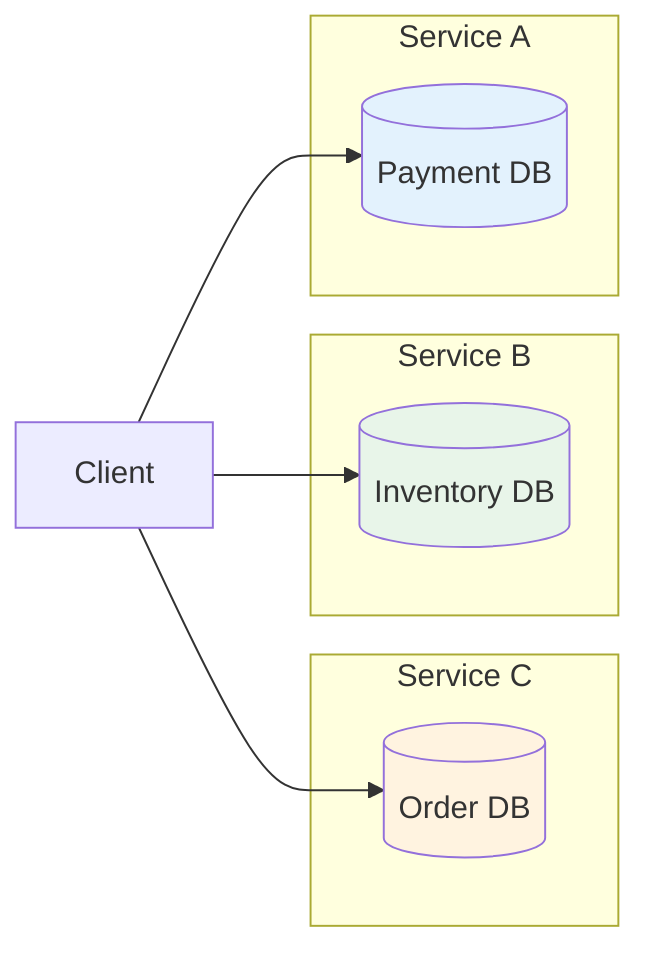

Each database has its own transaction. They don't talk to each other. If one commits and another fails, you're stuck with partial data:
- User's money is deducted
- Product inventory is updated
- But order creation fails

This is a catastrophic inconsistency that can lead to data corruption, financial discrepancies, and unhappy customers.

### The Distributed Transaction Problem

The core problem is: **How do we ensure atomicity across multiple independent databases?**

We need a protocol that:
1. Coordinates all participants to agree on a single outcome
2. Ensures all participants either commit or abort together
3. Handles failures gracefully
4. Recovers from crashes without data loss

Two-Phase Commit (2PC) is the classic solution to this problem.

---

## What is Two-Phase Commit?

Two-Phase Commit (2PC) is a distributed algorithm that coordinates all the processes that participate in a distributed atomic transaction on whether to commit or abort. It is a type of **atomic commitment protocol (ACP)**.

The protocol splits the commit process into two distinct phases:
1. **Prepare Phase**: Ask everyone "Can you commit?"
2. **Commit Phase**: Tell everyone "Go ahead and commit" or "Rollback"

### A Real-World Analogy

Think of it like organizing a group dinner reservation:

**Phase 1 (Prepare)**: You call each friend and ask "Can you make it Friday at 7pm?" You wait for everyone to confirm.

**Phase 2 (Commit)**: Once everyone says yes, you call them again: "Great, we're confirmed for Friday at 7pm." Now everyone shows up.

If even one friend says "Sorry, I can't make it" during Phase 1, you call everyone back and cancel the whole thing. Nobody shows up to an empty restaurant.

This analogy captures the essence of 2PC: unanimous agreement before commitment, or complete cancellation if anyone disagrees.

---

## Core Concepts

### Coordinator and Participants

The 2PC protocol involves two types of nodes:

#### Coordinator (Transaction Manager)
- The master site that initiates and controls the transaction
- Collects votes from all participants
- Makes the final decision (commit or abort)
- Sends the decision to all participants
- Maintains a transaction log for recovery

#### Participants (Resource Managers)
- The databases or services that hold the data
- Execute the transaction locally
- Vote on whether they can commit
- Follow the coordinator's final decision
- Maintain their own logs for recovery

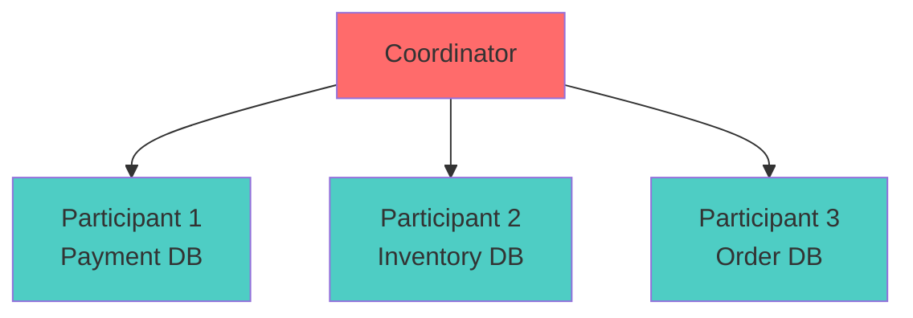

### Write-Ahead Log (WAL)

The Write-Ahead Log is a critical component for durability and recovery. Both the coordinator and participants maintain logs:

- **Coordinator's Log**: Records the transaction state (STARTED, PREPARED, COMMITTING, COMMITTED)
- **Participant's Log**: Records the vote and transaction outcome

Before any critical operation, the log entry is written to stable storage (disk). This ensures that if a crash occurs, the system can recover to a consistent state.

### Assumptions of the Protocol

The 2PC protocol makes several assumptions:

1. **Stable Storage**: Each node has stable storage with a write-ahead log
2. **No Permanent Failures**: No node crashes forever
3. **Log Integrity**: Data in the write-ahead log is never lost or corrupted in a crash
4. **Network Connectivity**: Any two nodes can communicate with each other

The first two assumptions are strong. If a node is totally destroyed, data can be lost. The last assumption is not too restrictive, as network communication can typically be rerouted.

---

## The Protocol in Detail

The Two-Phase Commit protocol consists of three phases: Phase 0 (Transaction), Phase 1 (Prepare/Voting), and Phase 2 (Commit/Completion).

### Phase 0: Transaction Initiation

Before the 2PC protocol begins, the application performs the following steps:

1. **Connection Establishment**: The application establishes a connection to a database. Every connection is associated with a specific element of the database, which becomes the transaction manager for all distributed transactions initiated from that connection.

2. **Statement Execution**: The application runs one or more SQL statements. The transaction manager sends the statements to all the participants for execution. Based on the returned results of the execution, the transaction manager identifies and updates the status of the participants.

3. **Commit Request**: The application issues a commit request, triggering the 2PC protocol.

### Phase 1: Prepare Phase (Voting Phase)

The coordinator initiates the prepare phase to gather votes from all participants.

#### Step 1: Coordinator Sends Prepare Message

The coordinator sends a `PREPARE` message to all participants. The message includes:
- The identity of the transaction manager
- All the participants involved in the transaction
- The global transaction identifier (XID)

#### Step 2: Participants Process Prepare Request

Upon receiving the prepare message, each participant performs the following:

**For Write Participants:**
1. Execute the transaction locally (but don't commit yet)
2. Write a prepare-to-commit log record that stores information to subsequently either commit or rollback the transaction
3. Lock all resources involved in the transaction (to prevent concurrent modifications)
4. If Durability is set, write a durable prepare-to-commit log record to stable storage

**For Read Participants:**
1. Identify the transaction as read-only
2. They can commit immediately without waiting for the final decision

#### Step 3: Participants Vote

Each participant sends a prepare response to the coordinator with its vote:

**Vote YES if:**
- The participant successfully wrote the prepare-to-commit log record
- All necessary locks were acquired
- No constraints would be violated
- The participant is healthy and not overloaded

**Vote NO if:**
- The participant couldn't write the prepare-to-commit log record
- Necessary locks couldn't be acquired
- A constraint would be violated
- The participant is overloaded or unhealthy

**Important**: A participant votes YES only if it can guarantee it will commit if asked. Once it votes YES, it has made a promise. Breaking that promise means data corruption.

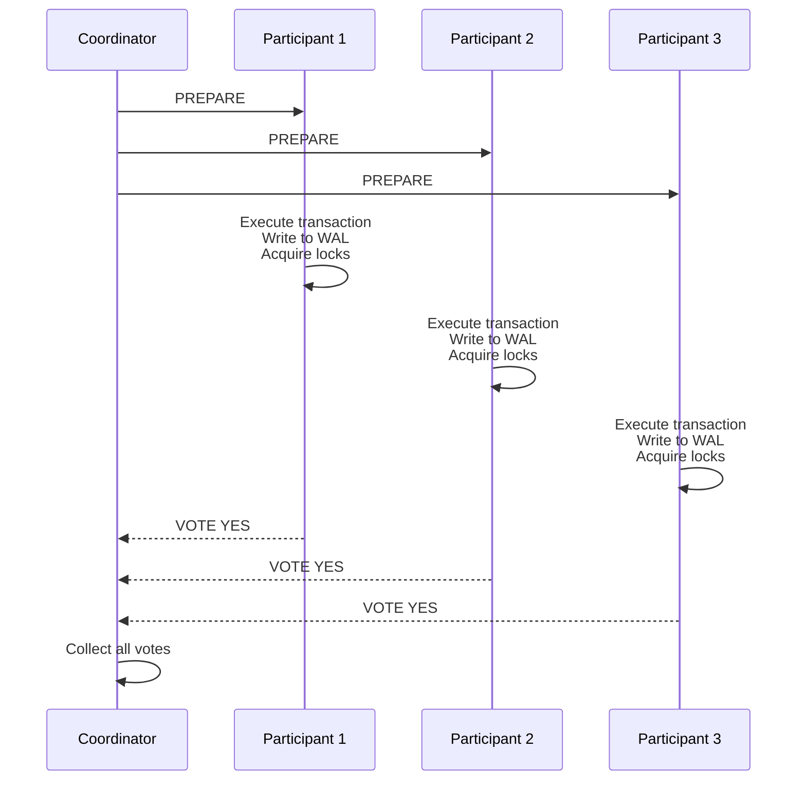

### Phase 2: Commit Phase (Completion Phase)

Once the coordinator receives votes from all participants, it makes the final decision and enters the commit phase.

#### Step 1: Coordinator Makes Decision

The coordinator bases its decision on the votes received:

**Commit Decision:**
- If all write participants send a 'Yes' vote in their prepare response
- At least one element for each participating replica set responds (failed participants don't affect the commit decision once identified as failed, as long as its replica sends a response)

**Rollback Decision:**
- If any write participant sends a 'No' vote in their prepare response
- If the coordinator's timeout expires before receiving all votes

The coordinator writes the decision to its transaction log before proceeding.

#### Step 2: Coordinator Sends Decision

The coordinator sends a message to all write participants with the commit decision:
- `COMMIT` if the decision is to commit
- `ROLLBACK` if the decision is to abort

#### Step 3: Participants Execute Decision

All write participants, including the transaction manager, commit or rollback the transaction based on the commit decision:

**On COMMIT:**
1. Make the transaction permanent
2. Release all locks and resources held during the transaction
3. Write a commit record to the log
4. Send an acknowledgement to the coordinator

**On ROLLBACK:**
1. Undo the transaction using the undo log
2. Release all locks and resources held during the transaction
3. Write a rollback record to the log
4. Send an acknowledgement to the coordinator

#### Step 4: Coordinator Completes Transaction

The coordinator completes the transaction when all acknowledgements have been received and writes the final state to its log.

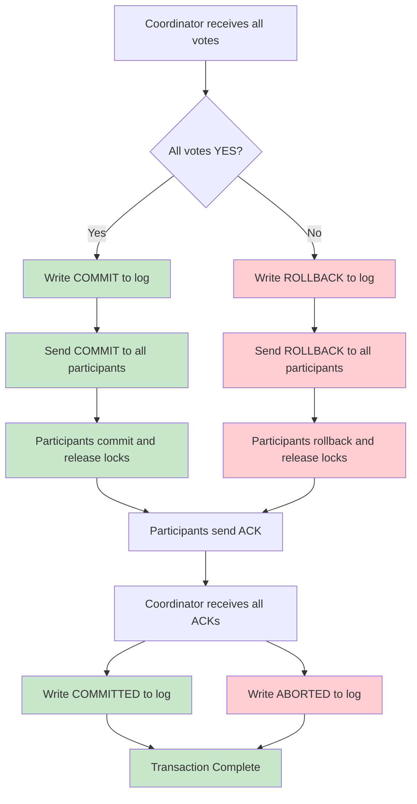

---

## Detailed Flow Diagrams

### Successful Commit Flow

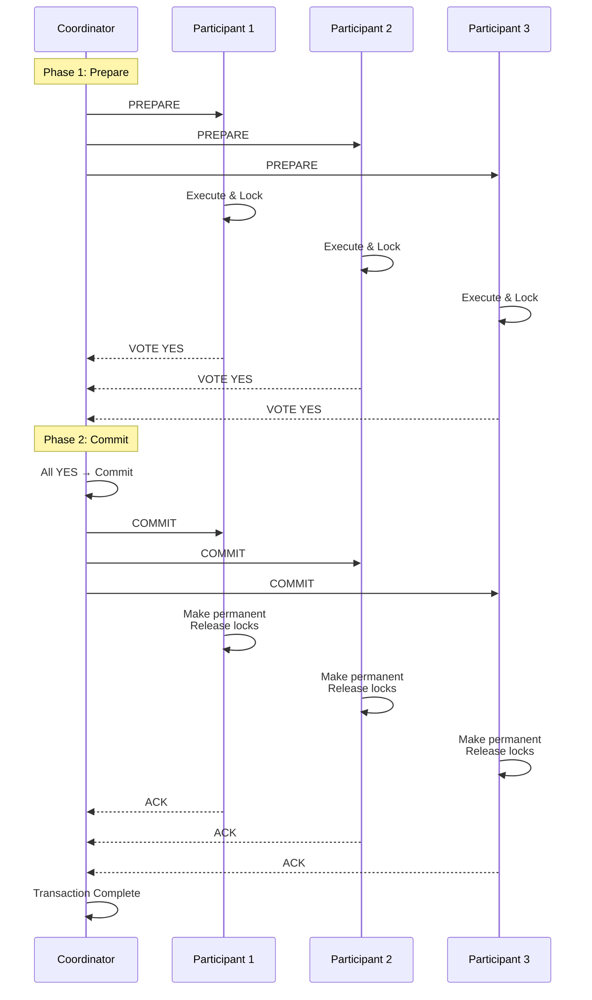

### Abort Flow

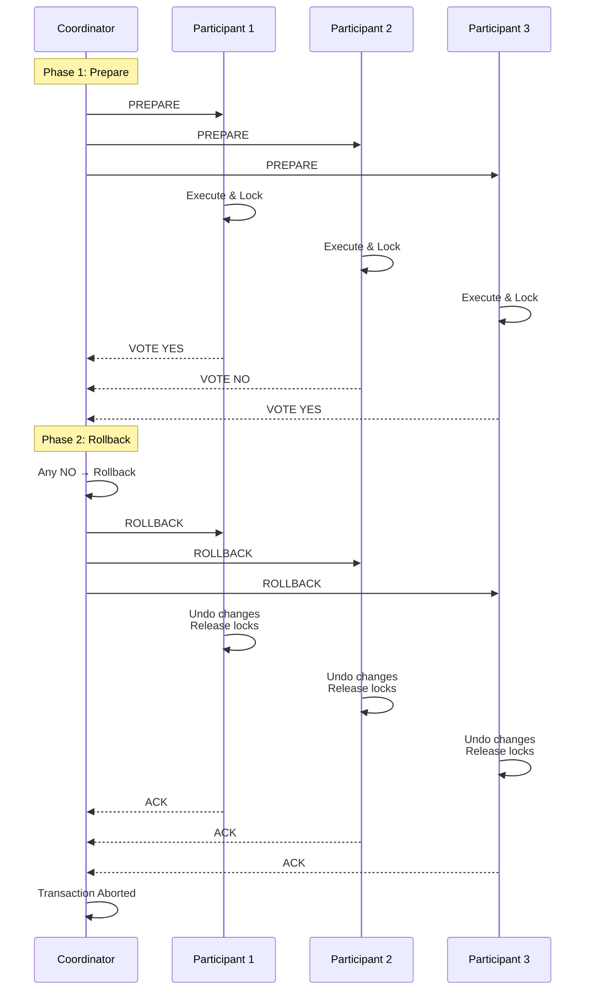

### Coordinator's Log States

The coordinator maintains a transaction log that tracks the state of each distributed transaction:

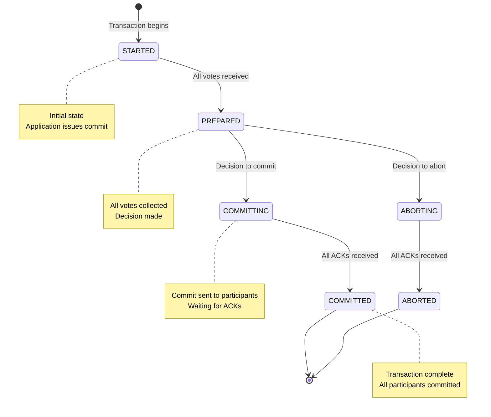

The coordinator's log is the source of truth for recovery. If the coordinator crashes, it reads this log on restart:
- If it logged `COMMITTING`, it resends `COMMIT` to all participants
- If it only logged `PREPARED`, it can either commit or abort (implementation dependent)
- If it logged nothing, it sends `ROLLBACK`

---

## Failure Scenarios and Recovery

2PC must handle several failure scenarios. Let's walk through each one in detail.

### Scenario 1: Participant Fails Before Voting

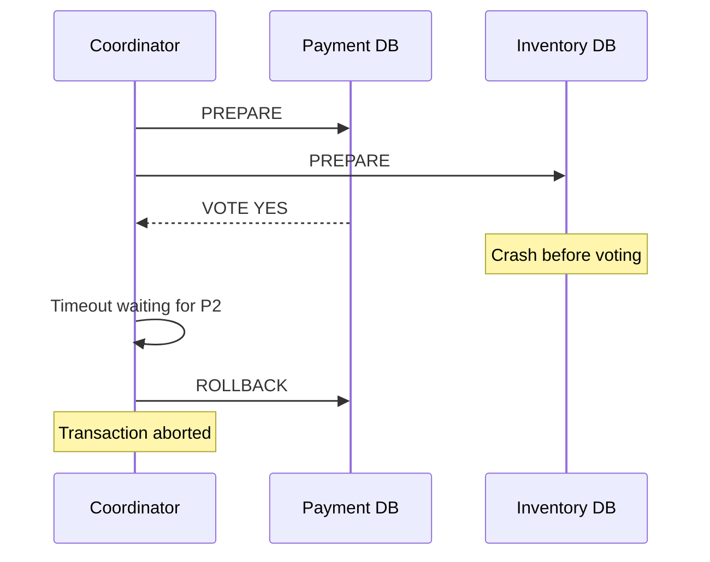

**What happens**: The coordinator times out waiting for a vote from P2. Since not all participants voted YES, it sends ROLLBACK to P1 (which voted YES).

**Recovery**: When the failed participant (P2) comes back online, it has no record of this transaction (it crashed before writing to its log), so there's nothing to clean up. The transaction is already aborted.

### Scenario 2: Participant Fails After Voting YES

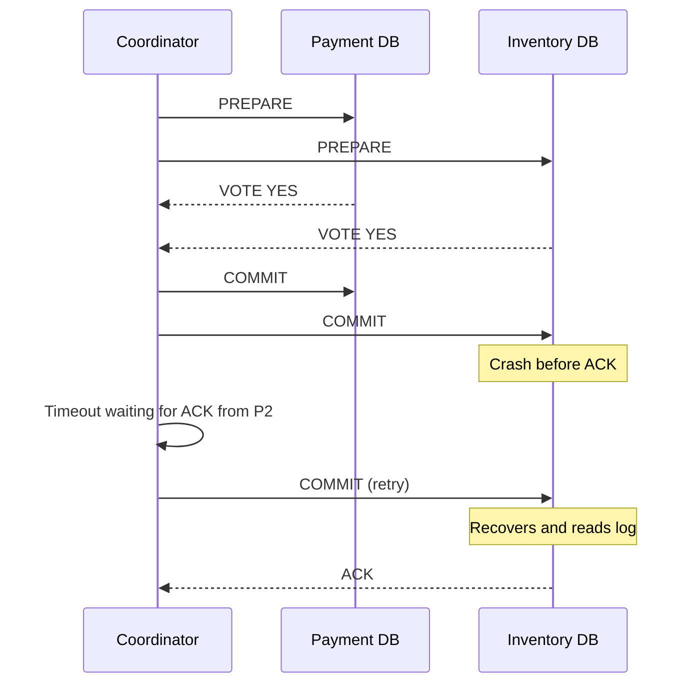

**What happens**: Participant P2 voted YES, received COMMIT, but crashed before acknowledging. The coordinator retries COMMIT until it gets an ACK.

**Recovery**: When P2 comes back, it reads its log, sees it voted YES but never committed. It contacts the coordinator (or waits for retry) to find out the decision. Since the coordinator's log shows COMMITTING, P2 completes the commit.

### Scenario 3: Coordinator Fails After Collecting Votes

This is the most critical failure scenario and reveals 2PC's blocking problem.

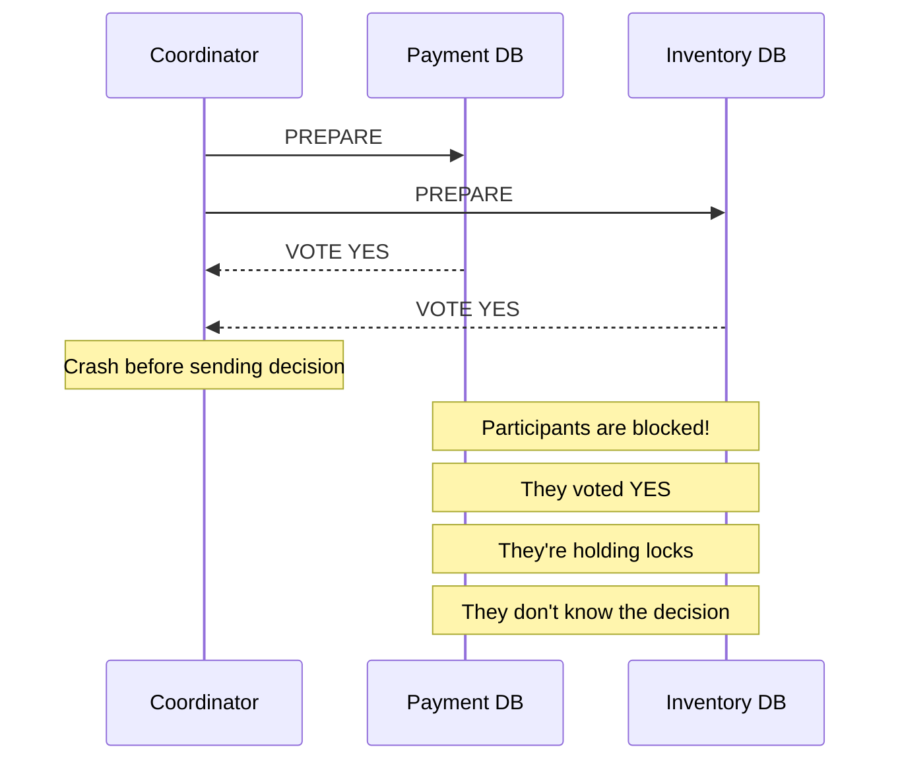

**What happens**: Both participants voted YES and are now holding locks. They can't commit (they don't know if the other participant voted YES). They can't rollback (they promised to commit if asked). They're stuck.

**Recovery**: The participants must wait for the coordinator to recover. When the coordinator restarts, it reads its log:
- If the log shows `PREPARED` with all YES votes, it can safely decide to COMMIT
- It then sends COMMIT to all participants
- Participants complete the commit and release locks

This is the **blocking problem** of 2PC. Participants remain blocked until the coordinator recovers.

### Scenario 4: Network Partition

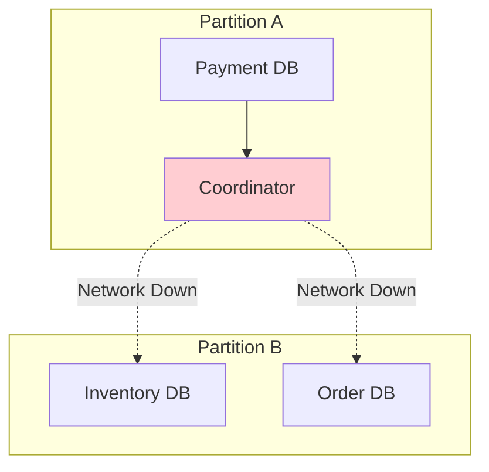

**What happens**: If the network splits after votes but before decision, participants in the isolated partition are blocked. They voted YES but can't reach the coordinator to learn the outcome.

**Recovery**: Similar to coordinator failure, participants must wait for network recovery. The coordinator, when it can communicate again, will retry sending the decision to all participants.

### Scenario 5: Participant Fails During Rollback

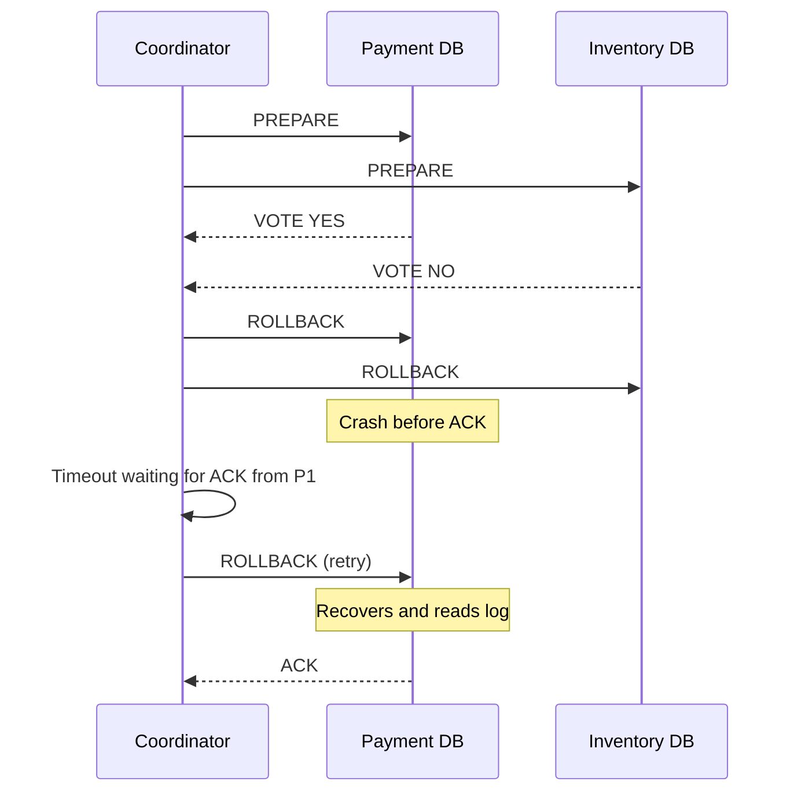

**What happens**: Participant P1 voted YES but the transaction is being rolled back (because P2 voted NO). P1 crashes before acknowledging the rollback.

**Recovery**: When P1 recovers, it reads its log and sees it voted YES but hasn't received a final decision. It contacts the coordinator to learn the outcome (ROLLBACK in this case) and completes the rollback.

---

## The Blocking Problem

The coordinator failure scenario reveals 2PC's biggest weakness: **it is a blocking protocol**.

### Why is 2PC Blocking?

When participants vote YES, they enter an uncertain state where they:
- Hold locks on resources
- Can't unilaterally decide to commit or abort
- Must wait for the coordinator

If the coordinator dies at the wrong moment (after collecting votes but before sending the decision), participants can be blocked indefinitely.

### Impact of Blocking

In a busy system, blocking causes:
- **Lock Contention**: Transactions pile up waiting for locks held by blocked participants
- **Timeout Cascades**: Timeouts cascade through the system as more transactions get stuck
- **User Impact**: Users see errors and delays
- **Resource Exhaustion**: System resources (connections, memory) are held by blocked transactions

### Why Can't Participants Decide Unilaterally?

Participants cannot unilaterally decide to commit or abort because:
- **If they commit**: They don't know if other participants voted YES. Some participants might have voted NO and rolled back, leading to inconsistency.
- **If they abort**: They promised to commit if asked. If the coordinator decided to commit, breaking this promise would violate the protocol's guarantees.

The only safe option is to wait for the coordinator's decision.

### Comparison with Non-Blocking Protocols

Three-Phase Commit (3PC) was designed to solve the blocking problem by adding a third phase. However, 3PC has its own issues:
- More complex implementation
- Higher latency (additional network round trips)
- Still doesn't handle network partitions perfectly
- Rarely used in practice

Modern systems often use other approaches instead of 2PC/3PC to avoid blocking, such as:
- Saga pattern (compensating transactions)
- Event sourcing with outbox pattern
- TCC (Try-Confirm-Cancel)
- Optimistic concurrency control

---

## XA Standard

Before looking at implementations, it's important to understand XA, the industry standard that makes 2PC work across different databases and systems.

### What is XA?

XA stands for "eXtended Architecture" and was developed by X/Open (now The Open Group) in 1991. It defines a standard interface between a Transaction Manager (the coordinator) and Resource Managers (the participants like databases, message queues, etc.).

Think of XA as a common language. Without it, every database would have its own way of doing 2PC. Your PostgreSQL database wouldn't know how to coordinate with your MySQL database. XA solves this by defining:
- **Transaction Manager (TM)**: The coordinator that drives the 2PC protocol
- **Resource Manager (RM)**: Any system that can participate in transactions (databases, JMS queues, etc.)
- **XA Interface**: The API that RMs must implement to participate in distributed transactions

### XA Architecture

```mermaid
graph TD
    App[Application]
    TM[Transaction Manager<br/>(Coordinator)]
    RM1[Resource Manager 1<br/>(PostgreSQL)]
    RM2[Resource Manager 2<br/>(MySQL)]
    RM3[Resource Manager 3<br/>(Message Queue)]
    
    App --> TM
    TM -->|XA Interface| RM1
    TM -->|XA Interface| RM2
    TM -->|XA Interface| RM3
    
    style TM fill:#ff6b6b
    style RM1 fill:#4ecdc4
    style RM2 fill:#4ecdc4
    style RM3 fill:#4ecdc4
```

### The XA Interface Methods

XA defines specific methods that Resource Managers must implement:

#### xa_start
Begins a new transaction branch on the resource manager. Associates the XID with the current thread.

#### xa_end
Ends the work performed on behalf of a transaction branch. Disassociates the XID from the current thread.

#### xa_prepare
Prepares the transaction for commit. This is the voting phase. The resource manager writes to its log and votes YES or NO.

#### xa_commit
Commits the transaction branch. Makes the changes permanent.

#### xa_rollback
Rolls back the transaction branch. Undoes all changes.

#### xa_recover
Returns a list of prepared but not completed transactions. Used during recovery to find in-doubt transactions.

### The Global Transaction ID (XID)

Every XA transaction has a unique identifier called an XID, which consists of:
- **Format ID**: Identifies the transaction manager (e.g., 1 for JTA)
- **Global Transaction ID**: Unique identifier for the overall distributed transaction (typically 64 bytes)
- **Branch Qualifier**: Identifies a specific branch within the transaction (typically 64 bytes)

This allows multiple databases to know they're part of the same distributed transaction.

Example XID structure:
```
Format ID: 1
Global Transaction ID: 0x1234567890ABCDEF...
Branch Qualifier: 0x0000000000000001...
```

### XA in Java (JTA)

In Java, XA is exposed through the Java Transaction API (JTA). Application servers like WildFly, WebLogic, and frameworks like Spring provide transaction managers that handle the coordination:

```java
// Using JTA with Spring
@Transactional
public void transferMoney(long fromAccount, long toAccount, BigDecimal amount) {
    // Spring's JtaTransactionManager coordinates XA behind the scenes
    accountRepository.debit(fromAccount, amount);  // Goes to Database 1
    accountRepository.credit(toAccount, amount);   // Goes to Database 2
    auditService.logTransfer(fromAccount, toAccount, amount);  // Goes to Database 3
}
```

The `@Transactional` annotation with a JTA transaction manager handles all the XA coordination automatically:
1. Starts the transaction
2. Enlists resource managers
3. Coordinates the prepare phase
4. Makes the commit/abort decision
5. Completes the transaction

### XA Transaction Flow

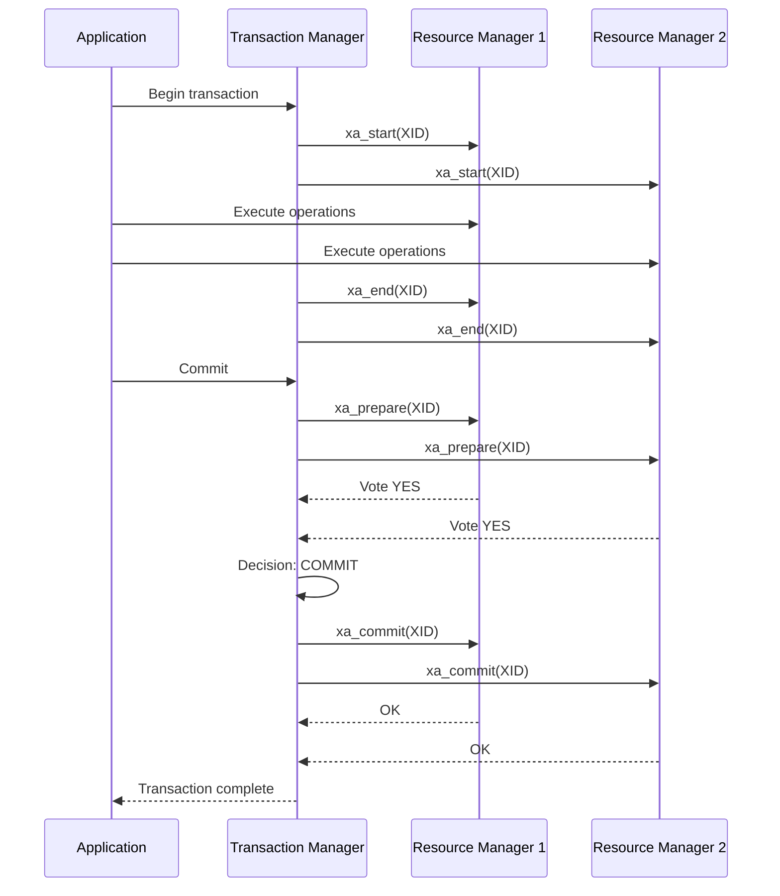

---

## Real-world Implementations

### PostgreSQL

PostgreSQL implements XA through the `PREPARE TRANSACTION` and `COMMIT PREPARED`/`ROLLBACK PREPARED` SQL commands:

```sql
-- Phase 1: Prepare
BEGIN;
UPDATE accounts SET balance = balance - 100 WHERE id = 1;
PREPARE TRANSACTION 'tx_12345';

-- Phase 2: Commit (later)
COMMIT PREPARED 'tx_12345';

-- Or rollback
ROLLBACK PREPARED 'tx_12345';
```

To view prepared (in-doubt) transactions:
```sql
SELECT * FROM pg_prepared_xacts;
```

PostgreSQL also supports the XA protocol through the `XA START`, `XA END`, `XA PREPARE`, `XA COMMIT`, and `XA ROLLBACK` commands when used with appropriate drivers.

### MySQL

MySQL implements XA transactions with the following syntax:

```sql
-- Start a transaction branch
XA START 'xid_1';

-- Execute operations
UPDATE accounts SET balance = balance - 100 WHERE id = 1;

-- End the transaction branch
XA END 'xid_1';

-- Prepare (vote)
XA PREPARE 'xid_1';

-- Commit or rollback
XA COMMIT 'xid_1';
-- or
XA ROLLBACK 'xid_1';
```

To view in-doubt transactions:
```sql
XA RECOVER;
```

### Oracle

Oracle has robust XA support through its JDBC driver and can participate in distributed transactions coordinated by a JTA transaction manager:

```java
// Oracle XA DataSource configuration
OracleXADataSource xaDataSource = new OracleXADataSource();
xaDataSource.setURL("jdbc:oracle:thin:@localhost:1521:ORCL");
xaDataSource.setUser("username");
xaDataSource.setPassword("password");

// Enlist in JTA transaction
Connection conn = xaDataSource.getXAConnection().getConnection();
// Use connection normally
// Transaction manager handles XA coordination
```

### Apache Kafka

Kafka supports exactly-once semantics with transactions using a variant of 2PC:

```java
// Kafka producer with transactions
Properties props = new Properties();
props.put("transactional.id", "my-transactional-id");

KafkaProducer<String, String> producer = new KafkaProducer<>(props);
producer.initTransactions();

try {
    producer.beginTransaction();
    producer.send(new ProducerRecord<>("topic1", "key1", "value1"));
    producer.send(new ProducerRecord<>("topic2", "key2", "value2"));
    producer.commitTransaction();
} catch (ProducerFencedException | OutOfOrderSequenceException | AuthorizationException e) {
    producer.close();
} catch (KafkaException e) {
    producer.abortTransaction();
}
```

Kafka's implementation is optimized for its use case and doesn't use full XA, but follows the same two-phase pattern.

### Google Spanner

Google Spanner uses a variant of 2PC called **TrueTime** to achieve distributed transactions with external consistency:

```java
// Spanner client library
try (TransactionContext txn = databaseClient.readWriteTransaction()) {
    txn.buffer(Mutation.newInsertOrUpdateBuilder("accounts")
        .set("id").to(1)
        .set("balance").to(900)
        .build());
    txn.commit();
}
```

Spanner's implementation leverages synchronized clocks across data centers to make commit decisions without blocking.

### CockroachDB

CockroachDB uses a distributed SQL protocol that includes 2PC for multi-region transactions:

```sql
BEGIN;
UPDATE accounts SET balance = balance - 100 WHERE id = 1;
COMMIT;
```

CockroachDB automatically handles the 2PC coordination across nodes without requiring explicit XA configuration.

### Amazon DynamoDB

DynamoDB supports transactions across multiple items using an optimistic 2PC variant:

```javascript
// AWS SDK for JavaScript
const params = {
  TransactItems: [
    {
      Update: {
        TableName: "Accounts",
        Key: { id: 1 },
        UpdateExpression: "SET balance = balance - :val",
        ExpressionAttributeValues: { ":val": 100 }
      }
    },
    {
      Update: {
        TableName: "Inventory",
        Key: { product_id: 456 },
        UpdateExpression: "SET quantity = quantity - :val",
        ExpressionAttributeValues: { ":val": 1 }
      }
    }
  ]
};

await ddb.transactWriteItems(params).promise();
```

DynamoDB's implementation is optimized for its key-value store architecture and provides ACID guarantees across items.

---

## Advantages and Disadvantages

### Advantages of 2PC

1. **Strong Consistency**: 2PC provides strong consistency guarantees. All participants either commit or abort together, ensuring no partial updates.

2. **Atomicity**: The protocol ensures atomicity across multiple databases. The transaction is all-or-nothing.

3. **Durability**: Through write-ahead logging, 2PC ensures that committed transactions survive failures.

4. **Standardization**: XA provides a standard interface, allowing different databases and systems to participate in distributed transactions.

5. **Simplicity of Concept**: The two-phase concept is easy to understand and reason about.

6. **Recovery**: The protocol includes well-defined recovery procedures for handling failures.

### Disadvantages of 2PC

1. **Blocking Protocol**: This is the most significant disadvantage. Participants can block indefinitely if the coordinator fails at the wrong time.

2. **Single Point of Failure**: The coordinator is a single point of failure. If it fails, the entire transaction can hang.

3. **Performance Overhead**: 2PC requires multiple network round trips (prepare, vote, decision, acknowledge), adding latency to transactions.

4. **Lock Contention**: Participants hold locks during the prepare phase, which can cause contention and reduce concurrency.

5. **Reduced Availability**: If any participant is unavailable, the entire transaction fails. This reduces overall system availability.

6. **Scalability Issues**: As the number of participants increases, the protocol's overhead and failure probability increase.

7. **Network Partitions**: 2PC doesn't handle network partitions well. Participants can be blocked if they can't communicate with the coordinator.

8. **Complex Recovery**: Recovery procedures can be complex, especially when dealing with in-doubt transactions.

### Performance Comparison

| Aspect | Single DB Transaction | 2PC Transaction |
|--------|----------------------|-----------------|
| Latency | ~1-5ms | ~10-50ms (multiple round trips) |
| Throughput | High | Lower (due to locking and coordination) |
| Availability | High | Lower (all participants must be available) |
| Consistency | Strong | Strong |
| Scalability | Limited by single DB | Limited by coordination overhead |

---

## When to Use 2PC

2PC is not a one-size-fits-all solution. Here's when you should consider using it:

### Use Cases for 2PC

1. **Strong Consistency Required**: When your business logic absolutely requires strong consistency across multiple databases (e.g., financial transactions, inventory management).

2. **Low Volume, High Value**: For low-volume, high-value transactions where consistency is more important than performance (e.g., bank transfers, order processing).

3. **Homogeneous Environment**: When all participants support XA and are under your control (e.g., multiple databases in the same data center).

4. **Legacy Systems**: When integrating with legacy systems that only support XA for distributed transactions.

5. **Regulatory Requirements**: When regulatory requirements mandate strong consistency and auditability (e.g., financial services, healthcare).

### When NOT to Use 2PC

1. **High-Performance Requirements**: When you need high throughput and low latency (2PC adds significant overhead).

2. **High Availability Required**: When your system must remain available even if some components fail (2PC requires all participants to be available).

3. **Geo-Distributed Systems**: When participants are across different geographic regions (network latency and partitions become major issues).

4. **Highly Scalable Systems**: When you need to scale to thousands of transactions per second (2PC's locking and coordination don't scale well).

5. **Eventual Consistency Acceptable**: When your business can tolerate eventual consistency (e.g., social media feeds, analytics).

### Decision Framework

```mermaid
flowchart TD
    A[Need distributed transaction?] -->|No| B[Use local transactions]
    A -->|Yes| C{Strong consistency<br/>required?}
    C -->|No| D[Use eventual consistency<br/>(Saga, Event Sourcing)]
    C -->|Yes| E{High performance<br/>required?}
    E -->|Yes| F[Consider alternatives<br/>(TCC, Optimistic locking)]
    E -->|No| G{All participants<br/>support XA?}
    G -->|No| H[Use Saga pattern<br/>or compensating transactions]
    G -->|Yes| I[Use 2PC with XA]
    
    style I fill:#c8e6c9
    style B fill:#e3f2fd
    style D fill:#fff3e0
    style F fill:#fff3e0
    style H fill:#fff3e0
```

---

## Alternatives to 2PC

Given 2PC's limitations, several alternatives have emerged for handling distributed transactions:

### 1. Saga Pattern

The Saga pattern breaks a transaction into a sequence of local transactions, each with a compensating transaction to undo changes if needed.

**How it works:**
- Execute local transactions in sequence
- If any step fails, execute compensating transactions for previous steps
- No locking across services
- Eventually consistent

**Example:**
```java
// Saga for order processing
public void processOrder(Order order) {
    try {
        paymentService.charge(order);
        inventoryService.reserve(order);
        shippingService.arrange(order);
    } catch (PaymentFailedException e) {
        // No compensation needed
    } catch (InventoryException e) {
        paymentService.refund(order);
    } catch (ShippingException e) {
        paymentService.refund(order);
        inventoryService.release(order);
    }
}
```

**Pros:**
- No blocking
- Better availability
- Works across heterogeneous systems
- Scales better

**Cons:**
- Eventually consistent (not strongly consistent)
- Complex to implement compensating logic
- Can expose intermediate states
- Harder to reason about

### 2. Event Sourcing with Outbox Pattern

Event sourcing stores all changes as a sequence of events. The outbox pattern ensures reliable event delivery.

**How it works:**
- Write business changes and events to the same local transaction
- A separate process reads events and publishes them
- Consumers process events and update their state
- Idempotent consumers handle duplicate events

**Example:**
```sql
-- Local transaction
BEGIN;
UPDATE orders SET status = 'CONFIRMED' WHERE id = 123;
INSERT INTO outbox_events (aggregate_id, event_type, payload) 
VALUES (123, 'OrderConfirmed', '{"orderId":123}');
COMMIT;

-- Separate process publishes events
-- Consumers receive and process
```

**Pros:**
- Reliable event delivery
- No distributed locking
- Good audit trail
- Scalable

**Cons:**
- Eventually consistent
- Requires idempotent consumers
- Event schema evolution challenges
- More complex architecture

### 3. TCC (Try-Confirm-Cancel)

TCC is a pattern where each operation has three phases: Try (reserve resources), Confirm (commit), or Cancel (release resources).

**How it works:**
- Try phase: Reserve resources (e.g., freeze balance, reserve inventory)
- Confirm phase: Commit the transaction (e.g., deduct balance, commit inventory)
- Cancel phase: Release reserved resources if transaction fails

**Example:**
```java
// TCC interface
public interface PaymentServiceTCC {
    @TccTry
    boolean tryCharge(Payment payment);
    
    @TccConfirm
    boolean confirmCharge(Payment payment);
    
    @TccCancel
    boolean cancelCharge(Payment payment);
}
```

**Pros:**
- No locking across services
- Better performance than 2PC
- Can handle heterogeneous systems
- Flexible error handling

**Cons:**
- Complex to implement
- Requires three methods per operation
- Business logic in compensation
- Resource reservation can be tricky

### 4. Optimistic Concurrency Control

Use version numbers or timestamps to detect conflicts and retry transactions.

**How it works:**
- Read data with version
- Modify data
- Write with check that version hasn't changed
- If version changed, retry transaction

**Example:**
```sql
-- Read
SELECT balance, version FROM accounts WHERE id = 1;

-- Write with version check
UPDATE accounts 
SET balance = balance - 100, version = version + 1 
WHERE id = 1 AND version = 5;

-- Check affected rows
-- If 0 rows affected, conflict occurred, retry
```

**Pros:**
- No locking
- Good for low-conflict scenarios
- Simple to implement
- Works with eventual consistency

**Cons:**
- Not suitable for high-conflict scenarios
- Requires retry logic
- Can lead to starvation under high contention
- Doesn't guarantee atomicity across operations

### Comparison of Alternatives

| Pattern | Consistency | Availability | Complexity | Use Case |
|---------|-------------|--------------|------------|----------|
| 2PC | Strong | Low | Medium | Financial transactions, low-volume |
| Saga | Eventual | High | High | E-commerce, order processing |
| Event Sourcing | Eventual | High | High | Audit trails, event-driven systems |
| TCC | Strong | High | High | Payment systems, resource reservation |
| Optimistic CC | Eventual | High | Low | Low-conflict scenarios, caching |

---

## Conclusion

Two-Phase Commit (2PC) is a foundational protocol in distributed systems that provides strong consistency guarantees across multiple databases and services. It solves the fundamental problem of ensuring atomicity in distributed transactions.

### Key Takeaways

1. **2PC provides strong consistency** by ensuring all participants either commit or abort together, making it suitable for financial and business-critical operations.

2. **The protocol has two phases**: Prepare (voting) and Commit (decision), with a coordinator orchestrating the process.

3. **The blocking problem is 2PC's major weakness**: Participants can block indefinitely if the coordinator fails at the wrong time, leading to reduced availability.

4. **XA standardizes 2PC** across different databases and systems, enabling heterogeneous environments to participate in distributed transactions.

5. **2PC has performance and availability trade-offs**: It adds latency, reduces availability, and doesn't scale well compared to alternatives.

6. **Modern systems often use alternatives**: Saga pattern, event sourcing, TCC, and optimistic concurrency control offer better availability and scalability for many use cases.

### When to Choose 2PC

Choose 2PC when:
- Strong consistency is non-negotiable
- Transaction volume is low to moderate
- All participants support XA
- Performance requirements are not extreme
- The system operates in a controlled environment

### The Future of Distributed Transactions

While 2PC remains important for certain use cases, the trend in modern distributed systems is toward:
- **Eventual consistency** for better availability
- **Event-driven architectures** for loose coupling
- **Compensation-based patterns** for handling failures
- **Domain-driven design** with bounded contexts

Newer databases like Google Spanner and CockroachDB are innovating in this space, providing distributed transactions with better performance and availability characteristics, often using variants or optimizations of the classic 2PC protocol.

### Final Thoughts

Understanding 2PC is essential for any system designer or engineer working with distributed systems. While you may not use it directly in every project, understanding its principles, trade-offs, and alternatives will help you make informed decisions about how to handle data consistency in your distributed applications.

The key is to choose the right tool for the job: 2PC when you need strong consistency and can accept its limitations, and alternatives when you prioritize availability, scalability, or performance.

---

## References

1. Wikipedia - Two-phase commit protocol: https://en.wikipedia.org/wiki/Two-phase_commit_protocol
2. Oracle Documentation - Two-Phase Commit Protocol: https://docs.oracle.com/en/database/other-databases/timesten/22.1/scaleout/two-phase-commit-protocol.html
3. X/Open XA Specification: The Open Group
4. "Two-Phase Commit: The Protocol That Keeps Distributed Transactions Honest" by Ajit Singh: https://singhajit.com/distributed-systems/two-phase-commit/
5. Java Transaction API (JTA) Specification: Oracle
6. Martin Kleppmann's "Designing Data-Intensive Applications" - Chapter 9: Consistency and Consensus
7. "Distributed Systems: Principles and Paradigms" by Andrew Tanenbaum and Maarten van Steen

---

## Glossary

- **Atomic Commitment Protocol (ACP)**: A protocol that ensures all participants in a distributed transaction either commit or abort together.
- **Coordinator**: The node that initiates and controls the distributed transaction, collecting votes and making the final decision.
- **Participant**: A database or service that holds data and participates in the distributed transaction.
- **Write-Ahead Log (WAL)**: A logging technique where changes are written to a log before being applied to the database, ensuring durability.
- **XA**: An industry standard interface for coordinating distributed transactions across different resource managers.
- **XID**: Global Transaction ID, a unique identifier for a distributed transaction in the XA protocol.
- **Blocking Protocol**: A protocol where participants may be forced to wait indefinitely if certain failures occur.
- **Resource Manager**: A system (database, message queue, etc.) that can participate in distributed transactions.
- **Transaction Manager**: The coordinator that drives the 2PC protocol and manages distributed transactions.
- **In-Doubt Transaction**: A transaction that is in an uncertain state, typically waiting for a coordinator's decision after a failure.
- **Heuristic Decision**: A unilateral decision made by a participant to commit or abort without coordinator authorization (used only in exceptional circumstances).
